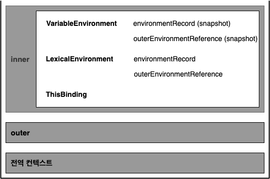
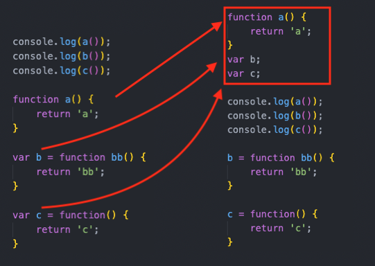
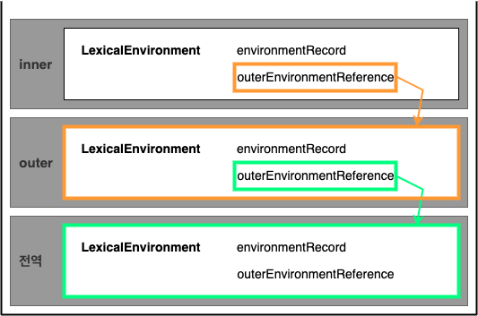

# 목차

<br>

- [목차](#목차)
- [실행 컨텍스트 이해하기](#실행-컨텍스트-이해하기)
- [1 실행 컨텍스트의 의미](#1-실행-컨텍스트의-의미)
- [2 실행 컨텍스트가 형성되는 경우](#2-실행-컨텍스트가-형성되는-경우)
- [3 예시로 이해하는 실행 컨텍스트의 세 가지 환경 정보](#3-예시로-이해하는-실행-컨텍스트의-세-가지-환경-정보)
- [4 LexicalEnvironment 이해하기](#4-lexicalenvironment-이해하기)
  - [4-1 environmentRecord](#4-1-environmentrecord)
  - [4-2 outerEnvironmentReference](#4-2-outerenvironmentreference)
- [참고](#참고)

<br>

# 실행 컨텍스트 이해하기
* 실행 컨텍스트의 의미
* 실행 컨텍스트가 형성되는 경우
  * 4가지가있는데 결국은 함수.
  * if, for, switch, while문은 아니라고 말해줘야함.
* 예시로 이해하는 실행 컨텍스트의 세 가지 환경 정보
  * VariableEnvironment, LexicalEnvironment, ThisBinding
* Lexical Environment 이해하기

<br>

# 1 실행 컨텍스트의 의미
* 사전적 의미 - Execution Context
  * Execution: 실행
  * Context: 문맥, 맥락, 환경 -> 코드의 배경이 되는 조건, 환경 (주변 환경을 이해하는 것)
* **Execution Context**
  * **코드를 실행하는 데에 필요한 배경이 되는 조건, 환경.**
  * **함수를 실행할 때 필요한 환경정보를 담은 객체.**
  * **실행에 필요한 여러가지 정보를 담고있다고 보면 된다.**
* ECMAScript에선 아래와 같이 정의한다.
  * 실행 가능한 코드를 형상화하고 구분하는 추상적인 개념
* **콜스택과 유사하다**
  * **실행 컨텍스트는 콜 스택에 들어가는 실행 정보 하나와 유사하다.**
  * "실행 가능한 JS 코드 블럭이 실행되는 환경"
  * 콜 스택과 똑같이 하나하나 스택형태로 쌓인다.

<br>

# 2 실행 컨텍스트가 형성되는 경우

💁‍♂️ **실행 컨텍스트가 형성되는 4가지 경우**

1. 전역공간
2. 함수
3. eval
4. module

<br>

💁‍♂️ **실행 컨텍스트가 형성되는 경우는 4가지지만, 결국 함수라고 볼 수 있다.**

4가지중 `eval`은 여러 문제를 야기하는 명령어라서 잘 사용되지 않는다고한다.

`전역공간`은 JS 코드가 실행되는 순간에 바로 전역 컨텍스트가 생성되고, 전체 코드가 끝날 때에 비로소 전역 컨텍스트가 종료되기때문에 `큰 의미에서의 함수`라고 볼 수 있다.

`module`역시 `import` 되는 순간에 그 모듈 내부에 있는 컨텍스트가 생성되고, 그 모듈 코드가 전부 끝날을 때 컨텍스트가 종료되기때문에 역시 `하나의 함수 공간`이라고 볼 수 있다.

즉, **결국 JS의 실행컨텍스트는 `함수`를 실행할 때에 형성된다고 볼 수 있다.**

> **실행 컨텍스트는 함수가 실행될 때야 비로소 생성되는 객체이다.**

<br>

🤔 **if, for, switch, while 문도 실행컨텍스트가 생성되는가?**

정답은 No다. 모두 블록스코프로 간주되며, 별개의 실행컨텍스트가 생성되지않는다고한다.

<br>

# 3 예시로 이해하는 실행 컨텍스트의 세 가지 환경 정보
간단한 예시로 실행컨텍스트를 살펴보자. 

```js
var a = 1;
function outer(){
    console.log(a);

    function inner(){
        console.log(a);
        var a = 3;
    }

    inner();

    console.log(a);
}
outer();
console.log(a);
```

<br>

위 코드의 실행 결과는 아래와 같다.

```js
1
undefined
1
1
```

> 실행결과가 예측되지않는다면 아직 실행 컨텍스트를 정확히 이해하지못한 것이다.

<br>

위 코드를 실행 컨텍스트 관점에서보면 아래와 같다.

<p align="center"> </p>

위와 같이 콜스택과처럼 **함수가 실행될 때마다 실행 컨텍스트이 형셩되며 실행 컨텍스트에는 세 가지 환경 정보가 있다.**

* `Variable Environment` - 식별자 정보 수집 (실행 컨텍스트의 실행 과정에서 값이 변하지 않는다. 한번 형성되면 변하지 않음.)
  * environmentRecord (snapshot)
  * outerEnvironmentReference (snapshot)
* `Lexical Environment` - 각 식별자의 데이터 추적 (실행 컨텍스트의 실행 과정에서 값이 변한다.)
  * environmentRecord: 현재문맥의 식별자 (hoisting)
  * outerEnvironmentReference: 외부 식별자 (scope chain)
* `this`

<br>

# 4 LexicalEnvironment 이해하기

<br>

🤔 Variable Environment와 Lexical Environment의 차이점?

`Variable Environment`는 선언 시점의 LexicalEnvironment의 Snapshot으로, 변경 사항은 반영되지 않는다.

실행 컨텍스트를 생성할 때 VariableEnvironment에 정보를 먼저 담은 다음, 이를 그대로 복사해서 LexicalEnvironment를 만들어 활용한다.

즉, Variable Environment와 Lexical Environment의 차이점은 실행컨텍스트가 생성된 후 함수가 실행될 때 실시간으로 값이 변하느냐 변하지않느냐에 차이만 존재한다.

<br>

💁‍♂️ **Lexical Environment의 의미**

* 사전적 의미
  * Lexical Environment: 어휘적,사전적 환경
* 실제 사전과 유사하다.
  * 영한 사전는 아래와 같이 영어와 한글을 정보를 가지고있다.
    * able: 할수 있는, apple: 사과, arrow: 화살, 화살표
  * 실행 컨텍스트도 사전과 유사하게 환경 정보를 가지고있다.
    * 내부 식별자 `a`: 현재 값은 undefined이다.
    * 내부 식별자 `b`: 현재 값은 20이다.
    * 외부 정보: D를 참조한다.
  * 즉, **Lexical Environment는 실행 컨텍스트를 구성하는 환경 정보들을 모아 사전처럼 구성한 객체**다.

<br>

💁‍♂️ **LexicalEnvironment를 구성하는 객체.**

* environmentRecord: 환경 기록
  * 현재 컨텍스트 내부의 식별자 정보
* outerEnvironmentReference: 외부 환경 참조
  * 외부 환경에 대한 내용을 참조하는 정보.

<br>

## 4-1 environmentRecord

<br>

🤔 **environmentRecord**

```text
Environment Record is a specification type used to define the association of Identifiers to specific variables and functions, 
based upon the lexical nesting structure of ECMAScript code. — ECMAscript
```
ECMAScript에 따르면, `Environment Record는 코드의 중첩 구조를 기반으로 식별자들을 특정 변수 또는 함수와의 연결을 정의하는데 사용된다.`고 명시해두었다.

이는 풀어말하면, **environmentRecord는 현재 컨텍스트의 식별자 정보들을 수집하고 관리하는 역할을한다는 것이다.**

이때, **environmentRecord는 선언된 변수'만'을 수집한다.** (값을 수집하지않는다.)

즉, **변수선언 및 함수선언문 만을 저장한다.**

> **쉽게 말해 실행 컨텍스트내 var, const, let, class, module, import, function등의 식별자 바인딩을 관리한다.**

<br>

💁‍♂️ **environmentRecord의 역할 - 호이스팅**

* environmentRecord의 역할
  * **실행 컨텍스트가 최초 실행될 때 제일 먼저 수행되는 작업이며, 현재 컨텍스트의 식별자 정보를 수집, 연결 및 관리한다.**
* **사실 이러한 과정을 호이스팅이라고 부른다.**
  * 호이스팅이랑 말을 많이 들었을텐데.. 호이스팅은 사실 실제 존재하는 개념이 아니고 environmentRecord의 정보수집 과정을 조금 쉽게 설명하기위해 만들어진 개념이라고한다.
* 호이스팅이란?
  * 끌어올리다.
  * **즉, 식별자 정보를 끌어올린다는 의미이며, 어디로? 올리느냐하면 실행 컨텍스트의 맨 위로 끌어올린다.**

<br>

💁‍♂️ **호이스팅 예시**

<p align="center"><br>호이스팅 전, 후 </p>

위와 같이 호이스팅은 식별자 정보를 위로 끌어올린다.

그리고 위 전역 컨텍스트에서 environmentRecord는 아래와 같다.

```js
{
    function a() {...},
    b: function bb() {...},
    c: function() {...}
}
```

<br>

## 4-2 outerEnvironmentReference

🤔 **outerEnvironmentReference**

* 현재 실행 컨텍스트에 관련있는 외부 식별자 정보
  * 외부의 LexicalEnvironment에 대한 참조 정보를 가진다.
* 중첩된 자바스크립트 코드에서 스코프 탐색을 하기 위해 사용된다.

<br>

💁‍♂️ **outerEnvironmentReference가 관여하는게 바로 스코프 체인이다.**

위에서 살펴본 예시의 outerEnvironmentReference를 시각화하면 아래와 같다.

<p align="center"> </p>

* 위 그림을 보면 알 수 있듯이, outerEnvironmentReference가 관여하는게 바로 스코프 체인이다.

<br>

🤔 **스코프와 스코프체인**

* 스코프
  * 스코프는 변수의 유효범위를 의미하여, 각 변수의 유효범위는 실행 컨텍스트가 만들고 결정한다.
* 스코프체인
  * 스코프체인은 변수의 유효범위를 계층적 구조로 연결된 것을 의미한다.

<br>

💁‍♂️ **스코프 체인 예시**

<p align="center"> </p>

**위 예시에서 inner 실행 컨텍스트에서 environmentRecord를 통해 특정 변수를 찾고, 만약 없다면 outerEnvironmentReference가 가리키는 outer의 LexicalEnvironment에서 해당 변수를 찾는다.**

**이 과정을 전역 컨텍스트까지 이어서 진행하며, 이를 스코프 체이닝이라고 부른다.**

> 스코프는 외부로는 나갈 수 있는데, 자신보다 더 안쪽으로는 들어갈 수 없다.

<br>

# 참고
* 코어 자바스크립트

