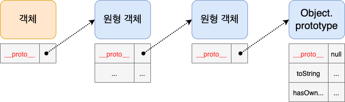
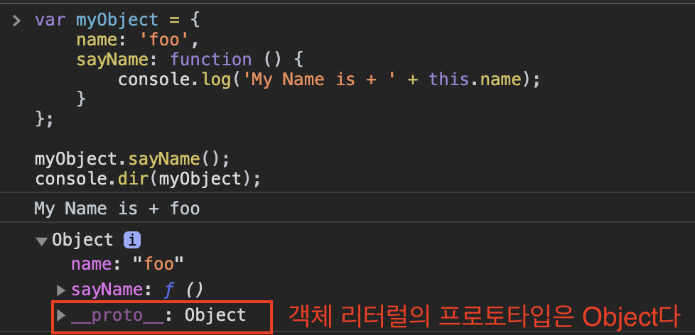
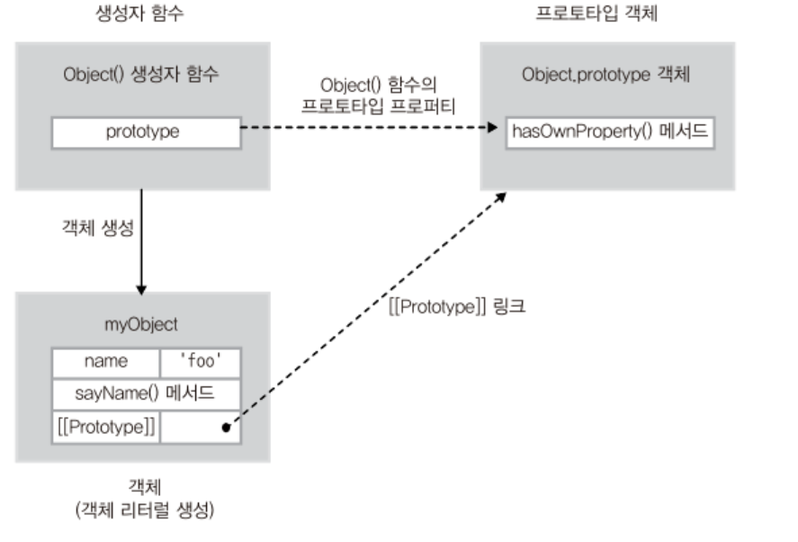
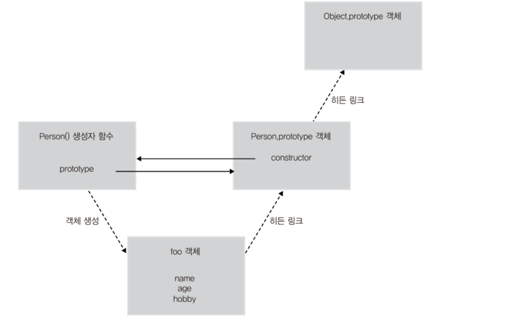

# 목차

<br>

- [목차](#목차)
- [프로토타입 체이닝](#프로토타입-체이닝)
- [1 프로토타입 체이닝이란](#1-프로토타입-체이닝이란)
- [2 객체 생성방식에 따른 프로토타입 체이닝](#2-객체-생성방식에-따른-프로토타입-체이닝)
  - [2-1 객체 리터럴 방식으로 생성된 객체의 프로토타입 체이닝](#2-1-객체-리터럴-방식으로-생성된-객체의-프로토타입-체이닝)
  - [2-2 생성자 함수로 생성된 객체의 프로토타입 체이닝](#2-2-생성자-함수로-생성된-객체의-프로토타입-체이닝)
- [3 프로토타입 체이닝의 종점은 Object이다](#3-프로토타입-체이닝의-종점은-object이다)
- [4 프로토타입 메서드와 this 바인딩](#4-프로토타입-메서드와-this-바인딩)
- [참고](#참고)

<br>

# 프로토타입 체이닝
[이전 글 - 프로토타입 이해하기](./프로토타입이란.md)에서 알 수 있듯이, JS에서 객체는 원형 객체로부터 생성되며, 생성된 객체는 원형에 대한 프로토타입 링크 (`__proto__`)를 갖게된다.

원형 또한 객체이므로 원형은 또 다른 원형을 참조하게되고, 아래와 같이 연속된 프로토타입 링크를 통해 JS의 최종 원형인 `Object.prototype`까지 연결된다.

<p align="center"> </p>

이번 글은 프로토타입 체이닝의 개념과 객체의 생성 방식에 따른 프로토타입 체이닝에 대해서 정리해본다.

<br>

# 1 프로토타입 체이닝이란
* `__proto__`
  * 모든 객체는 __proto__라는 프로퍼티를 가지고 있으며, 이 객체를 통해 자신의 부모 역할을 하는 객체에 접근할 수 있다.
* **프로토타입 체이닝이란**
  * **특정 객체의 프로퍼티나 메서드에 접근하려고 할 때, 해당 객체에 접근하고자하는 프로퍼티나 메서드가 없을 경우, `__proto__` 링크를 따라 프로퍼티를 검색한다.**
  * **이렇게 `__proto__`를 통해 상위 프로토타입들과 연결성이 Chain처럼 연결되어있어서 이를 프로토타입 체이닝이라 한다.**

<br>

# 2 객체 생성방식에 따른 프로토타입 체이닝

<br>

## 2-1 객체 리터럴 방식으로 생성된 객체의 프로토타입 체이닝
<p align="center"> </p>

* 객체 리터럴 방식으로 생성된 객체의 프로토타입은 `Object`로 체이닝되어있다.
  * 즉, 객체 리터럴 방식의 생성자 함수는 `Object`다.
* 그러므로 아래와 같이 `Object`의 메서드인 `hasOwnProperty()`를 호출할 수 있다.

<p align="center"><br>출처: 인사이드 자바스크립트 </p>

<br>

## 2-2 생성자 함수로 생성된 객체의 프로토타입 체이닝

```js
// Person() 생성자 함수
function Person(name, age, hobby) {
    this.name = name;
    this.age = age;
    this.hobby = hobby;
}

// foo 객체 생성
var foo = new Person('foo', 30, 'tennis');

// 프로토타입 체이닝
console.dir(foo.hasOwnProperty('name')); // true
```
<p align="center"><br>출처: 인사이드 자바스크립트 </p>

* 모든 객체는 자신을 생성한 생성자 함수의 `prototype` 프로퍼티가 가리키는 객체를 자신의 프로토타입 객체(부모 객체)로 취급한다.

<br>

# 3 프로토타입 체이닝의 종점은 Object이다

* JS에서 `Object.prototype` 객체는 프로토타입 체이닝의 종점이다.
  * 객체 리터럴 방식이나 생성자 함수를 이용한 방법이나 모두 프로토타입 체이닝의 종점은 `Object.prototype`이다.

<br>

# 4 프로토타입 메서드와 this 바인딩
프로토타입도 JS 객체다. 그러므로 객체와 동일하게 동작한다.

**프로토타입 메서드의 this는 기존의 메서드와 동일하게 동작한다.**

```js
// Person() 생성자 함수
function Person(name) {
    this.name = name;
}

// getName() 프로토타입 메서드
Person.prototype.getName = function() {
    return this.name;
};

// foo 객체 생성
var foo = new Person('foo');

console.log(foo.getName());              // foo

// Person.prototype 객체에 name 프로퍼티 동적 추가
Person.prototype.name = 'person';

console.log(Person.prototype.getName()); // person
```
위에서 `this`는 그 메서드를 호출한 객체에 바인딩된다.

<br>

# 참고
* 인사이드 자바스크립트
* 코어 자바스크립트


