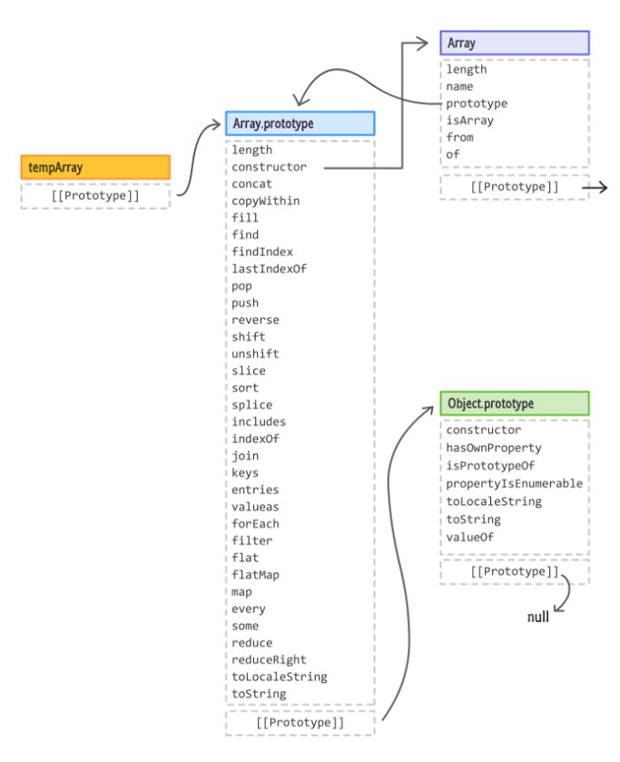

# 목차

<br>

- [목차](#목차)
- [JS 프로토타입 이해하기](#js-프로토타입-이해하기)
- [1 프로토타입 언어](#1-프로토타입-언어)
- [2 JS의 프로토타입](#2-js의-프로토타입)
  - [2-1 객체, 생성자 함수, 프로토타입 객체의 관계](#2-1-객체-생성자-함수-프로토타입-객체의-관계)
  - [2-2 생성자 함수](#2-2-생성자-함수)
  - [2-3 프로토타입 예시 예시](#2-3-프로토타입-예시-예시)
    - [Array 객체](#array-객체)
    - [간단한 프로토타입 예시](#간단한-프로토타입-예시)
- [3 프로토타입 속성과 사용 이유](#3-프로토타입-속성과-사용-이유)
  - [3-1 프로토타입 속성](#3-1-프로토타입-속성)
  - [3-2 사용이유](#3-2-사용이유)
- [참고](#참고)

<br>

# JS 프로토타입 이해하기
JS는 원형 객체로 새로운 객체를 생성하는 프로토타입(원형) 언어이다.

이번 글은 프로토타입이란 무엇이며 JS의 프로토타입 특징과 왜 사용하는지에 대해서 정리해본다.

<br>

# 1 프로토타입 언어
JS는 프로토타입 기반 언어인데, 프로토타입 기반 언어란 무엇일까?

위키피디아에선 아래와 같이 정의한다.

```text
프로토타입 기반 프로그래밍은 객체지향 프로그래밍의 한 형태로 클래스가 없고, 클래스 기반 언어에서 상속을 사용하는 것과는 다르게, 
객체를 원형(프로토타입)으로 하여 복제의 과정을 통하여 객체의 동작 방식을 다시 사용할 수 있다.
```

이를 해석하면 **프로토타입 기반 언어는 객체지향 프로그래밍을 구현하기 위해 원형 객체를 복제하여 새로운 객체를 생성하는 언어라고 볼 수 있다.**

그리고 조금 더 풀어말하면 **프로토타입 언어에선 모든 객체들이 메서드와 속성들을 상속받기 위한 템플릿으로써 프로토타입 객체 (prototype object)를 가진다고 볼 수 있다.** 

> 프로토타입의 사전적 의미
> * 프로토타입(prototype)은 원래의 형태 또는 전형적인 예, 기초 또는 표준을 의미한다.
> * protos (처음) + typos (느낌) => prototype (원본, 초기)

<br>

# 2 JS의 프로토타입

💁‍♂️ **복제가 아닌 프로토타입 링크를 통해 원형을 참조하는 방식으로 프로토타입을 구현한다**

앞서 `프로토타입 언어는 원형 객체를 복제하여 새로운 객체를 생성하는 언어`라고 말했다.

하지만 **JS는 실제로 원형 객체를 복제하여 새로운 객체를 생성하지않는다.**

대신 **복제가 아닌 프로토타입 링크를 통해 원형을 참조하게된다.**

그리고 **상속되는 속성과 메서드들은 각 객체가 아니라 객체의 생성자의 `prototype`이라는 속성에 정의되게된다.**

<br>

## 2-1 객체, 생성자 함수, 프로토타입 객체의 관계

<br>

💁‍♂️ **세 가지 개념의 관계**

JS는 복제가 아닌 프로토타입 링크를 통해 원형을 참조하는데, 그 구조가 아래와 같다.

<p align="center"> </p>

* `prototype` 프로퍼티: 프로토타입 속성 (원형 객체)
* `__proto__` (`[[Prototype]]`): 프로토타입 연결 (원형 객체를 가리킴)
* constructor: 생성자 함수

세 가지 개념의 역할은 아래와 같다.

* **모든 객체는 자신을 생성한 생성자 함수의 prototype 프로퍼티가 가리키는 객체를 자신의 프로토타입 객체 (부모 객체)로 취급한다.**
  * `prototype` : 생성자 함수로 생성하는 모든 객체의 **부모 객체** (프로토타입 속성)
    * **새로 생성되는 인스턴스에 상속되는 속성과 메서드들이 정의되어있는 객체.**
  * `__proto__` : 모든 객체가 가지고 있는 **부모 객체 링크** (프로토타입 연결)
    * **새로 생성되는 인스턴스가 `prototype`에 접근하기위한 링크.**
* **생성자 함수는 새로운 객체를 만들어주고, 자신의 prototype 프로퍼티를 부모 프로토타입으로 연결해주는 역할을 한다.**

<br>

💁‍♂️ **`prototype`과 `__proto__`은 그저 부모 객체와 부모 객체에 대한 링크를 의미한다.**

**`prototype`과 `__proto__`에 대해서 굉장히 헷갈리는데, 쉽게 이해하자면 `prototype`은 부모 객체를 의미하며, `__proto__`는 부모 객체에 접근하기위한 링크로 이해하면 된다.**

<br>

## 2-2 생성자 함수
JS에서 프로토타입 기반의 객체를 생성하고 사용하는데에는 생성자 함수의 역할이 가장 크다.

그러므로 생성자 함수가 어떻게 새로운 객체를 생성하고 프로토타입과 연결하는지에 대한 이해가 필요하다.

<br>

💁‍♂️ **JS에서 `new` 연산자로 객체를 생성하면 생성자 함수가 수행된다.**

JS에서 함수는 객체이므로 일반 객체와 동일하게 동작한다. 그리고 `[[Construct]]` 프로퍼티를 가진 함수는 아래와 같이 객체로 생성될 수 있다.

**실제로 JS의 모든 객체는 생성자 함수를 가지고있으며, 자바와 다르게 기존 함수에 `new 연산자`를 붙여서 호출하면 해당 함수는 생성자 함수로 동작하게된다.**

<p align="center"> </p>

<p align="center"><br>출처: 인사이드 자바스크립트 </p>

그리고 **모든 객체는 위와 같이 해당 객체의 프로토타입이 가리키는 생성자 함수에 의해서 생성(`new`)되며, 생성자 함수는 새로운 객체(인스턴스)를 생성하고 새로운 객체에게 프로토타입에 접근할 수 있는 프로토타입 링크 (`__proto__`)를 부여한다.**

> **결국 객체를 생성하는 건 생성자 함수의 역할이지만, 생성된 객체의 실제 템플릿 역할을 하는 건 생성자 자신이 아닌 생성자의 prototype 프로퍼티가 가리키는 프로토타입 객체다.**

<br>

💁‍♂️ **생성자 함수 동작 방식**

생성자 함수의 동작 방식을 조금 더 자세히 보면 아래와 같다.

```js
function Circle(radius) {
  // 1. 암묵적으로 빈 인스턴스가 생성되고 this에 바인딩된다.
  console.log(this); // Circle {} (빈 인스턴스)
  
  // 2. this에 바인딩되어 있는 인스턴스를 초기화한다.
  this.radius = radius;
  this.getDiameter = function() {
    return 2*this.radius;
  };
  
  // 3. 완성된 인스턴스가 바인딩된 this가 암묵적으로 반환된다.
  // return this;
}
```

<p align="center"><br>출처: 인사이드 자바스크립트 </p>

1. 인스턴스 생성과 this 바인딩
   * **인스턴스를 생성할 때, 부모 객체인 `prototype`에 대한 연결링크도 생성자함수로부터 할당받는다. (`__proto__`)**
2. 인스턴스 초기화
3. 인스턴스 반환

<br>

## 2-3 프로토타입 예시 예시

<br>

### Array 객체 
JS에서는 배열 역시 객체로 취급한다. 

<br>

💁‍♂️ **JS에서 배열은 모두 Array 생성자 함수로 생성한 것과 동일하게 동작한다. 그러므로 배열의 프로토타입은 `Array`이다.**

JS에서 배열은 모두 Array 생성자 함수로 생성한 것과 동일하게 동작한다. 

<p align="center"> </p>

* 리터럴 객체의 프로토타입은 `Object`이지만, 배열의 프로토타입은 `Array`이다.

이를 세 가지 개념으로 도식화하면 아래와 같다.

<p align="center"><br>출처: https://stackoverflow.com/questions/41208613/when-to-use-array-prototype-and-when-to-use-this-in-javascript </p>

그중에서 **prototype이라는 property가 존재하는데, 이 property가 바로 인스턴스화된 배열의 `[[Prototype]]` 로 연결이되어있다.**


**그러므로 배열은 `push`, `length`와 같은 배열 표준 메서드를 사용가능하지만, `Object`는 사용할 수 없다.**

**실제로 아래와 같이 아무 인스턴스화된 배열의 `[[Prototype]]`과 `Array의 prototype`는 같은 객체인 것을 볼 수 있다.**

<p align="center"> </p>

<br>

**또 다른 간단한 예시**

```js
let tempArray = [1, 2, 3, 4, 5, 6, 7, 8, 9, 10];
```

<p align="center"><br>출처: https://www.kirupa.com/html5/extending_built_in_objects_javascript.htm </p>

<br>

### 간단한 프로토타입 예시
```js
function Member() {
    this.x = "this";
};

Member.prototype.x = "protoX";
Member.prototype.y = "protoY";
Member.x = "x";

var a = new Member();

console.log(a.x);                // "this"
console.log(Member.x);           // "x"
console.log(a.y);                // "protoY"
console.log(Member.prototype.x); // "protoX"
console.log(Member.prototype.y); // "protoY"
```

<br>

# 3 프로토타입 속성과 사용 이유

<br>

## 3-1 프로토타입 속성
앞서 프로토타입언어에선 모든 객체들이 메서드와 속성들을 상속받기 위한 템플릿으로써 프로토타입 객체 (prototype object)를 사용한다고했다.

<br>

🤔 **그럼 상속 받는 속성과 메서드들은 어디에 정의되어 있을까?**

**정답은 상속 받는 멤버들은 `prototype` 속성에 정의되어있다.**

예를 들어, **`Object.`로 시작하는게 아니라, `Object.prototype.`로 시작하는 객체에 정의되어 담겨있다.**

<br>

> 정리하면.. **`prototype`도 하나의 객체이며 프로토타입 체인을 통해 상속하고자 하는 속성과 메서드를 담아주는 버킷으로 사용된다.**

<br>

## 3-2 사용이유

프로토타입을 왜 사용하는지 예시를 통해 살펴본다.

<br>

💁‍♂️ **프로토타입을 사용하지 않을 경우**

```js
function Person(name, age) {
    this.name = name;
    this.age = age;
}

var mark = new Person('마크', 25);
var binghe = new Person('빙허', 27);

// 매 인스턴스마다 메서드를 설정해줘야한다.
mark.setOlder = function() {
    this.age += 1;
}
mark.getAge = function() {
    return this.age;
}
binghe.setOlder = function() {
    this.age += 1;
}
binghe.getAge = function() {
    return this.age;
}
```
프로토타입을 사용하지 않을경우, 위와 같이 매 인스턴스마다 메서드를 설정해주어야한다.

그리고 매 인스턴스마다 메서드를 위한 메모리 낭비가 발생한다.

**물론 아래와 같이 코드의 중복을 줄일 수 있지만, 아래 예시 또한 `setOlder`과 `getAge`가 중복되어 생성되어 메모리 낭비 문제가 여전히 존재한다.**

```js
function Person(name, age) {
    this.name = name;
    this.age = age;
    this.setOlder = function() {
        this.age += 1;
    }
    this.getAge = function() {
        return this.age;
    }
}
```

<br>

💁‍♂️ **프로토타입을 사용할 경우**

위 예시를 프로토타입을 사용하는 예시로 변경해본다.

```js
function Person(name, age) {
    this.name = name;
    this.age = age;
}
Person.prototype.setOlder = function() {
    this.age += 1;
}
Person.prototype.getAge = function() {
    return this.age;
}

var mark = new Person('마크', 25);
var binghe = new Person('빙허', 27);
```
이렇게되면 하나의 메서드만 정의하고 인스턴스별 자신의 고유한 상태값을 사용하여 메서드를 재활용할 수 있게된다.

그리고 매번 동일한 메서드를 반복적으로 설정해줄 필요도 없게된다.

<br>

> **프로토타입을 이용하여 인스턴스의 메서드를 템플릿 객체에 일반화시킨 것!**

<br>

# 참고
* 인사이드 자바스크립트
* 코어 자바스크립트
* https://developer.mozilla.org/ko/docs/Learn/JavaScript/Objects/Object_prototypes

