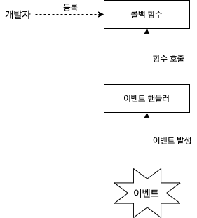
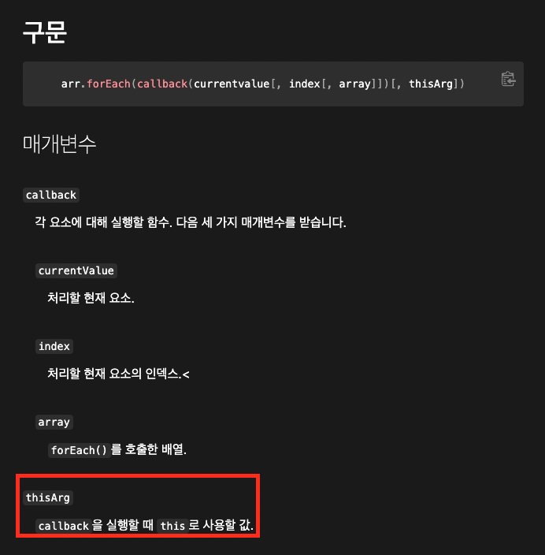

# 목차

<br>

- [목차](#목차)
- [callback 함수 이해하기](#callback-함수-이해하기)
- [1 callback의 의미](#1-callback의-의미)
- [2 callback 함수의 제어권](#2-callback-함수의-제어권)
- [3 callback 함수의 특징](#3-callback-함수의-특징)
- [4 callback으로 넘기는 것은 무조건 함수로 취급된다](#4-callback으로-넘기는-것은-무조건-함수로-취급된다)

<br>

# callback 함수 이해하기

<br>

# 1 callback의 의미

<br>

💁‍♂️ **사전적 의미**

* callback - 전화를 나한테 다시 해준다.
  * they will call me back later
  * 회신하다. 답신하다.
* callback function - 회신되는 함수
  * 특정 처리가 완료되거나 혹은 이벤트가 발생했을 때, 회신되는 함수 (호출되는 함수)

<br>

💁‍♂️ **콜백함수의 의미**

<p align="center"><br>대표적인 콜백함수 예시 </p>

콜백 함수는 코드를 통해 명시적으로 호출하는 함수가 아니라, 함수를 등록하고 어떤 이벤트가 발생했거나 특정 시점에 도달했을 때 시스템에서 호출되는 함수를 말한다.

<br>

💁‍♂️ **제어권 관점에서의 콜백함수 - 중요**

* **제어권 관점에서 콜백은 제어권을 넘긴다는 의미이다.**
* **콜백함수를 어떻게 실행할지는, 제어권을 넘겨받은 쪽에서 전적으로 관리하게된다.**
  * 즉, 콜백함수를 정의하여 넘겨줄 뿐, 해당 콜백함수의 제어권은 콜백함수를 매개변수로 받은 함수가 소유하게된다. (실행도 해당 함수가 실행한다.)

<br>

# 2 callback 함수의 제어권

<br>

💁‍♂️ **콜백함수를 넘겨주면서 넘겨주게 될 제어권은 크게 3가지이다.**

1. 실행 시점
2. 매개변수
3. this

**이 세가지는 모두 콜백함수를 실행하는 측에서 관리 및 제어한다.**

<br>

1️⃣ **실행 시점**

```js
var callback = function() {
    console.log(`1초마다 실행된다.`);
};
setInterval(callback, 1000);
```
* `setInterval`은 콜백함수를 넘겨줄 때 같이 넘기는 주기 단위로 콜백 함수를 실행한다.
* 즉, **콜백함수를 언제 실행하고 실행할지 여부를 판단하는 실행하는 제어권은 콜백함수를 실행하는 `setInterval` 함수에있다.**

<br>

2️⃣ **매개변수**

```js
var arr = [1, 2, 3, 4, 5];
var entries = [];
arr.forEach(function(v, i) {
    entries.push([i, v, this[i]]);
}, [10, 20, 30, 40, 50]);
console.log(entries); // [[0, 1, 10], [1, 2, 20], [2, 3, 30], [3, 4, 40], [4, 5, 50]]
```
* **`forEach`을 호출하며 매개변수로 콜백함수를 넘기면 해당 콜백함수의 `index`인 `i`를 `forEach`가 넣어준다.**
  * 위 예시에서의 `i`도 `forEach`가 넣어주는 것.
* 그리고 `forEach`의 두번째인자로 넘겨지는 것이 해당 콜백함수의 `this`가 된다.
  * 위 예시에서의 `[10, 20, 30, 40, 50]`
  * 물론 생략가능하다.

> 위 내용은 어떻게 알 수 있을까? 바로 문서를 살펴보면 된다.
> 
> <p align="center"><br>출처: https://developer.mozilla.org/ko/docs/Web/JavaScript/Reference/Global_Objects/Array/forEach </p>

<br>

3️⃣ **`this`**

**콜백함수를 실행하는 쪽에서 `this` 바인딩에 대한 제어권을 가지게된다.**

아래 예시를 살펴보면 이해가 쉽다.

```js
document.body.innerHTML = '<div id="a">abc</div>';
function callback(x) {
    console.log(this, x);
}

document.getElementById('a')
    .addEventListener('click', callback);
```
* **`addEventListener`로 넘기는 콜백함수의 `this`는 대상 `Dom Element`를 가리킨다.**
  * 이는 **`addEventListener` (콜백함수를 실행하는쪽)에서 직접 바인딩을 해주기때문이다.**
  * 즉, **콜백함수를 실행하는 쪽에서 `this` 바인딩에 대한 제어권을 가지고있다고 볼 수 있다.**
* 그리고 **콜백 함수의 매개변수 `x`는 `Event` 객체에 넘겨진다.** (클릭 이벤트에 `x` 값도 같이 넘겨지게된다.)
  * **이것도 마찬가지로 콜백 함수를 실행하는 `addEventListener`에서 콜백함수를 실행하면서 매개변수를 넣어준다.**

> 위 내용도 문서를 살펴보면 나오는 내용이다.
> 
> https://developer.mozilla.org/ko/docs/Web/API/EventTarget/addEventListener#%EB%A7%A4%EA%B0%9C%EB%B3%80%EC%88%98

<br>

# 3 callback 함수의 특징
앞서 살펴봤듯이 콜백 함수는 아래와 같은 특징을 가진다.

* **다른 함수 `(A)`의 인자로 콜백함수 `(B)`를 전달하면, `A`가 `B`의 제어권을 갖게된다.**
  * **특별한 요청(ex. bind)가 없는한, `A`에 미리 정해놓은 방식에 따라 `B`를 호출한다.**
  * **미리 정해놓은 방식이란 어떤 시점에 콜백을 호출할지, 인자에 어떤 값들을 지정할지, this에 무엇을 바인딩할지등의 제어권을 말한다.**

<br>

# 4 callback으로 넘기는 것은 무조건 함수로 취급된다
**콜백함수 관련된 코드를 작성할 때 가장 주의할 점은 콜백으로 넘기는 것은 무조건 함수로 취급된다는 것이다.**

```js
var arr = [1, 2, 3, 4, 5];
var obj = {
    vals: [1, 2, 3],
    logValues: function(v, i) {
        if (this.vals) {
            console.log(this.vals, v, i);
        } else {
            console.log(this, v, i);
        }
    }
};
obj.logValues(1, 2); // [1, 2, 3] 1 2 (메서드로 호출)
arr.forEach(obj.logValues); 
// 콜백함수로 전달 결과
// window 1 0 
// window 2 1 
// window 3 2 
// window 4 3 
// window 5 4 
```

위와 같이 `logValues`는 메서드로의 호출과 콜백 함수로의 함수 호출로 나눠서 볼 수 있다.

* **메서드로 호출될 경우 - `obj.logValues(1, 2);`**
  * **메서드로 호출**
  * `this`가 메서드로 동작하여 해당 객체를 바라보게된다.
* **콜백함수로 전달된 경우 - `arr.forEach(obj.logValues)`**
  * **일반 함수로 취급되어 `this`가 전역 객체를 바라보게된다.**
  * **이는 콜백함수로 넘겨지는 모든 값들이 모두 함수로 취급되기때문이다.**
  * 만약 `this` 바인딩을 꼭 지정하고싶다면, 명시적 바인딩을 사용하여 변경해줘야한다.

> **중요한 건!! 콜백함수로 넘겨지는 모든 값들이 모두 일반 함수로 취급된다는 것이다.**
