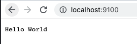

# 목차

<br>

- [목차](#목차)
- [들어가며](#들어가며)
- [Node.js](#nodejs)
  - [Node.js란?](#nodejs란)
  - [Node.js 특징](#nodejs-특징)
  - [Node.js 설치 및 버전 변경](#nodejs-설치-및-버전-변경)
  - [Node.js Hello World](#nodejs-hello-world)
- [NPM](#npm)
  - [NPM이란?](#npm이란)
  - [NPM 사용법](#npm-사용법)
  - [package.json](#packagejson)
  - [package-lock.json](#package-lockjson)
- [Node.js와 NPM을 이용하여 EXPRESS로 Hello World 서버 띄우기](#nodejs와-npm을-이용하여-express로-hello-world-서버-띄우기)
- [마치며](#마치며)
- [참고](#참고)

<br>

# 들어가며
이번 글은 프론트 개발자라면 빼놓을 수 없는 Node.js와 NPM의 대한 개념을 정리하는 글을 작성해보려고한다.

Node.js와 NPM의 기본적인 개념과 추구하는 방향 그리고 사용법에 대해서 정리하였다.

처음 Node.js와 NPM을 사용하려는 개발자를 대상으로 가능한 쉽게 작성하려고 노력했다.

<br>

# Node.js
자바스크립트를 사용하면 여러번 듣는 단어중 하나가 `Node.js`다.

이번 챕터에선 Node.js란 무엇이며, 어떻게 사용하는지에 대해서 간단히 다룬다.

<br>

## Node.js란?
Node.js에 대한 개념을 바로 알아보기이전에 JavaScript와 ECMAScript에 대해서 먼저 알아보자.

<br>

🤔 JavaScript와 ECMAScript

<p align="center"></p>

* ECMAScript (European Computer Manufacturer's Association)
  * 자바스크립트의 표준 사양한 ECMA-262 및 ECMA-402 스펙 를 말하며, 자바스크립트의 기본적인 핵심 문법을 규정한다. (기본 뼈대)
  * 자바스크립트를 표준화하기 위해 만들어졌다.
  * 값, 타입, 객체, 프로퍼티, 함수, 객체등등에 대한 개념을 정의하고 있으며 규정한다.
* JAVAScript
  * JAVAScript = ECMAScript + 여러 API
  * 자바스크립트는 기본 뼈대인 ECMAScript를 준수하며 브라우저나 여러 API를 포함하는 개념이다.
    * 여러 API의 예시로는 브라우저에서 많이 사용되는 Web API(DOM, BOM, fetch.. 등등)가 가장 대표적이다.

자바스크립트란 언어는 ECMAScript란 사양을 준수하는 범용 스크립트 언어이다.

<br>

🤔 브라우저 vs Node.js

> 자바스크립트는 보통 브라우저에서 많이 사용된다. 그렇다면 브라우저와 Node.js의 차이는 뭘까?

<p align="center"> </p>

* 공통점
  * ECMAScript을 준수한 자바스크립트 언어로 구성되어있다.
* 차이점
  * 브라우저 (JS + Web API)
    * 클라이언트 사이드 Web API 지원
    * DOM API를 기본적으로 제공하며, 파일 시스템등을 기본적으로 제공하지 않는다. (물론 방법은 있다)
  * Node.js (JS + Built-in API)
    * 파일 시스템, HTTP등 API 지원
    * DOM API와 같은 브라우저에서 사용하는 API를 제공하지 않으며, 파일 시스템, HTTP등을 기본적으로 제공한다.

쉽게 이야기하면 Node.js는 브라우저가 아닌 **일반적 컴퓨터에서의 JS 런타임 환경**이다.

<br>

🤔 그래서 Node.js가 뭐야?

[Node.js](https://nodejs.org/en/)는 구글이 발표한 오픈소스 [V8 엔진](https://v8.dev/)으로 빌드된 자바스크립트 런타임 환경이다.

> 자바에선 JRE이 있듯이, 자바스크립트엔 V8엔진을 기반으로한 Node.js란 런타임 환경이 있다고 생각하면 된다.

Node.js는 브라우저 외부 환경에서 JS 애플리케이션 개발에 사용되며, 이에 필요한 모듈, 파일 시스템, HTTP등이 빌트인으로 제공한다.

특히 백엔드에서만 다뤘던 서버를 Client-Side 개발을 하던 개발자(프론트엔드 개발자)들도 JS로 구축할 수 있다는 장점이 있다.

<br>

## Node.js 특징
Node.js는 Non-Blocking I/O와 단일 스레드 이벤트 루프를 통한 높은 Request 처리 성능을 가지고 있다.

다시 말해, 모든 API는 비동기 방식으로 동작하여 Non-Blocking I/O가 가능하고 단일 스레드 이벤트 루프 모델을 사용하여 보다 가벼운 환경에서도 빠르게 동작한다.

더 자세한 내용은 다른 글에서 다룰 예정이다.

<br>

## Node.js 설치 및 버전 변경

<br>

💁‍♂️ 먼저 Node.js를 설치해본다.

설치하는 방법은 간단하다. [Node.js](https://nodejs.org/en/)사이트에서 LTS버전을 다운받아 설치하면 Node.js와 NPM이 설치된다.

설치된 bin 파일 위치는 아래와 같다. (MAC 기준)
* Node.js: `/usr/local/bin/node`
* npm: `/usr/local/bin/npm`

제대로 설치되었다면 아래 명령어를 입력하면 설치된 버전이 출력된다.

```shell
$ node -v
$ npm -v
```

<br>

💁‍♂️ 만약 Node.js가 설치되었는데 버전을 바꾸고 싶다면?

```shell
$ npm install -g n
```
Node.js의 버전을 바꾸기 위해선 Node.js의 버전 매니저인 `n`을 설치해야한다.

> 만약 권한 관련된 에러가 발생한다면 `sudo`를 붙여주면 된다.

그리고 캐시를 강제로 삭제해준다.

```shell
$ npm cache clean -f
```

```shell
$ n {원하는 버전} # 버전 지정하여 수정
$ n lts        # 최신 LTS 버전 설치
```

설치가 완료되고 버전을 확인해보면 변경된 것을 볼 수 있다. (`node -v`)

> 만약 설치에 실패하거나 버전이 변경되지 않은 경우, `/usr/local/n/versions/node/{버전}`를 삭제하고 재설치하면 된다.

만약 특정 버전을 삭제하고싶다면 아래 명령어를 입력하면 된다.

```shell
$ n rm {원하는 버전}
$ n prune # 현재 사용중인 버전을 제외한 나머지 버전 일괄 삭제
```

<br>

## Node.js Hello World
이제 간단히 Node.js로 Hello World를 실행해본다.

<br>

💁‍♂️ 콘솔에 Hello World 찍기

> helloworld.js

```javascript
console.log('Hello World');
```

> 터미널

```shell
$ node helloworld.js

Hello World # 실행 결과
```

<br>

💁‍♂️ HTTP Server

간단히 HTTP 서버를 작성해서 시동해본다.

> app.js
```javascript
const http = require('http');
const port = 9100;

http.createServer((request, response) => {
    response.statusCode = 200;
    response.setHeader('Content-Type', 'text/plain');
    response.end('Hello World');
}).listen(port);

console.log(`Server running at http://127.0.0.1:${port}`);
```

동일하게 실행하면 된다.

```shell
$ node app.js
```

<p align="center"> </p>

<br>

# NPM
앞서 Node.js가 JS를 실행시키는 런타임 환경이라는 것을 알았다.

이제 NPM에 대해서 알아본다.

<br>

## NPM이란?

<br>

🤔 NPM이란?

NPM (Node Package Manager)은 자바스크립트 언어를 위한 패키지 관리자로, Node.js의 기본 패키지 관리자다.

관리툴을 이용하여 Node.js로 만들어진 모듈을 웹에서 받아서 쉽게 설치하고 관리해주는 프로그램이다.

> Python에서의 pip와 Java에서의 Gradle과 비슷한 역할이라고보면 된다.

<br>

🤔 NPM이 없다면?

1. NPM이 없다면 외부 라이브러리 패키지에 대한 형상관리가 어렵다. (직접 Github에서 다운받아 사용해야한다.)
2. NPM이 없다면 애플리케이션 제작시 자신이 아닌 다른 개발자가 개발해둔 좋은 라이브러리를 쉽게 활용하기 어려워진다.

<br>

## NPM 사용법

이번엔 NPM을 이용하여 어떻게 프로젝트를 생성하며 관리하는지 직접 명령어를 입력하며 살펴본다.

<br>

💁‍♂️ **프로젝트 시작 (`npm init`)**

```shell
$ npm init -y

{
  "name": "test",
  "version": "1.0.0",
  "description": "",
  "main": "index.js",
  "scripts": {
    "test": "echo \"Error: no test specified\" && exit 1"
  },
  "keywords": [],
  "author": "",
  "license": "ISC"
}

$ tree

.
└── package.json
```
* `npm init`: Node.js로 프로젝트를 시작할 때 NPM 초기 명령어이다.
  * `-y`를 붙인 이유는 초기 설정을 바로 초기화하기 위함이다. 만약 이 옵션을 주지 않으면 name, version등을 직접 입력해주어야한다.
* package.json을 생성하는 명령어라고 봐도 좋다.

> package.json에 대한 내용은 [아래]()에서 다룬다.

<br>

💁‍♂️ **모듈 설치 (`npm install`)**

이제 NPM을 사용하여 원하는 모듈 패키지를 설치해본다.

```shell
$ npm install
$ npm install express
```
* `npm install`: `package.json` 파일 및 해당 종속성에 나열된 모든 모듈 패키지 설치
* `npm install {패키지이름}@{버전}: 특정 패키지의 특정 버전 설치
  * (ex) `npm install express`: express 모듈 설치
  * (ex) `npm install express --global`: 전역 설치 (보통 `/usr/local/lib/node_modules`에 설치된다)
  * (ex) `npm install express --save-prod`: 지역 설치 (prod) -> `dependencies`에 추가됨.
  * (ex) `npm install express --save-dev`: 지역 설치 (dev) -> `devDependencies`에 추가됨.
* `npm install {주소}`: 특정 저장소에 저장된 패키지 설치. (예를 들어 github repo에 저장된 모듈 설치)

<br>

💁‍♂️ **모듈 삭제 (`npm uninstall`)**

NPM에 설차된 모듈 패키지를 삭제.

```shell
$ npm uninstall
$ npm uninstall express
```
* `npm uninstall`: 패키지 삭제 명령. (`node_modules`에 저장된 모듈을 삭제한다.)
* `npm uninstall {패키지 이름}@{버전}`: 패키지 삭제
  * (ex) `npm uninstall {패키지 이름}@{버전} -g`: 전역에 설치된 모듈 패키지 삭제 (`--global`도 가능)

<br>

💁‍♂️ **모듈 업데이트 (`npm update`)**

모듈 업데이트.

```shell
$ npm update
```

<br>

## package.json
> package.json에 대한 자세한 내용은 [공식 문서](https://docs.npmjs.com/cli/v8/configuring-npm/package-json)와 [참고](https://programmingsummaries.tistory.com/385)를 참고.

npm프로젝트를 초기화하면 아래와 같은 `package.json`이 생성된다.

```json
{
  "name": "test",
  "version": "1.0.0",
  "description": "",
  "main": "index.js",
  "scripts": {
    "test": "echo \"Error: no test specified\" && exit 1"
  },
  "keywords": [],
  "author": "",
  "license": "ISC"
}
```

`package.json`은 프로젝트 정보와 의존성 (dependencies)을 관리하는 문서이다.

프로젝트에서 어떤 패키지를 사용할 것인지, 어떤 버전을 사용하는지 등을 기록함으로써 어느 곳에도 동일한 개발 환경을 구축할 수 있도록 해준다.

> Java 개발자라면 Gradle의 `build.gradle`과 유사한 역할을 한다.

`package.json`의 상태는 다음과 같다.

* name: 프로젝트 이름. (필수)
* version: 프로젝트 버전을 정의 (필수)
* description: 프로젝트 설명
* keywords: 프로젝트 검색할 때 참조되는 키워드 (npm search)
* scripts: 프로젝트에서 자주 실행해야 하는 명령어를 scripts로 작성해두고 npm으로 명령어로 실행 (`npm run ...`)
* main: 프로젝트의 시작점이 되는 모듈의 ID. 
  * 예를 들어 `foo`라는 패키지가 있다면, 이를 사용하는 프로젝트에선 `require("foo")`로 임포트한다. 이때 main으로 지정된 모듈의 exports객체가 반환된다.
* dependencies: 애플리케이션의 로직을 구현(동작)하는데 연관이 있는 의존 패키지.
  * `npm install {라이브러리} --save-prod`로 의존성 추가한다.
  * ex. react, angular, chart, jquery, vue등등
* devDependencies: 개발 시에만 사용하는 개발용 의존 패키지.
  * `npm install {라이브러리} --save-dev`로 의존성 추가한다.
  * ex. webpack, js-compression, sass, eslint, imagemin등등

<br>

## package-lock.json
> 자세한 내용은 [공식 문서 - package-lock.json](https://docs.npmjs.com/cli/v8/configuring-npm/package-lock-json)을 참고.

npm을 사용하다보면 `package-lock.json`이라는 파일이 생성된다.

<br>

🤔 `package-lock.json`이란?

* `package-lock.json`은 `npm install`을 통해 `node_modules`나 `package.json`파일을 수정하게되면 자동으로 생성되는 파일이다.
* 이 파일은 **파일이 생성되는 시점의 의존성 트리에 대한 정확한 정보**를 가지고있는다. (특히 버전)
  * 이 파일은 가능한 저장소에 꼭 같이 커밋해야한다.
  * `node_modules`없이 배포하는 경우 꼭 필요하다.

<br>

🤔 `package-lock.json`이 왜 필요한가?

보통 `package.json`파일로 패키지를 설정할 때 `^`와 같이 특정 버전이 아닌 버전의 범위를 나타낸다.

현재 내 컴퓨터에는 `4.0.0`이 설치되어있다고해도, 추후에 새로운 minor, patch가 publish되면 다른 팀원의 컴퓨터에는 `4.0.1`이 설치될 수도 있는 것이다.

대부분의 경우엔 문제가 없지만, 간혹 이로인해 오류가 발생하기도 한다고한다.

`package-lock.json`이 존재한다면 의존성 트리에 대한 정보를 정확히 가지고있기 때문에, 더욱 동일한 환경을 이후에도 구축할 수 있도록 도와준다.

<br>

# Node.js와 NPM을 이용하여 EXPRESS로 Hello World 서버 띄우기
이제 Node.js와 NPM에 대한 기본적인 개념을 이해했으니, 간단히 EXPRESS 사용해서 Hello World 서버를 만들어본다.

```shell
# npm 프로젝트 초기화
$ npm init -y

# express 패키지 설치
$ npm install express --save-prod

# express가 제대로 의존성으로 들어왔는지 package.json 확인
$ cat package.json
{
  "name": "express_helloworld",
  "version": "1.0.0",
  "description": "",
  "main": "index.js",
  "scripts": {
    "clean:node": "rm -rf ./node_modules",
    "test": "echo \"Error: no test specified\" && exit 1"
  },
  "keywords": [],
  "author": "",
  "license": "ISC",
  "dependencies": {
    "express": "^4.17.2"
  }
}

# express 코드 작성
$ vim index.js
const express = require('express');
const app = express();
const port = 9100;

app.get('/', function (req, res) {
    res.send('Hello World');
});

let server = app.listen(port, function() {
    let host = server.address().address;
    let port = server.address().port;

    console.log(`Server is running at: ${host}:${port}`);
});

# 실행
$ node index.js
```

<br>

# 마치며
이번 글에선 Node.js와 NPM에 대한 기본적인 개념에 대해서 다뤘다.

백엔드 개발자로서 프론트에 대한 궁금증이 많았는데 정리를하면서 조금씩 이해가되는 것 같다.

처음 Node.js와 NPM을 다루시는 분들에게 도움이 되었으면~~

<br>

# 참고
* https://nodejs.org/en/
* https://v8.dev/
* https://poiemaweb.com/nodejs-basics
* https://docs.npmjs.com/cli/v8/configuring-npm/package-lock-json
