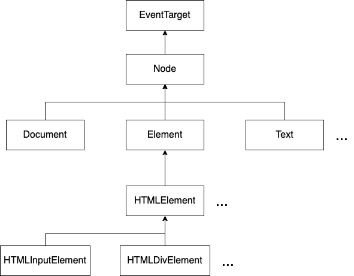
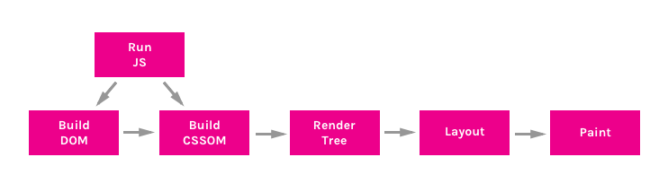
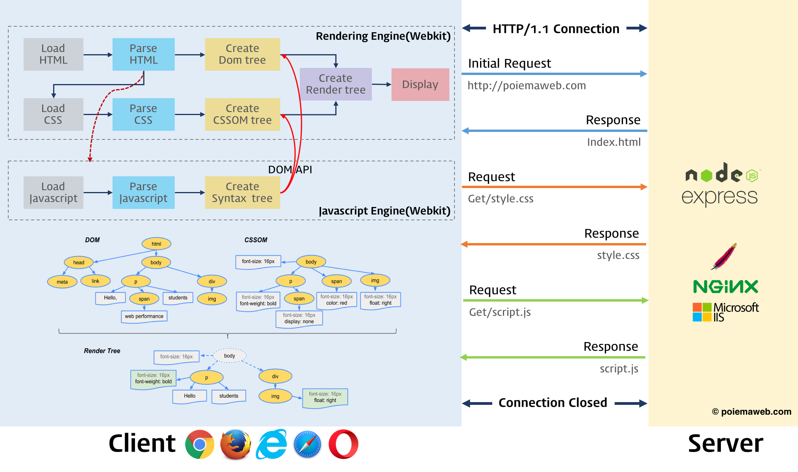
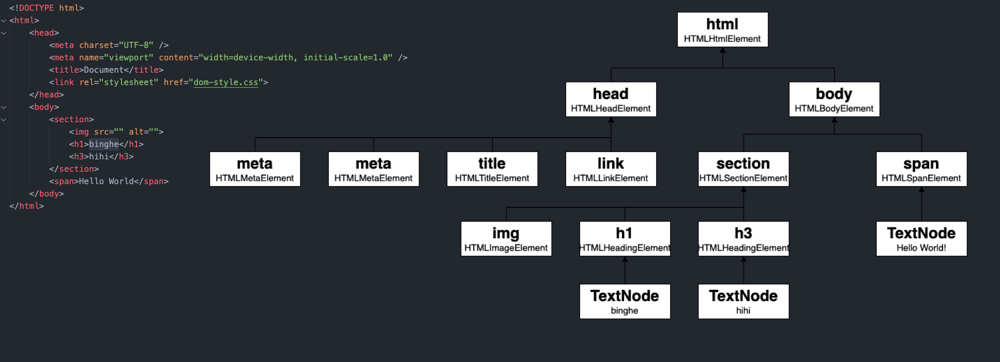
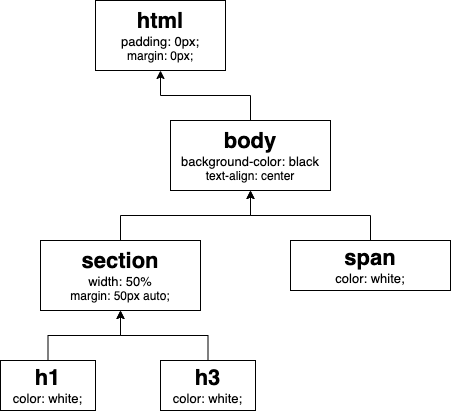
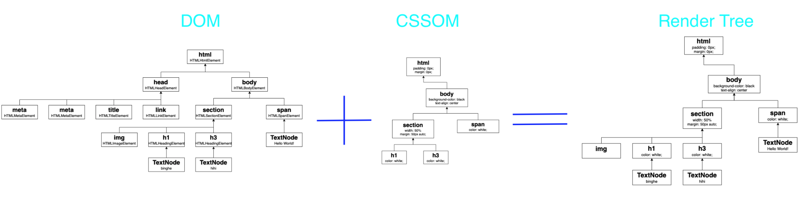

# DOM

<br>

- [DOM](#dom)
  - [DOM을 알아야 하는 이유](#dom을-알아야-하는-이유)
  - [DOM이란](#dom이란)
    - [DOM을 정확히 알아보자](#dom을-정확히-알아보자)
  - [DOM 구성 요소](#dom-구성-요소)
    - [Node](#node)
    - [EventTarget](#eventtarget)
  - [웹 페이지 빌드](#웹-페이지-빌드)
    - [DOM Tree](#dom-tree)
    - [CSSOM](#cssom)
    - [Render Tree](#render-tree)
    - [성능 보장 렌더링 순서](#성능-보장-렌더링-순서)
  - [DOM API](#dom-api)
- [출처](#출처)

<br>

## DOM을 알아야 하는 이유
* JS를 이용해 html에서 데이터를 가져오고 싶다면?
* 웹페이지에 보여지는 데이터를 변경하고 싶다면?
* 인터렉티브한 웹어플리케이션을 만들고 싶다면?

단순히 정보를 보여주는 웹페이지가 아니라, 동적인 기능이 있는 웹어플리케이션을 만들고 싶다면, **문서를 조작할 수 있게 해주는 DOM을 알아야 한다.**

<br>

## DOM이란
구글에서 DOM을 검색하면 아래와 같이 나온다.
```text
문서 객체 모델(Document Object Model)은 HTML, XML 문서의 프로그래밍 interface입니다.
DOM은 문서의 구조화된 표현(structured representation)을 제공하며 
프로그래밍 언어가 DOM 구조에 접근 할 수 있는 방법을 제공하여 문서 구조 및 스타일, 내용 등을 변경할 수 있게 도와줍니다.
```

포인트만 잡아보면 아래와 같다.

```text
DOM은 프로그래밍 언어가 DOM 구조에 접근할 수 있는 방법을 제공하여 
문서 구조, 스타일, 내용 등을 변경할 수 있게 돕는다.
```
* 즉, **DOM은 JS와 같은 프로그래밍 언어가 문서의 구조에 접근할 수 있는 방법을 제공하고, 변경할 수 있게 해준다.**

<br>

### DOM을 정확히 알아보자
> 본 내용은 [DOM이란 무엇인가? - godori](https://velog.io/@godori/DOM%EC%9D%B4%EB%9E%80-%EB%AC%B4%EC%97%87%EC%9D%B8%EA%B0%80)을 가져왔습니다.

1. 내가 작성한 HTML코드가 DOM이다?
   * 아니다! 하지만 내가 작성한 코드가 브라우저에 의해 파싱되면 DOM이 된다. (DOM이 HTML원본과 항상 동일하지는 않다.)
2. 페이지 View Source가 DOM이다? (DOM은 브라우저에서 보이는 것일까?)
   * 아니다! View Source는 그 페이지를 이루고 있는 HTML을 보여줄 뿐이며, 내가 작성한 HTML과 같다.
   * 하지만 백엔드 언어를 사용한 템플릿 파일을 이용한 경우, 정확히는 컴파일 된 결과를 말하는 것이다.
3. DevTools에서 보이는 코드가 DOM이다. (DOM은 개발도구에서 보이는 것이 아니다)
   * 그렇다! 브라우저에서 지원하는 개발자 툴에서 보이는 것이 DOM이다!
   * 이 툴에서 시각적으로 표현한 DOM이 나의 HTML 코드와 동일할 수는 있지만, 대개는 달라지게 되며 DevTool에서는 이러한 변경사항이 적용되어 표시된다.

<br>

## DOM 구성 요소

<br>

### Node
> **DOM의 기본 요소는 Node다!**   Node, Document, Element, Text ...
> 
> 더 자세한 내용은 [여기](https://ko.javascript.info/basic-dom-node-properties)와 [MDN - Node](https://developer.mozilla.org/en-US/docs/Web/API/Node)를 참고하면 된다.

<br>

<p align="center"> </p>

<br>

* **HTML tag -> JS의 Node라는 객체로 변환된다.**
  * Node안에는 tag의 내용들을 담고 있다.
* **모든 Node는 `EventTarget`을 상속받고 있다.**
  * 즉, **모든 Node는 이벤트가 발생할 수 있다.**
  * Document, Element, Text등도 Node를 상속받고 있기 때문에 이벤트가 발생할 수 있다.
* **어떤 태그냐에 따라서 `HTML....` Element가 변경된다.**

<br>

### EventTarget
> 더 자세한 내용은 [MDN - EventTarget](https://developer.mozilla.org/en-US/docs/Web/API/EventTarget)를 참고하면 된다.
* EventTarget이란?
  * EventTarget은 이벤트를 받을 수 있으며, 이벤트에 대한 수신기(Listener)를 가질 수 있는 객체가 구현하는 DOM 인터페이스이다.
* 생성자
  * `EventTarget()`: 새로운 `EventTarget()` 객체 인스턴스를 생성한다.
* 메서드 - 가장 중요!!
  * `EventTarget.addEventListener()`: `EventTarget`에 특정 이벤트 유형의 이벤트 처리기를 등록한다.
  * `EventTarget.removeEventListener()`: `EventTarget`에서 주어진 이벤트 수신기(listener)를 제거한다.
  * `EventTarget.dispatchEvent()`: `EventTarget`에 이벤트를 디스패치(전달)한다. (인공적으로 이벤트를 발생시킨다.)

<br>

> **모든 DOM Node에 이벤트를 등록할 수 있는 이유가 바로 모든 Node가 EventTarget을 상속받기 때문이다.**


<br>

## 웹 페이지 빌드
원본 HTML 문서를 읽어들인 후, 스타일을 입히고 대화형 페이지로 만들어 뷰 포트에 표시하기까지의 빌드 과정을 살펴보자.

이 과정은 `Critical Rendering Path`라고도 한다.

<p align="center"><br> 출처 : https://bitsofco.de/understanding-the-critical-rendering-path/</p>

1. HTML을 파싱해서 DOM Tree를 구성한다.
2. CSSOM Tree를 구성한다.
3. 자바 스크립트를 실행한다.
4. RenderTree를 생성한다.
5. Layout을 만들어낸다.
6. 그린다. (paint -> composition)

<br>

또 다른 그림(아래)을 보면 이해하는데 도움이 된다.

<p align="center"><br>출처 : https://poiemaweb.com/js-dom</p>

<br>

### DOM Tree
<p align="center"> </p>

* **브라우저가 우리의 웹페이지(HTML파일)를 읽어서 한 줄 한 줄씩 DOM Tree로 변환한다.**
  * 즉, HTML를 브라우저가 이해할 수 있도록 자신들만의 객체 나무로 만들어나가는 것! (**태그와 DOM 객체의 매칭**)

<br>

### CSSOM
<p align="center"> </p>

* **CSS Object Model = DOM + CSS**
  * 브라우저에서 DOM을 만들게 되면 CSS와 **병합**해서 CSSOM을 만들게 된다.
* CSSOM는 CSS 요소들을 상속한다.

<br>

### Render Tree
<p align="center"></p>

* DOM과 CSS의 속성을 병합해서 사용자에게 보여줄 Render Tree가 완성된다.

<br>

### 성능 보장 렌더링 순서
웹 페이지를 빌드하는 과정은 크게 두가지로 볼 수 있다.
* Construction: DOM -> CSSOM -> RenderTree
* Opertation: layout -> paint -> composition

<br>

Operation과정중 각각의 요소(width, height등을 고려해서)를 어디다가 보여줄 지 layout을 그린다.

그리고나서 paint과정이 진행된다. 하지만, 이때 바로 그림을 그리는 것이 아니라 요소들을 어떻게 배치(layout)했느냐에 각각 부분을 잘게 잘게 잘라서 비트맵(컴퓨터가 이해하는 이미지)로 만들어놓는다.

즉, layout을 paint하는 순서가 모두 다르며, 독립적으로 실행되게 된다.

또한, 포토샵의 레이어(겹겹히 쌓아서 그림을 그리는 방식)처럼 paint를 한다고 한다.

> 사실 정확히 이해하진 못했다.. 추후에 다시 정리하자..

<br>

## DOM API


<br>

# 출처
* [드림 코딩 ]()
* 우테코 DOM 강의
* https://wit.nts-corp.com/2019/02/14/5522
* https://bitsofco.de/understanding-the-critical-rendering-path/
