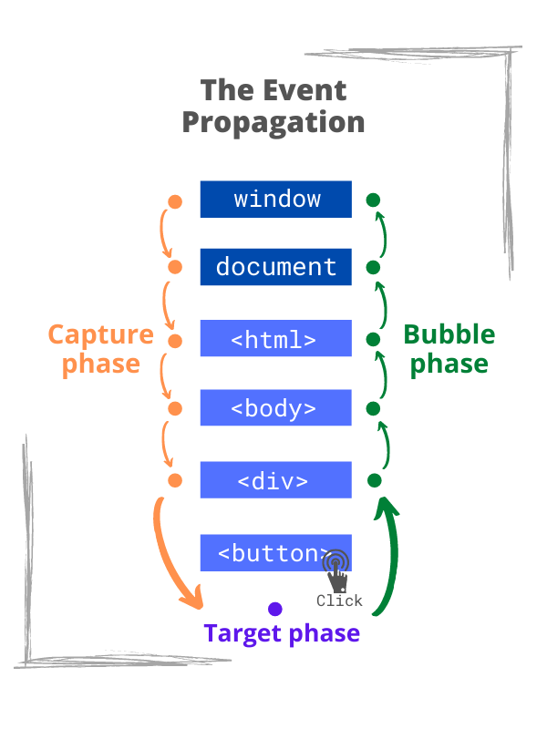
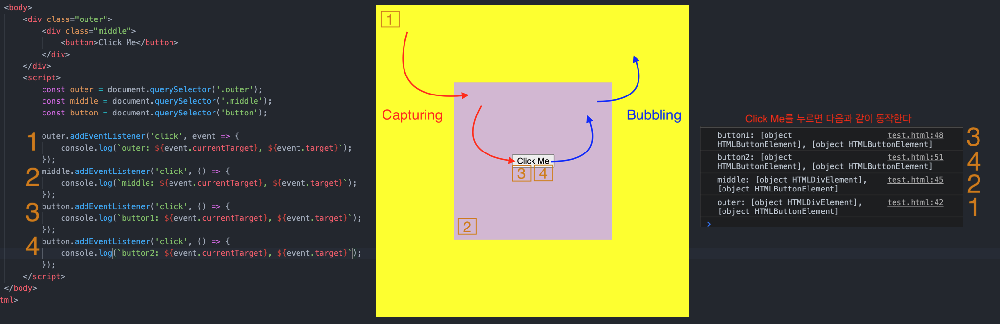

# Event

<br>

- [Event](#event)
  - [Event를 알아야 하는 이유](#event를-알아야-하는-이유)
  - [이벤트란](#이벤트란)
  - [이벤트의 종류](#이벤트의-종류)
    - [사용자 인터페이스 이벤트](#사용자-인터페이스-이벤트)
    - [키보드 이벤트](#키보드-이벤트)
    - [마우스 이벤트](#마우스-이벤트)
    - [focus와 blur 이벤트](#focus와-blur-이벤트)
  - [이벤트 핸들러](#이벤트-핸들러)
    - [이벤트 리스너](#이벤트-리스너)
  - [이벤트의 흐름과 제어](#이벤트의-흐름과-제어)
    - [이벤트 흐름](#이벤트-흐름)
    - [버블링](#버블링)
    - [캡처링](#캡처링)
    - [Event 객체](#event-객체)
    - [예시](#예시)
  - [이벤트 위임](#이벤트-위임)
    - [이벤트 위임이란](#이벤트-위임이란)
    - [이벤트 위임의 장단점](#이벤트-위임의-장단점)
    - [예시](#예시-1)
- [참고](#참고)

<br>

## Event를 알아야 하는 이유
* input창에 값을 입력하고, 엔터를 쳤을 때 지하철역을 리스트에 추가하고 싶다면?
* 삭제 버튼을 눌렀을 때 지하철 역을 삭제하고 싶다면
* 인터렉티브한 사용자 경험을 만들고 싶다면?

위와 같은 이벤트를 유연하게 처리하기 위해서 반드시 이벤트를 알아야 한다.

동적인 웹은 사용자와 상호작용이 잘 되야 한다. 그리고 그 상호작용은 어떤 이벤트에 의해 발생한다.

<br>

## 이벤트란

* 이벤트란?
  * 이벤트는 어떤 사건을 의미한다.
  * 사용자가 클릭 했을 '때', 스크롤을 했을 '때', 텍스트를 입력했을 '때'

<br>

## 이벤트의 종류
> 더 많은 이벤트는 [여기](https://developer.mozilla.org/ko/docs/Web/Events)에서 확인가능하다.
사용자의 이벤트를 다루기 위해서는 먼저, 이벤트의 종류에 대해 알아야한다.

<br>

### 사용자 인터페이스 이벤트
* 사용자 인터페이스(UI)이벤트
  * 브라우저가 로드한 HTML페이지가 아닌 브라우저 창을 사용할 때 발생하는 이벤트.

|이벤트|설명|
|------|---|
|load|웹 페이지의 로드가 완료되었을 때|
|unload|웹 페이지가 unload 될 때 (새로운 페이지를 요청한 경우)|
|error|브라우저가 JS 오류를 만났거나 요청한 자원이 존재하지 않는 경우|
|resize|브라우저 창의 크기를 조정했을 때|
|scroll|사용자가 페이지를 위아래로 스크롤 할 때|

<br>

### 키보드 이벤트
* 키보드 이벤트
  * 사용자가 키보드를 이용할 때 발생하는 이벤트

|이벤트|설명|
|---|---|
|keydown|사용자가 키를 처음 눌렀을 때 (키가 눌린 동안은 계속해서 발생)|
|keyup|사용자가 키를 뗄 때|
|keypress|사용자가 키를 눌렀다가 떼어서 문자가 화면에 나타나게 되면 발생한다. <br> 화살표 키를 누를 때 keydown 이벤트는 발생하지만 이 이벤트는 발생하지 않는다. <br> 사용자가 키를 계속 누르고 있으면 이벤트가 반복적으로 발생한다.|

> `keydown`이나 `keypress`이벤트에 대한 event객체는 어떤 키가 눌렀는지를 알려주는 속성을 가지고 있다.

<br>

### 마우스 이벤트
* 마우스 이벤트
  * 마우스를 움직이거나 버튼을 클릭했을 때 발생한다.

|이벤트|설명|
|---|---|
|click|마우스를 클릭했을 때|
|dblclick|마우스를 더블 클릭했을 때|
|mousedown|마우스를 누르고 있을 때|
|mouseup|요소 위에서 누르고 있던 마우스를 뗄 때|
|mousemove|마우스를 움직일 때 |
|mouseover|요소 위로 마우스를 움직였을 때 (터치스크린에서는 동작하지 않는다)|
|mouseout|요소 바깥으로 마우스를 움직였을 때 (터치스크린에서는 동작하지 않는다)|

<br>

### focus와 blur 이벤트
* focus, blur 이벤트란?
  * 사용자가 상호작용을 할 수 있는 **링크나 폼 요소 같은 HTML 요소는 포커스를 받을 수 있다**.
  * **이런 요소들은 자신이 포커스를 갖거나 잃을 때 이벤트를 발생시킨다.**
* 이 이벤트를 활용하는 경우
  * 사용자가 폼의 요소들과 상호직용을 할 때 도움말이나 피드백을 제공하고자 하는 경우(대부분 도움말은 실제사용자가 상호직용을 하는 요소가 아닌 다른 요소를 통해 보여준다.)
  * 사용자가 (폼을 제출할 때까지 기다리는 대신) 어느 한 요소에서 다른 요소로 이동했을 때 유효성검사를 수행할
필요가 있는 경우

|이벤트|설명|
|---|---|
|focus|마우스를 클릭했을 때|
|blur|마우스를 더블 클릭했을 때|
|focusin|마우스를 누르고 있을 때|
|focusout|요소 위에서 누르고 있던 마우스를 뗄 때|

<br>

## 이벤트 핸들러
이벤트 핸들링 하는 방법은 크게 3가지 있다.
1. HTML 이벤트 핸들러
2. 전통적인 DOM 이벤트 핸들러
3. 이벤트 리스너 (Event Listener)

**현재 가장 많이 사용되는 방법은 이벤트 리스너다.**

<br>

### 이벤트 리스너
```js
element.addEventListener('event', listener[, options]);
```
* element: 대상 DOM 요소
* event: 노드에 바인딩될 이벤트
* listener: 코드. 호출할 함수와 옵션

<br>

## 이벤트의 흐름과 제어
이벤트가 발생하는 순서를 이벤트 흐름(event flow)라고 한다.

<br>

### 이벤트 흐름
<p align="center"><br>출처 : https://dmitripavlutin.com/javascript-event-delegation/</p>

1. 캡처링 단계 - 이벤트가 하위 요소로 전파되는 단계
2. 타깃 단계 - 이벤트가 실제 타깃 요소로 전달되는 단계
3. 버블링 단계 - 이벤트가 상위 요소로 전파되는 단계

<br>

### 버블링
* 이벤트 버블링: 이벤트가 사용자의 동작에 직접적으로 영향을 받아 노드로부터 바깥쪽으로 전파되어 나가는 방식.
  * 한 요소에 이벤트가 발생하면, **이 요소에 할당된 핸들러가 동작하고, 이어서 부모 요소의 핸들러가 동작한다**. 가장 최상단의 조상 요소를 만날 때까지 이 과정이 반복되면서 요소 각각에 할당된 핸들러가 동작한다.

<br>

**event.target**
* `event.target`: 이벤트가 발생한 가장 안쪽의 요소를 참조하고 있다.
* 부모 요소의 핸들러는 이벤트가 정확히 어디서 발생했는지 등에 대한 자세한 정보를 `event.target`으로 얻을 수 있다.

<br>

**버블링 중단하기**

이벤트 버블링은 최상단까지 각 노드에서 모두 발생하게 된다. 이때 모든 핸들러가 호출되게 된다.

이때 만약 버블링을 중단하고 싶은 경우 두 가지 방법이 있다.

1. `event.stopPropagation()` 혹은 `event.stopImmediatePropagation()`
2. 각 핸들러에 `event.target`과 `event.currentTarget`을 비교하여 중단하는 방법
   * `if (event.target !== event.currentTarget) {return;}`

> 버블링은 유용하다고 한다. 꼭 멈춰야 하는 명백한 상황이 아니라면 버블링을 막지 말자! 안그러면 추후에 발생할 문제가 많다고 한다.

<br>

### 캡처링
* 이벤트 캡쳐링: 이벤트가 가장 바깥쪽의 노드로부터 시작해서 안쪽으로 전파되어 들어오는 방식
  * 거의 사용되진 않는다고 한다.
  * **`addEventListener`를 이용해 할당된 핸들러는 캡처링에 대해 전혀 알 수 없다.**
    * **이 핸들러들은 타깃 단계와 버블링 단계에서만 동작한다.**
  * 만약 캡처링 단계에서 이벤트를 잡아내려면 `addEventListener`의 `capture` 옵션을 `true`로 설정해야 한다.

<br>

### Event 객체
`Event`객체는 이벤트가 발생했을 때 **이벤트를 발생시킨 요소**와 **발생한 이벤트에 대한 정보**를 제공한다.
* 이벤트를 발생시킨 요소
* keypress 이벤트가 어떤 키에 의해 발생했는지에 대한 정보
* 사용자가 어떤 요소를 클릭해서 click 이벤트가 발생했는지에 대한 정보

<br>

**이벤트 객체는 이벤트 리스너로 지정된 함수에 자동으로 전달된다.**
* `event.target`: 이벤트가 발생한 가장 안쪽의 요소
* `event.currentTarget` (=`this`): 이벤트를 핸들링 하는 현재 요소 (핸들러가 실제 할당된 요소)
* `event.eventPhase`: 현재 이벤트 흐름 단계 (캡처링 = 1, 타깃 = 2, 버블링 = 3)
* `event.type`: 발생한 이벤트의 종류

<br>

### 예시
<p align="center"></p>

* 이벤트가 등록되는 순서에 따라서 이벤트 흐름이 실행된다.

<br>

## 이벤트 위임

<br>

### 이벤트 위임이란
**이벤트의 흐름을 이용하면 더 효율적으로 이벤트를 관리할 수 있다.**

이벤트는 이벤트가 발생한 엘리먼트를 포함하고 있는 부모 요소에도 영향을 미치기 때문에 자식 요소를 포함할 수 있는 요소에 이벤트 핸들러를 지정하고 이벤트의 흐름을 이용해 다룰 수 있다.

**즉, 이벤트 리스너가 실행할 작업을 요소의 부모 요소에게 위임할 수 있다**

이벤트 위임은 다음과 같이 동작한다.
1. 컨테이너에 하나의 핸들러를 할당한다 (부모에)
2. 핸들러의 `event.target`을 사용해 이벤트가 발생한 요소가 어디인지 알아낸다.
3. 원하는 요소에서 이벤트가 발생했다고 확인되면 이벤트를 핸들링한다.

<br>

### 이벤트 위임의 장단점
**장점**
* 동적으로 추가되는 요소들에도 동작한다.
  * DOM트리에 새로운 요소를 추가하더라도 이벤트에 대한 처리는 부모 요소에서 위임되었기 때문에 새로운 요소에 이벤트 핸들러를 다시 지정할 필요가 없다.
* 코드의 간결
  * 이 기법을 활용하면 함수를 많이 작성할 필요가 없으며 DOM과 코드간의 연결이 간소해져 결과적으로 유지보수에 도움이 된다.
```html
<ul id="parent-list">
    <li id="item1">Item 1</li>
    <li id="item2">Item 2</li>
    <li id="item3">Item 3</li>
</ul>
```
```js
//상위 노드에 이벤트 설정
document.getElementById("parent-list").addEventListener("click", function (e) {            
   if (e.target && e.target.nodeName == "LI") {                
      console.log(`List item  ${e.target.id} was clicked!`);
    }
 });
```

<br>

**단점**
* 이벤트 위임을 사용하려면 이벤트가 반드시 버블링 되어야 한다.
  * 하지만 몇몇 이벤트는 버블링 되지 않는다.
  * 그리고 낮은 레벨에 할당된 핸들러엔 `event.stopPropagation()`를 쓸 수 없다.
* 컨테이너 수준에 할당된 핸들러가 응답할 필요가 있는 이벤트이든 아니든 상관없이 모든 하위 컨테이너에서 발생하는 이벤트에 응답해야 하므로 CPU 작업 부하가 늘어날 수 있다.

<br>

### 예시
**`li`를 클릭하면 해딩 `li`에 `selected` 클래스 속성을 추가하는 예시.**

```html
<ul>
    <li>1</li>
    <li>2</li>
    <li>3</li>
    <li>4</li>
    <li>5</li>
    <li>6</li>
    <li>7</li>
    <li>8</li>
    <li>9</li>
    <li>10</li>
</ul>
```

```js
// BAD (위임을 사용하지 않은 코드)
const lis = document.querySelectorAll('li');
lis.forEach(li => {
    li.addEventListener('click', () => {
        li.classList.add('selected');
    });
});

// Good (위임을 사용한 코드)
const ul = document.querySelector('ul');
ul.addEventListener('click', event => {
    if (event.target.tagName == 'LI') { // 이벤트 발생한 노드가 li라면
    event.target.classList.add('selected');
    }
});
```
* BAD 케이스는 모든 `li` 노드를 가져와서 for문을 돌면서 리스너를 등록했다.
* **GOOD 케이스는 모든 `li` 노드의 상위 노드인 `ul`에만 리스너를 등록했다.**
  * **이와 같이, 모든 자식이 공통적으로 무언가 처리를 해야 될 때 일일이 이벤트 리스너를 자식 노드에 추가 하는 것보다 부모에 등록하는 것이 좋다.**

<br>

# 참고
* 우테코 이벤트 강의
* [드림 코딩 강의]()
* https://ko.javascript.info/bubbling-and-capturing
* https://ko.javascript.info/event-delegation

