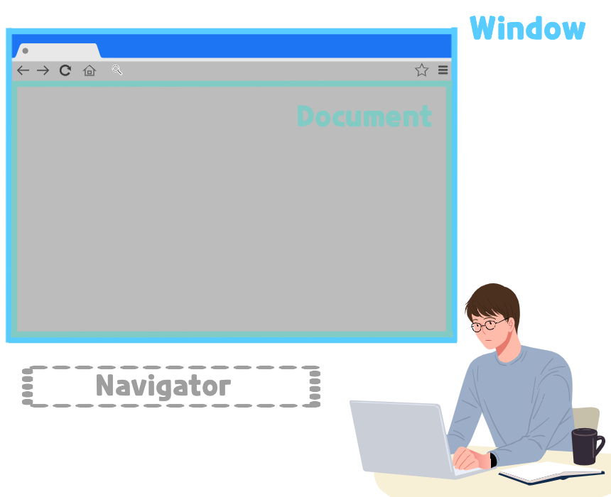
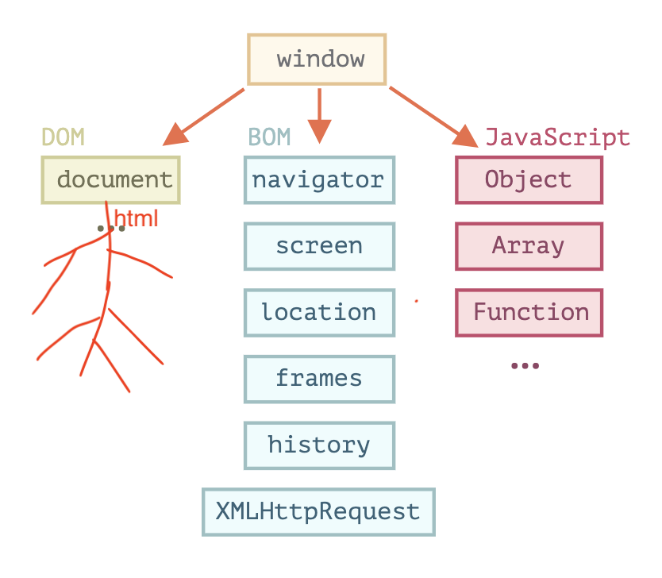
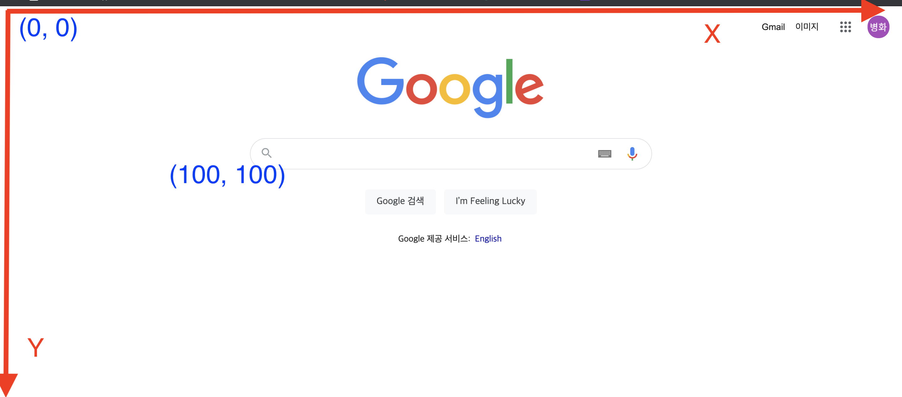

# WEB APIs

<br>

<br>

## WEB API란
> 더 자세한 내용은 [여기](https://developer.mozilla.org/en-US/docs/Learn/JavaScript/Client-side_web_APIs/Introduction)에서 확인할 수 있다.
* **브라우저마다 공통적으로 약속한 규약 (API)**
* 예시
  * DOM APIs
  * Network APIs
  * Graphics APIs
  * Audio/Video APIs
  * Device APIs
  * File APIs
  * Storage APIs
  * ...

> 전체 API 명세는 [여기](https://developer.mozilla.org/ko/docs/Web/API)에서 쉽게 확인할 수 있다.

<br>

## Browser 구조 분석

### window, document, navigator
<p align="center"><br>출처 : https://onlydev.tistory.com/6 </p>

* Window - 현재 열려있는 전체적인 창을 의미한다.
* Document - 웹 브라우저가 웹 문서를 읽고 페이지가 렌더링 되는 부분을 의미한다.
* Navigator - 사용자 눈에는 보이지 않지만 브라우저와 관련된 정보를 가져온다.
  *  브라우저에 대한 버전, 정보, 종류 등을 제공한다.
  *  컴퓨터에 대한 정보도 제공한다.


<br>

### DOM, BOM, JS
<p align="center"><br>출처 : https://ko.javascript.info/browser-environment </p>

* WINDOW: 브라우저 WINDOW를 조작하기 위한 API의 객체들을 가지고 있다.
  * ex. `console.log(window.innerWidth)` -> 창의 크기를 출력
    * `window`는 글로벌 객체이므로 빼줘도 된다.
* DOM(Document Object Model): 새로운 요소를 추가, 삭제, 이동 등등 (HTML 요소)
* BOM(Browser Object Model): 브라우저와 관련된 객체들
* JS: **JS가 웹의 내용을 바꿀 수 있는 것이 아니라, JS가 DOM, BOM을 이용해서 웹 페이지를 조작하는 것!!**

<br>

> `console.log(window)`를 하면 `window`객체 안에 DOM, BOM, 기타 다른 객체들이 있는 것을 볼 수 있다.

<br>

## 브라우저 좌표
<p align="center"></p>

* 중요한 점은 좌측 상단이 `(0, 0)`라는 것!!

> 더 자세한 내용은 [여기](https://ko.javascript.info/coordinates)를 참고하면 된다.

<br>

## 예시

<br>

### window size
* 윈도우의 사이즈를 변경하면 크기를 출력하는 예시
```html
<!DOCTYPE html>
<html lang="en">
    <head>
        <meta charset="UTF-8">
        <title>window size</title>
        <style>
            .tag {
                display: inline-block;
                background-color: thistle;
                padding: 16px;
                margin-top: 16px;
                font-size: 48px;
            }
        </style>
    </head>
    <body>
        <div class="tag">Window Size</div>
        <script>
            const tag = document.querySelector('.tag');
            window.addEventListener('resize', () => {
                tag.innerHTML = `
                window.screen: ${window.screen.width}, ${window.screen.height} <br>
                window.outer: ${window.outerWidth}, ${window.outerHeight} <br>
                window.innter: ${window.innerWidth}, ${window.innerHeight} <br>
                documentElement.clientWidth: ${document.documentElement.clientWidth}, ${document.documentElement.clientHeight}
                `;
            });
        </script>
    </body>
</html>
```

<br>


