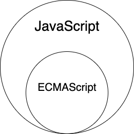
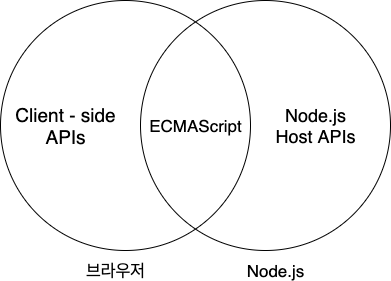

> 본 글은 다음 세 권의 책을 바탕으로 작성되었습니다.
>
> * [모던 자바스크립트 Deep Dive](http://www.yes24.com/Cooperate/Naver/welcomeNaver.aspx?pageNo=1&goodsNo=11781589)
> * [코어 자바스크립트](http://www.yes24.com/Cooperate/Naver/welcomeNaver.aspx?pageNo=1&goodsNo=11781589)
> * [인사이드 자바스크립트](http://www.yes24.com/Cooperate/Naver/welcomeNaver.aspx?pageNo=1&goodsNo=11781589)

# 목차

- [01 자바스크립트 개요](#01-자바스크립트-개요)
  * [1 자바스크립트란?](#1-자바스크립트란)
    + [1-1 자바스크립트와 ECMAScript](#1-1-자바스크립트와-ecmascript)
    + [1-2 자바스크립트 특징](#1-2-자바스크립트-특징)
    + [1-3 브라우저 vs Node.js](#1-3-브라우저-vs-nodejs)
  * [2 모듈과 NPM](#2-모듈과-npm)
- [참고](#참고)

# 챕터 01 자바스크립트 개요

## 1 자바스크립트란?

자바스크립트에 대한 기본적 정의는 [위키백과](https://ko.wikipedia.org/wiki/%EC%9E%90%EB%B0%94%EC%8A%A4%ED%81%AC%EB%A6%BD%ED%8A%B8)에 잘 정리되어 있다.

### 1-1 자바스크립트와 ECMAScript

  
  자바스크립트는 일반적으로 ECMAScript를 아우르는 개념이다.

* ECMAScript
  * 자바스크립트의 표준 사양인 ECMA-262를 말하며, 자바스크립트의 기본적인 핵심 문법을 규정한다.
    * 기본 뼈대라고 생각하면 된다.
  * 값, 타입, 객체, 프로퍼티, 함수, 객체 등등 많은 것을 규정한다.
* 자바스크립트
  * ECMAScript + API
    * 자바스크립트는 기본 뼈대인 ECMAScript와 브라우저나 여러 API등을 아우르는 개념이다.
  * [Web API](https://developer.mozilla.org/ko/docs/Web/API)
    * DOM, BOM, fetch ...등등

### 1-2 자바스크립트 특징

* 웹 브라우저에서 동작하는 유일한 프로그래밍 언어
  * **인터프리터 언어 (+약간의 컴파일 -> 호이스팅)**
* 멀티 패러다임 프로그래밍 언어
  * 명령형, 함수형, 프로토타입 기반 객체지향 프로그래밍

### 1-3 브라우저 vs Node.js

	

* 브라우저
  * 클라이언트 사이드 Web API 지원
    * DOM API를 기본적으로 제공
    * 파일 시스템을 기본적으로 지원하지 않는다. (물론 방법은 있다)
* Node.js
  * 파일 시스템, HTTP...등 API 지원
    * DOM API같은 브라우저에서 사용하는 API를 제공하지 않는다.
    * 파일 시스템을 기본적으로 지원

## 2 모듈과 NPM

https://poiemaweb.com/nodejs-npm

# 참고

* https://poiemaweb.com/nodejs-npm