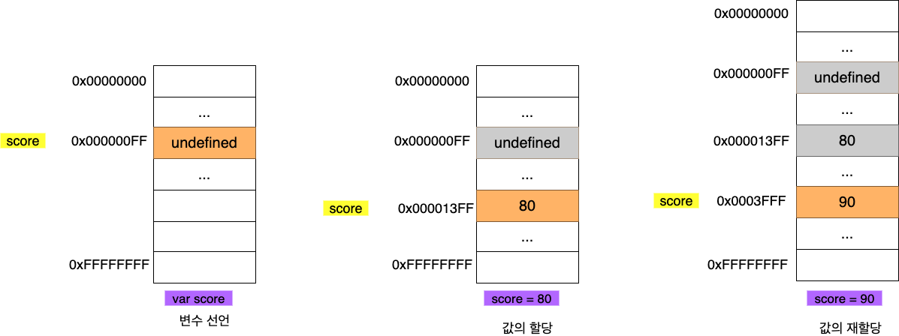
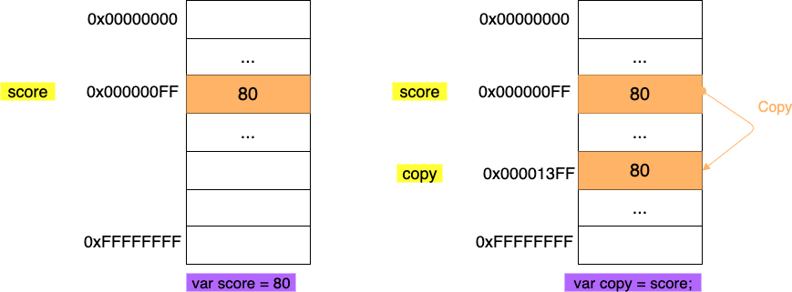
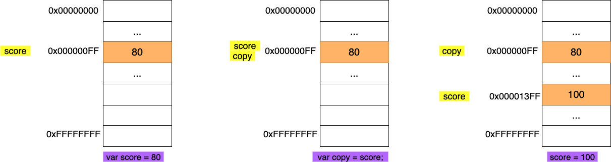
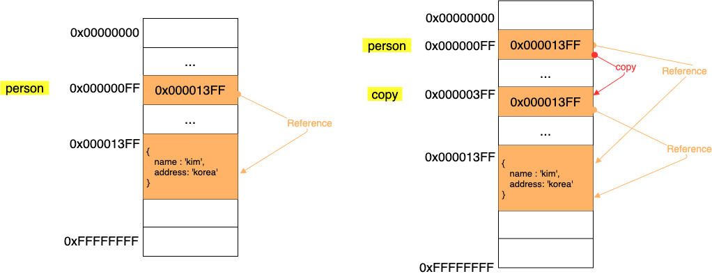

> 본 글은 다음 세 권의 책을 바탕으로 작성되었습니다.
>
> * [모던 자바스크립트 Deep Dive](http://www.yes24.com/Cooperate/Naver/welcomeNaver.aspx?pageNo=1&goodsNo=11781589)
> * [코어 자바스크립트](http://www.yes24.com/Cooperate/Naver/welcomeNaver.aspx?pageNo=1&goodsNo=11781589)
> * [인사이드 자바스크립트](http://www.yes24.com/Cooperate/Naver/welcomeNaver.aspx?pageNo=1&goodsNo=11781589)


# 목차


# 챕터 03 객체


## 1 객체 리터럴

자바스크립트는 객체기반의 프로그래밍 언어이며, **원시 값을 제외한 "모든 것" (함수, 배열, 정규 표현식 등등) 이 모두 객체다.**

객체 리터럴이란 객체를 생성하기 위한 표기법이다.


### 1-1 객체란?

<p align="center">

객체 리터럴을 통한 객체 생성
</p>

* 원시 타입
  * 단 하나의 값만 나타낸다.
* 객체 타입
  * 다양한 타입의 값 (원시 또는 다른 객체)을 **하나의 단위로 구성한 복합적인 자료구조.**
* 차이
  * **원시 타입은 변경 불가능 (불변)한 값**
  * **객체 타입의 값은 변경 가능한 값이다.**


### 1-2 프로퍼티

#### 프로퍼티

* 프로퍼티
  * **객체의 상태를 나타내는 값**
* 키와 값
  * 키 - 빈 문자열을 포함하는 모든 문자열 또는 심벌 값
  * 값 - 자바스크립트에서 사용할 수 있는 모든 값 (참조값을 통해 저장하기 때문)

> **자바에서 Map과 유사하다고 생각하면 될 듯하다.**


#### 프로퍼티 접근

```js
// 동적 생성
var obj = {};
var key = 'hello';

// ES5: 프로퍼티 키 동적 생성
obj[key] = 'world';
// ES6: 계산된 프로퍼티 이름
// var obj = {[key]: 'world'};

console.log(obj); // {hello: "world"}
console.log(obj[key]); // world
console.log(obj['hello']); // world
```

* 프로퍼티 접근
  * 마침표 표기법 - `obj.hello`
  * 대괄호 표기법 - `obj['hello']`
    * 키는 반드시 따옴표를 감싼 문자열이여야 한다.

* **객체에 존재하지 않는 프로퍼티에 접근하면 `undefined`를 반환한다.**


#### 프로퍼티 삭제

```js
var person = {
  name: 'Lee'
};

// 프로퍼티 동적 생성
person.age = 20;

// 프로퍼티 삭제
delete person.age;

// 존재하지 않은 프로퍼티 삭제시 에러가 발생하지 않는다.
delete person.address;

console.log(person); //{name : "Lee"}
```


#### 프로퍼티 관리 방식

<p align="center">
  
출처 : https://ko.wikipedia.org/wiki/해시_테이블</p>

* 프로퍼티 관리 방식
  * **프로퍼티 키를 인덱스로 사용하는 해시테이블와 같다고 생각할 수 있다.**
* 특징
  * 자바스크립트는 **클래스 없이 객체를 생성할 수 있으며 객체가 생성된 이후라도 동적으로 프로퍼티와 메서드를 추가할 수 있다.**
  * 이는 사용하기 매우 편리하지만 비용이 많이 든다. **V8에서는 프로퍼티에 접근하기 위해 동적 탐색 대신 히든 클래스라는 방식을 사용해 프로퍼티 접근 성능을 보장한다.**


### 1-3 메서드

```js
var circle = {
  radius: 5, // 프로퍼티
  
  // 원의 지름
  getDiameter: function() {
    return 2 * this.radius;
  }
};

console.log(circle.getDiameter()); // 10
```

* 자바스크립트의 함수는 **일급 객체이므로 함수도 값으로 취급할 수 있다.**
  * **함수도 프로퍼티 값으로 사용가능하는 의미.**
* 메서드
  * **프로퍼티 값이 함수일 경우, 일반 함수와 구분하기 위해 메서드라 부른다.**
  * **프로퍼티(상태)를 참조하고 조작할 수 있는 동작**
* **함수 vs 메서드**
  * 함수 - 독립적으로 존재
  * 메서드 - 클래스에 종속되어 존재


> 자바스크립트에서 함수와 객체는 분리해서 생각할 수 없는 개념이다. 두 개를 같이 이해해야 한다.


### 1-4 객체 생성


#### 클래스 기반

* 클래스 기반의 객체지향 언어는 클래스를 사전에 정의하고 필요한 시점에 new 연산자와 함께 생성자를 호출하여 인스턴스를 생성하는 방식으로 객체를 생성한다.


#### 프로토타입 기반

자바스크립트는 프로토타입 기반의 객체지향이므로 다양한 객체 생성 방법을 지원한다.

* 객체 리터럴
* Object 생성자 함수
* 생성자 함수
* Object.create메서드
* 클래스(ES6)

이중에서 **가장 일반적이고 간단한 방법은 객체 리터럴을 사용하는 방법이다.**

```js
// 객체 리터럴
var person = {
  name: 'binghe',
  sayHello: function() {
    console.log(`Hello! My name is ${this.name}`);
  }
};
```

* 객체 리터럴은 값으로 평가되는 표현식이다.
  * 따라서 객체 리터럴의 닫는 중괄호 뒤에는 세미콜론을 붙인다.
* 객체 리터럴의 장점
  * **객체를 생성하기 위해 클래스를 먼저 정의하고 new 연산자와 함께 생성자를 호출할 필요가 없다.**
    * **즉, 객체를 생성하고 사용하는 것조차 동적이다.**


## 2 원시 값과 객체의 비교

자바스크립트의 데이터 타입은 크게 두가지로 나눌 수 있다.

* 원시 타입
  * 변경 불가능한 값 **(불변성)**
  * 값을 변수에 할당하면 변수(확보된 메모리 공간)에는 실제 값이 저장된다. **(식별자에는 변수가 저장된 메모리 주소가 저장된다.)**
  * 값에 의한 전달
* 객체 타입
  * 변경 가능한 값 (참조 값)
  * 객체를 변수에 할당하면 변수(확보된 메모리 공간)에는 참조 값이 저장된다. (객체의 주소값이 저장)
  * 참조에 의한 전달


### 2-1 원시 값


#### 불변성



* 원시값은 기본적으로 불변 값이다.
  * 변수 값을 변경하기 위해 원시 값을 재할당하면 새로운 메모리 공간을 확보하고 재할당한 값을 저장한 후, 변수가  참조하던 메모리 공간의 주소를 변경한다.
* **불변성을 갖는 원시 값을 할당한 변수는 재할당 이외에 변수 값을 변경할 수 있는 방법이 없다.**

> 자바스크립트는 문자열도 원시값으로 다루기 때문에 한번 선언된 문자열을 일부 문자만을 변경해도 반영되지 않는다.
>
> ```js
> var str = 'string';
> 
> str[0] = 'S';
> console.log(str); //  string (일부 문자만 변경하면 반영되지 않는다.)
> ```


#### 값에 의한 전달

```js
var score = 80;

var copy = score;

console.log(score, copy); // 80 80
console.log(score === copy); // true
```

* 값에 의한 전달도 면밀히 말하면 메모리 주소를 전달한다.
* 하지만, 두가지의 방법으로 값을 전달 할 수 있다.
  1. 새로운 값을 생성해서 메모리 주소를 전달하는 방식
  2. 기존 값의 메모리 주소를 그대로 전달하는 방식


##### 새로운 값을 생성해서 전달하는 방식



* 새로운 값을 생성해서 전달하는 방식
  * **변수에 원시 값을 갖는 변수를 할당하면 할당되는 함수(score)의 원시 값이 복사되어 전달된다.**
  * 할당 시점에 두 변수가 기억하는 메모리 주소가 다르다.


##### 기존 값의 메모리 주소를 그대로 전달하는 방식



* 기존 값의 메모리 주소를 그대로 전달하는 방식
  * score의 변수값 80의 메모리 주소를 그대로 전달한다.
  * 할당 시점에 두 변수가 기억하는 메모리 주소가 같다.


> 식별자도 메모리 주소에 붙인 이름이라고 할 수 있다.
>
> **중요한 점은 어떠한 방식이든 원시 값은 서로 다른 메모리 공간에 저장된 별개의 값이 되어 서로 간섭할 수 없다는 것이다.**


### 2-2 객체


#### 변경 가능한 값

```js
var person = {
  name: 'kim',
  address: 'korea'
};

var copy = person;
```

<p align="center">

참조에 의한 전달</p>

* 객체를 할당한 변수가 기억하는 메모리 주소를 통해 메모리 공간에 접근하면 **참조 값에 접근할 수 있다.** (포인터)
* 변경 가능한 값
  * 원시 값은 불변이므로 재할당 외에는 값을 변경할 수 없었다.
  * **객체는 주소를 가지고 있으므로 재할당 없이 직접 변경할 수 있다.**
* **같은 주소를 가리키는 식별자는 하나의 객체를 공유하는 것.**
  * person이 변경되면 copy가 가리키는 객체도 같이 변경된다.


> **식별자가 기억하는 메모리 공간, 즉, 변수에 저장되어 있는 값이 원시 값이나 참조 값이나 차이만 있을 뿐, 식별자가 기억하고 있는 메모리 공간을 복사하는 것은 동일하다.**
>
> 즉, **모두 값에 의한 전달이라고 말할 수 있다.**


# 참고

