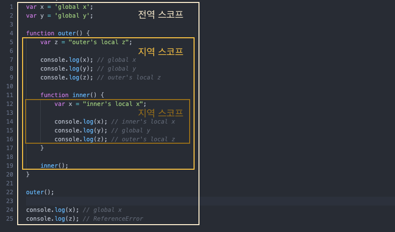
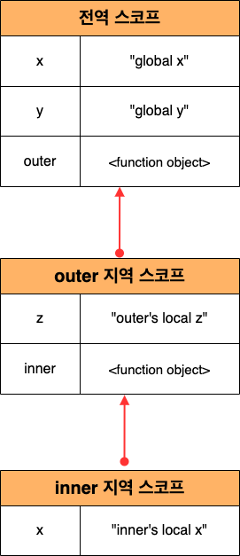
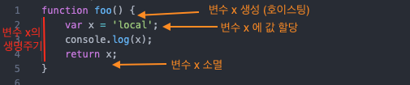

> 본 글은 다음 세 권의 책을 바탕으로 작성되었습니다.
>
> * [모던 자바스크립트 Deep Dive](http://www.yes24.com/Cooperate/Naver/welcomeNaver.aspx?pageNo=1&goodsNo=11781589)
> * [코어 자바스크립트](http://www.yes24.com/Cooperate/Naver/welcomeNaver.aspx?pageNo=1&goodsNo=11781589)
> * [인사이드 자바스크립트](http://www.yes24.com/Cooperate/Naver/welcomeNaver.aspx?pageNo=1&goodsNo=11781589)


# 목차


# 챕터 05 스코프


## 1 스코프란


### 1-1 스코프란


#### 스코프

* 변수의 스코프
  * **변수는 자신이 선언된 위치에 의해 자신이 유효한 범위가 정해진다.**
* 스코프란
  * 모든 식별자 (변수 이름, 함수 이름, 클래스 이름 등)는 **자신이 선언된 위치에 의해** 다른 코드가 식별자 자신을 참조할 수 있는 **유효 범위**가 결정된다.
  * 이를 스코프라 한다.
* 스코프의 예시
  * **파일 시스템**
    * 파일 시스템에서 파일 이름을 중복해서 사용할 수 있는 이유는 폴더라는 개념 때문이다.
  * 네임스페이스


#### 식별자 결정

```js
var var1 = 1;

if(true) {
  var var2 = 2;
  if(true) {
    var var3 = 3;
  }
}

function foo() {
  var var4 = 4;
  
  function bar() {
    var var5 = 5;
  }
}

console.log(var1); // 1
console.log(var2); // 2
console.log(var3); // 3
console.log(var4); // ReferenceErrorㄷ
console.log(var5); // ReferenceError
```

* 식별자 결정
  * JS는 스코프를 이용해 어떤 변수를 참조해야 할 것인지 결정한다.
  * 스코프란 식별자를 검색할 때 사용하는 규칙이다.
    * 검색할 때, JS 엔진은 코드의 문맥을 고려한다.
* 렉시컬 환경 (Lexical Environment)
  * 코드가 어디서 실행되되며 주변에 어떤 코드가 있는지를 저장한다.
  * 즉, **코드의 문맥은 렉시컬 환경으로 이뤄진다.**


### 1-2 스코프의 종류

JS에서 스코프는 크게 두가지로 나눌 수 있다.

* 전역 스코프 - 전역 변수
  * 전역 변수는 어디서든지 참조할 수 있다.
* 지역 스코프 - 지역변수
  * 지역변수는 자신의 지역 스코프와 하위 지역 스코프에서 유효하다.




## 2 스코프 체인


### 2-1 계층적 구조


#### 스코프는 계층적 구조로 되어있다

<p align="center">
</p>

* 스코프 체인이란
  * 스코프는 **함수의 중첩에 의해 계층적 구조**를 갖는다
  * 이렇게 **스코프가 계층적으로 연결된 것을 스코프 체인**이라 한다.


#### 스코프는 단방향으로 검색한다

* **하위 스코프 :arrow_right: 상위 스코프 순으로 검색한다.**
  * 변수를 참조할 때 JS는 스코프 체인을 통해 변수를 참조하는 코드의 스코프에서 시작하여 상위 스코프 방향으로 이동하며 선언된 변수를 검색한다.
* 즉, 다음과 같다.
  * **상위 스코프에서 유효한 변수 -> 하위 스코프에서 자유롭게 참조할 수 있다.**
  * **하위 스코프에서 유효한 변수 -> 상위 스코프에서 참조할 수 없다.**


### 2-2 Lexical Environment

스코프는 계층적구조로 식별자 검색을 한다고 하는데 **어떻게 상위 스코프를 아는가? 바로 렉시컬 환경때문에 가능한 것이다.**


#### 스코프 체인의 자료구조 렉시컬 환경

<p align="center">
실제 렉시컬 환경은 위와 같이 저장된다</p>

* **코드 (전역 코드와 함수 코드)를 실행하기에 앞서 위 그림과 유사한 자료구조인 렉시컬 환경을 실제로 생성한다.**
  * 즉, 스코프 체인은 물리적인 실체로 존재한다.
* **변수 선언이 실행되면 변수 식별자는 이 자료구조(렉시컬 환경)에 키(key)로 등록되고, 변수 할당이 일어나면 이 자료구조의 변수 식별자에 해당하는 값을 변경한다.**
* **변수의 검색도 이 자료구조 상에서 이뤄진다.**


#### 스코프 체인 == 렉시컬 환경을 단방향으로 연결한 것

* 스코프 체인은 실행 컨텍스트의 렉시컬 환경을 단방향으로 연결한 것이다.
* **전역 렉시컬 환경은 코드가 로드되면 곧바로 생성되고 함수의 렉시컬 환경은 함수가 호출되면 곧바로 생성된다.**


> **스코프체인(렉시컬 환경)은 "식별자를 검색하는 규칙"을 수행하기 위해 제공하는 자료구조라 생각하면 된다.**


## 3 함수 레벨 스코프

> 여기서 다루는 스코프 레벨은 `var`이다. 뒤에 언급하는 `let`, `const`는 `var`와 조금 다르다.


### 3-1 함수 레벨 스코프란


#### 블록 레벨 스코프

* 기존의 C나 자바에서는 함수 몸체만이 아니라 모든 코드 블록이 지역 스코프를 만든다.
  * 모든 코드 블록 : `if`, `for`, `while`, `try...catch`, `method`


#### var는 함수 레벨 스코프만 지원한다

```js
var x = 1;

if(true) {
  // var 키워드로 선언된 변수는 함수의 코드 블록만을 지역 스코프로 인정한다.
  // 함수 밖에서 var 키워드로 선언된 변수는 블록 내에서 선언되었다 할지라도 모두 전역 변수다.
  var x = 10;
}

// 원래는 1이 나와야 정상이지만, 10이 나오는 이유는 var가 함수 레벨 스코프만 지원하기 때문이다
console.log(10); // 10
```

* **var** 키워드로 선언한 변수는 **오로지 함수의 코드 블록만을 지역 스코프로 인정한다**
  * 이러한 **특성을 함수 레벨 스코프라 한다.**


### 3-2 상위 스코프를 결정하는 방식

```js
var x = 1;

function foo() {
  var x = 10;
  bar();
}

function bar() {
  console.log(x);
}

// 동적 스코프
foo(); // 10
bar(); // 1

// 렉시컬 스코프
foo(); // 1
bar(); // 1
```

* 상위 스코프가 무엇이냐에 따라 결과가 달리진다. 상위 스코프는 결정하는 방식은 두 가지이다.
  1. 동적 스코프
  2. 정적 스코프 (렉시컬 스코프)


#### 동적 스코프

> 런타임시점

* 함수를 **어디서 호출했는지에 따라 함수의 상위 스코프를 결정한다.**
  * bar 함수의 상위 스코프는 foo함수의 지역 스코프와 전역 스코프.
* 함수를 정의하는 시점에는 함수가 어디서 호출될 지 알 수 없다.
  * 따라서 동적 스코프는 **함수가 호출되는 시점에 동적으로 상위 스코프를 결정한다.**


#### 렉시컬(정적) 스코프

> 컴파일타임시점

* 함수를 **어디서 정의했는지에 따라 함수의 상위 스코프를 결정한다.**
  * bar 함수의 상위 스코프는 전역 스코프.
* 함수 정의가 평가되는 시점에 상위 스코프가 정적으로 결정되기 때문에 정적 스코프라 부른다.


### 3-3 JS는 렉시컬 스코프를 따른다

자바스크립트를 비롯한 대부분의 프로그래밍 언어는 렉시컬 스코프를 따른다.


#### 어디서 호출했는지가 아니라 어디서 정의했는지

* **렉시컬 스코프는 어디서 함수를 어디서 호출했는지가 아니라 함수를 어디서 정의했는지에 따라 상위 스코프를 결정한다.**
  * 함수가 호출된 위치는 상위 스코프 결정에 아무런 영향을 못 준다.


#### 상위 스코프는 함수 정의가 실행될 때 정적으로 결정된다

* 함수의 상위 스코프는 함수 정의가 실행될 때 정적으로 결정된다.
* 함수 정의가 실행되어 생성된 함수 객체는 이렇게 결정된 상위 스코프를 기억한다.
  * 함수가 호출될 때마다 함수의 상위 스코프를 참조할 필요가 있기 때문이다.


## 4 전역 변수의 문제점

전역 변수는 모든 스코프에서 접근할 수 있기 때문에 무분별한 사용은 위험하다.

**자바에서 static을 사용하지 말라는 것과 유사하다.**


### 4-1 변수의 생명주기


#### 모든 변수는 생성되고 소멸되는 생명주기가 있다.

```js
function foo() {
  var x = 'local';
  console.log(x);
  return x;
}

foo();
console.log(x); // ReferenceError
```

* 변수는 선언에 의해 생성되고 할당을 통해 값을 갖는다. 
  * 즉, 모든 변수는 생성되고 소멸되는 생명주기가 있다. (그래야 메모리를 효율적으로 사용할 수 있다.)


#### 호이스팅은 스코프 단위로 동작한다.



* 함수 내부에서 선언한 변수는 함수가 호출된 직후에 함수 내부 코드가 실행되기 이전에 JS 엔진에 의해 먼저 호출된다.
  * 즉, **함수 내부의 지역변수도 함수 내부에서 호이스팅이 발생한다.**

```js
var x = 'global';

function foo() {
    console.log(x); // undefined
    var x = 'local';
}

foo();
console.log(x); // global
```


#### 전역 변수의 생명 주기

전역 객체는 JS 엔진에 의해 어떤 객체보다도 먼저 생성되는 특수한 객체다.

**전역 변수는 전역 객체의 프로퍼티라고도 볼 수 있다.** 

그러므로 전역 변수의 생명주기는 프로그램의 종료까지라고 볼 수 있다.


### 4-2 전역 변수의 문제점

1. 암묵적 결합
   * 코드 어디서든 참조할 수 있기 때문에 어떻게 변경될 지 모른다.
2. 긴 생명 주기
   * 전역 변수는 생명 주기가 길다. 즉, 메모리 시소스를 오랜 기간 소비한다.
3. 스코프 체인 상에서 종점에 존재
   * 전역 변수의 검색 속도가 가장 느리다.
4. 네임스페이스 오염


### 4-3 전역 변수 사용을 하지 않는 방법

> 전역 변수를 반드시 사용해야 할 이유를 찾지 못한다면 지역 변수를 사용해야 한다

1. 즉시 실행 함수
   * 모든 코드를 즉시 실행 함수로 감싸면 모든 변수는 즉시 실행 함수의 지역변수가 된다.
2. 네임스페이스 객체
   * 전역에 네임스페이스 역할을 담당할 객체를 생성하고 전역 변수처럼 사용하고 싶은 변수를 추가하는 방식
   * Enum과 비슷하다.
3. 모듈 패턴
4. ES6 모듈


## 5 let, const


### 5-1 var의 문제점

**var를 사용해야 하지 말아야하는 이유이기도 하다.**

####  중복 선언 허용

```js
var x = 1;
var y = 1;

var x = 100;
var y;

console.log(x); // 100
console.log(y); // 1
```

* var키워드로 선언한 변수는 중복 선언이 가능하다


#### 함수 레벨 스코프

```js
var x = 1;
if(true){
  var x = 10;
}

console.log(x); // 10
```

* var로 선언한 변수는 오로지 함수의 코드 블록만을 지역 스코프로 인정한다.


#### 변수 호이스팅

```js
// 이 시점에서 변수 호이스팅에 의해 이미 foo 변수가 선언되었다.
console.log(foo);// undefined

foo = 123;

console.log(foo); // 123

// 변수 선언은 런타임 이전에 JS 엔진에 의해 암묵적으로 실행된다.
var foo;
```

* var 키워드로 변수를 선언하면 변수 호이스팅에 의해 변수 선언문이 스코프의 선두로 끌어 올려진 것처럼 동작한다.


### 5-2 let

var의 문제점들을 해결하기 위해 ES6부터 let을 도입하였다.


#### 중복 변수 선언 금지

```js
let bar = 123;
// let이나 const는 같은 스코프 내에서 중복 선언을 허용하지 않는다.
let bar = 456; // SyntaxError
```

* let 키워드로 이름이 같은 변수를 중복 선언하면 문법 에러가 발생한다.


#### 블록 레벨 스코프

```js
let foo = 1; // 전역 변수

{
  let foo = 2; // 지역 변수
  let bar = 3; // 지역 변수
}

console.log(foo); // 1
console.log(bar); // ReferenceError
```

* let은 블록 레벨 스코프를 따른다.
  * let은 모든 코드 블록(함수, if문, for문, while문, try/catch문 등)을 지역 스코프로 인정한다.


#### 변수 호이스팅


```js
// 런타임 이전에 선언 단계가 실행된다. (호이스팅) 아직 변수가 초기화되지 않았다.
// 초기화 이전의 일시적 사각지대에서는 변수를 참조할 수 없다.
console.log(foo); // undefined

let foo; // 변수 선언문에서 초기화 단계가 실행된다.
consol.log(foo); // undefined
```


```js
let let1 = 1; // 전역 변수

{
  console.log(let1); // ReferenceError (호이스팅이 일어나지 않았다면 참조 에러가 아닌 1이 나와야한다.)
  let let1 = 2; // 지역변수
}
```

* let은 변수 호이스팅이 일어나지 않는 것처럼 동작한다. 하지만, 실제로는 일어나기는 하지만 초기화 시작지점까지 참조를 할 수 없을 뿐이다.


### 5-3 const


