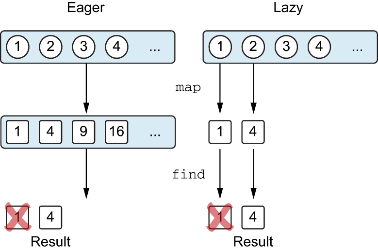

[Kotlin In Action](http://www.yes24.com/Product/Goods/55148593)을 바탕으로 정리한 자료입니다.

<br>

# 목차

<br>

- [목차](#목차)
- [들어가며](#들어가며)
- [1 람다 식과 멤버 참조](#1-람다-식과-멤버-참조)
  - [1-1 람다란 - 코드 블럭을 함수 인자로 넘기기](#1-1-람다란---코드-블럭을-함수-인자로-넘기기)
  - [1-2 람다 식 문법](#1-2-람다-식-문법)
  - [1-3 현재 영역에 있는 변수 접근](#1-3-현재-영역에-있는-변수-접근)
  - [1-4 멤버 참조](#1-4-멤버-참조)
- [2 컬렉션 함수형 API](#2-컬렉션-함수형-api)
  - [2-1 지연 계산](#2-1-지연-계산)
  - [2-2 시퀀스 연산 - 중간 연산과 최종 연산](#2-2-시퀀스-연산---중간-연산과-최종-연산)
- [3 수신 객체 지정 람다 - with와 apply](#3-수신-객체-지정-람다---with와-apply)
  - [3-1 with](#3-1-with)
  - [3-2 apply](#3-2-apply)
  - [3-3 with와 apply와 비슷한 패턴](#3-3-with와-apply와-비슷한-패턴)

<br>

# 들어가며
람다 식 (lambda expression)또는 람다는 다른 함수에 넘길 수 있는 작은 코드 조각을 의미한다.

이번 장에서 다루는 내용은 다음과 같다.
* 람다 식과 멤버 참조
* 시퀀스 (지연 컬렉션 연산)
* 자바 함수형 인터페이스 코틀린에서 사용
* 수신 객체 지정 람다 사용

<br>

# 1 람다 식과 멤버 참조

<br>

## 1-1 람다란 - 코드 블럭을 함수 인자로 넘기기

<br>

💁‍♂️ **람다전 무명 내부 클래스**

이전 자바에선 함수를 변수로 저장하거나 넘길 수 없어 아래와 같이 무명 내부 클래스를 통해 이런 목적을 달성했다.

> java
```java
button.setOnClickListener(new OnClickListener() {
    @Override
    public void onClick(View view) {
        // 클릭시 수행할 동작
    }
})
```

<br>

💁‍♂️ **람다**

이와 달리 JDK 8부터는 추상 메서드를 하나만 가지고 있는 `@FunctionalInterface`로 람다를 제공했으며, 코틀린도 아래와 같이 람다를 제공한다.

```kt
button.setOnClickListener { // 클릭시 수행할 동작. }
```

이는 여러 방면에서 함수형 프로그래밍을 가능하게하며, 특히 컬렉션등과 사용할 때 유용하다.

```kt
val people = listOf(Person("binghe", 30), Person("kim", 31))
println(people.maxBy { it.age })
```

<br>

💁‍♂️ **무명 내부 클래스와 람다의 차이점?**

어떤 로직을 담은 함수를 특정 함수의 매개변수로 넘긴다고 가정해본다.

무명 내부 클래스의 경우 객체를 명시적으로 선언해야하기 때문에, 해당 함수를 호출할 때마다 새로운 객체가 생성된다.

람다는 다르다. 람다내에서 외부 변수를 포획하지 않는 이상 람다에 대응하는 무명 객체를 메서드를 호출할 때마다 재활용한다. 

즉, 매번 인스턴스를 생성하지 않는다.

물론 람다가 주변 영역의 변수를 포획한다면 매 호출하맏 같은 인스턴스를 사용할 수 없어, 동일하게 새로운 인스턴스를 생성한다.

> **정리하면 람다가 변수를 포획하면 무명 클래스 안에 포획한 변수를 저장하는 필드가 생기며, 매 호출마다 그 무명 클래스의 인스턴스를 새로 만든다.**
>
> **하지만 포획하는 변수가 없는 람다에 대해서는 인스턴스가 단 하나만 생긴다.**

<br>

## 1-2 람다 식 문법

<br>

💁‍♂️ **람다 식 문법**

```kt
{ x: Int, y: Int -> x + y }
```
* 람다 식은 항상 중괄호 (`{}`)에 둘러 싸여 있다.
* **자바와 다르게 인자 목록 주변에 괄호가 없으며, 화살표가 인자 목록과 람다 본문을 구분해준다.**

<br>

💁‍♂️ **람다 식은 변수에 저장할 수 있다**

```kt
val sum = { x: Int, y: Int -> x + y }
```

<br>

💁‍♂️ **함수 호출 시 가장 맨 뒤 인자가 람다식이면 람다를 괄호 밖으로 빼낼 수 있으며, 람다가 유일한 인자라면 괄호 없이 사용할 수 있다.**

```kt
// 첫번째 방법
people.maxBy({ p: Person -> p.age })

// 두번째 방법 -> 함수 호출시 가장 맨 뒤 인자가 람다식이면 람다를 괄호 밖으로 빼낼 수 있다.
people.maxBy() { p: Person -> p.age }

// 세번째 방법 -> 함수 호출시 람다가 유일한 인자라면 괄호 없이 사용할 수 있다.
people.maxBy { p: Person -> p.age }
```
* 위 세가지 형태는 모두 같은 뜻이다.

<br>

이전 장에서 간단히 구현했던 `joinToString`을 람다로 리팩토링하면 아래와 같다.

```kt
// AS-IS
val names = people.joinToString(separator = " ", transform = { p: Person -> p.name })

// TO-BE
val names = people.joinToString(" ") { p: Person -> p.name }
```

<br>

💁‍♂️ **타입 추론**

자바와 동일하게 코틀린의 람다고 인자에 대해서 타입 추론을 자동으로 해준다.

```kt
people.maxBy { p: Person -> p.age }
people.maxBy { p -> p.age }
```

만약 인자가 하나라면 아래와 같이 `it`을 바로 사용할 수 있다.

```kt
people.maxBy { it.age }
```

<br>

## 1-3 현재 영역에 있는 변수 접근

<br>

💁‍♂️ **자바 무명 내부 클래스와 람다에서의 변수 접근**

자바 메서드내에서 무명 내부 클래스를 정의할 때 메서드의 로컬 변수를 무명 내부 클래스에서 사용할 수 있다. 

심지어 람다는 함수 안에서 정의하면 함수의 파라미터뿐 아니라 람다 정의의 앞에 선언된 로컬 변수까지 람다에서 모두 접근 가능하다.

단, **이때 변수는 `final`이여야한다. 즉, 람다나 무명 내부 클래스에서 변수를 변경할 순 없다.**

<br>

💁‍♂️ **코틀린에서의 변수 접근**

코틀린에서도 아래와 같이 람다내에서 변수에 접근 가능하다.

```kt
fun main() {
    val errors = listOf("403 Forbidden", "404 Not Found")

    printMessageWithPrefix(errors, "Error: ")
}

fun printMessageWithPrefix(messages: Collection<String>, prefix: String) {
    messages.forEach {
        println("$prefix $it") // 람다 안에서 함수의 "prefix" 파라미터 사용.
    }
}
```

<br>

💁‍♂️ **코틀린에선 람다 안에서 람다 밖 함수에 있는 변수에 접근할 수 있으며, 변경도 가능하다 - 포획 변수**

자바와 다른 점 중 중요한 한 가지는 코틀린 람다 안에서는 `final` 변수가 아닌 변수에 접근할 수 있다는 점이다.

**`final`이 아니라는 것은 람다 안에서 바깥의 변수를 변경할 수 있다는 의미이다.**

```kt
fun main() {
    val errors = listOf("200 OK", "500 Internal Server Error", "404 Not Found")

    printProblemCounts(errors)
}

fun printProblemCounts(responses: Collection<String>) {
    var clientErrors = 0
    var serverErrors = 0

    responses.forEach {
        if (it.startsWith("4")) {
            clientErrors++ // 람다 안에서 람다 밖의 변수를 변경한다.
        }
        if (it.startsWith("5")) {
            serverErrors++ // 람다 안에서 람다 밖의 변수를 변경한다.
        }
    }

    println("$clientErrors client errors, $serverErrors server errors")
}
```

위 예시와 같이 `clientErrors`, `serverErrors`등을 람다 안에서 변경한다.

그리고 **이렇게 람다 안에서 사용하는 외부 변수를 `람다가 포획한 변수`라고 부른다.**

<br>

💁‍♂️ **어떻게 람다 안에서 외부 변수를 포획할 수 있을까?**

코틀린에서 포획한 변수가 있는 람다를 저장해서 함수가 끝난 뒤에 실행해도 람다의 본문 코드는 여전히 포획한 변수를 읽거나 사용할 수 있다.

즉, **실제 변수가 선언된 함수가 종료되었음에도 람다에 포획되었다면 해당 변수는 그대로 람다에서 사용 할 수 있다.** (변수의 생명주기가 변경된 것)

이렇게 동작할 수 있는 이유는 래퍼로 한번 감싸기 때문이다.

* 포획한 외부 변수가 `final`인 경우
  * 람다 코드를 변수 값과 함께 저장한다. 즉, 자바와 마찬가지로 그 변수의 값을 복사한다.
* 포획한 외부 변수가 `final`이 아닌 경우
  * 변수를 특별한 래퍼로 감싸서 나중에 변경하거나 읽을 수 있게 한 다음, 래퍼에 대한 참조를 람다와 함께 저장한다.

예시를 통해 살펴보면 아래와 같다.

```kt
class Ref<T> (var value: T) // 변경 가능한 변수를 포획하는 방법을 보여주는 클래스

fun main() {
    val counter = Ref(0)
    val inc = { counter.value++ } // 공식적으로는 변경 불가능한 변수를 포획했지만, 그 변수가 가리키는 객체의 필드 값을 변경 할 수 있다.
}
```

코틀린에선 물론 위 과정을 자동으로 해주기 때문에 실제 코드에선 위와 같이 안해줘도 된다. 그저 아래와 같이 사용하면 된다.

```kt
var counter = 0
val inc = { counter++ }
```

<br>

💁‍♂️ **한가지 주의할 점은 람다를 이벤트 핸들러나 비동기 코드로 활용할 경우 로컬 변수가 변경될 수도 있다**

```kt
fun tryToCountButtonClicks(button: Button): Int {
    var clicks = 0
    button.onClick { clicks++ }
    return clicks
}
```

위 함수는 항상 0을 반환한다. `onClick` 핸들러는 호출될 때마다 clicks의 값을 증가시키지만 그 값의 변경을 관찰할 수 없다고한다.

이유는 핸들러는 `tryToCountButtonClicks`가 clicks를 반환한 다음에 호출되기 때문이다.

<br>

## 1-4 멤버 참조

자바와 같이 코틀린도 멤버 참조 (`::`)를 제공한다.

```kt
// Person의 age 참조
val getAge = Person::age
```

그리고 이는 아래와 같이 변수에 람다를 참조하여 다양하게 활용할 수 있다.

```kt
data class Person(val name: String, val age: Int)

fun main() {
    val createPerson = ::Person // Person의 인스턴스를 만드는 동작을 값으로 저장.
    
    val p = createPerson("binghe", 30)
    println(p)
}
```

<br>

# 2 컬렉션 함수형 API

코틀린에서도 자바의 `stream`과 같이 컬렉션을 스트림처리하고 쉽게 다룰 수 있도록 많은 API를 제공한다.

API의 종류가 사용법은 [공식 문서](https://kotlinlang.org/api/latest/jvm/stdlib/kotlin.collections/)를 참고하자.

<br>

## 2-1 지연 계산

<br>

💁‍♂️ **코틀린의 컬렉션 함수는 디폴트로 지연 계산되지 않는다**

자바와 다르게 코틀린내 컬렉션 함수는 결과 컬렉션을 즉시 생성한다.

**이는 컬렉션 함수를 연쇄하면 매 단계마다 계산 중간 결과를 새로운 컬렉션에 임시로 담는다는 의미이다.**

```kt
people.map (Person::name).filter { it.startWith("A") }
```

위 예시에서 `filter`와 `map` 모두 리스트를 반환한다. 코드로 살펴보면 아래와 같다.

```kt
fun main() {
    val people = listOf(Person("binghe", 30), Person("Abinghe", 30), Person("mark", 30))

    val map = people.map(Person::name)
    val filter = map.filter { it.startsWith("A") }

    println("type: ${map.javaClass.name}, values: $map")
    println("type: ${filter.javaClass.name}, values: $filter")
}

type: java.util.ArrayList, values: [binghe, Abinghe, mark]
type: java.util.ArrayList, values: [Abinghe]
```

타입을 보면 보다싶이 List인 것을 볼 수 있다.

<br>

💁‍♂️ **지연 계산하고 싶다면 시퀀스를 사용하면 된다.**

위와 같이 즉시 계산이 별로 큰 문제가 없어보이긴하지만, 매 연쇄 호출마다 컬렉션을 만든다는 의미이다.

원소가 별로없다면 큰 문제가 아니지만, 원소가 수백만 개가 되면 효율이 굉장히 떨어진다.

**물론 시퀀스를 사용하면 중간 임시 컬렉션을 사용하지 않고도 컬렉션 연산을 연쇄할 수 있다. 즉, 지연 연산된다.**

```kt
people.asSequence()
        .map(Person::name)
        .filter { it.startsWith("A") }
        .toList() // 결과 시퀀스
```

위 예시를 코드로 자세히 살펴보면 아래와 같다.

```kt
fun main() {
    val people = listOf(Person("binghe", 30), Person("Abinghe", 30), Person("mark", 30))

    val asSequence = people.asSequence()
    val map = asSequence.map(Person::name)
    val filter = map.filter { it.startsWith("A") }
    val toList = filter.toList()

    printTypeAndValue(asSequence)
    printTypeAndValue(map)
    printTypeAndValue(filter)
    printTypeAndValue(toList)
}

fun printTypeAndValue(obj: Any) {
    println("type: ${obj.javaClass.name}, value: $obj")
}

type: kotlin.collections.CollectionsKt...
type: kotlin.sequences.TransformingSequence, value: kotlin.sequences.TransformingSequence@6cc4c815
type: kotlin.sequences.FilteringSequence, value: kotlin.sequences.FilteringSequence@3a82f6ef
type: java.util.Collections$SingletonList, value: [Abinghe]
```

실행 결과에서 알 수 있듯이 중간 결과를 저장하는 컬렉션이 생기지 않는다. 중간 처리 결과를 저장하지 않고도 연쇄적으로 적용해서 효율적으로 계산을 수행할 수 있다.

<br>

💁‍♂️ **그럼 시퀀스만 사용하면 되는 것 아닌가..?**

답은 항상 그렇진 않다.

eager는 매 중간 단계마다 모든 원소의 처리를 수행하고, 다음 컬렉션 함수의 단계로 넘어간다면, lazy는 원소 하나하나 차례로 컬렉션 함수의 단계를 거치게된다.

즉, 처리 순서가 조금 다르다.

그러므로 원소를 차례로 iteration해야 한다면 시퀀스를 직접 사용하면 된다. 다만, 시퀀스 원소를 인덱스를 사용해 접근하는 등의 다른 API 메서드가 필요하다면 시퀀스를 리스트로 변환해야한다.

> 즉시 계산 컬렉션이 조금 더 효율적인 사례는 8장에서 다룬다. 이번 장에선 그저 큰 컬렉션인 경우엔 시퀀스를 사용하는 것이 좋다라는 것만 이해하자.

<br>

## 2-2 시퀀스 연산 - 중간 연산과 최종 연산

<br>

💁‍♂️ **자바 스트림 처리와 동일하게 코틀린 시퀀스 연산은 중간 연산과 최종 연산으로 나뉜다**

앞서 말했듯이 최종 연산이 호출되어야 실제 연산이 이뤄지며, 기존 즉시 연산과의 차이점은 아래 그림을 통해 쉽게 이해할 수 있다.

<p align="center"> </p>

* 즉시 연산
  * 각 원소에 대해서 map 함수 연산을 모두 수행한 이후
  * 각 원소에 대해서 filter 함수 연산을 수행한다.
* 지연 연산
  * 각 원소에 대해 순차적으로 map, filter 함수를 적용한다.

<br>

# 3 수신 객체 지정 람다 - with와 apply

코틀린 표준 라이브러리는 매우 편리하며 자주 사용되는 `with`와 `apply` 함수를 제공한다.

두 함수 모두 수신 객체를 명시하지 않고 람다의 본문 안에서 다른 객체의 메서드를 호출할 수 있게 해주는 편의 함수다.

<br>

## 3-1 with

<br>

💁‍♂️ **with 사용전과 후 예시**

간단히 with 사용전 알파벳을 출력하는 예시를 살펴본다.

> with 사용전

```kt
fun alphabet(): String {
    val result = StringBuilder()
    for (letter in 'A'..'Z') {
        result.append(letter)
    }
    result.append("\nNow I know the alphabet!")
    return result.toString()
}
```

이제 with를 사용하여 리팩토링하면 아래와 같다.

> with 사용후

```kt
fun alphabet(): String {
    val stringBuilder = StringBuilder()
    
    return with(stringBuilder) { // 메서드를 호출하려는 수신 객체 설정
        for (letter in 'A'..'Z') {
            this.append(letter) // "this"를 명시해서 앞에서 지정한 수신 객체의 메서드를 호출.
        }
        this.append("\nNow I know the alphabet!")
        return this.toString()
    }
}
```

<br>

💁‍♂️ **with는 사실 파라미터 2개가 있는 함수다**

위 예시에선 수신 객체를 설정하고, 해당 수신 객체를 사용하는 람다를 설정했다.

이때 사실 첫 번째 파라미터는 수신 객체를 받고, 두 번째 파라미터로 람다를 받은 것이다.

위에서 얘기했듯, 람다가 파라미터 가장 뒤에 오면 빼내는 관례를 사용한 것이.

```kt
// 실제론 아래와 같다.
with(stringBuilder, { ... })
```

**정리하면 `with`함수는 첫 번째 인자로 받은 객체를 두 번째 인자로 받은 람다의 수신 객체로 만든다.**

수신 객체 접근은 `this`로 하며, `this`를 생략하고 메서드만 호출해도 된다.

> 람다는 일반 함수와 비슷한 동작을 정의하는 한 방법이다. 그리고 with에서 사용되는 수신 객체 지정 람다는 확장 함수와 비슷한 동작을 정의하는 한 방법이다.

<br>

💁‍♂️ **with가 반환하는 값은 람다의 반환 값이다**

with가 반환하는 값은 람다 코드를 실행한 결과이며, 그 결과는 람다 식의 본문에 있는 마지막 식의 결과다.

```kt
fun alphabet(): String {
    val stringBuilder = StringBuilder()

    return with(stringBuilder) { // 메서드를 호출하려는 수신 객체 설정
        for (letter in 'A'..'Z') {
            append(letter) // "this"를 명시해서 앞에서 지정한 수신 객체의 메서드를 호출.
        }
        append("\nNow I know the alphabet!")
        toString()
    }
}
```

위 예시에선 `toString()`이 가장 마지막 식이므로, 이 값이 return된다.

<br>

## 3-2 apply

`apply` 함수는 거의 `with`와 같다. 유일한 차이점은 `apply`는 항상 자신에게 전달된 객체를 반환한다는 점이다.

<br>

💁‍♂️ **apply를 사용해 알파벳 만들기**

```kt
fun alphabet() = StringBuilder().apply {
    for (letter in 'A'..'Z') {
        append(letter)
    }
    append("\nNow I know the alphabet!")
}.toString()
```

예시에서 알 수 있듯이, `apply`의 수신 객체가 전달받은 람다의 수신 객체가 된다.

즉, **람다의 Input으로 받은 객체가 람다 처리 결과 Output이 된다.**

<br>

💁‍♂️ **apply 함수는 객체의 인스턴스를 만들면서 즉시 프로퍼티 중 일부를 초기화할 때 유용하다**

```kt
fun createViewCustomAttributes(context: Context) = 
    TextView(context).apply {
        text = "Sample Text"
        textSize = 20.0
        setPadding(10, 0, 0, 0)
    }
```

<br>

## 3-3 with와 apply와 비슷한 패턴

with와 apply는 수신 객체 지정 람다를 사용하는 일반적인 예제 중 하나다.

더 구체적인 함수를 비슷한 패턴으로 활용할 수 있다. 예를 들어, 표준 라이브러리의 `buildString` 함수를 사용하면 알파벳 예제를 더 간단히 만들 수 있다.

```kt
fun alphabet() = buildString {
    for (letter in 'A'..'Z') {
        append(letter)
    }
    append("\nNow I know the alphabet!")
}
```
