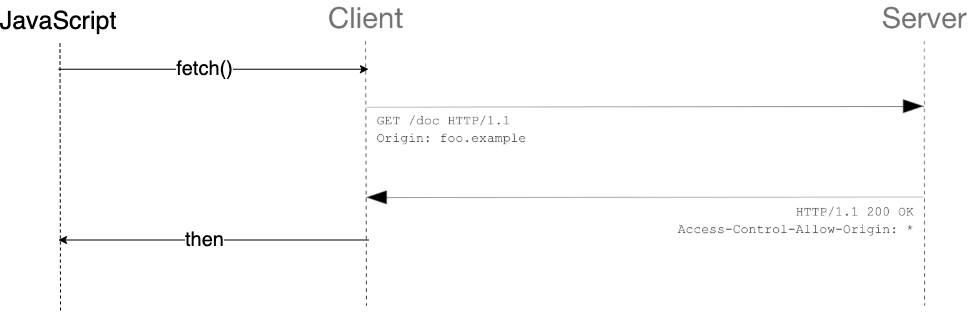

# 목차

 

- [목차](#목차)
- [개요](#개요)
- [출처(origin)이란](#출처origin이란)
- [SOP](#sop)
  - [SOP가 필요한 이유](#sop가-필요한-이유)
  - [SOP란](#sop란)
- [CORS](#cors)
  - [CORS가 필요한 이유](#cors가-필요한-이유)
  - [CORS란?](#cors란)
  - [CORS 접근제어 시나리오](#cors-접근제어-시나리오)
    - [Preflight Request](#preflight-request)
    - [Simple Request](#simple-request)
    - [Credentialed Request](#credentialed-request)
- [참고](#참고)

 

# 개요

웹 개발자라면 한번쯤 보게되는 에러 코드가 있다.

바로 CORS 위반 관련된 에러이다. 이번 기회에 한번 정리해보자.

 

# 출처(origin)이란
본격적으로 CORS를 이해하기 위해선, 출처(origin)란 무엇인지 알아야한다.

* 출처(Origin) = Scheme + Host + Port
  * 출처는 기본적으로 위 세가지를 기준으로 결정한다.
* IE의 경우는 포트는 무시하고 출처를 결정한다고 한다.

 

> JS에서는 `document.location.origin`을 통해 현재 출처를 확인할 수 있다.

 

# SOP
웹에선 다른 출처로의 리소스 요청을 제한하는 것과 관련된 정책이 두가지 존재한다.

* SOP
* CORS

 

CORS를 설명하기 전에, CORS가 나오게 된 배경 중에 하나인 SOP에 대해서 이야기해보자.

> 물론 SOP보다 CORS의 등장이 더 빠르다는 자료도 있다.

 

## SOP가 필요한 이유
> 아래 내용은 주관적으로 생각한 SOP가 필요한 이유입니다 :)

이전 웹 생태계는 대부분 서버 사이드 랜더링(SSL)방식을 사용했다.

서버 사이드 랜더링의 경우, 정적 페이지 요청과 비슷하게 하나의 출처(도메인)에서 모든 정보를 받아서 사용했다.

 

 

 

하지만, 웹 기술의 발전으로, 프론트측에서 스크립트 언어를 사용하여, 
비동기적인 HTTP 요청을 하기 시작했다.

이는 하나의 페이지에 여러 서버에 요청하는 일이 가능해졌음을 의미한다.

 

이렇게 보면 다른 출처에 요청을 하는 것이 좋아보이지만, 아래와 같이 보안적인 이슈가 존재한다.

 

만약 SOP를 적용시켰다면, `hack.kr`에서 `domain-a.com`라는 서버로 요청한 결과를 보지 못하도록 할 수 있기 때문에 보안적 문제를 해결할 수 있다.

 

> **중요한 점은 출처를 비교하는 로직이 서버에 구현된 스펙이 아니라 브라우저에 구현되어 있는 스펙이라는 점이다.**
> * 요청 자체를 제한할 수도 있지만, 만약 요청을 한다고해도 서버는 CORS를 위반하더라도 정상적으로 응답을 주지만, 응답의 파기 여부는 브라우저가 결정한다.
> * 물론 서버가 같은 출처에서 보낸 요청만 받겠다는 로직을 가지고 있으면 서버에서 에러를 응답하게 할 수 있다.

 

## SOP란

* SOP는 하나의 출처(origin)에서 로드된 자원이 다른 출처(cross origin)의 자원과 상호작용 하지 못하도록 요청 발생을 제한하고, 동일 출처(same origin)에서만 접근이 가능하도록 하는 정책이다.

 

# CORS
> SOP에 대해서 알았으니, 이제 본격적으로 CORS에 대해서 이야기해보자.

 

## CORS가 필요한 이유
SOP를 이용해서 다른 출처의 경우 제한하는 것이 보안적으론 안전할 수 있다.

하지만, 요즘은 프론트와 백이 분리되어 개발되며, 프론트 서버와 백앤드 서버를 따로 두기도 한다.

그렇게 되면 프론트 서버로부터 받아온 페이지에서 백앤드 서버로 요청하면 SOP로 인해서 제한될 수 있다.

**이처럼 한 출처에서 실행 중인 웹 애플리케이션이 특정한 다른 출처의 선택한 자원에 접근할 수 있는 권한을 부여하는 체제가 필요하다.**

**그리고 이것이 바로 CORS다.**

 

## CORS란?
* **교차 출처(Cross-orign)?**
  * 서로 다른 출처(origin)라고 생각하면 된다.
* **CORS란?**
  * **교차 출처 자원 공유**(CORS)는 웹 페이지 상의 제한된 리소스를 최초 자원이 서비스된 도메인 밖의 다른 도메인으로부터 요청할 수 있게 허용하는 구조이다.
  * CORS는 교차 출처 요청을 허용하는 것이 안전한지 아닌지를 판별하기 위해 브라우저와 서버가 상호 통신하는 하나의 방법을 정의한다.
  * **다른 출처의 리소스를 불러올려면 그 출처에서 올바른 CORS 헤더를 포함한 응답을 반환해야 한다.**

 

## CORS 접근제어 시나리오

 

🤔 **CORS의 기본적인 동작 방식은?**

* 웹 클라이언트측에서 다른 출처의 리소스를 요청할 때 HTTP 프로토콜을 이용해서 요청을 보내게 된다.
  * 이때 요청 헤더에 `Origin`이라는 필드를 함께 보내게된다.
* **이후 서버가 응답을 할 때 헤더에 Access-Control-Access-Origin`이라는 값에 "이 리소스를 접근하는 것이 허용된 출처"를 내려주게된다.**
  * **응답을 받은 클라이언트(브라우저)는 자신이 보냈던 요청의 `Origin`과 서버가 보내준 응답의 `Access-Control-Allow-Origin`을 비교해본 후 유효한 응답인지 확인한다.**

> CORS는 기본적인 동작 방식과 다르게 3가지의 시나리오로 동작하는 경우가 많다.

 

### Preflight Request
Preflight Request(프리플라이트 요청)은 요청을 한번에 보내지 않고 예비 요청과 본 요청을 나누어서 전송하는 것을 의미한다.

**이때 예비 요청을 프리플라이트 요청이라 부르며, `OPTION`메서드를 이용해서 본 요청을 보내기 전에 브라우저 스스로 이 요청을 보내는 것이 안전한지 확인한다.**

* 브라우저는 본 요청전에 `OPTION`을 통해 예비요청을 한다.
  * `Access-Control-Request-Method`: 이후 어떤 HTTP 메서드를 사용할 것인지를 서버에게 미리 알려주는 속성.
  * `Access-Control-Request-Headers`: 본 요청에서 `X_PINGOTHER`과 `Content-Type`헤더를 사용할 것이라는 것을 미리 알려주는 속성.
* 서버에서 프리플라이트 처리를 해주었다면 프리플라이트 응답이 온다.
  * `Access-Control-Allow-Origin`: 이 서버 리소스에 접근이 가능한 출처를 나타낸다. (여기선 `http://foo.example`만 가능.)
  * `Access-Control-Allow-Method`: 해당 리소스에서 지원하는 HTTP 메서드를 의미한다.
  * `Access-Control-Allow-Headers`: 해당 리소스에서 지원하는 HTTP 헤더를 의미한다.

 

### Simple Request
Simple Request (단순 요청)은 프리플라이트 요청과 다르게 예비 요청을 보내지 않고 바로 서버에게 본 요청을 보낸다.

서버는 이에 대한 응답의 헤더에 `Access-Control-Allow-Origin`과 같은 값을 보내주면, 브라우저에서 CORS 정책 위반 여부를 검사하는 방식.

쉽게 보면, 프리플라이트와 단순 요청의 시나리오는 예비 요청의 존재 유무만 다를 뿐 비슷하다.

단, **단순 요청은 다음과 같은 조건을 충족해야한다.**

1. 다음중 하나의 메서드만 사용해야한다.
   * GET, HEAD, POST
2. Accept, Accept-Language, Content-Language, Content-Type, DPR, Downlink, Save-Data, Viewport-Width, Width 헤더만 허용된다.
3. Content-Type 헤더는 다음의 값들만 허용한다.
   * application/x-www-form-urlencoded, multipart/form-data, text/plain

**흔히 이러한 조건을 지키기는 까다롭다고 한다. 일단 `Authorization`부터 안된다...**

 

 

### Credentialed Request
인증 정보를 포함한 요청 (Credentialed Request)은 다른 출처 간 통신에서 좀 더 보안을 강화하고 싶을 때 사용한다.

인증 정보를 포함한 요청의 더 자세한 내용은 [여기](https://developer.mozilla.org/ko/docs/Web/HTTP/CORS#%EC%9D%B8%EC%A6%9D%EC%A0%95%EB%B3%B4%EB%A5%BC_%ED%8F%AC%ED%95%A8%ED%95%9C_%EC%9A%94%EC%B2%AD)에서 확인하자.

 

# 참고
* https://ko.wikipedia.org/wiki/%EA%B5%90%EC%B0%A8_%EC%B6%9C%EC%B2%98_%EB%A6%AC%EC%86%8C%EC%8A%A4_%EA%B3%B5%EC%9C%A0
* https://developer.mozilla.org/ko/docs/Web/HTTP/CORS
* https://evan-moon.github.io/2020/05/21/about-cors
