# 1장. HTTP 개관

- [개요](#개요)
- [1 리소스](#1-리소스)
  * [1-1 미디어 타입 (MIME)](#1-1-미디어-타입-mime)
  * [1-2 URI](#1-2-uri)
  * [1-3 URL](#1-3-url)
- [2 트랜잭션](#2-트랜잭션)
  * [2-1 메서드](#2-1-메서드)
  * [2-2 상태 코드](#2-2-상태-코드)
- [3 메시지](#3-메시지)
- [4 TCP 커넥션](#4-tcp-커넥션)
  * [4-1 TCP/IP](#4-1-tcpip)
  * [4-2 접속, IP주소, 포트번호](#4-2-접속-ip주소-포트번호)
  * [4-3 텔넷(Telnet)을 이용한 실전 예제](#4-3-텔넷telnet을-이용한-실전-예제)
- [5 프로토콜 버전](#5-프로토콜-버전)
- [6 웹의 구성요소](#6-웹의-구성요소)
  * [6-1 프록시](#6-1-프록시)
  * [6-2 캐시](#6-2-캐시)
  * [6-3 게이트웨이](#6-3-게이트웨이)
  * [6-4 터널](#6-4-터널)
  * [6-5 에이전트](#6-5-에이전트)

 

## 개요

이 장은 HTTP를 간결하게 설명한다.

* 리소스(웹 컨텐츠)가 어디서 오는지
* 웹 트랜잭션이 어떻게 동작하는지
* HTTP 통신을 위해 사용하는 메시지의 형식
* HTTP 기저의 TCP 네트워크 전송
* 여러 종류의 HTTP 프로토콜
* 인터넷 곳곳의 설치된 다양한 HTTP 구성 요소

HTTP는 인터넷의 멀티미디어 배달부 역할을 하며, 여러 파일들을 웹 브라우저와 웹 서버에게 옮겨준다.

 

## 1 리소스

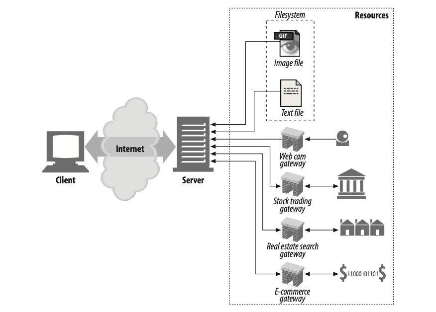

* 웹 리소스는 웹 컨텐츠의 원천이다. 두 가지의 종류가 있다.
  * 정적 파일
    * 텍스트, HTML, 워드, 이미지 파일등등
  * 동적 파일
    * 요청과 상황에 따라 컨텐츠를 생성하는 파일.

 

### 1-1 미디어 타입 (MIME)

* **미디어 타입의 의미**
  * 인터넷은 수천 가지 데이터 타입을 다루기 때문에, HTTP는 웹에서 전송되는 객체 각각에 신중하게 `MIME` 타입이라는 **데이터 포맷 라벨**을 붙인다.
* `MIME`의 의미
  * `MIME (Multipurpose Internet Mail Extensions)` 은 원래 각기 다른 전자메일 시스템 사이에서 메시지가 오갈 때 겪는 문제점을 해결하기 위해 설계 되었다.
  * `MIME`은 이메일에서 워낙 잘 동작했기 때문에, HTTP에서도 멀티미디어 콘텐츠를 기술하고 라벨을 붙이기 위해 채택되었다고 한다.
* `MIME`의 사용
  * 웹서버는 모든 HTTP 객체 데이터에 `MIME` 타입을 붙인다.
  * 웹 브라우저는 이를 기반으로 해당 파일을 다룬다. (HTML, 이미지, 비디오 등등)
  * ***HTTP 메시지중 `Content-Type`이 바로 `MIME`이다.***

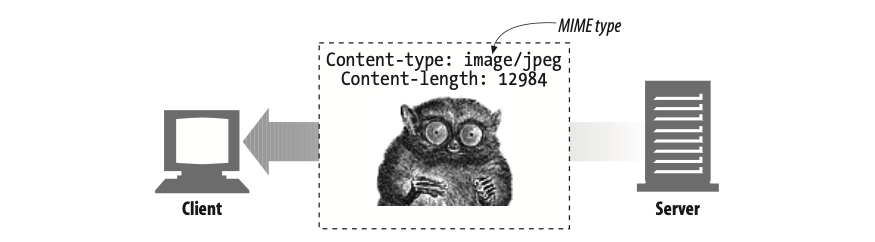

* `MIME` 의 기술 방법
  * `MIME` 타입은 사선(/)으로 구분된 주 타입과 부 타입으로 이루어진 문자열 라벨이다.
    * HTML : `text/HTML`
    * JPEG : `image/jpeg`

 

### 1-2 URI

* URI의 의미

  * **URI (Uniform Resource Indentifier)는 인터넷의 우편물 주소** 같은 것으로, **정보 리소스를 고유하게 식별하고 위치를 지정할 수 있다.**
  * 웹 서버 리소스는 각자 이름을 갖고 있기 때문에, 클라이언트는 관심 있는 리소스를 지목할 수 있다. 이때 웹 상의 주소 URI를 사용한다.

* URI 예제

  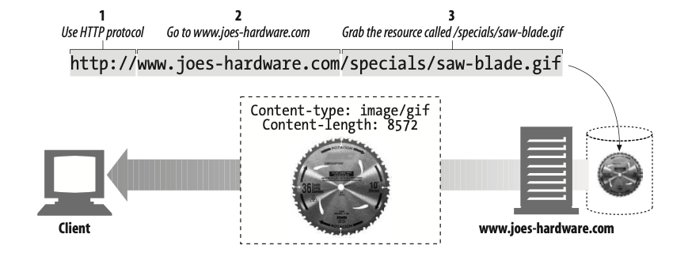

  * `joes-hardware.com`서버에 있는 이미지 리소스에 대한 URI를 신청하는 예제이다.

* 대표적인 URI

  * **URL : 오늘날 제일 많이 사용되는 URI 방식이다. 웹 상의 주소라고 보면 된다.**
  * URE : 최신 기법이라는데 아직은 사용이 안된다고 한다.

 

### 1-3 URL

* URL의 의미

  * **통합 자원 지시자 (Uniform Resource Locator)는 리소스 식별자의 가장 흔한 형태다.**
  * URL은 특정 서버의 한 리소스에 대한 **구체적인 위치**를 서술한다.
  * **URL은 리소스가 정확히 어디에 있고 어떻게 접근할 수 있는지 분명히 알려준다.**

* URL 예제

  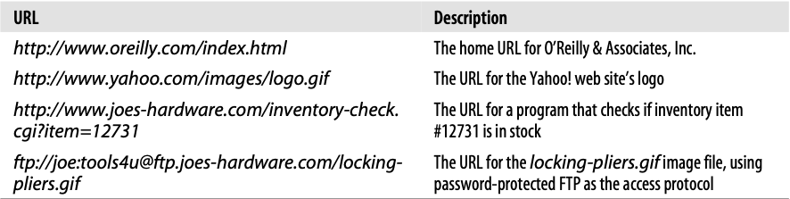

 

## 2 트랜잭션

> 트랜잭션의 사전적 의미 : 처리, 거래, 상호작용 **(통신의 한 단위)**

* 트랜잭션의 의미

  * HTTP 트랜잭션은 **요청 명령과 응답 결과**로 구성되어 있다. 
  * ***클라이언트와 서버가 서로 통신(요청+응답)하는 것을 트랜잭션이라고 보면 된다.***
  * ***클라이언트와 서버간의 상호작용 = 트랜잭션***
  * 웹 브라우저는 시각적으로 풍부한 웹페이지를 가져올 때 대량의 HTTP 트랜잭션을 수행한다.

* 트랜잭션의 예제

  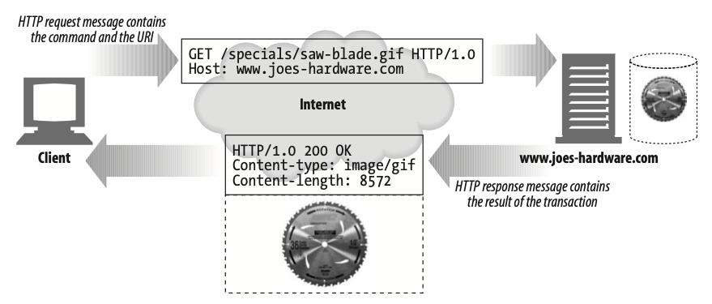

 

### 2-1 메서드

* HTTP 메서드의 의미
  * HTTP의 모든 요청 메시지는 하나의 메서드를 갖고 있다.
  * **메서드는 서버에게 어떤 동작이 취해져야 하는지 알려준다. ( 가져오기, 수정하기 등등 )**
* 메서드의 종류
  * GET / POST / DELETE / POST / HEAD

 

### 2-2 상태 코드

* 상태코드의 의미
  * **HTTP의 모든 응답 메시지는 하나의 상태 코드를 갖고 있다.**
  * 상태 코드는 클라이언트에게 요청이 성공했지는 아니면 추가 조치가 필요한지 알려주는 세 자리 숫자다.
* 상태 코드의 종류 (대표적 코드)
  * 200 : 문서가 바르게 반환되었다.
  * 302 : 다시 보내라. 다른 곳에 가서 리소스를 가져가라
  * 404 : 없음. 리소스를 찾을 수 없다.

 

## 3 메시지

* 메시지의 의미

  * HTTP 메시지는 단순한 줄 단위의 문자열(`String`)이다.
    * ***이진 형식이 더 엄격하고 빠르나 확장과 디버그가 용이하지 않아 문자열을 사용한다고 한다.***
  * HTTP의 요청을 보내고 응답을 보낼 때 사용하는 것이 메시지이다.

* 메시지의 종류

  * 요청 메시지
  * 응답 메시지

* 메시지의 구성

  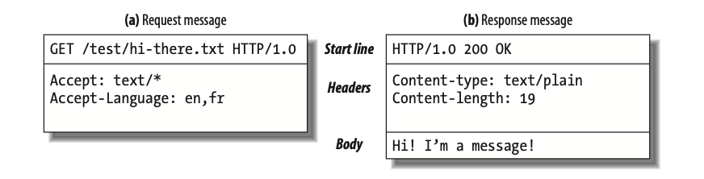

  * 시작줄 : 요청이라면 무엇을 해야하는지, 응답이라면 무슨일이 일어났는지 나타낸다.
  * 헤더 : 키-값 형식으로, 메시지의 형식을 기록한다.
  * 본문 : 메시지의 본문(내용). 텍스트, 이진 데이터를 이용한 이미지, 비디오 등등

* 메시지의 예제

  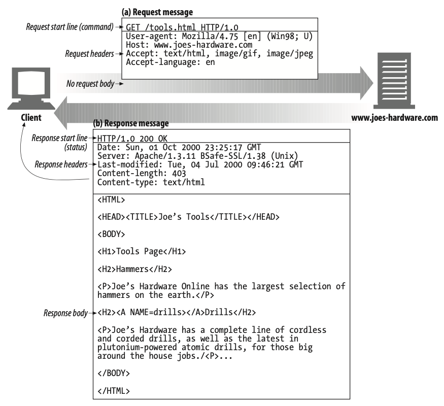

 

## 4 TCP 커넥션

HTTP는 이번 챕터에선 이에 대해서 간단히 다룬다.

### 4-1 TCP/IP

* TCP/IP의 의미

  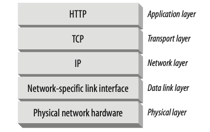

  * TCP/IP는 **전송 계층**에 속해있으며, **신뢰성있는 통신**을 지원한다.
  * **TCP/IP는 TCP와 IP가 층을 이루는, 패킷 교환 네트워크 프로토콜의 집합이다.**
  * **TCP/IP는 각 네트워크와 하드웨어의 특성을 숨기고, 어떤 종류의 컴퓨터나 네트워크든 서로 신뢰성 있는 의사소통을 하게 해준다.**
  * **HTTP는 애플리케이션 계층 프로토콜이며, TCP/IP 덕분에 네트워크 통신의 신뢰성을 가지고 메시지를 주고 받는다.**

* ***TCP/IP의 특성***

  * 오류 없는 데이터 전송
  * 순서에 맞는 전달 ( 데이터는 언제나 보낸 순서대로 도착한다. )
  * 조각나지 않는 데이터 스트림 ( 언제든 어떤 크기로든 보낼 수 있다. )

> ***HTTP는 TCP 위의 계층이다. TCP는 IP 위의 계층이다.***

 

### 4-2 접속, IP주소, 포트번호

* 의미
  * ***HTTP 클라이언트가 서버에 메시지를 전송할 수 있게 되기 전, IP주소와 포트 번호를 사용해 클라이언트와 서버 사이에 TCP/IP 커넥션을 맺어야한다.***
  * TCP 커넥션을 맺는 것은 다른 회사 사무실에 있는 누군가에게 전화를 거는 것과 다소 비슷하다.
* TCP커넥션을 이용한 HTTP 트랜잭션 과정
  * 웹브라우저는 서버의 URL에서 호스트 명을 추출한다.
  * 웹브라우저는 서버의 호스트 명을 IP로 변환한다.
  * 웹브라우저는 URL에서 포트번호를 추출한다.
  * 웹브라우저는 웹 서버와 TCP 커넥션을 맺는다.
  * 웹브라우저는 서버에 HTTP 요청을 보낸다.
  * 서버는 웹브라우저에게 HTTP 응답을 보낸다.
  * 커넥션이 닫히면, 웹브라우저는 문서를 보여준다.

 

### 4-3 텔넷(Telnet)을 이용한 실전 예제

* 웹 브라우저 연결의 기본적인 절차

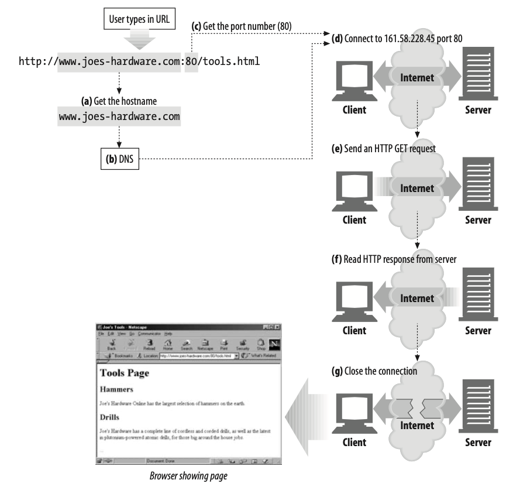

* 텔넷이란?

  * ***사용자의 키보드를 목적지의 TCP 포트로 연결해주고 출력 TCP 포트를 사용자의 화면으로 연결해준다.***
  * 원격 연결과 같은 의미이다. (지금은 보안적으로 우수한 SSH를 이용한다.)
  * HTTP를 포함한 일반적인 TCP 서버에 연결하기 위해 사용될 수 있다.
  * ***웹 서버는 유저를 웹 클라이언트처럼 취급하고, TCP 커넥션을 통해 돌려주는 데이터는 화면에 출력된다.***

* 텔넷을 이용한 HTTP요청

  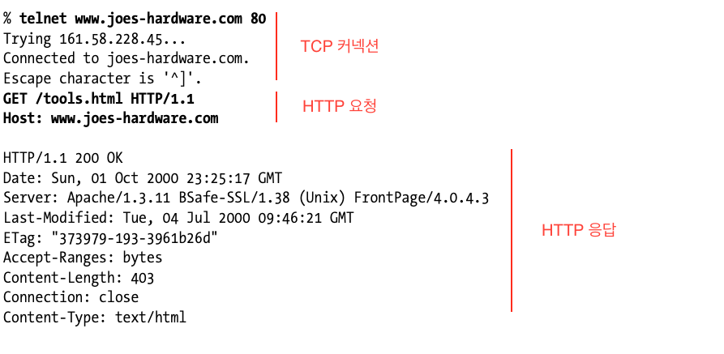

  * 우선 `joes-hardware.com`의 IP 주소를 찾아 그 컴퓨터의 80번 포트로 TCP 커넥션을 맺는다.
  * TCP 커넥션이 연결되면, 사용자는 HTTP 요청을 타이핑해서 입력한다.
  * 서버는 콘텐츠를 HTTP 응답에 담아 반환하고 커넥션을 끊는다.

 

## 5 프로토콜 버전

오늘날 쓰이고 있는 HTTP 프로토콜은 버전이 여러 가지이다.

1. HTTP/0.9
   * 1991년의 초기 버전. GET 메서드만 지원하고, 멀티미디어 콘텐츠에 대한 MIME 타입이나, 헤더등을 지원하지 않았다.
2. HTTP/1.0
   * 처음으로 널리 쓰이기 시작한 HTTP 버전. 추가 메서드, MIME, 헤더 등을 추가했다.
3. HTTP/1.0+
   * HTTP/1.0에 기능을 더 추가한 버전. keep-alive 기능이 추가 되었다고 한다.
4. HTTP/1.1
   * HTTP 설계의 구조적 결함 교정, 두드러진 성능 최적화, 잘못된 기능 제거에 집중한 버전.
   * **현재의 HTTP 버전이다.**
5. HTTP/2.0
   * 구글의 SPDY 프로토콜을 기반으로 설계가 진행 중인 프로토콜.

 

## 6 웹의 구성요소

### 6-1 프록시

> proxy : 대리, 대리인

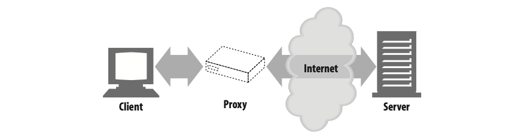

* **프록시의 의미**
  * **프록시는 클라이언트와 서버 사이에 위치하여, 클라이언트의 모든 HTTP 요청을 받아 서버에 전달한다.**
  * 이 애플리케이션은 사용자를 위한 프록시로 동작하며 사용자들 대신해서 서버에 접근한다.
* **프록시의 용도**
  * 프록시는 주로 **보안**을 위해 사용된다.
  * 모든 웹 트래픽 흐름 속에서 신뢰할 만한 **중개자 역할**을 한다.
  * 프록시는 요청과 응답을 **필터링**하기도 한다.

 

### 6-2 캐시

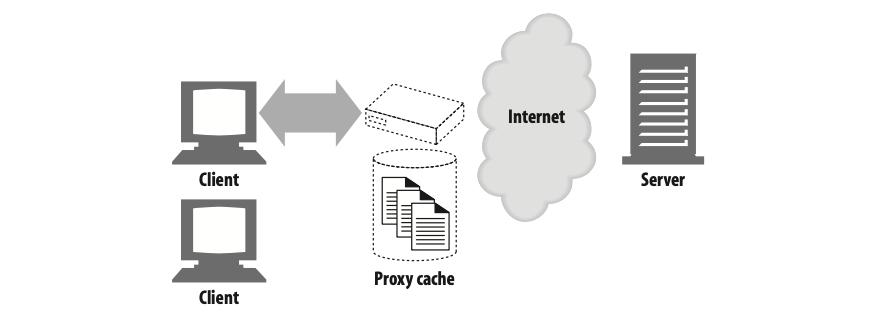

* 캐시의 의미
  * **웹캐시와 캐시 프록시는 자신을 거쳐 가는 문서들 중 자주 찾는 것의 사본을 저장해 두는, 특별한 종류의 HTTP 프록시 서버다.**
  * 컴퓨터에서 램과 같은 역할을 한다.

 

### 6-3 게이트웨이

> gateway : 입구, 관문

* **게이트웨이 의미**
  * **게이트웨이는 다른 서버들의 중개자로 동작하는 특별한 서버다.**
* 게이트웨이 활용
  * 게이트웨이는 **주로 HTTP 트래픽을 다른 포로토콜로 변환**하기 위해 사용된다.
    * 서로 다른 프로토콜과 애플리케이션 간의 통신을 위해 사용
  * 게이트웨이는 언제나 스스로가 리소스를 갖고 있는 진짜 서버인 것처럼 요청을 다룬다.
  * 클라이언트는 자신이 게이트웨이와 통신하고 있음을 알아채지 못한다.

 

### 6-4 터널

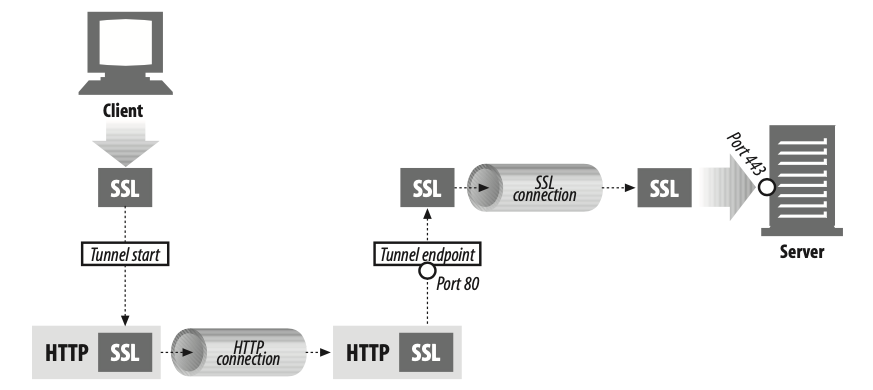

* 터널의 의미
  * **터널은 두 커넥션 사이에서 날(raw) 데이터를 열어보지 않고 그대로 전달해주는 HTTP 애플리케이션이다.**
* 터널의 활용
  * 터널은 보통 비 HTTP 데이터를 하나 이상의 HTTP 연결을 통해 그대로 전송해주기 위해 사용된다.
  * 대표적인 것은 암호화된 SSL 트래픽을 HTTP 커넥션으로 전송함으로써 웹 트래픽(80포트)만 허용하는 사내 방화벽을 통과시키는 것이다.
    * HTTP/SSL 터널은 HTTP 요청을 받아들여 목적지의 주소와 포트번호로 커넥션을 맺는다. 이후부터는 암호화된 SSL 트래픽을 HTTP 채널을 통해 목적지 서버로 전송할 수 있게 된다.
  * HTTPS를 위해 HTTP를 터널로 사용한다는 의미.

 

### 6-5 에이전트

* 에이전트의 의미
  * 사용자를 위해 HTTP 요청을 만들어주는 클라이언트 프로그램을 말한다.
  * 웹 요청을 만드는 애플리케이션은 뭐든 HTTP 에이전트다.
  * 대표적으로 크롬, 사파리등이 있다.
