# URL과 리소스

- [개요](#개요)
- [1 URL이란](#1-url이란)
- [2 URL문법](#2-url문법)
  * [2-1 스킴: 사용할 프로토콜](#2-1-스킴-사용할-프로토콜)
  * [2-2 호스트와 포트](#2-2-호스트와-포트)
  * [2-3 사용자 이름과 비밀번호](#2-3-사용자-이름과-비밀번호)
  * [2-4 경로](#2-4-경로)
  * [2-5 파라미터](#2-5-파라미터)
  * [2-6 질의 문자열](#2-6-질의-문자열)
  * [2-7 프래그먼트](#2-7-프래그먼트)
- [3 단축 URL](#3-단축-url)
  * [3-1 상대 URL](#3-1-상대-url)
- [4 안전하지 않은 문자](#4-안전하지-않는-문자)
  * [4-1 URL 문자 집합](#4-1-url-문자-집합)
  * [4-2 인코딩 체계](#4-2-인코딩-체계)
- [5 스킴의 바다](#5-스킴의-바다)
- [6 URN](#6-urn)
  * [6-1 URL의 한계](#6-1-url의-한계)
  * [6-2 URN이란](#6-2-urn이란)

 

## 개요

이 장은 URL과 리소스에 대해서 다룬다.

* URL 문법, 여러 URL컴포넌트가 어떤 의미를 가지며 무엇을 수행하는지.
* 여러 웹 클라이너트가 지원하는 상대 URL과 확장 URL 같은 단축 URL에 대해서
* URL의 인코딩과 문자 규칙
* 여러 인터넷 정보 시스템에 적용되는 공통 URL 스킴
* 기존 이름은 유지하면서 객체들을 다른 장소로 옮기는 것을 가능하게 해주는 URN을 포함한 URL의 미래

 

## 1 URL이란

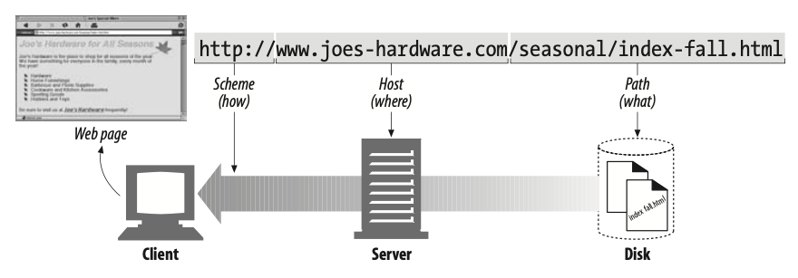

* URL이란
  * **URL은 인터넷의 리소스를 가리키는 표준이름이다.**
  * URL은 통합 자원 식별자(Uniform Resource Identifier) 혹은 URI라고 불리는 더 일반화된 부류의 부분집합이다.
  * URL은 브라우저가 정보를 찾는데 필요한 리소스의 위치를 가리키며, URL을 이용해 사람과 애플리케이션이 인터넷상의 수십억 개의 리소스를 찾고 사용하며 공유할 수 있다.
* URL이 있기 전에
  * **직접 전송 프로토콜(TCP)를 이용해서 ftp같은 프로토콜을 이용해 해당 서버에 접속후 파일을 찾아야했다.**
  * **URL을 사용하면서부터 서버의 리소스에 바로 접근을 할 수 있게 되었다.**

## 2 URL문법

**URL로 인터넷상의 모든 리소스를 찾을 수 있지만, 그 리소스들은 다른 스킴(HTTP, FTP, SMTP)을 통해 접근할 수 있으며, URL문법은 스킴에 따라서 달라진다.**

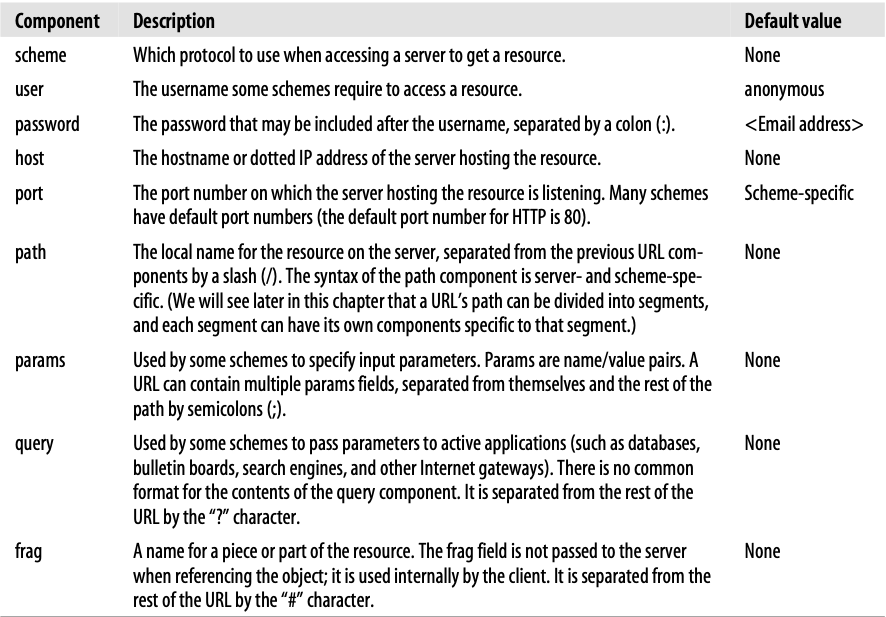

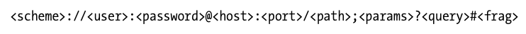

* 대부분의 URL은 위와 같이 9개의 부분으로 나누어져 있다.

 

### 2-1 스킴: 사용할 프로토콜

* 스킴이란?
  * **스킴은 주어진 리소스에 어떻게 접근하는지 알려주는 정보이다.**
  * 대표적인 예제로는 **HTTP, FTP, SMTP**등이 있다.

 

### 2-2 호스트와 포트

* 호스트
  * 리소스를 호스팅하고 있는 장비와 그 장비 내에서 리소스에 접근할 수 있는 서버가 어디에 있는지 알아야한다. 
  * **호스트는 접근하려고 하는 리소스를 가지고 있는 인터넷상의 호스트 장비를 가리킨다.**
    * 즉, **네트워크에 연결되어 주소가 할당된 컴퓨터나 기타 장치를 의미한다.**
  * **서버 IP주소 혹은 도메인 주소**
* 포트
  * 서버가 열어놓은 네트워크 포트를 가리킨다.

 

### 2-3 사용자 이름과 비밀번호

* 사용자 이름과 비밀번호

  * 리눅스 같은 경우, 다중 사용자 시스템을 사용하는데 외부에서 SSH(sftp)로 해당 서버에 접속하려면 사용자 이름과 비밀번호가 필요하다.
  * 즉, 많은 서버가 자신이 가지고 있는 데이터에 접근을 허용하기 전에 사용자 이름과 비밀번호를 요구한다.

* 예시

  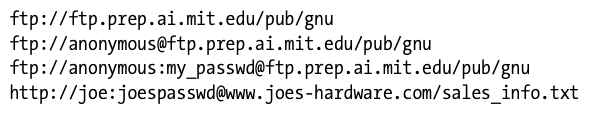

 

### 2-4 경로

* 경로란
  * **URL의 경로는 리소스가 서버의 어디에 있는지 알려준다.**
  * 해당 경로는 **계층적 파일 시스템 경로**와 유사한 구조를 가진다.

 

### 2-5 파라미터

* 파라미터란?
  * **URL의 파라미터는 애플리케이션이 서버에 정확한 요청을 하기 위해 필요한 입력 파라미터를 받는데 사용한다.**
  * **이름/값 쌍의 리스트**로 URL나머지 부분들로부터 ';' 문자로 구분하여 URL에 기술한다.
  * 여기서 말하는 파라미터는 프로토콜에 대한 파라미터이다.
  * URL을 이용하는 애플리케이션에 접근하려면 프로토콜 파라미터가 필요한 경우가 있다.
* 예시
  * `ftp://prep.ai.mit.edu/pub/gnu;type=d`
  * `http://www.joes-hardware.com/hammers;sale=false/index.html;graphics=true`

 

### 2-6 질의 문자열

* 질의 문자열이란?

  * **서버에 리소스를 요청받는 범위를 좁히기 위해서 질문이나 질의 문자열을 사용한다.**
  * `?` 우측에 있는 값들을 말한다.
  * `&`로 나누고 이름-값 쌍 형식의 문자열을 사용한다.

* 예시

  
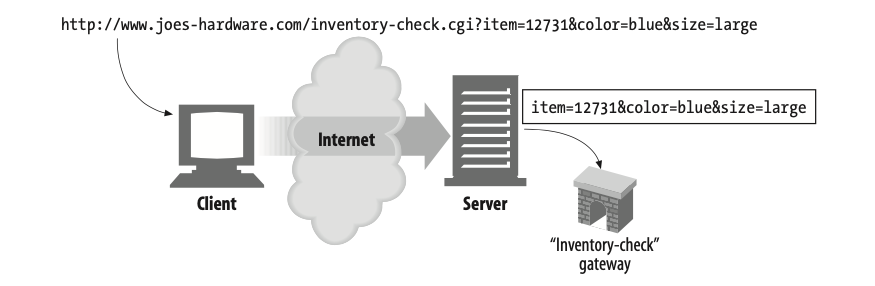

 

### 2-7 프래그먼트

* 프래그먼트란?
  * **URL은 한 리소스의 전체 내용을 가리키지만, 프래그먼트는 해당 리소스의 일부를 가리킬 수 있게 해준다.**
  * **큰 텍스트파일에서 한 문단을 가리킬 수 있는 것과 같다.**
  * URL에서는 `#`를 사용한다.
* 예시
  * `http://www.joes-hardware.com/tools.html#drills`

> **일반적으로 HTTP서버는 객체 일부가 아닌 전체만 다루기 때문에, 클라이언트는 서버에 프래그먼트를 전달하지 않는다.**
>
> 프래그먼트 형식으로 요청을 하면 그냥 해당 리소스 전체를 반환한다.

 

## 3 단축 URL

URL은 리눅스의 파일 시스템과 유사하다. 그러므로 **URL의 종류도 두 가지**이다.

* 절대 URL : 리소스에 접근하는데 필요한 **모든 정보**를 가지고 있다.
* 상대 URL : 모든 정보를 담고 있지 않고, **기저(base)라고 하는 다른 URL을 사용한다.**

### 3-1 상대 URL

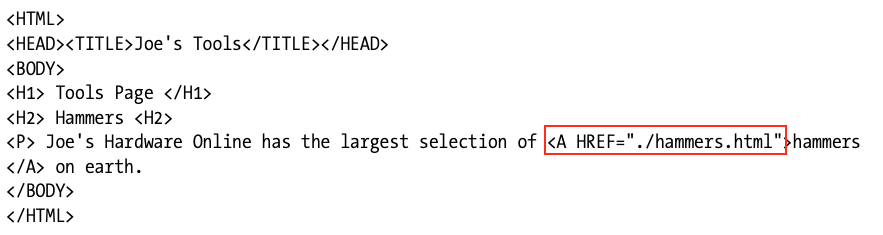

*  개념
  * 상대 URL은 URL을 짧게 표시하는 방식이다.
  * **리소스에 대한 모든 정보를 가지고 있지 않고 기저(base) URL을 기반으로 정보를 가지고 있다.**
  * 기저(base) URL은 리소스의 스킴과 호스트 그리고 경로등을 가지고 있다. (현재 디렉토리 같은)

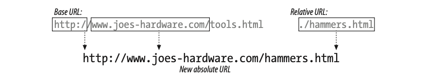

* 기저(base) URL이란
  * **해당 리소스의 URL을 기저 URL로 사용하거나, 해당 디렉토리의 주소를 기저 URL로 사용해서 더 짧은 경로를 의미하는 상대 경로를 표현할 수 있다.**
* URL의 파싱
  * 모든 상대 URL은 절대 URL로 변환된다.
  * 즉 **상대 URL을 각 컴포넌트 단위로 파싱(분해)하고, 각 상황에 맞게 절대 경로로 변환된다.**

 

## 4 안전하지 않은 문자

* 안전한 전송이란?
  * **정보가 유실될 위험 없이 URL을 전송할 수 있는 것을 의미한다.**
  * SMTP는 메시지에 7비트 인코딩을 사용하기 때문에, 영어를 제외한 문자는 제거하고 전송을 한다.
  * URL은 문자가 제거되는 일을 피하고자 상대적으로 작고 일반적으로 안전한 알파벳 문자만 포함하도록 허락한다.
  * ***URL설계자들은 URL에서 안전하지 않은 문자(8비트를 넘어가는 각 나라의 언어들)를 안전한 문자로 인코딩할 수 있게 하였다.***

 

### 4-1 URL 문자 집합

* 기본적인 문자 집합 (8비트)
  * 영어는 8비트내로 모든 알파벳을 표현할 수 있다. (US-ASCII)
  * 하지만, 전 세계 각 나라의 언어들을 표현하기 위해서는 8비트로는 전부 표현을 할 수가 없다.
  * 이러한 여러가지의 문자를 포함하기 위해서 ***URL에 이스케이프 문자열***을 사용할 수 있게 하였다.

* 이스케이프 문자란?
  * **US-ASCII에서 사용이 금지된 문자들로, 특정 문자나 데이터를 인코딩할 수 있게 함으로써 이동성과 완성도를 높였다.**

 

### 4-2 인코딩 체계

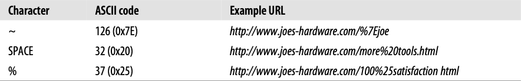

* 인코딩
  * **안전한 문자 집합을 이용하는 경우 그 표현의 한계를 넘기 위해, URL에 있는 안전하지 않은 문자들을 표현할 수 있는 인코딩 방식이 고안되었다.**
* URL의 인코딩
  * 인코딩은 안전하지 않은 문자를 `%`로 시작해, ASCII 코드로 표현되는 두 개의 16진수 숫자로 이루어진 '이스케이프'문자로 바꾼다.

 

## 5 스킴의 바다

웹에서 각 URL요청에는 항상 스킴이 붙어있다.

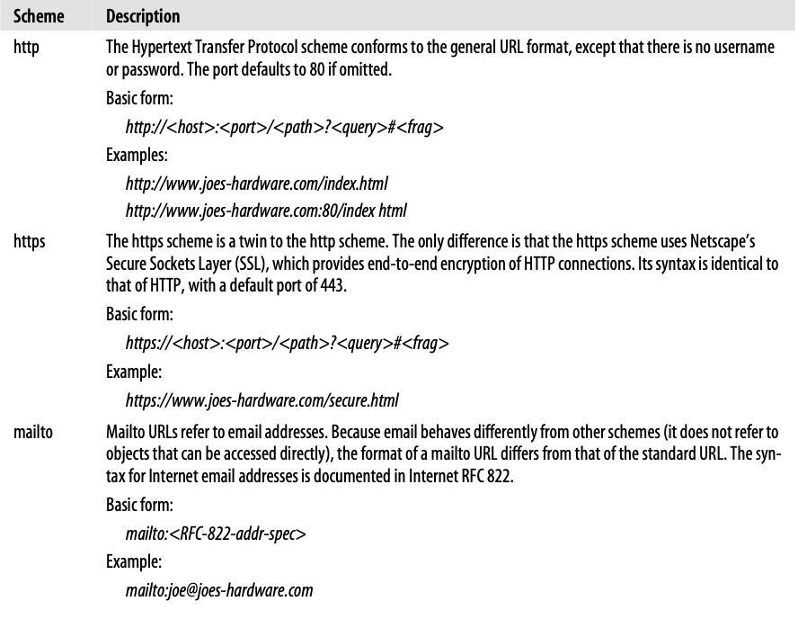

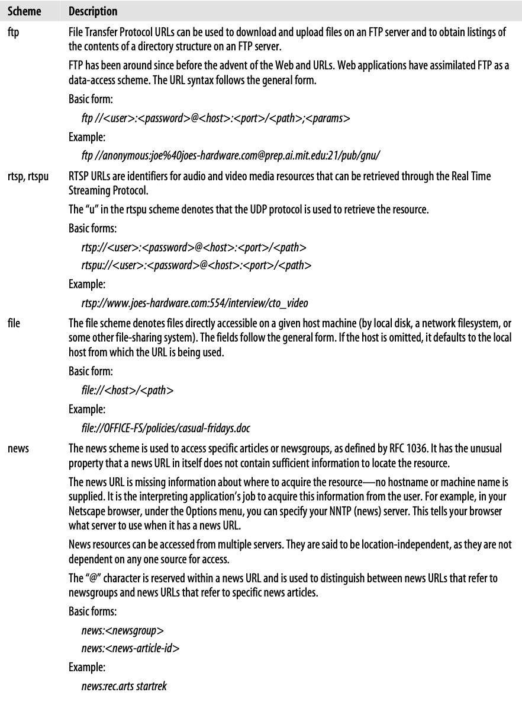

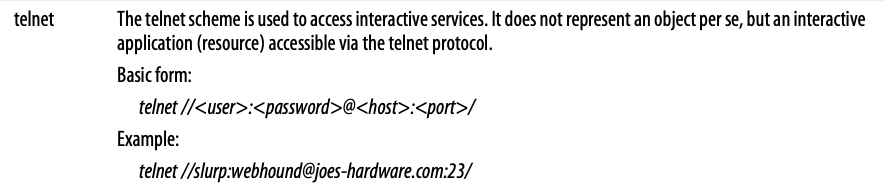

 

## 6 URN

### 6-1 URL의 한계

* URL은 주소이지 실제 이름이 아니다. 즉, URL이 특정 시점에 어떤 것이 위치한 곳을 알려준다는 의미이다.
* 이는 리소스가 옮겨지면 동일한 URL을 더는 사용할 수 없다는 의미이기도 하다.
  * 그리고 그 시점에 기존 URL이 가리키고 있던 객체를 찾을 방법이 없어진다.

 

### 6-2 URN이란

* URN이란?
  * URN(Uniform Resource Names)는 URI의 부분집합으로 새로운 표준이다.
  * **URN은 객체가 옮겨지더라도(웹 서버 내에서나 웹 서버 간 모두) 항상 객체를 가리킬 수 있는 이름을 제공한다.**
* 왜 URL으로 변경되지 않는가?
  * URL에서 URN으로 주소 체계를 바꾸는 것은 매우 큰 작업이다. 표준이기 때문이다.
  * URN을 지원하려면 많은 변화가 필요하다. 표준을 제정하는 것에서부터 여러 HTTP 애플리케이션을 수정하기 위한 벤더들과의 합의도 필요하다.
