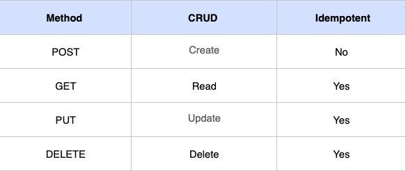

<br>

# HTTP 메시지

<br>

- [HTTP 메시지](#http-메시지)
  - [개요](#개요)
  - [1 메시지의 흐름](#1-메시지의-흐름)
    - [1-1 흐름의 종류](#1-1-흐름의-종류)
    - [1-2 다운스트림으로 흐르는 메시지](#1-2-다운스트림으로-흐르는-메시지)
  - [2 메시지의 각 부분](#2-메시지의-각-부분)
    - [2-1 메시지의 문법](#2-1-메시지의-문법)
    - [2-2 시작줄](#2-2-시작줄)
      - [메서드](#메서드)
      - [상태 코드](#상태-코드)
    - [2-3. 헤더](#2-3-헤더)
      - [헤더의 종류](#헤더의-종류)
  - [3 메서드](#3-메서드)
      - [GET](#get)
      - [HEAD](#head)
      - [PUT](#put)
      - [POST](#post)
    - [PUT과 POST의 차이](#put과-post의-차이)
    - [TRACE](#trace)
    - [OPTIONS](#options)
    - [DELETE](#delete)
    - [확장 메서드](#확장-메서드)
  - [4 상태 코드](#4-상태-코드)
  - [5 헤더](#5-헤더)
    - [5-1 일반 헤더](#5-1-일반-헤더)
    - [5-2 요청 헤더](#5-2-요청-헤더)
    - [5-3 응답 헤더](#5-3-응답-헤더)
    - [5-4 엔터티 헤더](#5-4-엔터티-헤더)

<br>

## 개요

**HTTP가 인터넷의 배달원이라면, HTTP 메시지는 무언가를 담아 보내는 소포와 같다.**

이번 장은 HTTP 메시지의 모든것에 대해 다룬다.

* 메시지가 어떻게 흘러가는가
* HTTP 메시지의 세 부분 (시작줄, 헤더, 개체 본문)
* 요청과 응답 메시지의 차이
* 요청 메시지가 지원하는 여러 기능(메서드)들
* 응답 메시지가 반환하는 여러 상태 코드들
* 여러 HTTP 헤더들은 무슨 일을 하는가

<br>

## 1 메시지의 흐름

**HTTP 메시지는 HTTP 애플리케이션 간에 주고받은 데이터의 블록들이다.**

<br>

### 1-1 흐름의 종류

<p align="center"><br>출처: HTTP 완벽가이드</p>

* HTTP의 흐름이란?
  * HTTP 메시지는 강물과 같이 흐른다는 의미에서 사용되고 있다.
  * HTTP 메시지는 클라이언트, 서버, 프록시 사이를 흐른다.
* **인바운드와 아웃바운드**
  * HTTP는 인바운드 아웃바운드라는 용어를 트랜잭션 방향을 표현하기 위해 사용한다.
  * **인바운드 : 메시지가 원 서버로 향하는 것은 인바운드로 향한다고 한다.  (요청)**
  * **아웃바운드 : 모든 처리가 끝난 뒤에 메시지가 사용자 에이전트로 돌아오는 것을 아웃바운드라고 한다. (응답)**

<br>

### 1-2 다운스트림으로 흐르는 메시지

<p align="center"><br>출처: HTTP 완벽가이드</p>

* HTTP 메시지는 요청 메시지냐 응답 메시지냐에 관계없이 모든 메시지는 다운스트림으로 흐른다.

<br>

## 2 메시지의 각 부분

> **시작줄과 헤더는 그냥 줄 단위로 분리된 아스키 문자열이다.**
>
> * 각 줄은 캐리지 리턴(ASCII 13)과 개행 문자(ASCII 10)로 구성된 두 글자의 줄바꿈 문자열으로 끝난다. `\n`

HTTP 메시지는 단순한, 데이터의 구조화된 블록이다.

<p align="center"><br>출처: HTTP 완벽가이드</p>

* 메시지는 아래와 같이 구성된다.
  * 시작줄 : 이것이 어떤 메시지인지 서술
  * 헤더 : 속성
  * 본문 : 데이터를 담고 있다. (텍스트 혹은 이진 데이터)

<br>

### 2-1 메시지의 문법

<p align="center"><br>출처: HTTP 완벽가이드</p>

* 요청 메시지
  ```shell
  <메서드> <요청 URL> <버전>
  <헤더>
  
  <엔터티 본문>
  ```
* 응답 메시지
  ```shell
  <버전> <상태 코드> <사유 구절>
  <헤더>
  
  <엔터티 본문>
  ```

<br>

### 2-2 시작줄

모든 HTTP 메시지는 시작줄로 시작한다. 

* 요청 메시지의 시작줄은 무엇을 해야 하는지 말해준다.
* 응답 메시지의 시작줄은 무슨 일이 일어났는지 말해준다.

#### 메서드

<p align="center"><br>출처: HTTP 완벽가이드</p>

* 메서드 개념
  * 요청의 시작줄은 메서드로 시작하며, 서버에게 무엇을 해야 하는지 말해준다.
* 확장 메서드
  * HTTP는 쉽게 확장할 수 있도록 설계 되었기 때문에, 다른 서버는 그들만의 메서드를 사용하기도 한다.

#### 상태 코드

<p align="center"><br>출처: HTTP 완벽가이드</p>

* 상태 코드 개념
  * 상태 코드는 클라이언트에게 무엇이 일어났는지 알려주는 용도이다.
  * 숫자로 된 코드를 구성된다.
* 자주 사용되는 코드

<p align="center"><br>출처: HTTP 완벽가이드</p>

<br>

### 2-3. 헤더

HTTP 헤더 필드는 요청과 응답 메서드에 추가 정보를 더한다.

기본적으로 이름/값 쌍의 목록이다.

자주 사용되는 헤더는 다음과 같다.

<p align="center"><br>출처: HTTP 완벽가이드</p>

<br>

#### 헤더의 종류

HTTP 헤더 명세는 여러 헤더 필드를 정의한다.

애플리케이션은 또한 자유롭게 자신만의 헤더를 만들 수 있다. 

HTTP 헤더는 보통 다음과 같이 분류된다.

* 일반 헤더
  * 요청과 응답 양쪽에 모두 나타날 수 있다.
* 요청 헤더
  * 요청에 대한 부가 정보를 제공
* 응답 헤더
  * 응답에 대한 부가 정보를 제공
* Entity 헤더
  * 본문 크기와 콘텐츠, 혹은 리소스 그 자체를 서술
* 확장 헤더
  * 명세에 정의되지 않은 새로운 헤더

<br>

## 3 메서드

> 모든 서버가 모든 메서드를 구현하고 있지 않다. 서버마다 다르다.

#### GET

<p align="center"><br>출처: HTTP 완벽가이드</p>

* GET이란?
  * **주로 서버에게 리소스를 달라고 요청하기 위해 쓰인다.**

<br>

#### HEAD

<p align="center"><br>출처: HTTP 완벽가이드</p>

* HEAD란?
  * **GET처럼 행동하지만, 서버는 응답으로 헤더만 돌려준다.**
  * 엔티티 본문은 결코 반환하지 않는다.
* HEAD의 사용
  * 리소스를 가져오지 않고도 그에 대해 무엇인가(타입이라거나)를 알아낼 수 있다.
  * 응답의 상태 코드를 통해, 개체가 존재하는지 확인할 수 있다.
  * 헤더를 확인하여 리소스가 변경되었는지 검사할 수 있다.

<br>

#### PUT

<p align="center"><br>출처: HTTP 완벽가이드</p>

* PUT이란?
  * **PUT 메서드는 서버에 문서를 쓴다. (Update)**
  * **서버가 요청의 본문을 가지고 요청 URL의 이름대로 새 문서를 만들거나, 이미 URL이 존재한다면 본문을 사용해서 교체하는 것이다.**
* 주의 사항
  * PUT은 콘텐츠를 변경할 수 있게 해주기 때문에, 많은 웹 서버가 PUT을 수행하기 전에 사용자에게 비밀번호를 입력해서 로그인을 하도록 요구해야한다.

<br>

#### POST

<p align="center"><br>출처: HTTP 완벽가이드</p>

* POST란?

  * **POST는 서버에 입력 데이터를 전송하기 위해 설계되었다.**
  * `form`데이터를 다룰 때 많이 사용된다.

<br>

### PUT과 POST의 차이

* **차이점**

  * 게시판에 글쓰기 요청을 2번 날리면 POST는 2개의 게시물이 등록된다.
  * PUT은 동일한 요청 2번을 날리면 첫번째 요청에서 생성된 게시물이 있으므로 생성하지 않고 교체하게 된다. (덮어쓴다)

* **PUT의 특징**

  * **PUT은 서버에서 사용할 리소스의 식별자를 같이 보내는게 일반적이다.**
    * **생성자를 통해 이미 있는 리소스면 새로 만들지 않고 해당 리소스를 업데이트한다.**
  * POST는 그냥 보내고 싶은 것을 보내고 서버에선 새로 생성한다.

* **멱등성**

  * **멱등성 : 연산을 여러 번 적용하더라도 결과가 달라지지 않는 성질을 의미한다.**

  * **POST는 멱등성을 만족하지 못하고, PUT은 만족한다.**

    <p align="center">
      
    </p>

* 결론

  * POST : Create Only
  * PUT : Update If Not Existed Then Create

<br>

### TRACE

<p align="center"><br>출처: HTTP 완벽가이드</p>

* TRACE란?
  * 클라이언트가 어떤 요청을 할 때, 그 요청은 방화벽, 프록시, 게이트웨이 등의 애플리케이션을 통과할 수 있다. 이들에게는 원래의 HTTP 요청을 수정할 수 있는 기회가 있다.
  * **TRACE 메서드는 클라이언트에게 자신의 요청이 서버에 도달했을 때 어떻게 보이게 되는지 알려준다.**
  * **TRACE 요청은 목적지 서버에서 루프백 진단을 시작한다.**
* TRACE 사용
  * **TRACE메서드는 주로 진단을 위해 사용된다.**
  * 요청이 의도한 요청/응답 연쇄를 거쳐가는지 검사할 수 있다.
  * 프록시나 다른 애플리케이션들이 요청에 어떤 영향을 미치는지 확인해보고자 할 때도 좋은 도구다.

<br>

### OPTIONS

<p align="center"></p>

* OPTIONS란?
  * OPTIONS는 웹 서버에게 여러 가지 종류의 지원 범위에 대해 물어본다.
  * **서버에게 특정 리소스에 대해 어떤 메서드가 지원되는지 물어본다.**

<br>

### DELETE

<p align="center"></p>

* DELETE란?
  * 서버에게 요청 URL로 지정한 리소스를 삭제할 것을 요청한다.
  * **단, 클라이언트는 삭제가 수행되는 것을 보장하지 못한다. (서버에서 무시할 수 있다.)**

<br>

### 확장 메서드

* 확장 메서드란? 
  * 이미 정해진 메서드 말고 서버 개발자가 특정한 새로운 메서드를 정의할 수 있다.
* 자주 사용되는 확장 메서드.

<p align="center"><br>출처: HTTP 완벽가이드</p>

<br>

## 4 상태 코드

https://developer.mozilla.org/ko/docs/Web/HTTP/Status

* 상태 코드
  * 100-199 : 정보성 상태 코드
  * 200-299 : 성공 상태 코드
  * 300-399 : 리다이렉션 상태 코드
  * 400-499 : 클라이언트 에러 상태 코드
  * 500-599 : 서버 에러 상태 코드

<br>

## 5 헤더

> 헤더는 종류가 굉장히 많으므로, 필요할때 찾아서 공부하면 된다.

**헤더와 메서드는 클라이언트와 서버가 무엇을 하는지 결정하기 위해 함께 사용된다.**

헤더는 크게 다섯 가지로 분류된다.

* 일반 헤더
* 요청 헤더
* 응답 헤더
* 엔터티 헤더
* 확장 헤더

<br>

### 5-1 일반 헤더

* 일반 헤더는?
  * 클라이언트와 서버 양쪽 모두가 사용하는 헤더이다.
* 대표적인 예
  * `Date`

<br>

### 5-2 요청 헤더

* 요청 헤더란?
  * **요청 메시지를 위한 헤더이다.**
  * 서버에게 클라이언트가 받고자 하는 데이터의 타입이 무엇인지와 같은 부가 정보를 제공한다. (`Accept`)

* 대표적인 예
  * `Cookie`
  * `Accept`
  * `Proxy`

<br>

### 5-3 응답 헤더

* 응답 헤더란?
  * **클라이언트에게 부가 정보를 제공하는 헤더이다.**
  * 누가 응답을 보내고 있는지 혹은 응답자의 능력은 어떻게 되는지 알려주며, 응답에 대한 설명을 제공한다.
* 대표적인 예
  * `Set-Cookie`

<br>

### 5-4 엔터티 헤더

* 엔터티 헤더란?
  * 요청과 응답 양쪽 모두 엔터티를 포함할 수 있기 때문에, 이 헤더들은 양 타입의 메서지에 모두 나타날 수 있다.
  * **엔터티 헤더는 엔터티(내용물)에 대한, 개체의 타입부터 시작해서 주어진 리소스에 대한 정보를 제공한다.**
  * 일반적으로 엔터티 헤더는 메시지의 수신자에게 자신이 다루고 있는 것이 무엇인지 말해준다.
* 대표적인 예
  * `Allow`
  * `Content-type`
