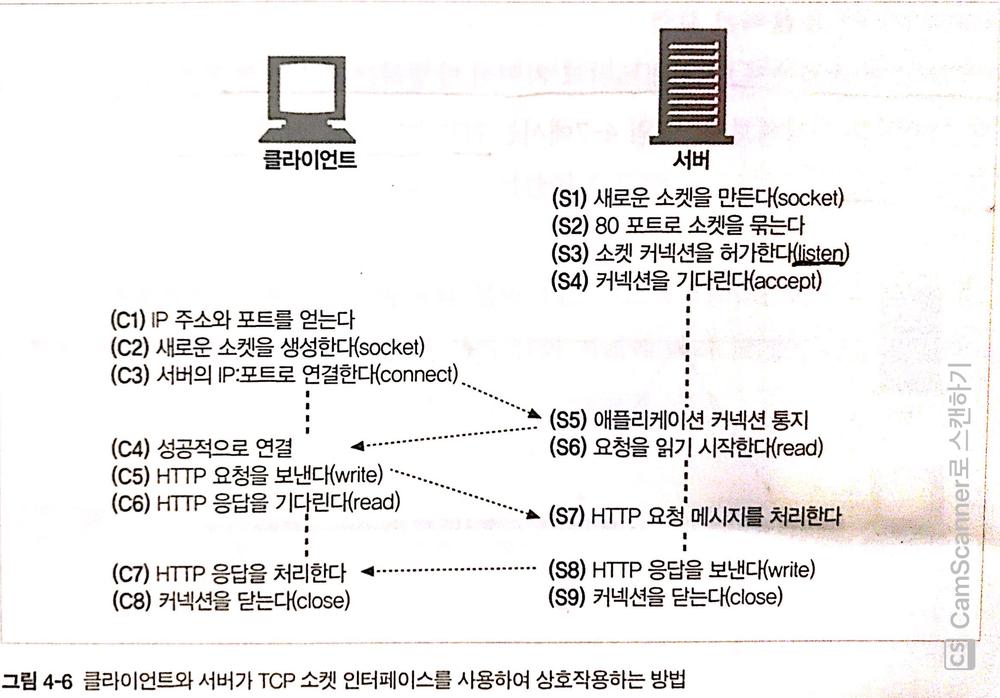

# HTTP 커넥션

HTTP는 TCP를 이용하는 응용계층중 하나이다.

HTTP커넥션과 그것이 어떻게 사용되는지에 대해 잘 이해해야만 효율적인 HTTP 통신을 할 수 있다.

이번 장은 HTTP 커넥션에 대해서 다룬다.

* HTTP는 어떻게 TCP 커넥션을 사용하는가
* TCP 커넥션의 지연, 병목, 막힘
* 병렬 커넥션, keep-alive 커넥션, 커넥션 파이프라인을 활용한 HTTP의 최적화
* 커넥션 관리를 위해 따라야 할 규칙들

***TCP는 HTTP(응용 프로그램)과 소켓 사이의 인터페이스 역할을 한다.***

## 1. TCP 커넥션

전 세계 모든 HTTP통신은 패킷 교환 네트워크 프로토콜들의 계층화된 집합인 TCP/IP를 통해 이루어진다.

### 1-1. 신뢰할 수 있는 데이터 전송 통로 TCP

* HTTP의 진실
  * ***HTTP 커넥션은 몇몇 사용 규칙을 제외하고는 TCP 커넥션에 불과하다.***
* TCP의 특징
  * 커넥션이 맺어지면 손실 혹은 손상되거나 순서가 바뀌지 않는다. (안전하다)

### 1-2. TCP 스트림은 세그먼트로 나뉘어 IP 패킷을 통해 전송된다.

* 프로토콜 스택

* TCP 세그먼트의 구성
  * IP 패킷 헤더
    * IP 헤더는 발신지와 목적지 IP 주소, 크기, 기타 플래그를 가진다.
  * TCP 세그먼트
    * TCP 세그먼트 헤더는 TCP 포트 번호, TCP 제어 플래그를 가지고 있다.
    * 또한, 데이터의 순서와 무결성을 검사하기 위해 사용되는 숫자 값을 포함한다.
  * **TCP 데이터 조각**
    * HTTP의 메시지 내용처럼 TCP를 통해 보내고자하는 데이터를 담고 있다.
* HTTP는 TCP의 위에서 돌아간다.
  * HTTP가 메시지를 전송하고자 할 경우, 현재 연결되어 있는 TCP 커넥션을 통해서 메시지 데이터의 내용을 순서대로 보낸다.
* **TCP의 전송방식**
  * TCP는 IP 패킷 (혹은 IP 데이터그램)이라고 불리는 작은 조각을 통해 데이터를 전송한다.
  * ***TCP는 세그먼트라는 단]위로 데이터 스트림을 잘게 나누고, 세그먼트를 IP패킷라고 불리는 봉투에 담아서 인터넷을 통해 데이터를 전달한다.***
  * 이 모든 것은 TCP/IP 소프트웨어에 의해 처리되며, 그 과정은 HTTP 프로그래머에게 보이지 않는다.

### 1-3. TCP 커넥션 유지하기

* TCP 커넥션

  * TCP 커넥션은 간단히 말해서 두 컴퓨터간의 네트워크 통로를 만드는 것과 같다. (`Stream`)

* TCP 커넥션 식별

  * ***TCP커넥션은 네 가지 값으로 식별한다.***
  * `<발신지 IP 주소, 발신지 포트, 수신지 IP 주소, 수신지 포트>`
  * 이 네 가지 값으로 유일한 커넥션을 생성한다.
  * ***서로 다른 두 개의 TCP 커넥션은 네 가지 주소 구성요소의 값이 모두 같을 수 없다.***

* TCP 커넥션

  * 컴퓨터는 항상 TCP 커넥션을 여러 개 가지고 있다.
  * TCP는 포트 번호를 통해서 이런 여러 개의 커넥션을 유지한다.

* 포트

  * 포트 번호는 회사 직원의 내선전화와 같다.
  * 회사의 대표 전화번호는 안내 데스크로 연결되고 내선전화는 해당 직원으로 연결되듯이 IP 주소는 해당 컴퓨터에 연결되고 포트 번호는 해당 애플리케이션으로 연결된다.

  

### 1-4. TCP 소켓 프로그래밍

소켓 API를 사용해서 HTTP 트랜잭션을 하는 그림.

* 소켓(socket)이란?
  * ***네트워크 소켓은 컴퓨터 네트워크를 경유하는 프로세스 간 통신의 종착점(End Point)이다.***
  * 소켓은 프로세스가 네트워크를 통해서 데이터를 주고받으려면 반드시 열어야 하는 창구 같은 것이다.
  * 소켓은 두 프로그램이 네트워크를 통해 서로 통신을 수행할 수 있도록 양쪽에 생성되는 링크의 단자이다.
  * 통신을 위한 일종의 통로
* 소켓의 장점
  * 소켓을 이용하면 인터넷의 복잡한 하부 구조에 대한 세부적인 지식 없이도 손쉽게 네트워크 프로그램을 개발할 수 있다.

* 소켓 동작 - 소켓 API
  * 소켓 API를 사용하면, TCP 종단(endpoint) 데이터 구조를 생성하고, 원격 서버의 TCP 종단에 그 종단 데이터 구조를 연결하여 데이터 스트림을 읽고 쓸 수 있다.
* TCP API
  * TCP API는 기본적인 네트워크 프로토콜의 핸드쉐이킹을 지원한다.
  * TCP 데이터 스트림과 IP 패킷 간의 분할 및 재조립에 대한 모든 세부사항을 외부로부터 숨긴다.

> 엔드 포인트란? (End Point)
>
> * IP 주소와 포트 번호의 조합을 의미한다.
> * 모든 TCP 연결은 2개의 엔드 포인트로 유일하게 식별되어질 수 있다.

## 2. TCP의 성능에 대한 고려

HTTP는 TCP의 바로 위 계층이기 때문에 HTTP 트랜잭션의 성능은 그 아래 계층인 TCP 성능에 영향을 받는다.

* ***HTTP는 그저 `String`을 해석할 뿐이다. `String`을 전송하고 수신하는 TCP성능에 따라 HTTP의 성능이 정해진다.***

  

### 2-1. HTTP 트랜잭션 지연

HTTP 요청 과정에서 어떤 네트워크 지연이 발생하는지 살펴보자.

* 해석
  * 트랜잭션을 처리하는 시간(`Process`)은 TCP 커넥션을 설정하고, 요청을 전송하고, 응답 메시지를 보내는 것에 비하면 상당히 짧다는 것을 알 수 있다.
  * ***너무 많은 데이터를 내려받거나 복잡하고 동적인 자원들을 실행하지 않는 한, 대부분의 HTTP 지연은 TCP 네트워크 지연 때문에 발생한다.***
* 지연시키는 원인
  * DNS
    * URI를 IP로 변환하는데 시간이 꽤 걸릴수도 있다.
  * TCP 커넥션
    * 클라이언트는 TCP 커넥션 요청을 보내고 서버가 커넥션 허가 응답을 회신하기를 기다린다.
    * 커넥션 설정 시간(3 - way handshake)은 새로운 TCP 커넥션에서 항상 발생한다.
  * 서버 처리 시간
    * 웹 서버가 HTTP 요청을 받은 후 처리하고 응답을 하는데까지의 시간.

### 2-2. TCP 관련 성능 지연

가장 일반적인 TCP 관련 지연에 대해서 정리했다.

* TCP 커넥션의 핸드셰이크 설정
* 인터넷의 혼잡을 제어하기 위한 TCP의 느린 시작
* 데이터를 한데 모아 한 번에 전송하기 위한 네이글 알고리즘
* TCP의 편승 확인응답을 위한 확인응답 지연 알고리즘
* TIME_WAIT 지연과 포트 고갈

#### 2-2-1. TCP 커넥션 핸드셰이크 지연

* `3 way handshaking`
  * 어떤 데이터를 전송하든 새로운 TCP 커넥션을 열 때면, TCP 소프트웨어는 커넥션을 맺기 위한 조건을 맞추기 위해 연속으로 IP 패킷을 교환한다.
* 지연 이유
  * ***TCP의 `ACK` 패킷은 HTTP 요청 메시지 전체를 전달할 수 있을 만큼 큰 경우가 많고, 많은 HTTP 서버 응답 메시지는 하나의 IP 패킷에도 담길 수 있다.***
  * ***크기가 작은 HTTP 트랜잭션은 50% 이상의 시간을 TCP를 구성하는 데 쓴다.***
  * ***즉, 작은 데이터의 트랜잭션을 위해 TCP 연결을 해야하는 기회비용이 너무 크다.***

#### 2-2-2. 확인응답 지연

* 확인응답(ACK)이란?
  * 인터넷 자체가 패킷 전송을 완벽히 보장하지는 않기 때문에, TCP는 성공적인 데이터 전송을 위해 자체적인 확인 체계를 가진다.
  * 각 TCP 세그먼트는 순번과 데이터 물결성 체크섬을 가진다. 각 세그먼트의 수신자는 세그먼트를 온전히 받으면 작은 확인응답 패킷을 송신자에게 반환한다. (3-way handshaking)
  * **송신자가 특정 시간 안에 확인응답 메시지를 받지 못하면 패킷이 파기되었거나 오류가 있는 것으로 판단하고 데이터를 다시 전송한다.**
* 확인응답 편승
  * ***확인응답(ACK)는 그 크기가 작기 때문에, TCP는 같은 방향으로 송출되는 데이터 패킷에 확인응답을 편승시킨다.***
  * TCP는 송출 데이터 패킷과 확인응답을 하나로 묶음으로써 네트워크를 좀 더 효율적으로 사용한다.
* **확인응답 지연이란?**
  * 확인응답 지연은 송출할 확인응답을 특정 시간 동안 버퍼에 저장해 두고, 확인응답을 편승시키기 위한 송출 데이터 패킷을 찾는다.
  * 만약 일정 시간 안에 송출 데이터 패킷을 찾지 못하면 확인응답은 별도 패킷을 만들어 전송된다.
  * ***HTTP 특정상 이런 버퍼에 담아두고 기다리는 짧은 시간도 지연이 자주 발생한다고 한다.***

#### 2-2-3. TCP 느린 시작

* 느린 시작이란?
  * TCP의 데이터 전송 속도는 TCP 커넥션이 만들어진 지 얼마나 지났는지에 따라 달라질 수 있다.
  * ***TCP 커넥션은 시간이 지나면서 자체적으로 '튜닝'되어서, 처음에는 커넥션의 최대 속도를 제한하고 데이터가 성공적으로 전송됨에 따라서 속도 제한을 높여나간다.***
  * 이렇게 조율하는 것을 TCP 느린 시작이라고 부르며, 이는 인터넷의 급작스러운 부하와 혼잡을 방지하는데 쓰인다.
* ***느린 시작 방법 (혼잡 윈도를 연다.)***
  * ***TCP 느린 시작은 TCP가 한 번에 전송할 수 있는 패킷의 수를 제한한다.***
  * ***HTTP 트랜잭션에서 전송할 데이터의 양이 많으면 모든 패킷을 한 번에 전송할 수 없다.***
  * ***하나의 패킷을 보내고 응답을 받으면 2배인 2개의 패킷을 보내는 방식으로 '튜닝'을 한다.***
* 해결 방법
  * 이 혼잡제어 기능 때문에, 새로운 커넥션은 이미 어느 정도 데이터를 주고받은 '튜닝'된 커넥션보다 느리다.
  * ***'튜닝'된 커넥션은 더 빠르기 때문에, HTTP에는 이미 존재하는 커넥션을 재사용하는 기능이 있다.***
    * `keep-alive`

#### 2-2-4. 네이글 알고리즘과 TCP_NODELAY

* 네이글 알고리즘이란?
  * 네트워크 효율을 위해서, 패킷을 전송하기 전에 많은 양의 TCP 데이터를 한 개의 덩어리로 합친다.
  * 네이글 알고리즘은 세그먼트가 최대크기가 되지 않으면 전송을 하지 않는다.
  * 다만 다른 모든 패킷이 확인응답을 받았을 경우에는 최대 크기보다 작은 패킷의 전송을 허락한다.
* 지연 이유
  * ***크기가 작은 HTTP 메시지는 패킷을 채우지 못하기 때문에, 앞으로 생길지 생기지 않을지 모르는 추가적인 데이터를 기다리며 지연될 것이다.***
  * 네이글 알고리즘은 확인응답 지연과 함께 쓰일 경우 형편없이 동작한다. 네이글 알고리즘은 응답이 도착할 때까지 데이터를 전송을 멈추고 있는 반면, 확인응답 지연은 확인응답을 100~200밀리초 지연시킨다.

#### 2-2-5. TIME_WAIT의 누적과 포트 고갈

* TIME_WAIT이란?
  * TCP 커넥션의 종단에서 TCP 커넥션을 끊으면, 종단에서는 커넥션의 IP 주소와 포트 번호를 메모리의 작은 영역에 기록해 놓는다.
  * 이 정보는 같은 주소와 포트 번호를 사용하는 새로운 TCP 커넥션이 일정 시간 동안에는 생성되지 않게 하기 위한 것으로, 보통 세그먼트의 최대 생명주기에 두 배 정로의 시간 동안만 유지된다.
* 역할
  * TIME_WAIT은 이전 커넥션과 관련된 패킷이 그 커넥션과 같은 주소와 포트 번호를 가지는 새로운 커넥션에 삽입되는 문제를 방지한다.
  * ***실제로 TIME_WAIT은 특정 커넥션이 생성되고 닫힌 다음, 그와 같은 IP 주소와 포트 번호를 가지는 커넥션이 특정 시간이내에 또 생성되는 것을 막아준다.***
  * 즉 현재 연결중인 TCP 커넥션을 또 다시 연결하면 중복이 발생하는데, 이를 방지해준다는 것.

* TIME_WAIT 지연
  * 이 중에서 세개는 고정되어 있고, 발신지 포트만 변경할 수 있다. (서버는 80번 포트를 주로 사용한다.)
  * 클라이언트가 서버에 접속할 때마다, 유일한 커넥션을 생성하기 위해서 새로운 발신지 포트를 쓴다.
  * 하지만 ***사용할 수 있는 발신지 포트의 수는 제한되어 있고, TIME_WAIT 시간동안 커넥션이 재사용될 수 없으므로, 초당 500개로 커넥션이 제한된다.***
  * 같은 클라이언트로부터 초당 500개의 커넥션을 처리할 수 있는 서버라면 전혀 문제가 없다.

> TIME_WAIT 포트 고갈은 성능 측정 시에 심각한 성능 저하를 발생시키지만, 보통 실제 상황에서는 문제를 발생시키지 안흔다.
>
> 하지만 성능 측정을 하는 사람이라면, 결국에는 이 문제에 봉착하게 될 것이고 생각하지도 못했던 성능상의 문제가 생긴 것으로 오해할 수 있으니 특별한 주의가 필요하다.

