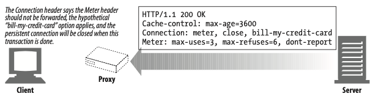

# HTTP 커넥션

- [개요](#개요)
- [1 TCP 커넥션](#1-tcp-커넥션)
  * [1-1 신뢰할 수 있는 데이터 전송 통로 TCP](#1-1-신뢰할-수-있는-데이터-전송-통로-tcp)
  * [1-2 TCP 스트림은 세그먼트로 나뉘어 IP 패킷을 통해 전송된다](#1-2-tcp-스트림은-세그먼트로-나뉘어-ip-패킷을-통해-전송된다)
  * [1-3 TCP 커넥션 유지하기](#1-3-tcp-커넥션-유지하기)
  * [1-4 TCP 소켓 프로그래밍](#1-4-tcp-소켓-프로그래밍)
- [2 TCP의 성능에 대한 고려](#2-tcp의-성능에-대한-고려)
  * [2-1 HTTP 트랜잭션 지연](#2-1-http-트랜잭션-지연)
  * [2-2 TCP 관련 성능 지연](#2-2-tcp-관련-성능-지연)
    + [2-2-1 TCP 커넥션 핸드셰이크 지연](#2-2-1-tcp-커넥션-핸드셰이크-지연)
    + [2-2-2 확인응답 지연](#2-2-2-확인응답-지연)
    + [2-2-3 TCP 느린 시작](#2-2-3-tcp-느린-시작)
    + [2-2-4 네이글 알고리즘과 TCP_NODELAY](#2-2-4-네이글-알고리즘과-tcpnodelay)
    + [2-2-5 TIME_WAIT의 누적과 포트 고갈](#2-2-5-timewait의-누적과-포트-고갈)
- [3 HTTP 커넥션 관리](#3-http-커넥션-관리)
  * [3-1 흔히 잘못 이해하는 Connection 헤더](#3-1-흔히-잘못-이해하는-connection-헤더)
  * [3-2 순차적인 트랜잭션 처리에 의한 지연 ( HTTP 커넥션의 문제 )](#3-2-순차적인-트랜잭션-처리에-의한-지연--http-커넥션의-문제-)
  * [3-3 병렬 커넥션](#3-3-병렬-커넥션)
  * [3-4 지속 커넥션](#3-4-지속-커넥션)
    + [3-4-1 지속 커넥션 vs 병렬 커넥션](#3-4-1-지속-커넥션-vs-병렬-커넥션)
    + [3-4-2 Keep-Alive 커넥션](#3-4-2-keep-alive-커넥션)
  * [3-5 HTTP/1.1의 지속 커넥션](#3-5-http11의-지속-커넥션)
  * [3-6 파이프라인 커넥션](#3-6-파이프라인-커넥션)
  * [3-7 커넥션 끊기](#3-7-커넥션-끊기)
  * [3-8 우아한 커넥션 끊기](#3-8-우아한-커넥션-끊기)

<br>

## 개요

HTTP는 TCP를 이용하는 응용계층중 하나이다.

HTTP커넥션과 그것이 어떻게 사용되는지에 대해 잘 이해해야만 효율적인 HTTP 통신을 할 수 있다.

이번 장은 HTTP 커넥션에 대해서 다룬다.

* HTTP는 어떻게 TCP 커넥션을 사용하는가
* TCP 커넥션의 지연, 병목, 막힘
* 병렬 커넥션, keep-alive 커넥션, 커넥션 파이프라인을 활용한 HTTP의 최적화
* 커넥션 관리를 위해 따라야 할 규칙들


***TCP는 HTTP(응용 프로그램)과 소켓 사이의 인터페이스 역할을 한다.***


## 1 TCP 커넥션

전 세계 모든 HTTP통신은 패킷 교환 네트워크 프로토콜들의 계층화된 집합인 TCP/IP를 통해 이루어진다.

<p align="center"></p>

**중요한 점은 TCP 커넥션을 먼저 만들고 HTTP Request를 보낸다는 것이다.**

<br>

### 1-1 신뢰할 수 있는 데이터 전송 통로 TCP

<p align="center"></p>

* HTTP의 진실
  * ***HTTP 커넥션은 몇몇 사용 규칙을 제외하고는 TCP 커넥션에 불과하다.***
  * 그저 두 개체(클라이언트와 서버)간의 문자열을 주고받고, 서로 약속된 규칙을 통해 읽고 사용하는 것 뿐이다.
* **TCP의 특징**
  * **커넥션이 맺어지면 손실 혹은 손상되거나 순서가 바뀌지 않는다. (안전하다)**

<br>

### 1-2 TCP 스트림은 세그먼트로 나뉘어 IP 패킷을 통해 전송된다

<p align="center"></p>

* 프로토콜 스택

<p align="center"></p>

* TCP 세그먼트의 구성
  * **IP 패킷 헤더**
    * IP 헤더는 발신지와 목적지 IP 주소, 크기, 기타 플래그를 가진다.
  * **TCP 세그먼트**
    * TCP 세그먼트 헤더는 TCP 포트 번호, TCP 제어 플래그를 가지고 있다.
    * 또한, **데이터의 순서와 무결성을 검사하기 위해 사용되는 숫자 값을 포함한다.**
  * **TCP 데이터 조각**
    * **HTTP의 메시지 내용처럼 TCP를 통해 보내고자하는 데이터를 담고 있다.**
* **HTTP는 TCP의 위에서 돌아간다**
  * **HTTP가 메시지를 전송하고자 할 경우, 현재 연결되어 있는 TCP 커넥션을 통해서 메시지 데이터의 내용을 순서대로 보낸다.**
* **TCP의 전송방식**
  * TCP는 IP 패킷 (혹은 IP 데이터그램)이라고 불리는 작은 조각을 통해 데이터를 전송한다.
  * ***TCP는 세그먼트라는 단위로 데이터 스트림을 잘게 나누고, 세그먼트를 IP패킷라고 불리는 봉투에 담아서 인터넷을 통해 데이터를 전달한다.***
  * **이 모든 것은 TCP/IP 소프트웨어에 의해 처리되며, 그 과정은 HTTP 프로그래머에게 보이지 않는다.**

<br>

### 1-3 TCP 커넥션 유지하기

<p align="center"></p>

* **TCP 커넥션**
* **TCP 커넥션은 간단히 말해서 두 컴퓨터간의 네트워크 통로를 만드는 것과 같다. (`Stream`)**
  
* TCP 커넥션 식별

  * ***TCP커넥션은 네 가지 값으로 식별한다.***
  * `<발신지 IP 주소, 발신지 포트, 수신지 IP 주소, 수신지 포트>`
  * 이 네 가지 값으로 **유일한 커넥션**을 생성한다.
  * ***서로 다른 두 개의 TCP 커넥션은 네 가지 주소 구성요소의 값이 모두 같을 수 없다.***

* TCP 커넥션

  * 컴퓨터는 항상 TCP 커넥션을 여러 개 가지고 있다.
  * TCP는 포트 번호를 통해서 이런 여러 개의 커넥션을 유지한다.

* 포트

  * **포트 번호는 회사 직원의 내선전화와 같다.**
  * 회사의 대표 전화번호는 안내 데스크로 연결되고 내선전화는 해당 직원으로 연결되듯이 IP 주소는 해당 컴퓨터에 연결되고 포트 번호는 해당 애플리케이션으로 연결된다.

<br>

### 1-4 TCP 소켓 프로그래밍

<p align="center"><br>소켓 API를 사용해서 HTTP 트랜잭션을 하는 그림</p>

* 소켓(socket)이란?
  * ***네트워크 소켓은 컴퓨터 네트워크를 경유하는 프로세스 간 통신의 종착점(End Point)이다.***
  * 소켓은 프로세스가 네트워크를 통해서 데이터를 주고받으려면 반드시 열어야 하는 창구 같은 것이다.
  * 소켓은 두 프로그램이 네트워크를 통해 서로 통신을 수행할 수 있도록 양쪽에 생성되는 링크의 단자이다.
  * 통신을 위한 일종의 통로
* **소켓의 장점**
  * **소켓을 이용하면 인터넷의 복잡한 하부 구조에 대한 세부적인 지식 없이도 손쉽게 네트워크 프로그램을 개발할 수 있다.**

<p align="center"><br></p>

* 소켓 동작 - 소켓 API
  * **소켓 API를 사용하면, TCP 종단(endpoint) 데이터 구조를 생성하고, 원격 서버의 TCP 종단에 그 종단 데이터 구조를 연결하여 데이터 스트림을 읽고 쓸 수 있다.**
* TCP API
  * **TCP API는 기본적인 네트워크 프로토콜의 핸드쉐이킹을 지원한다.**
  * **TCP 데이터 스트림과 IP 패킷 간의 분할 및 재조립에 대한 모든 세부사항을 외부로부터 숨긴다.**

> 엔드 포인트란? (End Point)
>
> * IP 주소와 포트 번호의 조합을 의미한다.
> * 모든 TCP 연결은 2개의 엔드 포인트로 유일하게 식별되어질 수 있다.

<br>

## 2 TCP의 성능에 대한 고려

HTTP는 TCP의 바로 위 계층이기 때문에 HTTP 트랜잭션의 성능은 그 아래 계층인 TCP 성능에 영향을 받는다.

* ***HTTP는 그저 `String`을 해석할 뿐이다. `String`을 전송하고 수신하는 TCP성능에 따라 HTTP의 성능이 정해진다.(중요)***

### 2-1 HTTP 트랜잭션 지연

HTTP 요청 과정에서 어떤 네트워크 지연이 발생하는지 살펴보자.

<p align="center"></p>

* 해석
  * 트랜잭션을 처리하는 시간(`Process`)은 TCP 커넥션을 설정하고, 요청을 전송하고, 응답 메시지를 보내는 것에 비하면 상당히 짧다는 것을 알 수 있다.
  * ***너무 많은 데이터를 내려받거나 복잡하고 동적인 자원들을 실행하지 않는 한, 대부분의 HTTP 지연은 TCP 네트워크 지연 때문에 발생한다.***
* **지연시키는 원인**
  * DNS
    * URI를 IP로 변환하는데 시간이 꽤 걸릴수도 있다.
  * TCP 커넥션
    * 클라이언트는 TCP 커넥션 요청을 보내고 서버가 커넥션 허가 응답을 회신하기를 기다린다.
    * **커넥션 설정 시간(3 - way handshake)은 새로운 TCP 커넥션에서 항상 발생한다.**
  * 서버 처리 시간
    * 웹 서버가 HTTP 요청을 받은 후 처리하고 응답을 하는데까지의 시간.

<br>

### 2-2 TCP 관련 성능 지연

가장 일반적인 TCP 관련 지연에 대해서 정리했다.

* TCP 커넥션의 핸드셰이크 설정
* 인터넷의 혼잡을 제어하기 위한 TCP의 느린 시작
* 데이터를 한데 모아 한 번에 전송하기 위한 네이글 알고리즘
* TCP의 편승 확인응답을 위한 확인응답 지연 알고리즘
* TIME_WAIT 지연과 포트 고갈

#### 2-2-1 TCP 커넥션 핸드셰이크 지연

<p align="center"></p>

* `3 way handshaking`
  * 어떤 데이터를 전송하든 새로운 TCP 커넥션을 열 때면, TCP 소프트웨어는 커넥션을 맺기 위한 조건을 맞추기 위해 연속으로 IP 패킷을 교환한다.
* 지연 이유
  * ***TCP의 `ACK` 패킷은 HTTP 요청 메시지 전체를 전달할 수 있을 만큼 큰 경우가 많고, 많은 HTTP 서버 응답 메시지는 하나의 IP 패킷에도 담길 수 있다.***
  * ***크기가 작은 HTTP 트랜잭션은 50% 이상의 시간을 TCP를 구성하는 데 쓴다.***
  * ***즉, 작은 데이터의 트랜잭션을 위해 TCP 연결을 해야하는 기회비용이 너무 크다.***

<br>

#### 2-2-2 확인응답 지연

* 확인응답(ACK)이란?
  * **인터넷 자체가 패킷 전송을 완벽히 보장하지는 않기 때문에, TCP는 성공적인 데이터 전송을 위해 자체적인 확인 체계를 가진다.**
  * **각 TCP 세그먼트는 순번과 데이터 물결성 체크섬을 가진다. 각 세그먼트의 수신자는 세그먼트를 온전히 받으면 작은 확인응답 패킷을 송신자에게 반환한다. (3-way handshaking)**
  * 송신자가 특정 시간 안에 확인응답 메시지를 받지 못하면 패킷이 파기되었거나 오류가 있는 것으로 판단하고 데이터를 다시 전송한다.
* 확인응답 편승
  * ***확인응답(ACK)는 그 크기가 작기 때문에, TCP는 같은 방향으로 송출되는 데이터 패킷에 확인응답을 편승시킨다.***
  * TCP는 송출 데이터 패킷과 확인응답을 하나로 묶음으로써 네트워크를 좀 더 효율적으로 사용한다.
* **확인응답 지연이란?**
  * **확인응답 지연은 송출할 확인응답을 특정 시간 동안 버퍼에 저장해 두고, 확인응답을 편승시키기 위한 송출 데이터 패킷을 찾는다.**
  * **만약 일정 시간 안에 송출 데이터 패킷을 찾지 못하면 확인응답은 별도 패킷을 만들어 전송된다.**
  * ***HTTP 특정상 이런 버퍼에 담아두고 기다리는 짧은 시간도 지연이 자주 발생한다고 한다.***

<br>

#### 2-2-3 TCP 느린 시작

<p align="center"><br> 출처 : https://jwprogramming.tistory.com/36</p>

* 느린 시작이란?
  * TCP의 데이터 전송 속도는 TCP 커넥션이 만들어진 지 얼마나 지났는지에 따라 달라질 수 있다.
  * ***TCP 커넥션은 시간이 지나면서 자체적으로 '튜닝'되어서, 처음에는 커넥션의 최대 속도를 제한하고 데이터가 성공적으로 전송됨에 따라서 속도 제한을 높여나간다.***
  * 이렇게 조율하는 것을 TCP 느린 시작이라고 부르며, 이는 인터넷의 급작스러운 부하와 혼잡을 방지하는데 쓰인다.
* ***느린 시작 방법 (혼잡 윈도를 연다)***
  * ***TCP 느린 시작은 TCP가 한 번에 전송할 수 있는 패킷의 수를 제한한다.***
  * ***HTTP 트랜잭션에서 전송할 데이터의 양이 많으면 모든 패킷을 한 번에 전송할 수 없다.***
  * ***하나의 패킷을 보내고 응답을 받으면 2배인 2개의 패킷을 보내는 방식으로 '튜닝'을 한다.***
    * 이를 "혼잡 윈도(window)를 연다"고 한다.
* 해결 방법
  * 이 혼잡제어 기능 때문에, 새로운 커넥션은 이미 어느 정도 데이터를 주고받은 '튜닝'된 커넥션보다 느리다.
  * ***'튜닝'된 커넥션은 더 빠르기 때문에, HTTP에는 이미 존재하는 커넥션을 재사용하는 기능이 있다.***
    * `keep-alive`

<br>

#### 2-2-4 네이글 알고리즘과 TCP_NODELAY

* 네이글(Nagle) 알고리즘이란?
  * **네트워크 효율을 위해서, 패킷을 전송하기 전에 많은 양의 TCP 데이터를 한 개의 덩어리로 합친다.**
  * **네이글 알고리즘은 세그먼트가 최대크기가 되지 않으면 전송을 하지 않는다.**
  * 다만 다른 모든 패킷이 확인응답을 받았을 경우에는 최대 크기보다 작은 패킷의 전송을 허락한다.
* 지연 이유
  * ***크기가 작은 HTTP 메시지는 패킷을 채우지 못하기 때문에, 앞으로 생길지 생기지 않을지 모르는 추가적인 데이터를 기다리며 지연될 것이다.***
  * 네이글 알고리즘은 확인응답 지연과 함께 쓰일 경우 형편없이 동작한다. 네이글 알고리즘은 응답이 도착할 때까지 데이터를 전송을 멈추고 있는 반면, 확인응답 지연은 확인응답을 100~200밀리초 지연시킨다.

<br>

#### 2-2-5 TIME_WAIT의 누적과 포트 고갈

<p align="center"></p>

* TIME_WAIT이란?
  * TCP 커넥션의 종단에서 TCP 커넥션을 끊으면, 종단에서는 커넥션의 IP 주소와 포트 번호를 메모리의 작은 영역에 기록해 놓는다.
  * 이 정보는 같은 주소와 포트 번호를 사용하는 새로운 TCP 커넥션이 일정 시간 동안에는 생성되지 않게 하기 위한 것으로, 보통 세그먼트의 최대 생명주기에 두 배 정로의 시간 동안만 유지된다.
* 역할
  * TIME_WAIT은 이전 커넥션과 관련된 패킷이 그 커넥션과 같은 주소와 포트 번호를 가지는 새로운 커넥션에 삽입되는 문제를 방지한다.
  * ***실제로 TIME_WAIT은 특정 커넥션이 생성되고 닫힌 다음, 그와 같은 IP 주소와 포트 번호를 가지는 커넥션이 특정 시간이내에 또 생성되는 것을 막아준다.***
  * 이렇게 함으로써 일정 시간 패킷의 오동작을 맏아준다.


* TIME_WAIT 지연
  * 이 중에서 세개는 고정되어 있고, 발신지 포트만 변경할 수 있다. (서버는 80번 포트를 주로 사용한다.)
  * 클라이언트가 서버에 접속할 때마다, 유일한 커넥션을 생성하기 위해서 새로운 발신지 포트를 쓴다.
  * 하지만 ***사용할 수 있는 발신지 포트의 수는 제한되어 있고, TIME_WAIT 시간동안 커넥션이 재사용될 수 없으므로, 초당 500개로 커넥션이 제한된다.***
  * 같은 클라이언트로부터 초당 500개의 커넥션을 처리할 수 있는 서버라면 전혀 문제가 없다.


> TIME_WAIT 포트 고갈은 성능 측정 시에 심각한 성능 저하를 발생시키지만, 보통 실제 상황에서는 문제를 발생시키지 않는다.
>
> 하지만 성능 측정을 하는 사람이라면, 결국에는 이 문제에 봉착하게 될 것이고 생각하지도 못했던 성능상의 문제가 생긴 것으로 오해할 수 있으니 특별한 주의가 필요하다.

> 더 자세한 내용은 [여기](https://tech.kakao.com/2016/04/21/closewait-timewait/)에서 확인

<br>

## 3 HTTP 커넥션 관리

이번 장에서는 커넥션을 생성하고 최적화하는 HTTP 기술을 설명한다.

### 3-1 흔히 잘못 이해하는 Connection 헤더

* Connection 헤더란?

  * Connection 일반 헤더는 현재의 전송이 완료된 후 네트워크 접속을 유지할지 말지를 제어한다.
  * 만약 전송된 값이 `keep-alive`면, 연결은 지속되고 끊기지 않으며, 동일한 서버에 대한 후속 요청을 수행할 수 있다.

* Connection헤더는 다음 3가지 종류의 토큰을 전달할 수 있다.

  * **HTTP 헤더 필드 명 - 인접한 애플리케이션간의 커넥션에 해당되는 헤더들을 나열한다.**
  * 임시적인 토큰 값 - 커넥션에 대한 비표준 옵션을 의미한다.
  * close 값 - 커넥션 작업이 완료되면 종료되어야 함을 의미한다.

* **만약 Connection헤더에 HTTP 헤더 필드명이 있다면**

  * **해당 필드들은 현재 커넥션만을 위한 정보이므로 다음 커넥션에 전달하면 안 된다.**
  * **즉, Connection 헤더에 있는 모든 헤더 필드는 메시지를 다른 곳으로 전달하는 시점에 삭제되어야 한다.**

* 예를 들어

  * HTTP는 클라이언트와 서버 사이에 프록시, 캐시 같은 중재자가 놓이는 것을 허락한다. 하지만 때로는 인접한 HTTP 애플리케이션끼리의 커넥션만 적용될 옵션을 지정해야할 때가 있다.
    * 예를 들어, '클라이언트 - 프록시 - 서버' 구조에서 '클라이언트 - 프록시' 간의 커넥션에만 적용되는 옵션을 설정해야되는 경우
  * **HTTP의 Connection 헤더가 대표적으로 다음번 커넥션에는 영향을 끼치지 않고 현재 커넥션에만 영향을 줄 수 있는 옵션 설정이 가능하다.**
  * 즉, **Connection 헤더에 명시된 헤더들이 전달되는 것을 방지하는 것이다.**

* hop-by-hop 헤더

  * Connection과 같은 헤더를 hop-by-hop 헤더라고 부른다.
  * 이는 오직 한 개의 전송 링크에만 적용되며 다음 서버로 전달되어서는 안된다.

* 예시

  <p align="center"><br>Connection 헤더는 Meter 헤더를 다른 커넥션으로 전달하면 안 되고,<br> 'bill-my-credit-card' 옵션을 적용할 것이며 이 트랜잭션이 끝나면 커넥션이 끊길 것이라고 말한다.</p>

  * **프록시는 송신자의 Connection 헤더 (meter, close, bill-my-credit-card)에 있는 모든 요청을 적용한다.**
  * **다음 기기(Client)에는 Connection 헤더와 헤더에 기술된 Meter 헤더를 삭제하여 message를 전달한다.**

<br>

### 3-2 순차적인 트랜잭션 처리에 의한 지연 ( HTTP 커넥션의 문제 )

예를 들어 3개의 이미지가 있는 웹페이지의 경우, HTML 파일과 3개의 이미지에 해당하는 총 네 번의 트랜잭션을 생성해야 한다.

<p align="center"><br>네 개의 트랜잭션(순차)</p>

* 문제점
  * 트랜잭션마다 새로운 커넥션이 만들어지고 끊어지면서 위에서 살펴본 3 way handshake 지연과 TCP slow start 문제가 발생하게 된다.
  * 또한, 첫 번째 객체를 내려받는 동안 이후의 객체들은 모두 정지 상태이므로 사용자 경험도 매우 나쁘다.

* 이 문제를 해결하는 방법은 다음과 같다.
  * 병렬 커넥션 - 여러 개의 TCP 커넥션을 통한 동시 HTTP 요청
  * 지속 커넥션 - 커넥션을 맺고 끊는 데서 발생하는 지연을 제거하기 위한 TCP 커넥션의 재활용
  * 파이프라인 커넥션 - 공유 TCP 커넥션을 통한 병렬 HTTP 요청
  * 다중 커넥션 - 요청과 응답들에 대한 중재 (실험적인 기술)

<br>

### 3-3 병렬 커넥션

<p align="center"><br> 웹페이지의 컴포넌트들은 각각의 HTTP 커넥션에서 처리된다</p>

* 병렬 커넥션이란?
  * HTTP는 클라이언트가 여러 개의 커넥션을 맺음으로써 여러 개의 HTTP 트랜잭션을 병렬로 처리할 수 있다.

<p align="center"><br> 네 개의 트랜잭션 (병렬)</p>

* 병렬 커넥션은 페이지를 더 빠르게 내려받는다
  * 단일 커넥션의 대역폭 제한과 커넥션이 동작하지 않고 있는 시간을 활용하면 객체가 여러 개 있는 웹페이지를 더 빠르게 내려받을 수 있다.
  * 예를 들어, HTML 페이지를 먼저 내려받고 남은 이미지들을 병렬로 내려받아 커넥션 지연이 겹쳐짐으로써 총 지연시간을 줄일 수 있다.
* 병렬 커넥션이 항상 더 빠르지는 않다
  * **클라이언트의 네트워크 대역폭이 좁을 때** 병렬로 내려받을 경우 제한된 대역폭 내에서 각 객체를 전송받는 것은 느리기 때문에 성능상의 장점은 거의 없어진다.
  * 또한 **다수의 커넥션은 메모리를 많이 소모하고 자체적인 성능 문제를 발생시킨다.** 복잡한 웹페이지는 수십 개에서 수 백 개의 객체를 포함한다. 많은 사용자가 사용하므로 수 백개의 커넥션을 허용하는 경우는 드물다.
  * **브라우저는 실제로 병렬 커넥션을 사용하긴 하지만 적은 수 (대부분 4개)의 병렬 커넥션만을 허용한다.**
* 병렬 커넥션은 더 빠르게 '느껴질 수'있다.
  * 병렬 커넥션이 페이지를 항상 더 빠르게 로드하지는 않는다.
  * 다만, 화면에 여러 개의 객체가 동시에 보이면서 내려받고 있는 상황을 볼 수 있기 때문에 사용자는 더 빠르게 내려받고 있는 것처럼 느낄 수 있다.

<br>

### 3-4 지속 커넥션

* 사이트 지역성(site locality)란?
  * 웹 클라이언트는 보통 같은 사이트에 여러 개의 커넥션을 맺는다. (HTML, 이미지, 하이퍼링크 등등)
  * 이러한 속성을 사이트 지역성이라 부른다.

<p align="center"><br> 네 개의 트랜잭션(연속 vs 지속)</p>

* 지속 커넥션이란?
  * 처리가 완료된 후에도 계속 연결된 상태로 있는 TCP 커넥션을 지속 커넥션이라 부른다.
  * HTTP/1.1을 지원하는 기기는 모두 지원하며, 처리가 완료된 후에도 TCP 커넥션을 유지하여 HTTP 요청을 재사용할 수 있다.
* 지속 커넥션의 장점
  * 이미 맺어져 있는 지속 커넥션을 재사용함으로써, 커넥션을 맺기 위한 준비작업에 따르는 시간을 절약할 수 있다.
  * 게다가 이미 맺어져 있는 커넥션은 TCP의 느린 시작으로 인한 지연을 피함으로써 더 빠르게 데이터를 전송할 수 있다.

<br>

#### 3-4-1 지속 커넥션 vs 병렬 커넥션

* **병렬 커넥션의 단점**
  * 각 트랜잭션마다 새로운 커넥션을 맺고 끊기 때문에 시간과 대역폭이 소요된다.
  * 각각의 새로운 커넥션은 TCP 느린 시작 때문에 성능이 떨어진다.
  * 실제로 연결할 수 있는 병렬 커넥션의 수에는 제한이 있다.
* **지속 커넥션은 병렬 커넥션의 단점을 해결할 수 있다. (지속 커넥션의 장점)**
  * 커넥션을 맺기 위한 사전 작업과 지연을 줄여준다.
  * 튜닝된 커넥션을 유지하므로 느린 시작 문제를 해결한다.
  * 커넥션의 수를 줄여준다.
* 하지만, **지속 커넥션을 잘못 관리할 경우, 문제가 발생한다.**
  * **지속 커넥션을 잘못 관리하면, 계속 연결된 상태로 있는 수많은 커넥션이 쌓이게 된다.**
  * 이는 로컬의 리소스 그리고 원격의 클라이언트와 서버의 리소스에 불필요한 소모를 발생시킨다.
* **지속 커넥션과 병렬 커넥션을 함께 사용할때 가장 효과적이다.**
  * 오늘날 많은 애플리케이션은 적은 수의 병렬 커넥션만을 맺고 그것을 유지한다.

<br>

#### 3-4-2 Keep-Alive 커넥션

> HTTP/1.1부터 keep-alive는 명세에서 빠졌지만, 오늘날 브라우저와 서버에서 아직도 널리 사용되고 있다.

* Keep-Alive란?
  * HTTP/1.0 브라우저와 서버들부터 지원하기 시작한 지속 커넥션이다.

<p align="center"><br>keep-alive 트랜잭션 헤더 핸드셰이크</p>

* Keep-Alive 동작

  * keep-alive 커넥션을 구현한 클라이언트는 커넥션을 유지하기 위해서 요청에 `Connection:Keep-Alive` 헤더를 포함시킨다.
  * 이 요청을 받은 서버는 그 다음 요청도 이 커넥션을 통해 받고자 한다면, 응답 메시지에 같은 헤더를 포함시켜 응답한다.
  * 만약 응답에 keep-alive 헤더가 없다면, 클라이언트는 서버가 keep-alive를 지원하지 않으며, 응답 메시지가 전송되고 나면 서버 커넥션을 끊을 것이라 추정한다.

* Keep-Alive 옵션

  ```http
  Connection: Keep-Alive
  Keep-Alive: max=5, timeout=120
  ```

  * timeout : 커넥션이 얼마간 유지될 것인지를 의미한다. (이대로 동작한다는 보장은 없다)
  * max : 커넥션이 몇 개의 HTTP 트랜잭션을 처리할 때까지 유지될 것인지를 의미한다.

* Keep-Alive 커넥션 제한과 규칙

  * Keep-Alive는 HTTP/1.0에서는 기본적으로 사용되지 않는다. 사용하려면 클라이언트 요청 헤더에 추가해야한다.
  * 커넥션을 계속 유지하려면 모든 메시지에 Keep-Alive 헤더를 포함해야한다. 아니면 요청을 처리후 끊는다.
  * 엔터티 본문의 길이를 알 수 있어야 커넥션 유지가 가능하다.
    * Content-Length값이 정확해야 한다는 의미이다. 트랜잭션이 끝나는 시점에 기존 메시지의 끝과 새로운 메시지의 시작점을 정확히 알 수 없기 때문이다.
  * 프록시와 게이트웨이는 message를 전달하거나 캐시에 넣기 전에 Connection에 명시된 모든 헤더들과 Connection 헤더를 제거해야 한다. (hop-by-hop)
  * keep-alive 커넥션은 Connection 헤더를 인식하지 못하는 프록시 서버와는 맺어지면 안 된다.
    * Dumb(멍청한) 프록시로 인해 발생할 문제를 예방하기 위한 것이지만, 현실적으로 그것이 쉽진 않다.
  * 기술적으로 HTTP/1.0를 따르는 기기루부터 받는 모든 Connection 헤더 필드는 무시해야 한다.
    * 오래된 프록시 서버로부터 실수로 전달될 수 있기 때문이다.
  * 클라이언트는 응답 전체를 받기 전에 커넥션이 끊어질 경우 요청을 다시 보낼 준비를 해야한다.

* Keep-Alive와 멍청한(dump) 프록시

  * dump 프록시란

    * Connection 헤더를 이해하지 못해서 해당 헤더들을 삭제하지 않고 요청 그대로를 다음 프록시에 전달하는 프록시를 의미한다.

    <p align="center">keep-alive는 Connection 헤더를 지원하지 않는 프록시(dump Proxy)와는 상호작용하지 않는다.</p>

  1. 클라이언트가 proxy에 Connection: Keep-Alive를 전달.
  2. Proxy가 Connection 헤더를 삭제하지 않고 서버에 전달.
  3. 서버는 proxy와 커넥션을 유지하고 커넥션을 끊지 않는다.
  4. 서버가 proxy에 Connection: Keep-Alive가 포함된 response를 전달. 하지만 proxy는 Connection: Keep-Alive헤더를 이해하지 못하고 서버로부터의 커넥션이 끊어지길 기다린다.
  5. Proxy가 클라이언트에 Connection: Keep-Alive를 전달.
  6. 클라이언트가 다음 요청을 보내면, proxy는 서버와의 커넥션 단절을 기다리고 있기 때문에 클라이언트의 요청이 무시된다.

> **이와 같이 홉별 헤더들은 전달하거나 캐시하면 안된다.**

<br>

### 3-5 HTTP/1.1의 지속 커넥션

HTTP/1.1에서는 Keep-Alive를 지원하지 않지만 더욱 개선된 지속 커넥션을 제공한다.

이는 기본적으로 활성화되어있고 커넥션을 끊으려면 message에 `Connection: close` 헤더를 포함하면 된다.

* 지속 커넥션 제한과 규칙
  * 클라이언트가 요청 헤더에 close를 명시했다면, 클라이언트는 그 커넥션으로 추가 요청을 보낼 수 없다.
  * 커넥션 상의 모든 message가 자신의 정확한 길이 정보를 가지고 있어야 커넥션의 지속이 가능하다.
  * 커넥션 헤더의 값과 상관없이 언제든 커넥션을 끊을 수 있다. 서버는 커넥션을 끊기 전에 적어도 한개의 요청에 대한 응답을 보내야한다.
  * 커넥션이 중간에 끊어지더라도 커넥션을 복구할 수 있어야 한다.
  * 클라이언트는 전체 응답을 받기전에 커넥션이 끊어지면 요청을 다시 보낼 준비를 해야한다
  * 사용자는 서버의 부하를 덜기 위해 최소한의 커넥션(2개)만을 유지해야 한다.

<br>

### 3-6 파이프라인 커넥션

* HTTP/1.1은 지속 커넥션을 통해 요청을 pipelining할 수 있다.
* 파이프라인 커넥션이란
  * 요청에 대한 응답이 오기 전에 여러개의 요청을 queue에 쌓아 순차적으로 요청하고 그에 대한 응답을 받는 방법이다.
  * 이는 대기 시간이 긴 네트워크 상황에서 네트워크상의 왕복으로 인한 시간을 줄여서 성능을 높여준다.

<p align="center"><br>네 개의 트랜잭션(파이프라인 커넥션)</p>

* 파이프라인 커넥션의 제약사항
  * 클라이언트는 지속 커넥션이 확인되기 전까지 파이프라인을 만들면 안된다.
  * 클라이언트는 커넥션이 끊어지더라도 완료되지 않은 요청이 파이프라인에 있으면 다시 보낼 준비를 해야한다.
  * POST같이 연산이 한 번 일어날때마다 결과가 바뀔수도 있는 요청은 파이프라인을 사용하면 안된다. (멱등성)

<br>

### 3-7 커넥션 끊기

커넥션 관리(특히 언제 어떻게 커넥션을 끊는가)에는 명확한 기준이 없다.

#### 3-7-1 마음대로 끊기

어떠한 클라이언트, 서버, 프록시라도 언제든지 TCP 커넥션을 끊을 수 있다.

예를 들어, 지속 커넥션의 경우에 일정 시간동안 요청이 없는 경우 서버는 그 커넥션을 끊는 것이 가능하다.

하지만 서버는 커넥션을 끊는 시점에 클라이언트가 데이터를 보내지 않을 것이라는 확신을 할 수 없고, 커넥션을 끊는 순간 클라이언트가 요청을 보내게 되면 문제가 생긴다.

<br>

#### 3-7-2 Content-Length와 truncation

응답은 본문의 정확한 크기 값을 가지는 Content-Length를 가지고있어야한다.

클라이언트가 응답 헤더에 명시된 length와 엔터티 본문의 길이가 다르거나, Content-Length 헤더 자체가 존재하지 않으면 서버에 Content-Length를 질의해야 한다.

<br>

#### 3-7-3 커넥션 끊기의 허용과 재시도, 멱등성

커넥션은 에러가 없더라도 언제든 끊을 수 있다.

HTTP 애플리케이션은 예상치 못하게 커넥션이 끊어졌을 때에 적절히 대응할 수 있는 준비가 되어 있어야한다.

예를 들어, 트랜잭션 수행중 커넥션이 끊기면 클라이언트는 커넥션을 다시 맺고 한번 더 트랜잭션을 시도해야한다.

GET, HEAD, PUT, DELETE등 멱등성을 만족하는 메서드들은 반복요청을 자동으로 처리하거나 파이프 라인을 이용해도 상관 없지만, POST의 경우 자동으로 요청을 재전송하면 안된다.

<br>

### 3-8 우아한 커넥션 끊기

TCP 커넥션은 양방향이다.

<p align="center"><br>TCP 커넥션은 양방향이다</p>

TCP 커넥션의 양쪽에는 데이터를 읽거나 쓰기 위한 입력 큐와 출력 큐가 있다.

한쪽 출력 큐에 있는 데이터는 다른 쪽의 입력 큐에 보내질 것이다.

#### 3-8-1 전체 끊기와 절반 끊기

<p align="center"><br>전체 끊기와 절반 끊기</p>

* 전체 끊기 - `close()`
  * TCP 커넥션에서 입력 채널과 출력 채널을 **동시에 끊는 방식**
* 절반 끊기 - `shutdown()`
  * TCP 커넥션에서 입력 채널과 출력 채널중 **하나만 끊는 방식**

> 특히 서버의 출력만을 끊는 것을 우아한 커넥션 끊기라고 부른다.

<br>

#### 3-8-2 TCP 끊기와 리셋 에러

단순한 HTTP 애플리케이션은 전체 끊기만을 사용할 수 있다.

**다만 파이프라인 지속 커넥션을 사용할 때, 기기들에 예상치 못한 쓰기 에러를 발생하는 것을 예방하기 위해 '절반 끊기'를 사용해야한다.**

**보통은 커넥션의 출력 채널을 끊는 것이 안전하다.** 커넥션의 반대편에 있는 기기는 모든 데이터를 버퍼로부터 읽고 나서 데이터 전송이 끝남과 동시에 커넥션을 끊었다는 것을 알게 될 것이다.

<p align="center"><br>연결이 끊긴 커넥션에 데이터가 도착하게 되면 'connection reset by peer' 에러를 낸다.</p>

**만약 반대편에서 더는 데이터를 보내지 않을 것이란 확신이 없는 이상 입력채널을 끊게 되면 문제가 발생한다.** 클라이언트에서 끊긴 입력 채널에 데이터를 전송하면 서버에서 'connection reset by peer' 에러를 발생시키는데, 대부분의 OS에서는 상당히 중요한 에러로 취급한다. 이 에러가 발생되면 버퍼에 저장된 아직 읽히지 않은 모든 요청과 응답 데이터를 삭제하기 때문에 파이프라인 커넥션에서는 더욱 악화된다.

<br>

#### 3-8-3 우아하게 끊기

**위의 문제를 회피하기 위해서는 애플리케이션이 출력 채널을 먼저 끊고, 다른쪽 기기의 출력 채널이 끊어지기를 기다려야한다.**

반대편에서 출력 채널을 끊으면 커넥션은 온전히 종료된다.

하지만, 양단의 기기가 이 기능을 구현했다는 보장이 없기 때문에 출력 채널을 끊은 후에도 입력 채널에 대한 상태 검사를 주기적으로 해주어야한다.