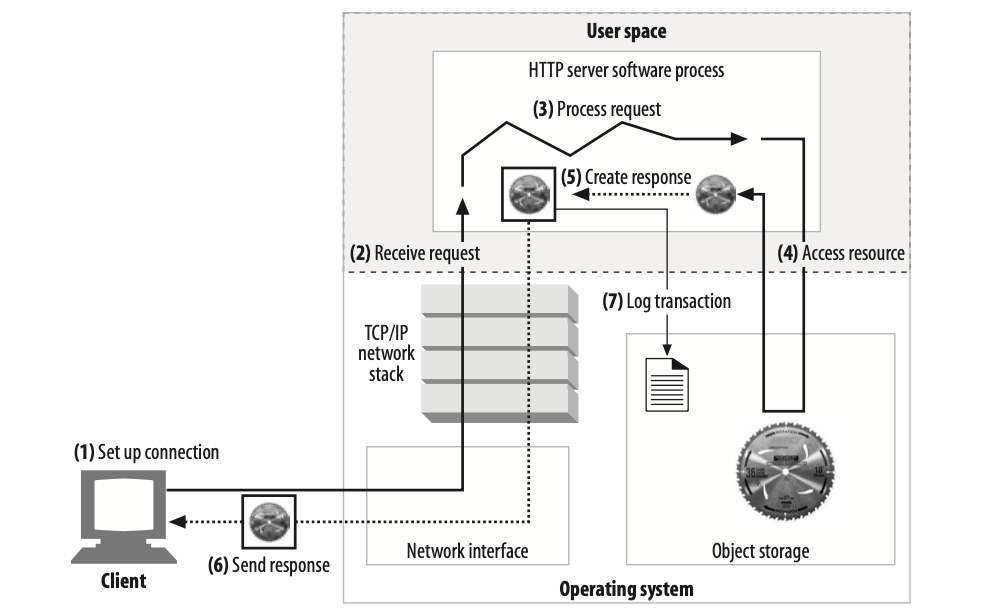
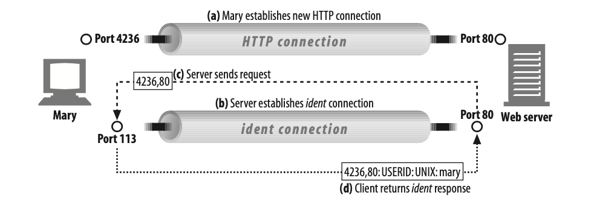
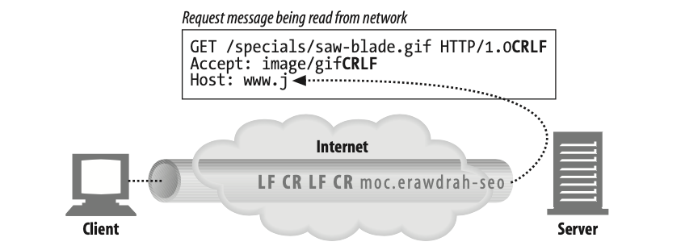
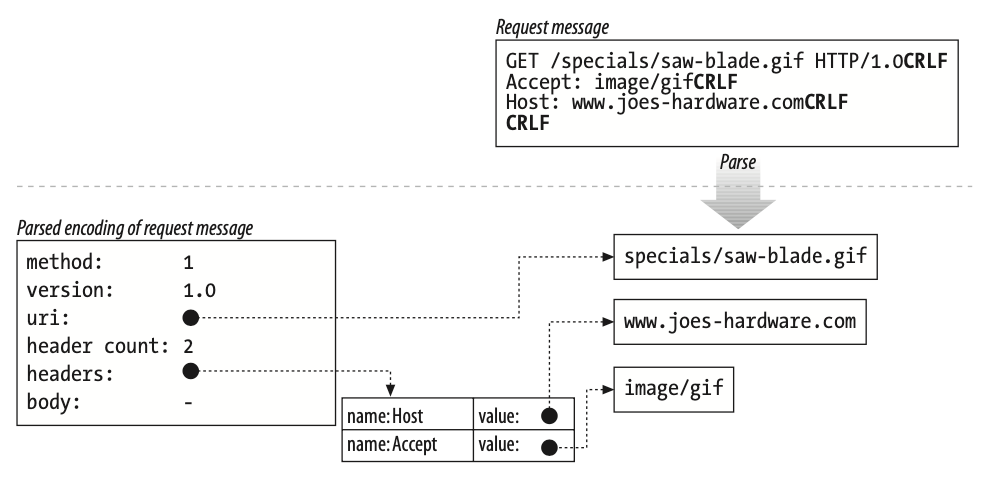
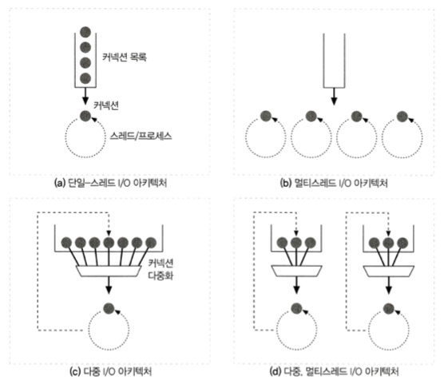
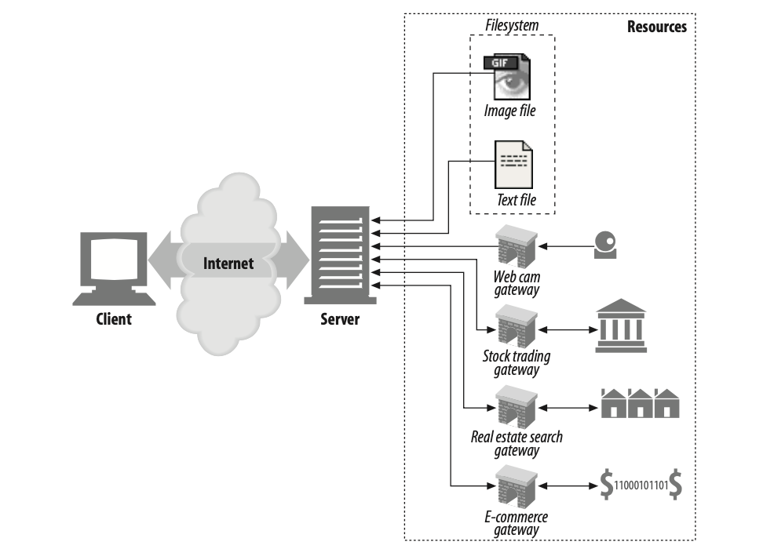
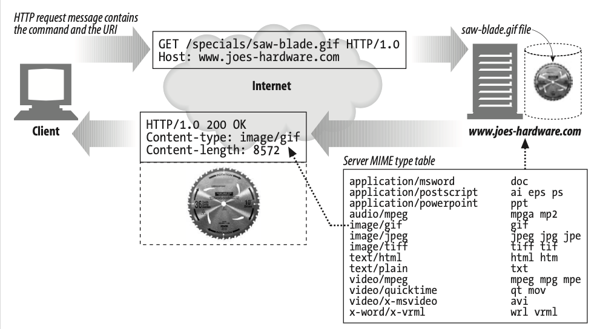

# 웹 서버

- [웹 서버](#웹-서버)
  - [1 웹 서버란](#1-웹-서버란)
    - [1-1 웹 서버의 의미](#1-1-웹-서버의-의미)
    - [1-2 웹 서버 종류](#1-2-웹-서버-종류)
  - [2 진짜 웹 서버가 하는 일](#2-진짜-웹-서버가-하는-일)
    - [2-1 클라이언트 커넥션 수락 (1단계)](#2-1-클라이언트-커넥션-수락-1단계)
      - [2-1-1 새 커넥션 다루기](#2-1-1-새-커넥션-다루기)
      - [2-2-2 클라이언트 호스트 명 식별](#2-2-2-클라이언트-호스트-명-식별)
      - [2-2-3 ident를 통해 클라이언트 사용자 알아내기](#2-2-3-ident를-통해-클라이언트-사용자-알아내기)
    - [2-2 요청 메시지 수신 (2단계)](#2-2-요청-메시지-수신-2단계)
      - [2-2-1 메시지 파싱](#2-2-1-메시지-파싱)
      - [2-2-2 메시지의 내부 표현](#2-2-2-메시지의-내부-표현)
      - [2-2-3 커넥션 입출력 처리 아키텍처 (중요)](#2-2-3-커넥션-입출력-처리-아키텍처-중요)
    - [2-3 요청 처리 (3단계)](#2-3-요청-처리-3단계)
    - [2-4 리소스의 매핑과 접근 (4단계)](#2-4-리소스의-매핑과-접근-4단계)
      - [2-4-1 Docroot](#2-4-1-docroot)
      - [2-4-2 디렉토리 목록](#2-4-2-디렉토리-목록)
      - [2-4-3 동적 콘텐츠 리소스 매핑](#2-4-3-동적-콘텐츠-리소스-매핑)
    - [2-5 응답 만들기 (5단계)](#2-5-응답-만들기-5단계)
      - [2-5-1 응답 엔터티](#2-5-1-응답-엔터티)
      - [2-5-2 MIME 타입 결정하기](#2-5-2-mime-타입-결정하기)
      - [2-5-3 리다이렉션](#2-5-3-리다이렉션)
    - [2-6 응답 보내기 (6단계)](#2-6-응답-보내기-6단계)
    - [2-7 로깅 (7단계)](#2-7-로깅-7단계)

<br>

## 1 웹 서버란

<br>

### 1-1 웹 서버의 의미

* '웹 서버' 용어의 의미
  * '웹 서버'는 웹 서버 소프트웨어(WAS)와 웹페이지 제공에 특화된 장비(Apache, NginX...) 양쪽 모두를 가리킨다.
* 웹 서버의 역할
  * 웹 서버는 HTTP 요청을 처리하고 응답을 제공한다.
* **웹 서버 구현**
  * 웹 서버는 HTTP 및 그와 관련된 TCP 처리를 구현한 것이다.
  * **웹 서버는 HTTP 프로토콜을 구현하고, 웹 리소스를 관리하고, 웹 서버 관리 기능을 제공한다.**
  * **웹 서버는 TCP 커넥션 관리에 대한 책임을 운영체제와 나눠 갖는다.**
    * 운영체제는 컴퓨터 시스템의 하드웨어를 관리하고 TCP/IP 네트워크 지원, 웹 리소스를 유지하기 위한 파일 시스템, 현재 연산 활동을 제어하기 위한 프로세스 관리를 제공한다.

<br>

### 1-2 웹 서버 종류

* 다목적 소프트웨어 웹 서버
  * 다목적 소프트웨어 웹 서버는 네트워크에 연결된 표준 컴퓨터 시스템에서 동작한다.
  * Apache, nginx ...
* 임베디드 웹 서버
  * 임베디드 웹 서버는 일반 소비자용 제품에 내장될 목적으로 만들어진 작은 웹 서버이다.
  * 프린터, 가전제품 ...

<br>

## 2 진짜 웹 서버가 하는 일

상용 웹 서버는 굉장히 복잡하게 되어있다.

<p align="center"><br>기본 웹 서버 요청의 단계<br>출처: HTTP 완벽가이드</p>

1. 커넥션을 맺는다 - 클라이언트의 접속을 받아들이거나, 원치 않는 클라이언트라면 닫는다.
2. 요청을 받는다 - HTTP 요청 메시지를 네트워크로부터 읽어 들인다.
3. 요청을 처리한다 - 요청 메시지를 해석하고 행동을 취한다.
4. 리소스에 접근한다 - 메시지에서 지정한 리소스에 접근한다.
5. 응답을 만든다 - 올바른 헤더를 포함한 HTTP 응답 메시지를 생성한다.
6. 응답을 보낸다 - 응답을 클라이언트에게 돌려준다.
7. 트랜잭션을 로그로 남긴다 - 로그파일에 트랜잭션 완료에 대한 기록을 남긴다.

<br>

### 2-1 클라이언트 커넥션 수락 (1단계)

1단계는 클라이언트 커넥션 수락이다.

**웹 서버는 클라이언트의 커넥션 요청을 받아 수락하거나 거절할 수 있다.**

**그러기 위해서는 클라이언트 호스트 명등을 알아내야한다.**

<br>

#### 2-1-1 새 커넥션 다루기

* **TCP 커넥션 -> 요청자 신원 식별**
  * 클라이언트가 웹 서버에 TCP 커넥션을 요청하면, **웹 서버는 그 커넥션을 맺고 TCP 커넥션에서 IP 주소를 추출하여 커넥션 맞은편에 어떤 클라이언트가 있는지 확인한다.**
* TCP 커넥션이 맺어지면 -> 커넥션 목록에 추가
  * 일단 새 커넥션이 맺어지고 받아들여지면, 서버는 새 커넥션을 커넥션 목록에 추가하고 커넥션에서 오가는 데이터를 지켜보기 위한 준비를 한다.
* 웹 서버는 어떤 커넥션이든 마음대로 거절하거나 즉시 닫을 수 있다.
  * IP 주소나 호스트 명이 인가되지 않았거나 악의적이라고 판단하면 커넥션을 닫는다.

<br>

#### 2-2-2 클라이언트 호스트 명 식별

* 웹 서버는 요청에 대한 호스트 명을 식별하기 위해 여러 방법을 사용한다.
* 역뱡향 DNS
  * 대부분의 웹 서버는 역방향 DNS를 사용해서 클라이언트 IP 주소를 호스트 명으로 변환하도록 설정되어 있다.
  * 이와 같은 호스트 명 룩업은 꽤 시간이 많이 걸릴 수 있어 웹 트랜잭션을 느려지게 할 수 있다. 대용량 웹 서버는 호스트 명 분석을 꺼두거나 특정 콘텐츠에 대해서만 켜놓는다.
* 예시 (Apache)
  * 아파치에서는 HostnameLookups 설정 지시자로 호스트 명 룩업을 켤 수 있다.
    ```xml
    HostnameLookups off
    <Files ~ "/.(html|htm|cgi)$">
      HostnameLookups on
    </Files>
    ```

<br>

#### 2-2-3 ident를 통해 클라이언트 사용자 알아내기
* ident란?
  * 클라이언트를 식별하기 위한 또다른 프로토콜.
  * ident 프로토콜은 서버에게 어떤 사용자 이름이 HTTP 커넥션을 초기화했는지 찾아낼 수 있게 해준다.
  * telnet, sendmail등에서 사용된다고 한다.
* ident 동작 방식
  <p align="center"><br>출처: HTTP 완벽가이드</p>

  * (a) 클라이언트는 HTTP 커넥션을 연다.
  * (b, c) 서버는 그 후 자신의 커넥션을 클라이언트의 ident 서버 포트(113)을 향해 열고, 새 커넥션에 대응하는 사용자 이름을 묻는 요청을 보낸다.
  * (d) 클라이언트는 ident 응답을 반환한다.
* ident를 자주 사용하는가?
  * ident는 조직 내부에서는 잘 사용할 수 있지만, 공공 인터넷에서는 다음을 포함한 여러 이유로 잘 동작하지 않는다.
  * 우선 HTTP 트랜잭션을 유의미하게 지연시킨다.
  * 또한, 방화벽이 ident 트래픽을 막는 경우도 많으며, 안전하지 않고 조작하기 쉽기 때문에 자주 사용되진 않는다고 한다.

<br>

### 2-2 요청 메시지 수신 (2단계)
**커넥션에 데이터가 도착하면, 웹 서버는 네트워크 커넥션에서 그 데이터를 읽어 들이고 파싱하여 요청 메시지를 구성한다.**

<br>

#### 2-2-1 메시지 파싱
<p align="center"><br>커넥션에서 요청 메시지를 읽고있는 과정<br>출처: HTTP 완벽가이드</p>

* 요청 메시지를 파싱할 때, 웹 서버는 다음과 같은 일을 한다.
  * 요청줄을 파싱하여 요청 메서드, 지정된 리소스의 식별자(URI), 버전 번호를 찾는다.
  * 메시지 헤더들을 읽는다. 각 메시지 헤더는 CRLF(캐리지 리턴 줄바꿈)으로 끝난다.
  * 헤더의 끝을 의미하는 CRLF로 끝나는 빈 줄을 찾아낸다. (존재한다면)
  * 요청 본문이 있다면, 읽어 들인다 (길이는 Content-Length 헤더로 정의한다)
* 메시지 파싱의 특징
  * 요청 메시지를 파싱할 때, 웹 서버는 입력 데이터를 네트워크로부터 불규칙적으로 받는다.
  * 네트워크 커넥션이 언제라도 무효화될 수 있기 때문에, 웹 서버는 파싱해서 이해하는 것이 가능한 수준의 분량을 확보할 때까지 데이터를 네트워크로부터 읽어서 메시지 일부분을 메모리에 임시로 저장해둘 필요가 있다.

<br>

#### 2-2-2 메시지의 내부 표현
<p align="center"><br>요청 메시지를 편리한 내부 표현 형태로 파싱<br>출처: HTTP 완벽가이드</p>
웹 서버는 보통 요청 메시지를 쉽게 다룰 수 있도록 내부의 자료 구조에 저장한다.

속도가 빠른 룩업 테이블 (Hash)에 저장해서 신속하게 접근할 수 있도록 한다.

<br>

#### 2-2-3 커넥션 입출력 처리 아키텍처 (중요)
<p align="center"><br>출처: HTTP 완벽가이드</p>

* 단일 스레드 웹 서버 (Single-Thread)
  * 개념
    * 단인 스레드 웹 서버는 한 번에 하나씩 요청을 처리한다.
    * 트랜잭션이 완료되면, 다음 커넥션이 처리된다.
  * 단점
    * 구현하기 간단하지만 처리 도중에 모든 다른 커넥션이 무시된다. (블록)
    * 이는 성능에 심각하므로, 오직 로드가 적은 서버에만 적당하다.
* 멀티프로세스와 멀티스레드 웹 서버 (Multithreaded)
  * 개념
    * 여러 요청을 동시에 처리하기 위해 여러 개의 프로세스 혹은 고효율 스레드를 할당한다.
    * 스레드/프로세스는 필요할때 마다 만들어질 수도 있고 미리 만들어질 수도 있다.
  * 단점
    * 매 커넥션마다 스레드/프로세스 하나를 할당하면, 수많은 동시 커넥션을 처리할 때 너무 많은 메모리와 리소스를 소비한다.
    * 컨텍스트 스위칭 비용도 크다.
    * 많은 멀티스레드 웹 서비스가 스레드/프로세스의 최대 개수에 제한을 걸어 사용한다. (스레드 풀)
* 다중 서버 (Multiplexed)
  * Multiplexed의 의미
    * 물리적 장치의 효율성을 높이기 위해서 최소한의 물리적인 요소만 사용해서 최대한의 데이터를 전달하기 위해 사용되는 기술
    * 실제로 많은 웹 서버가 채택하고 있는 방식이다.
  * 개념
    * 모든 커넥션은 동시에 활동을 감시당한다. 
    * 커넥션의 상태가 바뀌면 (데이터 사용 혹은 에러), 그 커넥션에 대해 작은 양의 처리가 수행된다.
    * 그 처리가 완료되면, 커넥션은 다음번 상태 변경을 위해 열린 커넥션 목록으로 돌아간다.
  * 장점
    * 어떤 커넥션에 대해 작업을 수행하는 것은 그 커넥션에 실제로 해야 할 일이 있을 때뿐이다.
    * 스레드와 프로세스는 유휴 상태의 커넥션에 매여 기다리느라 리소스를 낭비하지 않는다.
* 다중 멀티스레드 (Multiplexed, multithreaded)
  * 개념
    * CPU 여러 개의 이점을 살리기 위해 멀티스레딩과 멀티플렉싱을 결합한 형태이다.
    * 여러 개의 스레드는 각각 열려있는 커넥션을 감시하고 각 커넥션에 대해 조금씩 작업을 수행한다.

<br>

### 2-3 요청 처리 (3단계)
웹 서버가 요청을 받으면, 서버는 요청으로부터 메서드, 리소스, 헤더, 본문을 얻어내어 처리한다.

이와 관련된 내용은 뒤에서 더 자세히 다룬다.

<br>

### 2-4 리소스의 매핑과 접근 (4단계)
웹 서버는 리소스 서버다.

그들은 미리 만들어진 콘텐츠(정적)를 제공하며, 서버 위에서 동작하는 리소스 생성 애플리케이션(WAS)을 통해 만들어진 동적 컨텐츠도 제공한다.

웹 서버가 클라이언트에 콘텐츠를 전달하려면, 우선 요청 메시지의 URI에 대응하는 알맞은 콘텐츠를 찾아서 제공해야한다.

<br>

#### 2-4-1 Docroot
일반적으로 웹 서버 파일 시스템의 특별한 폴더를 웹 콘텐츠를 위해 예약해준다.

이를 docroot라고 한다.

아차피의 경우 `httpd.conf` 설정 파일에 DocumentRoot 줄을 추가하여 문서 루트를 설정할 수 있다.

<br>

**가상 호스팅된 docroot**


가상 호스팅 웹 서버는 각 사이트에 그들만의 분리된 문서 루트를 주는 방법으로 한 서버에서 여러 개의 웹 사이트를 호스팅한다.

서버는 두 웹 사이트를 HTTP Host 헤더나 서로 다른 IP 구조를 이용해 구분할 수 있다.

아파치에서는 `VirtualHost` 블록으로 설정할 수 있다.
```conf
<VirtualHost www.joes-hardware.com>
  ServerName www.joes-hardware.com
  DocumentRoot /docs/joe
  TransferLog /logs/joe.access_log
  ErrorLog /logs/joe.error_log
</VirtualHost>

<VirtualHost www.marys-antiques.com>
  ServerName www.marys-antiques.com
  DocumentRoot /docs/mary
  TransferLog /logs/mary.access_log
  ErrorLog /logs/mary.error_log
</VirtualHost>
```

<br>

#### 2-4-2 디렉토리 목록
웹 서버는 경로가 아닌 디렉토리 URL에 대한 요청을 받을 수 있다.

대부분 디렉토리 URL을 요청했을 때 다음과 같이 행동을 설정할 수 있다.

* 에러를 반환한다.
* 디렉토리 대신 특별한 '색인 파일'을 반환한다.
* 디렉토리를 탐색해서 그 내용을 담는 HTML 페이지를 반환한다.

대부분의 웹 서버는 요청한 URL에 대응되는 디렉토리 안에서 `index.html` 파일을 찾는다.

<br>

#### 2-4-3 동적 콘텐츠 리소스 매핑
웹 서버는 URI를 동적 리소스에 매핑할 수도 있다.

즉, 요청에 맞게 콘텐츠를 생성하는 프로그램에 URI를 매핑하는 것이다.

<p align="center"><br> 출처: HTTP 완벽가이드</p>

대표적인 것이 동적인 컨텐츠를 만드는 WAS(웹 애플리케이션 서버)이다. 

아파치에서는 URI의 경로명이 실행 가능한 프로그램이 위치한 디렉토리로 매핑되도록 설정하는 기능을 제공한다.
```conf
ScriptAlias /cgi-bin/ {실행할 프로그램 위치}
```

<br>

### 2-5 응답 만들기 (5단계)

서버는 요청 메서드로 서술되는 동작을 수행한 뒤 응답 메시지를 반환한다.

응답 메시지는 상태 코드, 응답 헤더, 응답 본문(생성되었다면)을 포함한다.

<br>

#### 2-5-1 응답 엔터티
응답 본문을 생성한다면, 그 내용을 응답 메시지와 함께 돌려보낸다.

만약 본문이 있다면, 응답 메시지는 주로 다음을 포함한다.
* 본문의 MIME 타입을 서술하는 Content-Type 헤더
* 본문의 길이를 서술하는 Content-Length 헤더
* 실제 응답 본문의 내용

<br>

#### 2-5-2 MIME 타입 결정하기
웹 서버는 응답 본문의 MIME 타입을 결정해야 하는 책임이 있다.

* mime.types
  <p align="center"><br>출처: HTTP 완벽가이드</p>

  * 파일 이름의 확장자를 사용하는 방식 (가장 흔한 방식)
* 매직 타이핑
  * 아파치는 각 파일의 내용을 검사해서 알려진 패턴에 대한 테이블(매직 파일)에 해당하는 패턴이 있는지 찾아서 MIME을 경정한다.
  * 느리지만 파일이 표준 확장자 없이 이름 지어진 경우에 특히 편리하다.
* 유형 명시
  * 특정 파일이나 디렉토리 안의 파일들이 파일 확장자나 내용에 상관없이 어떤 MIME 타입을 갖도록 웹 서버를 설정할 수 있다.

<br>

#### 2-5-3 리다이렉션
웹 서버는 종종 성공 메시지 대신 리다이렉션 응답을 반환한다.

응답코드는 3XX이며, Location 응답 헤더에 새로운 위치에 대한 URI을 포함한다.

<br>

### 2-6 응답 보내기 (6단계)

웹 서버는 받을 때와 마찬가지로 커넥션 너머로 데이터를 보낼 때도 비슷한 이슈에 직면한다.

서버는 여러 클라이언트에 대한 많은 커넥션을 가질 수 있다. 그들 중 일부는 아무것도 안한 상태이고, 일부는 서버로 데이터를 보내고 있으며, 또 다른 일부는 클라이언트로 돌려줄 응답 데이터를 실어 나르고 있을 것이다.

서버는 커넥션 상태를 추적해야하며, 관리해야한다.

<br>

### 2-7 로깅 (7단계)
트랜잭션이 완료되었을 때 웹 서버는 트랜잭션이 어떻게 수행되었는지에 대한 로그를 로그파일에 기록한다.

