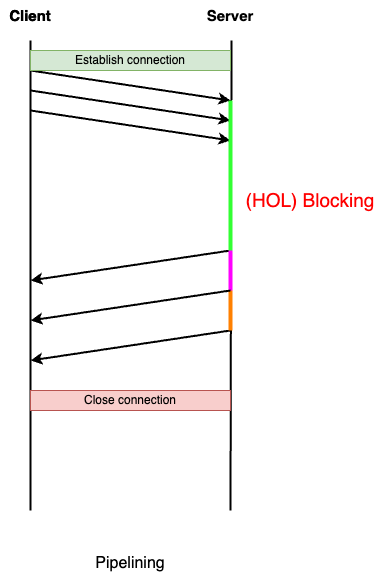
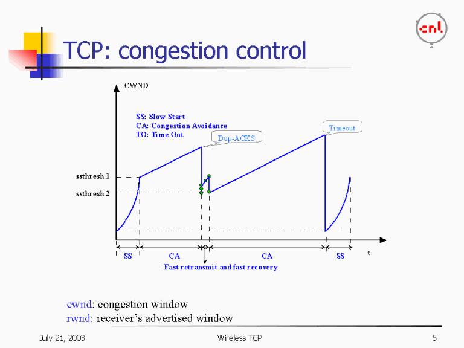
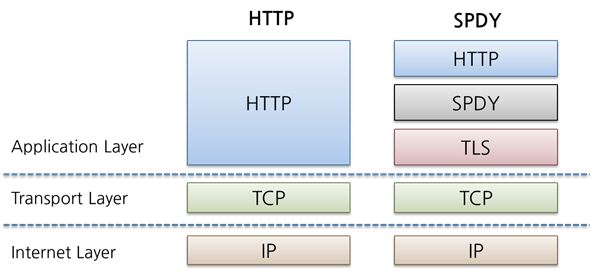
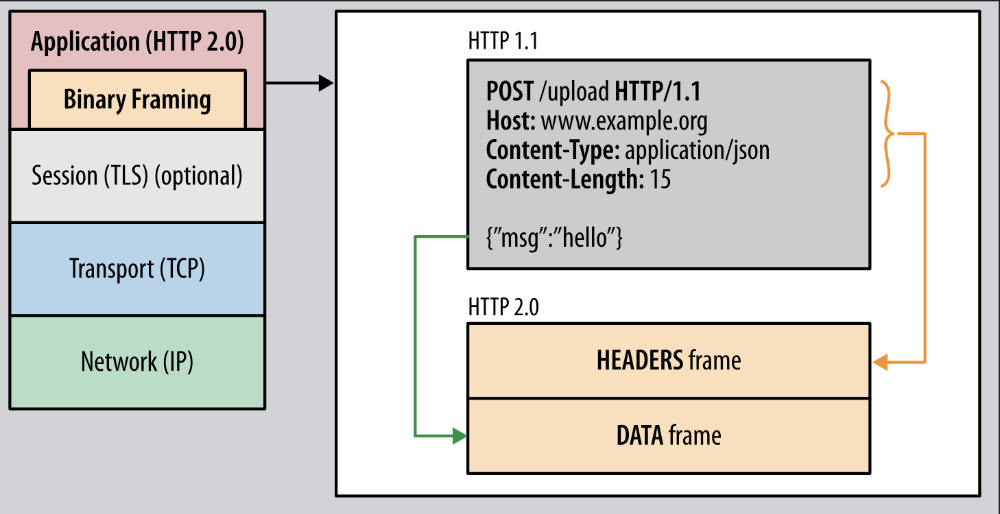
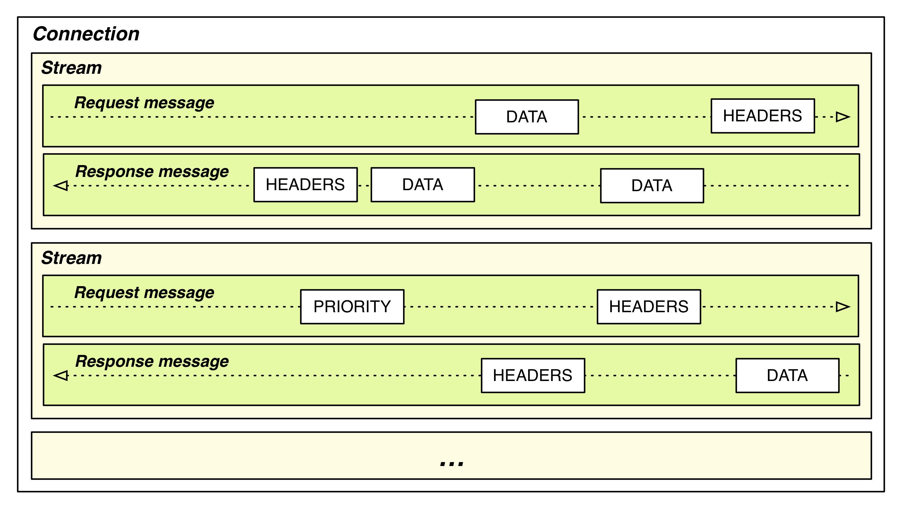
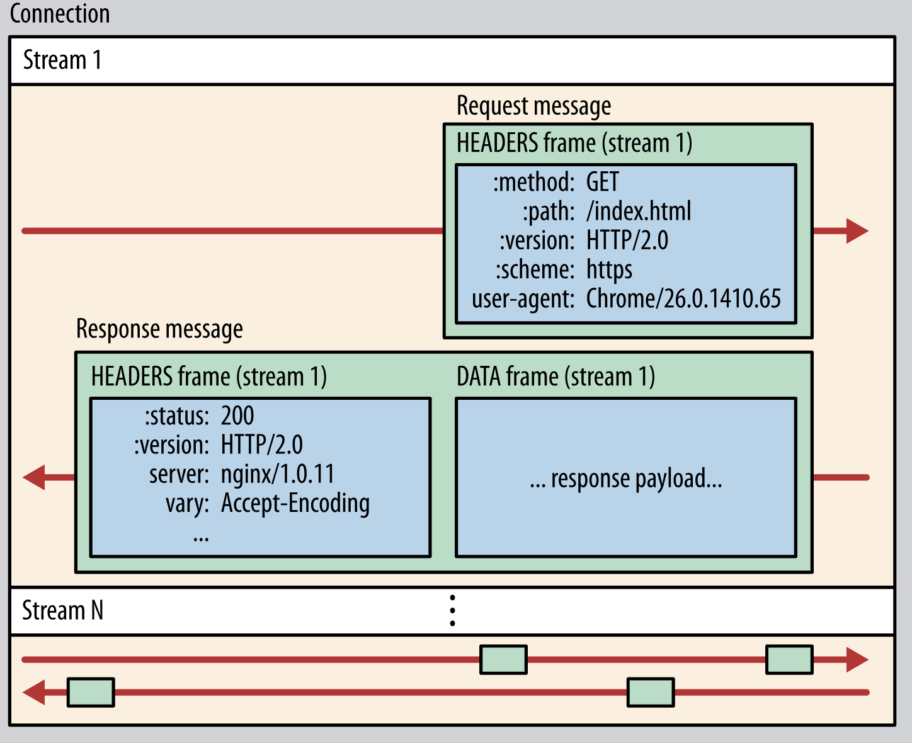
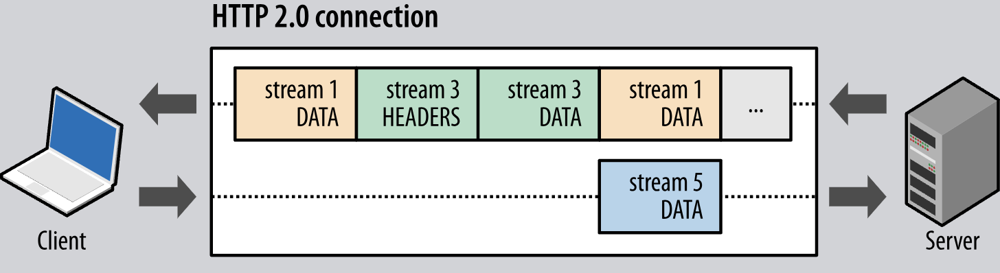
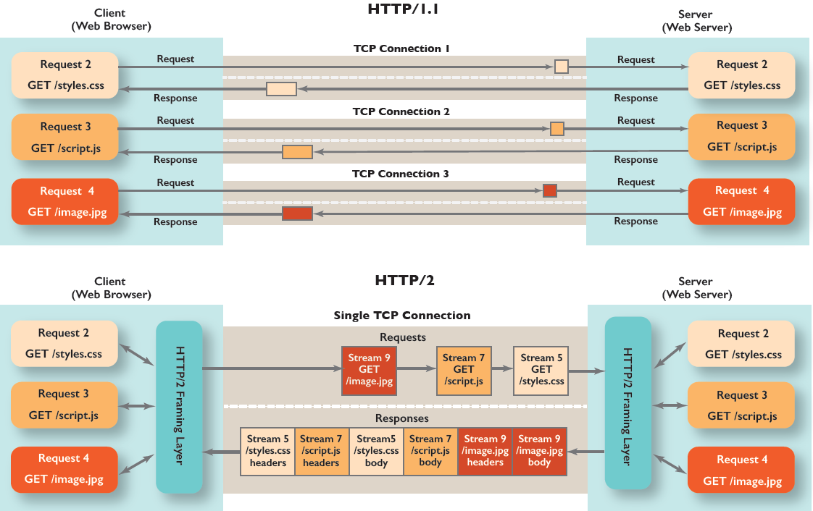
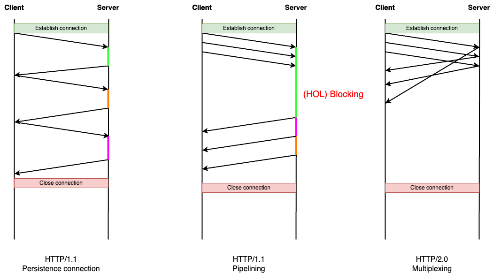
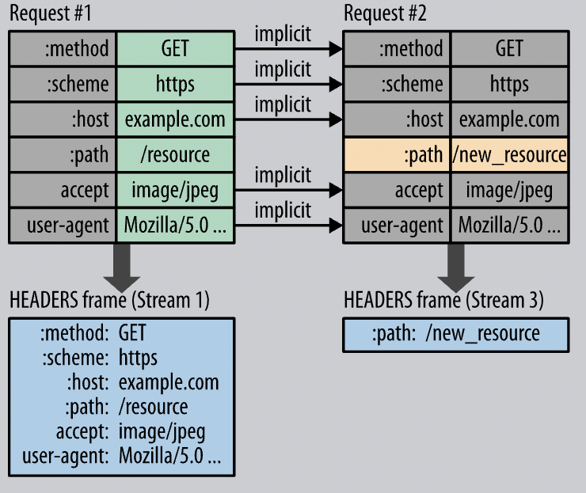

# 목차

 

- [목차](#목차)
- [HTTP 진화과정 이해하기 두번째 - HTTP/2.0](#http-진화과정-이해하기-두번째---http20)
- [여전히 HTTP/1.1은 TCP를 제대로 활용하지 못한다](#여전히-http11은-tcp를-제대로-활용하지-못한다)
- [HTTP/2.0의 토대 비표준 프로토콜 - SPDY](#http20의-토대-비표준-프로토콜---spdy)
- [HTTP/2.0](#http20)
  - [Binary Framing Layer](#binary-framing-layer)
  - [Multiplexing](#multiplexing)
  - [HTTP2.0 with Push](#http20-with-push)
  - [Stream Prioritization](#stream-prioritization)
  - [Flow Control](#flow-control)
  - [Header Compression](#header-compression)
- [HTTP/2.0도 완벽하진 않다. HTTP/3.0의 등장](#http20도-완벽하진-않다-http30의-등장)
- [참고](#참고)

 

# HTTP 진화과정 이해하기 두번째 - HTTP/2.0

[이전 글 - HTTP/0.9 ~ HTTP/1.1](../HTTP_0_9_to_1_1/HTTP_0_9_to_1_1.md)에선 HTTP 초기부터 현재까지도 가장 많이 사용된다고 볼 수 있는 HTTP/1.1까지의 발전 과정을 살펴보았다.

이번 글은 HTTP/1.1에서 HTTP/2.0으로 발전하게되는 과정을 통해 HTTP/2.0를 정리해보고자한다.

 

# 여전히 HTTP/1.1은 TCP를 제대로 활용하지 못한다

조금 자극적일 수도 있는 글귀이긴하지만, HTTP/1.1에서 HTTP/2.0으로 발전하게된 계기는 바로 HTTP/1.1이 TCP Connection을 제대로 활용하지 못했기때문이다.

그 이유는 아래와 같다.

 

💁‍♂️ **자체적인 병렬처리 불가**

이전 글에서도 살펴보았듯이, HTTP/1.1에서의 서버는 요청이 들어온 순서대로 (FIFO) 처리후 응답을 반환해야한다.

이로인해 TCP Connection이 잦은 idle 상태가됨으로써 Connection을 제대로 활용하지못한다.

 

위와 같이 Pipielining이라는 성능 향상 스펙이 존재했음에도, HTTP/1.1의 FIFO 형식의 처리한계로인해 HOLB (Head Of Line Blocking)이 발생하는등 결국 Pipelining은 빛을 보지못하고 사용되지않게되었다.

조금 자세히 말하자면.. 클라이언트가 요청하는 데이터의 크기는 제각각 이기 때문에, 첫번째로 요청한 데이터가 용량이 큰 데이터라면, 두번째, 세번째 데이터가 아무리 빨리 처리되어도 HTTP/1.1의 우선순위 원칙에 따라 첫번째 데이터의 응답 속도가 늦어지면 후 순위에 있는 데이터 응답속도도 덩달아 늦어지는 것이다.

물론 브라우저는 이러한 HTTP/1.1의 한계를 극복하고자 물리적인 TCP 연결을 여러 개 두는 방식으로 병렬적으로 처리할 수 있게했다. 하지만 이는 임시방편에 불가하다. 그 이유는 아래 TCP 내용을 보면 이해가 될 것이다.

 

💁‍♂️ **TCP 비효율적 사용**

TCP는 보수적인 환경을 가정하고 네트워크상의 다양한 트래픽 용도로 공평하게 동작하도록 설계되었다.

이것이 TCP가 성공할 수 있는 이유였으며, TCP가 속도는 조금 느렸어도 신뢰성있는 데이터 통신을 가능하게하는데있어서 큰 영향을 끼친 요소이기도하다.

신뢰성있는 데이터 통신에 있어서 **가장 핵심은 TCP의 혼잡 제어 (Congestion Control)라고 볼 수 있다.**

일반적으로 네트워크에선 한 엔드포인트에 데이터가 몰릴 경우, 자신에게 온 데이터를 모두 처리할 수 없게되는데, 이때 다른 엔드포인트가 또 다시 재전송하게되어 결국 혼잡만 가중시켜 오버플로우나 데이터 손실을 발생시키게된다.

**혼잡 제어란 이러한 정보 소통량이 과다한 것을 감지하여 패킷을 적게 보내면서 적절한 전송 패킷 사이즈를 찾아 혼잡 붕괴 현상을 방지하는 것 말한다.**

이때 **핵심은 혼잡 윈도우 (Congestion Window)라는 개념이며, 이는 수신자가 확인(ACK)하기 전까지 송신자가 전송할 수 있는 TCP 패킷의 수를 의미한다.**

예를 들어, 혼잡 윈도우가 1로 설정되어있다면, 송신자는 단 하나의 패킷만 전송하며, 그 패킷에 대한 수신자의 확인을 받아야만 또 다른 패킷을 전송할 것이다.

**문제는 TCP가 현재 Connection에 알맞는 혼잡 윈도우의 크기를 결정하기 위해 느린 시작 (Slow Start)를 사용하는데, 아래와 같이 TCP의 혼잡을 제어하고 공평하게 통신하기위해 윈도우 크기를 높였다 줄였다한다.**

 출처: http://www.sfu.ca/~ljilja/cnl/presentations/wan/wireless_TCP/sld005.htm 

즉, **최적의 혼잡 윈도우 크기를 얻는 데 TCP Connection상 몇 번의 왕복이 필요하며, 이는 결국 성능적인 문제를 야기한다.**

그리고 혼잡 제어는 기본적으로 `혼잡이 발생하면 윈도우 크기를 줄이거나, 혹은 증가시키지 않으며 혼잡을 회피한다`라는 기조로 구현된 경우가 많아 조금이라도 혼잡이 발생한다면 위 그림에서 볼 수 있듯이, 혼잡 윈도우를 다시 1로 내려 다시 Slow Start를 시행한다.

> **물론 HTTP/2.0도 TCP 기반으로 동작하기에 위 문제는 여전히 발생한다.**
> 
> 다만, **HTTP/2.0은 HTTP/1.1과 다르게 TCP Connection 하나만을 가지고 병렬처리한다.**
> 
> 즉, **여러 데이터를 주고받을 때 혼잡 제어의 영향을 훨씬 더 적게 받음으로써 통신 속도가 더 빠르다.**

이외에도 TCP 환경에서 동작하는 HTTP의 특성상 Handshake가 반복적으로 발생함으로써 불필요한 RTT (Round Trip Time) 증가로 인해 네트워크 지연을 초래하여 성능을 저하하게한다.

 

💁‍♂️ **비대한 메시지 헤더**

HTTP/1.1은 응답의 바디 크기대비 헤더 크기 비율은 매우 낮지만, 요청의 경우 반대로 헤더가 대부분의 용량을 차지할 수 있다.

게다가 바디를 압축하는 메커니즘은 존재하지만, 사실상 헤더를 압축하는 방법은 없다고 볼 수 있다.

HTTP 아카이브에 따르면, 2016년 말, 요청 헤더의 평균 크기는 약 460bytes이며, 140개의 개체가있는 일반적인 웹 페이지의 경우, 요청 헤더의 전체 크기가 약 63kb가 된다고한다.

큰 문제가 없어보이지만 TCP 혼잡 윈도우 제어 관점에서 바라보면, TCP가 해당 요청을 보내는데만 혼잡 윈도우의 크기가 처음부터 크지 않기에 자칫 3~4번 혹은 그 이상의 왕복이 필요할 수 있다.

결국 이것 또한 전송해야하는 데이터의 증가로인해 성능에 악영향을 끼친다.

 

💁‍♂️ **우선순위 설정 불가**

웹페이지에서 어떤 개체는 다른 개체보다 훨씬 중요할 수 있다.

물론 높은 우선순위의 개체를 먼저 가져오는게 좋지만, HTTP/1.1에선 개체에 대한 요청/응답별로 우선 순위 설정이 불가하다.

즉, 요청한 순서대로 우선순위가 정해지기때문에 자칫 낮은 우선순위의 개체를 가져오느라 높은 우선순위의 개체를 늦게 가져와 페이지의 로딩을 지연시키는 현상이 발생할 수 있는 것이다.

 

# HTTP/2.0의 토대 비표준 프로토콜 - SPDY

 

💁‍♂️ **위에서 살펴보았듯이 HTTP/1.1은 한계가 분명했다.**

1999년, HTTP/1.1을 기술한 RFC 2616에서 현대의 웹 토대가 된 HTTP/1.1 표준이 정의되었다.

그이후 지금까지도 사실상 HTTP/1.1은 대중적으로 사용되고있지만, 구현의 단순성과 접근성에 주안점을 두고 최적화한 프로토콜이다보니 성능측면에선 앞서 언급했듯이 취약점이 많다.

> [여전히 HTTP/1.1은 TCP를 제대로 활용하지 못한다](#여전히-http11은-tcp를-제대로-활용하지-못한다)

이후 계속된 웹의 폭발적인 수요 증가와 발전으로 인해 더 효율적이고 빠른 HTTP가 필요하게되었고, 2009년 구글의 마이크 벨시와 로베르토 페온이 제시한 SPDY를 시작으로 HTTP를 개선하고자하는 움직임이 시작되었다.

SPDY 프로젝트의 목표는 아래와 같다.

- Target a 50% reduction in page load time (PLT).
- Avoid the need for any changes to content by website authors.
- Minimize deployment complexity, and avoid changes in network infrastructure.
- Develop this new protocol in partnership with the open-source community.
- Gather real performance data to (in)validate the experimental protocol.

이중에서 가장 중점적으로 개선하고자하는 부분은 page load time의 향상이었으며, SPDY는 새로운 binary framing layer을 도입하여 기본 TCP 연결을 보다 효율적으로 사용하도록함으로써 성능 개선을 진행했다.

 출처: https://d2.naver.com/helloworld/140351 

위 그림에서 **SPDY가 binary framing layer라고 볼 수 있으며, 해당 계층에 multiplexing, prioritization, head compression을 적용함으로써 성능 향상을 이루었다.**

**이 새로운 3가지 개념이 HTTP/2.0에도 그대로 이어지며, 사실상 성능 개선의 핵심 개념이된다.**

> 이 세가지 개념에 대해선 아래 [HTTP/2.0](#http20)에서 더 자세히 다룬다.

 

💁‍♂️ **Hello HTTP/2, Good Bye SPDY**

SPDY를 발표한지 얼마안되어 구글의 마이크 벨시와 로베르토 페온은 여러 사이트를 대상으로한 SPDY의 결과와 소스코드를 공개했다.

이때 탑 25 웹사이트를 대상으로 홈 네트워크 연결기준 55%이상의 빠른 결과가 나왔다고한다. - [출처](https://blog.chromium.org/2009/11/2x-faster-web.html) -

마지막으로 2012년에 Chrome, Firefox, Opera등 여러 브라우저와 대형 웹사이트들이 SPDY를 적용하였으며, 점차 많은 기업들이 채택함에따라 사실상 표준이 되는 궤도에 올랐다.

이후 HTTP Working Group (HTTP-WG)가 SPDY에서 배운 교훈을 바탕으로 SPDY를 채택 및 조금 개선하여 공식적으로 `HTTP/2.0` 표준을 공개하게된다.

> 더 자세한 내용은 [Hello HTTP/2, Good Bye SPDY](https://developers-kr.googleblog.com/2015/02/hellohttp2.html)에 자세히 나와있다.

 

💁‍♂️ **SPDY는 기존 HTTP 표준을 대체하려는 목적이 아닌 HTTP를 통한 전송을 더 효율적으로 확장하는 형태로 구현되었다.**

SPDY라고 기존 HTTP의 스펙을 대체한 것이 아니다.

기존 HTTP의 애플리케이션 계층에서의 동작은 동일하며, 기존에 제공되는 기능이나 HTTP 메서드, 상태 코드, URI 및 헤더 필드와 같은 핵심 개념을 변경되지 않았다.

즉, 기존의 HTTP의 스펙은 HTTP 계층에서 동일하게 유지되며, 새로 생기는 SPDY 계층에서 HTTP/1.1의 성능 한계를 해결하고자한다는 것이다.

그리고 새로 생긴 계층이 바로 SPDY에선 SPDY 계층이라하며, **HTTP/2.0에선 binary framing layer라고 한다**.

 

# HTTP/2.0

 

💁‍♂️ **HTTP/2.0은 low-latency의 데이터 전송을 위해 설계되었다.**

앞서 말했듯이, HTTP/1.1까진 네트워크 자원 (TCP Connection)을 십분 활용하지 못했다.

그리하여 HTTP/2.0은 하나의 TCP Connection에 여러 요청/응답을 병렬적으로 처리하는 것을 목표로했으며, 헤더 압축, 우선순위 설정등을 통해 네트워크 자원을 십분 활용하고자했다.

결과적으로 HTTP/2.0은 HTTP/1.1에 비해 더 적은 수의 TCP Connection을 사용하여 더욱 빠르게 네트워크 통신을 할 수 설계되었다.

이는 TCP 네트워크상 Connection수가 적어짐에 따른 경쟁이 줄어들고, Connection의 수명이 길어져 네트워크의 활용도를 더 높이는 결과를 불러일으켰다.

이제 어떻게 이러한 성능 향상을 불러왔는지 정리해본다.

 

## Binary Framing Layer

HTTP/2의 모든 성능 향상의 핵심은 클라이언트와 서버간에 메시지를 캡슐화하고 전송하는 방식을 지정하는 새로운 Binary Framing Layer 계층이다.

 출처: https://web.dev/performance-http2/ 

HTTP/1.1와 HTTP/2.0의 주요한 차이점인 이 계층은 소켓 인터페이스와 애플리케이션(개발자가 구현하는 애플리케이션)에 노출되는 HTTP API 사이에 최적화된 새로운 인코딩 매커니즘을 적용한다.

그래서 **HTTP/2.0에선 1.1에서의 text로 전송되던 것과 달리 binary frame으로 인코딩되어 전송된다.**

이때 **기존의 HTTP 메서드, 헤더와 같은 기존 스펙은 그대로 유지되며 영향받지않는다.** 

그저 전송되는 방식이 인코딩되고 메시지가 분할되어 전송되는 것 뿐이다.

또한 HTTP/1.1에선 `\r`이나 `\n`와 같은 개행 문자로 구분되던 헤더와 바디를 HTTP/2.0에선 위 그림에서 알 수 있듯이 헤더와 바디가 layer로 구분된다.

이로인해 데이터 파싱 및 전송 속도가 증가하였으며, 오류 발생 가능성이 줄어들었다고 볼 수 있다.

> 헤더와 바디가 따로 분리되어 전송된다.

**이렇게 새로운 계층이 생겼다는 것은 클라이언트와 서버 모두 이 계층에 대한 구현이 되어있어야한다는 의미이기도하다.**

 

💁‍♂️ **Streams, Messages, Frames**

클라이언트와 서버가 인코딩된 데이터를 주고받을때, HTTP/2.0의 새로운 용어를 이해해야한다.

 HTTP/2 streams, messages, frames 출처: High Performance Browser Networking. Ilya Grigorik

* Stream - 연결된 Connection 내에서 하나 이상의 메시지를 양뱡향으로 주고 받는 양방향 바이트 흐름. (요청과 응답을 양방향으로 오가는 논리적 연결 단위.)
* Message - HTTP/1.1와 마찬가지로 하나의 요청과 응답을 구성하는 단위. 다수의 Frame으로 이루어진 배열 라인.
* Frame - HTTP/2.0의 가장 작은 통신 단위로, Header 혹은 Data가 포함되어있다.
  * 위 그림에서 DATA와 HEADERS 각각 단위가 Frame이며, 네트워크상에서 전송되는 최소 단위라고 보면된다.

HTTP/2.0은 HTTP 요청/응답 (메시지)을 여러 개의 Frame로 나누고 인코딩하여 데이터를 주고받는다.

그리고 요청/응답 메세지는 특정 Stream에 속하며, 여러 개의 Stream은 하나의 Connection에 속하는 구조이다.

 

💁‍♂️ **세 용어의 관계를 조금 더 자세히 정리해보면 아래와 같다.**

 출처: https://web.dev/performance-http2/ 

* 모든 통신은 단일 TCP Connection에서 수행되며, **한 Connection안에서 원하는 수만큼의 양방향 Stream을 전달할 수 있다.**
  * 하나의 커넥션에서 여러 개의 Stream이 동시에 열리니 속도가 굉장히 빠르다. (병렬 처리)
* **각 Stream은 양방향 메세지를 전달하는데 사용되는 고유 식별자와 선택적 우선 순위 정보를 포함한다.**
* **각 Message는 하나 이상의 Frame으로 구성된 요청/응답과 같은 논리적 HTTP 메시지다.**
* **Frame은 특정 유형의 데이터 (HTTP 헤더나 Payload)를 전달하는 가장 작은 통신 단위다. 데이터가 Frame으로 분할되어 전송된다고보면 된다. 서로 다른 Stream의 Frame은 서로 인접하지않으며, 각 Frame의 헤더에 포함된 Stream 식별자를 통해 재조립된다.**

 

**결론적으론 HTTP/2.0은 기존 HTTP 메시지를 Binary로 구성된 여러 개의 Frame으로 분해한 다음 특정 Stream에 매핑되어 전송된다.**

그리고 **이 모든 Stream은 단일 TCP Connection 내에서 다중화되어 병렬처리된다.** (Multiplexing)

이렇게 함으로써 **HTTP/2.0은 multiplexing, prioritization, header compression을 모두 구현할 수 있게되었다.**

이제부터 본격적으로 이 세가지 개념에 대해서 다뤄본다.

 

## Multiplexing
> 다중화

 

💁‍♂️ **Multiplexing**

[여전히 HTTP/1.1은 TCP를 제대로 활용하지 못한다](#여전히-http11은-tcp를-제대로-활용하지-못한다)에서 정리했듯이 HTTP/1.1은 요청/응답을 순서대로 처리해야하는 문제로인해 병렬적인 처리가 불가능하다.

그래서 임시적인 방안으로 여러 개의 TCP Connection을 열어 병렬적으로 동작하도록 구성하는 경우가 많았다.

**HTTP/2.0은 이러한 문제를 해결하기위해 위에서 언급한 binary framing layer를 추가하여 HTTP 메시지를 binary 형태의 frame으로 나누고 하나의 connection으로 동시에 여러 개의 message stream을 응답 순서에 상관없이 주고받는 multiplxing을 적용했다.**

 출처: https://web.dev/performance-http2/ 

multiplexing을 도입함으로써 동일한 Connection에서 한 번에 여러 요청을 보내고 어떤 순서로든 응답을 다시 받을 수 있게되었다.

 

💁‍♂️ **HTTP/1.1 통신 과정과 HTTP/2.0 통신 과정**

아래 HTTP/1.1와 HTTP/2.0의 통신과정을 살펴보면 Multiplexing을 쉽게 이해할 수 있다.

 출처: HTTP/2 in action. https://freecontent.manning.com/mental-model-graphic-how-is-http-1-1-different-from-http-2/ 

**HTTP 1.1은 TCP Connection을 맺고나서 요청을 보냈을 때, 해당 요청에 대한 응답이 도착하고나서야 해당 TCP 커넥션에 다시 요청을 보낼 수 있다.**

그래서 위와 같이 일반적으로 브라우저들은 TCP Connection을 여러 개의 요청을 만들어 병렬적으로 처리한다.

반면에 **HTTP/2.0은 하나의 TCP Connection에 여러 개의 Stream이 동시에 요청/응답을 수행한다.**

HTTP 1.1은 요청과 응답이 메시지라는 단위로 구분되어있었지만, HTTP/2.0부터는 Stream을 통해 요청과 응답이 묶일 수 있어 여러 개의 요청을 병렬적으로 처리할 수 있게된 것이다.

조금 풀어말하면, TCP Connection 하나로 여러 요청/응답이 병렬적으로 수행하는것인데, 이게 가능한 이유는 각 Stream의 요청/응답에 고유식별자가 존재하여 클라이언트나 서버에 Frame이 전달되었을 때 binary framing layer에서 이 frame이 어느 Stream의 것인지 식별이 가능하기때문이다.

이렇게 요청/응답 Frame이 각각 어떤 Stream에 속하는지 알 수 있기때문에 순서와 상관없이 요청/응답을 보냄으로써 병렬적으로 처리가 가능한 것이다.

> HTTP/1.1에선 응답이 요청을 알 수 있는 방법이 없어 순서대로 처리할 수 밖에 없다.

 

💁‍♂️ **Multiplexing 도입으로 TCP를 더욱 더 효율적으로 사용할 수 있게되었다.**

앞서 말했듯이, 기존의 HTTP/1.1은 병렬적인 처리를위한 임시방편으로 여러 개의 TCP Connection을 열어 사용했다.

이경우 **각 TCP Connection별로 TCP의 특성상 혼잡제어로인해 윈도우 사이즈를 줄였다 늘렸다함으로써 성능적으로 악영향을 끼치게된다.**

반면 Multiplexing을 도입한 HTTP/2.0은 여러 데이터를 주고받을 때 혼잡 제어의 영향을 훨씬 더 적게 받음으로써 통신 속도가 훨씬 더 빠른 것이다.

즉, HTTP/2.0은 TCP Connection을 십분 잘 활용하게되었다고 볼 수 있다.

또한, HTTP/1.1에서 Pipelining은 HOLB로인해 사용되지않게되었는데, HTTP/2.0은 순서대로 응답을 받을 필요가없기에 아래와 같이 Pipelining과 다르게 요청을 동시에하지만 순서대로 응답을 받지않아도되게되었다.

 

 

## HTTP2.0 with Push

HTTP/2.0에선 Multiplexing외에도 클라이언트의 요청에 대해 미래에 필요할 것 같은 리소스를 미리 클라이언트에 보낼 수 있다.

예를 들어, 클라이언트가 HTML을 요청했을 때, 서버는 해당 HTML 문서가 링크하고있는 이미지, CSS파일, JS 파일등의 리소스를 스스로 파악하여 클라이언트에 미리 push해서 브라우저 캐시에 가져다놓는 것이다.

서버는 클라이언트가 직접적으로 요청하지않은 리소스를 미리 꺼내서 가까운 미래에 특정 개체가 필요할 때 바로 사용될 수 있도록 성능 향상을 이끌어내는 것이다.

push 관련된 자세한 동작 과정은 [HTTP/2 in action](https://freecontent.manning.com/animation-http-1-1-vs-http-2-vs-http-2-with-push/)에 자세히 나와있다.

 

## Stream Prioritization
> 스트림 우선순위

 

💁‍♂️ **스트림 우선순위**

HTTP/2.0에선 HTTP 메세지를 여러 Binary Frame으로 분할하고, 여러 Frame을 멀티플렉싱 할 수 있게되면서 요청과 응답이 동시에 병렬적으로 이루어져 비약적인 속도 향상이 되었다.

하지만 하나의 TCP Connection에 여러 요청과 응답이 뒤섞이면서 Stream의 우선순위를 지정할 필요가 생기게되었다. 

이로인해 HTTP/2.0 표준엔 각 Stream에 우선순위 관련된 가중치와 의존성을 추가했다.

* 각 Stream에는 1부터 256사이의 가중치가 할당될 수 있다.
* 각 Stream에는 다른 Stream에 대한 명시적인 의존성이 부여될 수 있다.

> 각 브라우저의 요청 우선순위관련된 내용을 [여기](https://calendar.perfplanet.com/2018/http2-prioritization/)확인할 수 있다.

 

## Flow Control
> 흐름 제어

HTTP/2.0에선 애플리케이션 수준의 흐름 제어를 지원한다.

관련하여 더 자세한 내용은 [여기](https://web.dev/performance-http2/#flow-control)를 참고.

 

## Header Compression

HTTP/1.1에선 헤더를 아무런 압축없이 그대로 전송하였다. 이를 개선하기 위해 **HTTP/2.0에선 HTTP 메시지의 헤더를 압축하여 전송한다.**

거기에더해 HTTP/1.1에서의 헤더값 중복되는 문제를 해결하기위해, **HTTP/2.0에선 이전 Message의 헤더 내용중 중복되는 필드를 재전송하지 않도록하였다.**

 출처: https://web.dev/performance-http2 

중복 헤더는 Static / Dynamic Header Table 개념을 사용하여 중복 헤더를 검출하여, 중복된 헤더의 index 값만 전송하고 중복되지 않은 Header 정보의 값은 호프만 인코딩 (Huffman Encoding) 기법을 사용하는 HPACK 압축 방식으로 인코딩 처리하여 전송한다.

 

# HTTP/2.0도 완벽하진 않다. HTTP/3.0의 등장

이번 글은 HTTP/1.1의 문제점에 대해서 살펴보고, 그 문제점을 HTTP/2.0에선 성능 측면에서 어떻게 해결하였는지 알아보았다.

gRPC등의 RPC 통신이 늘어남에따라 점차 HTTP/2.0의 사용량도 많아질 것으로 보이는데, HTTP/2.0도 여전히 성능적인 한계가있다.

* TCP로인한 여전한 RTT(Round Trip Time)가 발생한다.
  * 아무리 멀티플렉싱으로 성능을 향상했다고해도, HTTP/2.0도 여전히 TCP위에서 동작한다. 당연히 Handshake에 대한 RTT로 지연이 발생한다.
  * 이 문제는 사실 TCP로 통신하는한 계속해서 발생하는 문제다.
* TCP 자체의 Head Of Line Blocking
  * 패킷을 이용하는 TCP에서 패킷이 유실되거나 오류가 있을 때 재전송하게되는데, 이 재전송 과정에서 패킷의 지연이 발생하면 TCP 레벨에서 HOLB가 발생한다.
  * 즉, HTTP/2.0에선 애플리케이션 계층의 HOLB를 해결했을지몰라도, 전송 계층에서의 HOLB는 여전히 발생하게된다.
* TCP의 혼잡 제어
  * TCP는 혼잡 제어를 수행하기에 전송 속도 및 혼잡 Window를 낮은 생태에서 천천히 높이는 방식으로 속도 및 혼잡을 제어한다. (Slow Start)
  * 이는 네트워크 상황이 좋을 때 사실상 불필요한 지연을 발생시킨다.

**결과적으로 HTTP/2.0도 TCP 기반으로 동작하기에 TCP가 갖는 문제를 그대로 가지게된다는 것이다.**

그래서인지 **HTTP/3.0에선 TCP를 버리고 UDP를 채택하였다. 정확히는 UDP를 개조한 QUIC라는 프로토콜인데 이와 관련해서 다음 글에서 다뤄보고자한다.**

 

# 참고
* https://web.dev/performance-http2
* http://www.sfu.ca/~ljilja/cnl/presentations/wan/wireless_TCP/sld005.htm
* https://d2.naver.com/helloworld/140351
* https://blog.chromium.org/2009/11/2x-faster-web.html
* HTTP/2 in action
* 러닝 HTTP/2
* https://stackoverflow.com/questions/36517829/what-does-multiplexing-mean-in-http-2
* https://datatracker.ietf.org/doc/html/rfc2068#section-8.1.2.2

