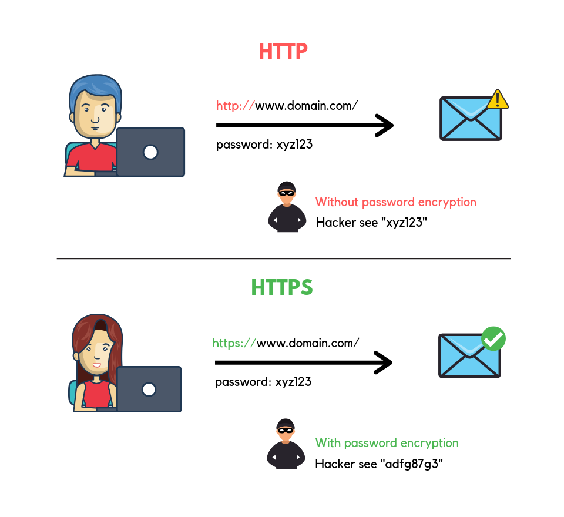
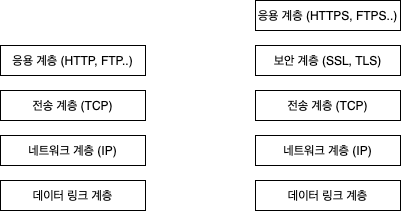
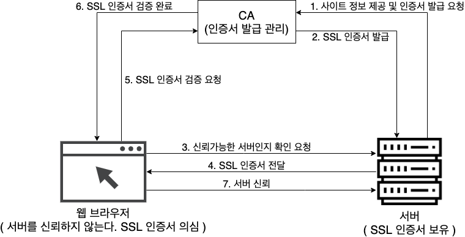
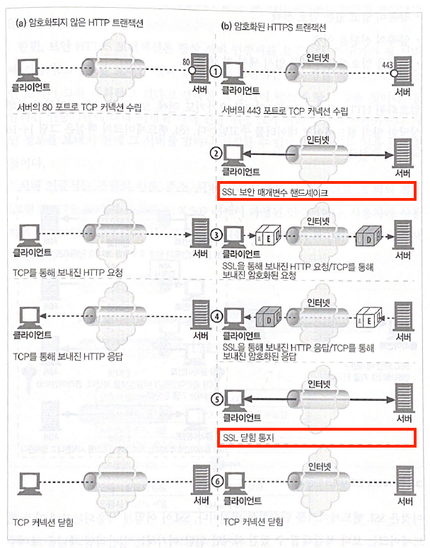
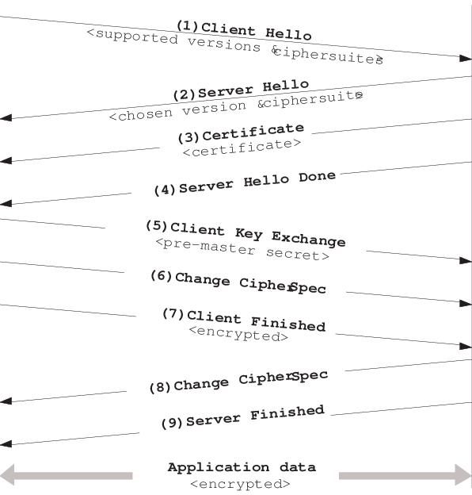

# 목차

 

- [목차](#목차)
- [개요](#개요)
- [HTTP vs HTTPS](#http-vs-https)
  - [두 가지 프로토콜의 차이점](#두-가지-프로토콜의-차이점)
  - [HTTPS가 필요한 이유](#https가-필요한-이유)
- [HTTPS를 이해하기 위한 사전 지식](#https를-이해하기-위한-사전-지식)
  - [HTTPS와 SSL](#https와-ssl)
  - [대칭키와 비대칭키](#대칭키와-비대칭키)
- [HTTPS 동작 Flow](#https-동작-flow)
  - [추상적으로 보는 HTTPS 동작 Flow](#추상적으로-보는-https-동작-flow)
  - [조금 구체적으로 보는 HTTPS 동작 Flow](#조금-구체적으로-보는-https-동작-flow)
  - [완전 구체적으로 보는 HTTPS 동작 Flow - SSL Handshake](#완전-구체적으로-보는-https-동작-flow---ssl-handshake)
- [마치며](#마치며)
- [참고](#참고)

 

# 개요
HTTPS를 이것저것 따라서 적용시킨 경험이 있다.

하지만 여러 도메인에 대한 HTTPS를 적용시켜야할 필요성이 느껴졌지만, 동작 원리를 모르니 어디부터 손 대야할 지 전혀 모르겠다...

HTTPS 동작 원리가 그저 마법처럼 보인다.

자! 이 마법을 풀어보고자 이번 글을 작성하였다 :)

우선 HTTPS를 이해하기 위한 사전 지식을 정리하였고, 이 후에 동작 원리를 추상적인 것부터 시작하여 3단계에 거쳐 구체화시키는 방식으로 정리하였다.

> 그리고 이번 글을 작성하면서 가장 큰 도움을 받은 [환영님의 블로그](https://aws-hyoh.tistory.com/)에게 감사함을 전하고싶다.

 

# HTTP vs HTTPS
필자는 기술, 프로토콜등등은 모두 무엇이고, 왜 사용해야하는지, 그리고 어떤 컨셉을 가졌는지에 대해서 알아야 더 깊이 이해할 수 있다고 생각든다.

그런 의미에서 HTTPS에 대한 복잡한 개념을 바로 말하기보다는 HTTP와 HTTPS의 차이점과 HTTPS가 필요한 이유를 먼저 정리해보자.

 

## 두 가지 프로토콜의 차이점
HTTP는 모두가 알다시피 Hypertext인 HTML을 전송하기 위한 통신규악(프로토콜)을 의미한다.

HTTPS는 기존 HTTP 통신 방식에서 보안을 위한 계층을 추가한 것이다. 

> OSI 7계층처럼 네트워크 통신 계층에서 하나의 계층이 추가된 것이라고 보면 이해가 빠르다.

그리고 이 계층을 SSL (Secure Socket Layer) 혹은 TLS (Transport Layer Security)라고 부른다. 

> SSL과 TLS의 차이점은?
> * 같은 말이다. 1994년 넷스케이프 내비게이터 웹 브라우저를 위해 HTTPS를 발명하였는데, 이때 SSL 프로토콜과 함께 사용되었다.
> * 하지만 넷스케이프 내비게티어 웹 브라우저말고도 점차 많이 사용되면서 표준화 기구인 IETF의 관리로 변경되면서 TLS라는 이름으로 변경되었다고 한다.
> * 많은 사람들이 아직까지도 SSL이라고 칭하기도 한다. (본문에서도 이하 SSL로 칭하겠다.)

**자! 복잡한 이야기는 미뤄주고, 쉽게 생각해서 HTTPS는 HTTP의 보안이 강화된 버전이라고 보면 쉽다.**

 

## HTTPS가 필요한 이유
HTTP도 잘 사용되는데 왜 굳이 HTTPS라는 개념을 어렵게 배워서까지 이해해야할까??

**다르게 말하면, HTTPS는 왜 필요한 것일까?**

크게 3가지 이유가 있다.

 

**1. 암호화**

첫 번째는 암호화이다.

 출처: https://serverguy.com/ssl/difference-between-http-and-https/

HTTP는 보안을 전혀 신경쓰지 않기 때문에, 그대로 네트워크를 통해 통신을 하면 전송 중간에 스니핑을 당해 내용을 그대로 노출할 수 있다.

큰 이슈가 아니라고 생각할 수도 있지만, 로그인의 경우 아이디와 비밀번호를 HTTP를 통해 전송하면, 그대로 노출되는 큰 보안 이슈가 발생할 수 있다.

반면에, HTTPS는 네트워크상에서 해커가 패킷을 가로채도 암호화가 되어있기 때문에 해커가 내용을 볼 수 없다.

즉, 로그인할 때 아이디와 비밀번호를 암호화해서 보내기 때문에 복호화 키가 없다면 해커가 전혀 내용을 알아볼 수 없다.

 

**2. 데이터 무결성**

두 번째는 데이터 무결성이다.

HTTPS는 데이터가 전송되는 동안 의도적이든 그렇지 않든 모르는 사이에 데이터가 변경되거나 손상되는 일을 방지한다.

 

**3. 인증**

세 번째는 인증이다.

HTTPS는 제 3 인증 기관을 통해 접속하고자하는 사이트가 신뢰할 수 있는 사이트인지 판별해준다. ex. 피싱 사이트 방지

다시 말해 접속하고자하는 사이트가 믿을 만한 곳인지 판별해준다. 이때 기관으로부터 검증된 사이트만 주소에 HTTPS 사용이 허가된다.

이때 사용되는 것이 바로 보안인증서(SSL/TLS 인증서)이다.

이와 관련된 내용은 아래서 다 자세히 다룰 예정이다!

 

**4. SEO**

네 번째 이유는 조금 보너스인 부분인데 검색엔진 최적화(SEO)에도 좋다고 한다.

실제로 구글이 HTTPS 웹 사이트에 가산점을 준다고 한다. 이로 인해 사용자들이 결국 점점 안전하다고 생각하는 사이트를 더 많이 방문하게 되는 것!

 

# HTTPS를 이해하기 위한 사전 지식 
본격적으로 HTTPS를 이해하기 위해선 사전적인 지식이 있다. 이에 대해서 알아보자.

 

## HTTPS와 SSL
HTTPS와 SSL은 마치 인터넷과 웹의 차이와 비슷하다.

웹이 인터넷 위에서 돌아가는 서비스 중의 하나인 것처럼 HTTPS도 SSL 프로토콜 위에서 돌아가는 프로토콜중 하나이다.

SSL은 '보안 계층'이라는 독립적인 프로토콜 계층을 만들어, 응용 계층과 전송 계층 사이에 속한다.

HTTPS는 SSL위에 HTTP 프로토콜을 얹어 보안된 HTTP 통신을 하는 프로토콜을 의미한다.

 

## 대칭키와 비대칭키
> 대칭키와 비대칭키의 더 자세한 개념은 [암호화 기초](https://github.com/binghe819/TIL/blob/master/Network/Security/%EC%95%94%ED%98%B8%ED%99%94%20%EA%B8%B0%EC%B4%88.md#%EB%8C%80%EC%B9%AD%ED%82%A4%EC%99%80-%EB%B9%84%EB%8C%80%EC%B9%AD%ED%82%B9)을 참고하자.

대칭키와 비대칭키의 핵심은 아래와 같다.

* 대칭키
  * 개념
    * 하나의 키로 암호화와 복호화를 모두 수행.
  * 특징
    * 알고리즘의 구조가 단순하며, **비대칭키에 비해 암호화와 복호화 속도가 빠르다.**
    * 하지만, 키 관리의 어려움이 있다.
* 비대칭키
  * 개념
    * 공개키(public), 개인키(private)등 두 키를 사용하여 암호화와 복호화를 수행.
  * 특징
    * **대칭키에 비해 속도가 느리다**.
    * 다만, 안전한 통신이 가능하고 키 관리가 비교적 용이하다.

 

**HTTPS. 더 정확히는 SSL은 대칭키와 비대칭키의 장점을 모두를 활용한다.**

비대칭키 방식을 사용하여 [인증](#https가-필요한-이유)을 먼저 완료한다. 그리고 비대칭키를 사용하여 클라이언트가 서버에 대칭키를 전달하고, 데이터 통신에선 대칭키를 사용한다.

즉, **인증서 인증에는 비대칭키를 사용하고, 이후의 데이터 전송에는 효율성을 생각해서 대칭키를 사용한다.**

이와 관련된 내용은 아래 [HTTPS 동작 Flow]()에서 더 자세히 다룬다.

 

# HTTPS 동작 Flow
필자는 어떤 기술을 처음 배울 때 큰 그림을 우선적으로 그려보려고 노력한다.

그 이유는 큰 그림을 그리지 않고 바로 세부적인 부분을 공부하면 길을 헤매거나, 중간에 흥미를 잃게 되기 때문이다.

지금까지 HTTPS가 왜 필요한지, 그리고 HTTPS를 이해하기 위한 사전 지식에 대해서 알아보았으니, 이제 본격적으로 HTTPS의 큰 그림을 알아보자.

 

## 추상적으로 보는 HTTPS 동작 Flow
개발자가 아닌 일반인도 알아볼 수 있는 큰 그림을 먼저 그려보자.

> SSL, 암호화 방식등 여러 내용을 제외하였다.

**쉽게 생각해서 `SSL 인증서`는 신분증과 같다.**

 

**쉬운 예시를 들어보자.**
* 편의점 알바(웹 브라우저)에 가서 담배를 사려면 19살이 넘는다는 인증을 해야한다.
* 담배를 구매하고자 하는 손님(서버)가 들어오면 신분증을 요구한다.
* 편의점 알바(웹 브라우저)는 신분증을 신분증 인증 기관에 조회하여 인증받는다.

위 예시와 HTTPS 인증 과정은 크게 다르지 않다.

다만, 웹 브라우저가 서버를 신용하게되는 과정에서 데이터 전송시 사용되는 대칭키를 주고 받는다.

 

## 조금 구체적으로 보는 HTTPS 동작 Flow
위에선 굉장히 추상적으로 HTTPS 동작 Flow를 알아보았다.

이번엔 조금 더 구체적으로 알아본다.

어떻게 SSL 인증서를 생성하는지, 웹 브라우저는 이 SSL이 진짜임을 어떻게 알게 되는지, 웹 브라우저와 서버가 데이터를 어떻게 암호화할 수 있는지ㅇ에 대해서 알아본다.

SSL Handshake과정을 조금 추상화했다고 생각하면 된다.

 

**1-2. 서버 (사이트):** 비대칭키(Server_Public, Server_Private)를 생성한다. 그리고 서버의 각종 정보와 Server_Public 키를 인증기관에 전달하면서 SSL 인증서 생성을 요청한다.

**2-6. 인증 기관 (CA):** 서버임을 입증하는 정보 (ex. 도메인 주소, 조직, 나라, 유효기간등등)를 담은 SSL 인증서를 발급한다. 그리고 비대칭키(CA_Public, CA_Private)를 생성하고, SSL 인증서를 CA_Private으로 암호화하여 서버에게 전달한다.

**7-8. 서버 (사이트):** 서버는 CA로부터 받은 인증서 (CA_Private으로 암호화된 인증서)를 게시한다. 클라이언트가 접속 요청을 위한 인증서를 요구하면 인증서를 반환한다.

**9-12. 클라이언트 (웹 브라우저):** CA_Private으로 암호화된 SSL 인증서를 서버로부터 전달받으면, CA에게 CA_Public 키를 요청한다. 그리고 CA_Public 키로 암호화된 SSL 인증서를 복호화한다. 이때 서버의 정보가 담긴 SSL 인증서와 같이 암호화해둔 Server_Public 키를 얻는다.

**13-15. 클라이언트 (웹 브라우저) - 서버 (사이트):** 웹 브라우저는 데이터 전송에 사용되는 대칭키를 생성한다. 그리고 획득한 Server_Public으로 대칭키를 암호화하여 서버에 전달한다. 서버는 Server_Private으로 전달받은 암호화된 대칭키를 복호화한다.

**16. 클라이언트 (웹 브라우저) - 서버 (사이트):** 서로 가지고 있는 대칭키로 데이터를 암호화하고 복호화하며 데이터를 주고받는다.

 

> 총 3개의 암호키를 만든다.
> * 서버에서 생성한 비대칭키: 클라이언트와 서버가 데이터 통신에 사용되는 대칭키를 암호화하여 전달하기 위해 생성.
> * CA에서 생성한 비대칭키: SSL 인증서서 인증하기 위해 생성.
> * 대칭키: 데이터를 안전하게 주고받기위해 생성.

 

## 완전 구체적으로 보는 HTTPS 동작 Flow - SSL Handshake
이번엔 완전 구체적으로 HTTPS의 동작을 살펴본다. 다시 말해 SSL Handshake는 어떤 원리로 동작하는지 알아본다.

우선 SSL Handshake의 목적과 HTTPS 통신 과정에서의 Handshake가 위치하는 부분을 살펴보자.

 

**SSL Handshake의 목적**

> 목적을 정확히 파악해야 길을 헤매지 않는다.
1. 안정성이 보장된 데이터 통신을 위한 **대칭키를 교환하기 위함**.
2. SSL 인증서를 **인증**하기 위함.
3. **암호화 알고리즘(Cipher Suite) 결정**

 

**HTTPS의 전체적인 통신 과정**

 출처: HTTP 완벽 가이드 14장

중요한 점은 SSL Handshake하기 전후로 TCP 커넥션을 수립하고 닫아야한다는 것이다. (3, 4 way handshake)

즉, 기존의 HTTP 통신 사이에 SSL Handshake를 하고, 이를 통해 얻은 대칭키로 보안을 강화한 데이터를 주고 받는다고 보면 된다.

 

이제 본격적으로 SSL Handshake 부분을 살펴보자.

[출처: Classification of SSL Servers based on their SSL Handshake for Automated Security Assessment](https://www.researchgate.net/publication/270574368_Classification_of_SSL_Servers_based_on_their_SSL_Handshake_for_Automated_Security_Assessment)

 

**ClientHello**
> 암호화 알고리즘 나열 및 전달

* **역할**
  * **Client가 Server에 연결을 시도하며 전송하는 패킷.**
  * **Client는 어떤 암호화 알고리즘을 사용할 수 있는지 확인하기 위해 보내는 전송.**
* 전송하는 내용
  * 자신이 사용 가능한 Cipher Suite (암호화 알고리즘)목록.
  * Session ID
  * SSL Protocol Version
  * Random byte등등

 

**Server Hello**
> 암호화 알고리즘 선택

* **역할**
  * Client가 보내온 Cipher Suite중 하나를 선택하고, SSL Protocol Version과 함께 Client에게 알림. (Server가 사용가능한 알고리즘을 선택하여 전달.)
* 전송하는 내용
  * Cipher Suite
  * SSL Protocol Version

 

**Certificate**
> 인증서 전달

* **역할**
  * Server가 가지고 있는 암호화된 SSL 인증서를 클라이언트에게 전달. 인증서 내부엔 Server가 발행한 공개키도 포함되어 있다.
* Client
  * Client는 CA에게 공개키를 요청하고 받는다.
  * 그리고 서버가 보낸 CA의 개인키로 암호화된 SSL 인증서를 복호화한다.
  * 복호화가 성공하면 CA가 서명한 것이 맞으니 검증 완료.
* 전송하는 내용
  * Server가 가지고 있는 CA 개인키로 암호화된 SSL 인증서.

 

**Server Key Exchange (option) / ServerHello Done**
> 인증서 검증 완료 및 Server 공개키 전달

* **Server Key Exchange (option)**
  * Server의 공개키가 복호화한 SSL 인증서 내부에 없을 경우, Server가 직접 전달하는 과정을 의미한다.
  * 물론, SSL 인증서 내부에 존재하면 이 과정은 생략된다.
* ServerHello Done
  * **Client가 Server로부터 전달 받은 인증서를 복호화하여 인증 완료하고 Server 공개키를 확보하는 과정.**
  * **그리고 Server가 행동을 마쳤음을 전달하는 패킷.**

 

**Client Key Exchange**
> 데이터를 암호화할 대칭키 전달

* **역할**
  * Client가 대칭키를 생성하여 SSL 인증서 내부에서 추출한 Server의 공개키로 암호화한 후 Server에 전달한다.
* 참고 내용
  * 실제로 대칭키를 보내지 않고 키를 생성할 자료를 보낸다. 이와 관련해서는 보안과 관련된 더 깊은 내용을 다뤄야하므로 생략한다.

 

**Change CipherSpec / Client Finished**
> 안전한 데이터를 보낼 준비가 되었음을 알림.

* **역할**
  * Client와 Server가 인증과 보안을 위해 교환할 정보를 모두 완료했고, 데이터를 주고받을 준비가 되었음을 알림. 
  * 그리고 ClientFinished를 전달함으로써 SSL Handshake가 종료하게 됨.

 

> 아래 이미지는 이전에 스터디를 하며 정리했던 내용이다.
> 
> SSL Handshake를 한 눈에 보기 편하다고 생각들어 참고용으로 올려준다!
> 

 

 

# 마치며
이전엔 HTTPS를 적용시키기위해 무작정 여러 자료들을 따라 적용시켰다.

물론 동작하는 원리는 **마법**이라고 생각했다.. 이렇게 정리를 하고나니 마법이 아닌 것이라는 것을 알게 되었다.

기술을 하나하나 이해하는건 굉장히 재밌는 것 같단 생각을 또 한번 하게된 계기인 듯하다.

 

자! 이제 정말 간단히 HTTPS를 정리해보자.

🤔 HTTP는 통신 과정에서 스니핑 당하기 쉬우니 보안을 강화하고 싶은데 어떻게 할까?

💁‍♂️ HTTP로 보낼 내용을 Client와 Server가 모두 가지고 있는 대칭키로 암호화하여 보내면 된다. (비대칭키는 성능이 좋지 않다.)

🤔 그렇다면 대칭키는 어떻게 교환하는가? 그리고 서버가 페이크가 아닌지 어떻게 인증하는가?

💁‍♂️ 이때 진행하는 것이 SSL Handshake이다. 이 과정에서 비대칭키를 이용해 Client와 Server의 신뢰와 대칭키 교환을 제 3자인 CA가 도와준다.

💁‍♂️ SSL Handshake를 통해 대칭키를 모두 갖게되었다면 이제 데이터 통신을 하고 완료되면 닫으면 된다!

 

# 참고
* https://ko.wikipedia.org/wiki/HTTPS
* https://developers.google.com/search/docs/advanced/security/https?hl=ko
* https://aws-hyoh.tistory.com/38?category=768734
* https://opentutorials.org/course/228/4894
