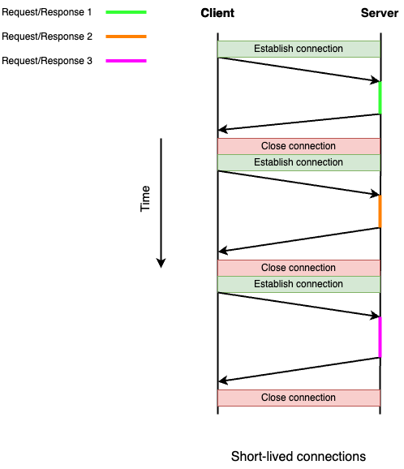
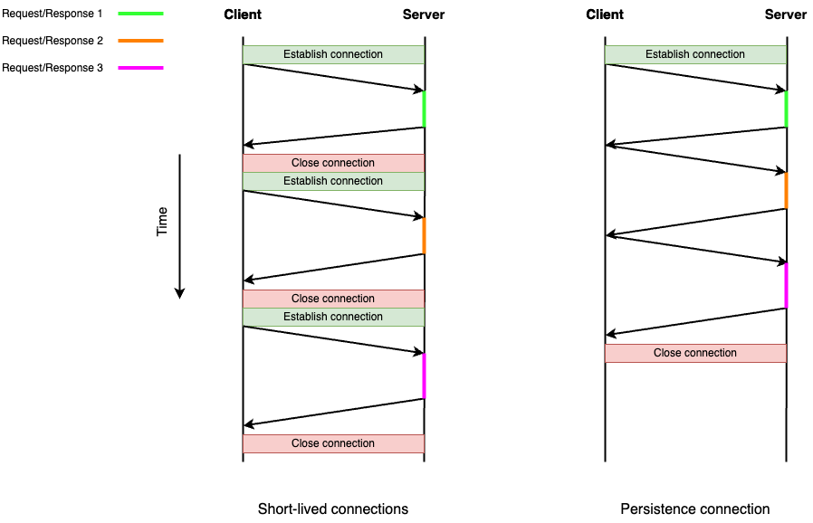
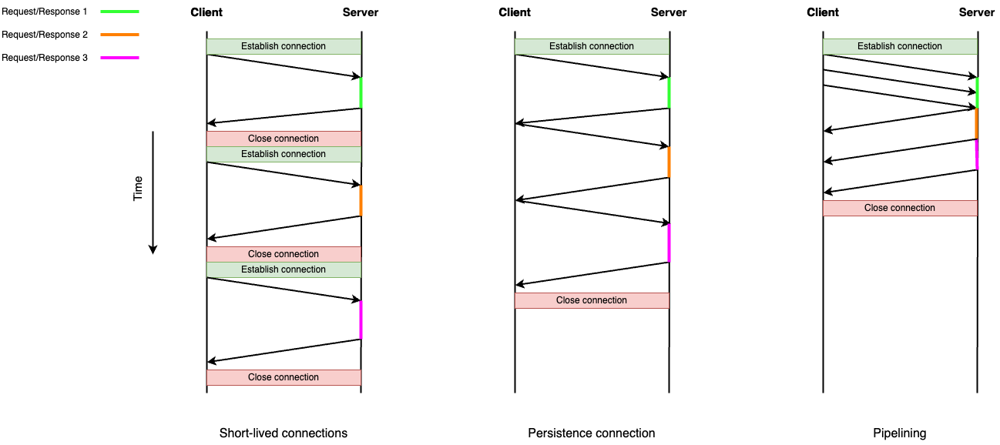
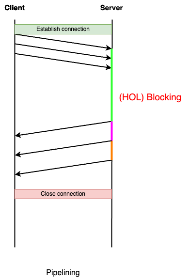

# 목차 

<br>

- [목차](#목차)
- [HTTP 진화과정 이해하기 첫번째 - HTTP 0.9부터 HTTP 1.1까지](#http-진화과정-이해하기-첫번째---http-09부터-http-11까지)
- [최초 버전이자 표준 이전의 HTTP - HTTP/0.9](#최초-버전이자-표준-이전의-http---http09)
- [HTTP/1.0](#http10)
- [HTTP/1.1](#http11)
- [HTTP/1.1 성능 개선의 임시방편 - TCP 연결 여러개 사용](#http11-성능-개선의-임시방편---tcp-연결-여러개-사용)
- [다음은](#다음은)
- [참고](#참고)

<br>

# HTTP 진화과정 이해하기 첫번째 - HTTP 0.9부터 HTTP 1.1까지
HTTP (HyperText Transfer Protocol)는 월드 와이드 웹상에서 많이 사용되는 정보를 주고받을 수 있는 프로토콜이다.

네트워크 장치 간에 정보를 전송하도록 설계되었으며 애플리케이션 계층 프로토콜로서 전송 계층위에서 실행된다.

많이 사용되는 이 프로토콜은 다양한 버전이 존재하며, 웹 사이트별로 각각 다른 버전을 사용한다.

이번 글을 시작으로 이러한 HTTP 각 버전의 차이점과 등장 배경 및 버전 별 특징을 정리해보고자 한다.

<br>

# 최초 버전이자 표준 이전의 HTTP - HTTP/0.9

<br>

💁‍♂️ **HTTP의 시작은 1989년 팀 버너스 리 (Tim Berners-Lee)에 의해 제안된 인터넷의 하이퍼텍스트 시스템이다**

1989년 CERN에서 일하던 Tim Berners-Lee와 그의 팀은 대학과 연구소의 학술적 정보를 저장하고 교환하기위한 하이퍼텍스트 시스템을 제안한다.

쉽게 말해 현재의 HTML파일을 주고받을 수 있는 시스템을 고안한 것인데, 이는 초기에 Mesh라고 불렸으며 1990년에 구현 과정에서 월드 와이드 웹(World Wide Web, 이하 웹)으로 이름이 변경되었다고한다.

> 하이퍼텍스트란 참조(하이퍼링크)를 통해 독자가 한 문서에서 다른 문서로 즉시 접근할 수 있는 텍스트를 의미한다. 지금의 HTML이라고 이해하면된다.

그리고 이때부터 HTTP는 연결 지향적인 특성을 지녀 UDP에 비해 안정적이고 신뢰성있는 통신을 제공하는 TCP/IP 프로토콜 기반으로 만들어졌다.

TCP가 트래픽을 최적화하는 흐름 제어나 혼잡 제어 기능을 기본적으로 제공하기에, 복잡한 사항을 무시하고 온전히 정보 교환하는 프로토콜만 신경쓰면되기때문에 용이성 측면에서 채택된 것으로 보인다.

<br>

💁‍♂️ **초기 버전인 HTTP/0.9는 매우 단순한 프로토콜이었다.**

초기의 HTTP는 그저 하이퍼텍스트만을 통신하기위해 고안되었으며, TCP/IP 위에서 동작하기에 매우 단순했다.

이미지는 처리할 수 없고 텍스트만 다룰 수 있는 HTML만을 가져오도록 설계되었으며, 헤더없이 GET 메서드만 존재했다.

굉장히 단순한 요청과 응답만 할 수 있었으며, 상태 코드도 없었기때문에 문제가 발생할 경우 특정 html 파일에 오류 관련 설명과 함께 보내졌다.

> [초창기 HTTP 사양](https://www.w3.org/Protocols/HTTP/AsImplemented.html)

<br>

💁‍♂️ **HTTP/0.9의 스펙을 정리하면 아래와 같다.**

- TCP/IP 링크 위에서 동작하는 ASCII 프로토콜
- Get 메서드만 지원
- HTTP 헤더 X, 상태 코드 X
- 응답도 HTML 파일 자체만 보내줌
- 서버와 클라이언트 간의 연결은 모든 요청 후에 닫힘(closed)

<br>

# HTTP/1.0

<br>

💁‍♂️ **HTTP/1.0 탄생**

점차 웹이 인기를 끌면서 HTTP/0.9 사양에 만족하지 못한 여러 사용자와 브라우저 및 웹 서버 벤더들은 각각 HTTP에 여러 기능을 추가했다고한다.

문제는 HTTP에서 명시한 스펙이 없으므로 이들 간엔 다양한 혼란이 존재했다.

이때 이러한 다양한 요구사항을 만족시키며 스펙을 표준화하기위한 HTTP-WG (HTTP Working Group)이라는 조직이 탄생하였으며, 1996년 HTTP/0.9 버전에서 대폭 개선된 HTTP/1.0 스펙인 RFC1945가 발표되었다.

>  RFC 1945는 어렵게 생각할 필요없이 HTTP 1.0 프로토콜 통신 스펙에 관한 기술 문서 정도로 생각하면 된다.
> 
> 컨텐츠 인코딩, 다양한 글자 지원, 멀티파트 타입, 인가, 캐싱, 프록시, 날짜 형식 등을 문서화 하였다.

<br>

💁‍♂️ **HTTP/1.0에 정의된 주목할 만한 몇 가지 스펙**

- 헤더 (기본적인 HTTP 메서드와 요청/응답 헤더 추가)
- 응답 코드 (요청에 대한 성공/실패 여부를 담은 응답 코드 추가)
- 리다이렉트
- 다양한 파일 형식 지원(Content-Type 추가)
- 조건부 요청
- 콘텐츠 인코딩 (압축)
- 단기 커넥션 (매 Request&Response당 Connection 연결)

<br>

💁‍♂️ **문제점 -> Short-lived Connections**

HTTP는 두 엔드포인트가 연결될 수 있도록하는 근본적인 전송 프로토콜을 요구하진 않지만, 보통 데이터 전송에 대한 무결성을 만족하기위해 연결 기반 TCP 표준에 의존한다.

즉, HTTP는 TCP 위에서 실행되며, 애플리케이션 계층에서 TCP 연결 및 소켓이라는 인터페이스를 이용하여 HTTP 스펙에 부합하는 문자열을 주고받는 것이다.

이때 데이터를 주고받기위한 필수 조건으로 TCP 연결 (Connection)을 먼저 맺어야한다.

> 네트워크에서 배우는 3-way handshake와 4-way handshake를 통한 연결 및 끊기를 의미한다.

<p align="center"><br>Short-lived connections</p>

**이때 HTTP/1.0의 가장 큰 문제점이 나타나는데, 바로 HTTP의 비연결성 (connectionless) 특징으로인해 매 요청/응답마다 TCP 커넥션을 맺어야하는 Short-lived connections (단기 커넥션) 문제가 발생한다는 것이다.**

즉, **커넥션 하나당 하나의 요청/응답 처리만 수행하며, 매 요청마다 새로운 TCP 커넥션을 맺는 구조이다.**

데이터를 주고받을 때마다 매번 3-way handshake로 연결을 맺고, HTML (혹은 다른 데이터)를 받고나서 4-way handshake로 연결 끊기를 반복한다.

이는 성능상 당연히 큰 손해를 볼 수 밖에 없는 구조였다.

<br>

# HTTP/1.1

HTTP/1.0이 나오고 얼마 되지 않아 1.1 버전이 발표되었고, 이 프로토콜은 지금까지 20년 넘게 명맥을 유지하고 있다.

[HTTP/1.1 목표](https://datatracker.ietf.org/doc/html/rfc2068#section-1.1)을 살펴보면 아래와 같이 명시하고있다.

```text
HTTP/1.0 does not sufficiently take into consideration the effects of hierarchical proxies, caching, the need for persistent connections, and virtual hosts. 

In addition, the proliferation of incompletely-implemented applications calling themselves "HTTP/1.0" has necessitated a protocol version change in order for two communicating applications to determine each other's true capabilities.
```

정리하면 아래 두 가지를 보완하고자 HTTP/1.1을 설계했음을 알 수 있다.

* HTTP/1.0 스펙에서 계층적 프록시, 캐싱, 지속 연결성에 대해서 고려하지 못한 부분이 많아 보완하고자함.
* HTTP/1.0로 통신한다고 명시하고 스펙을 제대로 구현하지않는 경우가 많음.

<br>

💁‍♂️ **TCP 연결 재활용 - Persistence connection**

HTTP/1.0의 가장 큰 문제는 Short-lived connections이었다.

이는 HTTP가 TCP 연결 기반위에서 신뢰성을 확보함과 동시에 비연결성을 만족시키기위해 매 요청/응답마다 커넥션을 맺고 끊기때문에 발생하는 문제다.

**HTTP/1.1에선 Persistence connection이란 이름으로 한 번 연결을 맺으면 지정한 timeout동안 지속적으로 연결을 유지하도록 이 문제를 보완했다.**

즉, **두 엔드포인트간에 TCP 연결이 맺어지면 timeout동안 유지되며, 여러 개의 요청/응답을 주고받을 수 있는 구조다.**

이런 지속 연결을 위해 HTTP/1.1에선 `keep-alive`라는 헤더가 추가되었다.

실제로 이 헤더를 사용하여 연결의 timeout을 설정한다.

<p align="center"><br>Persistence connection</p>

<br>

💁‍♂️ **의도는 좋았으나 잘 안되었던 개선 스펙 - Pipelining**

HTTP/1.1에선 TCP 연결을 지속하는 Persistence connections외에도 네트워크적 비용을 줄이기위해 Pipelining을 스펙에 추가했다.

**파이프 라이닝은 클라이언트가 여러 개의 요청을 보낼 때 처음 요청이 응답될 때까지 기다리지않고 모든 요청을 동시에 전송할 수 있는 기능이다.**

<p align="center"><br>Pipelining</p>

즉, 여러 개의 요청을 한꺼번에 보내서 응답을 받음으로서 대기시간을 줄이는 기술이다.

**문제는 HTTP/1.1에서의 서버는 요청이 들어온 순서대로 (FIFO) 처리후 응답을 반환해야한다.**

이유는 HTTP/1.1에서 응답으로 자신이 속한 요청을 나타내는 식별자가 없기  때문입니다.

다시 말해, HTTP/1.1에선 서버가 순서대로 응답하는 것 외엔 요청을 응답과 연결할 수 있는 방법이 없다.

서버의 응답이 순서 없이 반환될 경우 클라이언트는 어떤 요청에 대한 응답인지 알 수 없다는 의미다.

이는 **아래와 같이 어떤 한 요청을 처리하는 데 시간이 오래 걸리는 경우, Head Of Line (HOL) Blocking 현상으로 인해 다른 요청들에 대한 응답도 함께 지연되는 문제가있다.**

<p align="center"> </p>

그리고 아래 내용은 [HTTP/1.1 Pipelining 스펙](https://datatracker.ietf.org/doc/html/rfc2068#section-8.1.2.2)에 정의된 내용으로 클라이언트와 서버가 각 상황별로 구현해야하는 부분이 까다로운 것을 알 수 있다.

```text
A server MUST send its responses to those requests in the same order that the requests were received.

Clients which assume persistent connections and pipeline immediately after connection establishment SHOULD be prepared to retry their connection if the first pipelined attempt fails. 

If a client does such a retry, it MUST NOT pipeline before it knows the connection is persistent. 

Clients MUST also be prepared to resend their requests if the server closes the connection before sending all of the corresponding responses.
```

**스펙에 맞게 구현했다해도 제대로 동작한다는 보장도 없다. 이로인해 인터넷상의 서버와 프록시중 파이프라이닝을 제대로 구현한 곳은 거의 없으며, 있더라도 제대로 동작하지 않는 경우가많아 현재는 잘 사용되지 않는다.**

> 이러한 이유로 Pipelining은 HTTP/2에서 사용되는 더 나은 알고리즘인 multiplexing으로 대체되었다. 이와 관련해서는 다음 글에서 다룬다.

<br>

💁‍♂️ **그 외 HTTP/1.1에 추가된 스펙**

- cacheability (헤더의 확장)
- OPTIONS 메서드
- Upgrade 헤더
- Range 요청
- Transfer-Encoding 압축

<br>

# HTTP/1.1 성능 개선의 임시방편 - TCP 연결 여러개 사용

앞서 말했듯이, HTTP/1.1은 HTTP/1.1에서의 서버는 요청이 들어온 순서대로 (FIFO) 처리후 응답을 반환해야한다.

일반 사용자가 브라우저에서 네이버와 같은 웹사이트를 접속한다고 가정한다면, 네이버 페이지엔 HTML과 다양한 CSS, 이미지를 불러와야하는데 이를 하나하나 순서대로 가져온다면 랜더링이 점차 느려지는 문제가 발생한다.

**결국 병렬 처리가 필요한 상황에서 HTTP/1.1 스펙상으론 한계가 존재했다.**

**결국 브라우저는 물리적인 TCP 연결을 여러 개 두는 방식으로 병렬 연결을 구현하게되었다.**

각 연결로 요청을 전송해 어느정도 병렬 처리가 가능하도록한 것이다.

<br>

다음 글에서 얘기할 내용인 부분이지만 살짝 얘기하자면, 이렇게 TCP 연결을 여러개 사용한다면 어느정도 병렬 처리가 가능하다.

**다만 TCP 특성상 각 연결마다 TCP 혼잡 제어로인해 적합한 혼잡 윈도우 크기를 찾아야하며, 여전히 각 연결은 HOL 블로킹의 영향을 받게되는 문제가있다.**

**한마디로 HTTP/1.1의 성능적인 문제를 어느정도는 해결하지만, 임시적인 해결책일 뿐 근본적인 해결책은 아니라는 의미이다.**

<br>

# 다음은

이번 글은 HTTP/0.9부터 HTTP/1,1까지의 발전과정을 살펴보며 어떻게 HTTP가 발전해왔는데 살펴보았다.

HTTP/1.1은 구현의 단순성과 접근성에 주안점을 두고 최적화한 프로토콜이다보니 지금까지도 사실 굉장히 보편적으로 사용되는 버전이다.

다만 여전히 성능측면에서 취약한 부분이 많다. 다음 글에선 HTTP/1.1의 성능적인 측면에서의 문제점을 바탕으로 HTTP/2.0 발전 과정을 살펴본다.

<br>

# 참고
* 러닝 HTTP/2.0
* https://developer.mozilla.org/ko/docs/Web/HTTP/Basics_of_HTTP/Evolution_of_HTTP
* https://developer.mozilla.org/en-US/docs/Web/HTTP/Connection_management_in_HTTP_1.x
