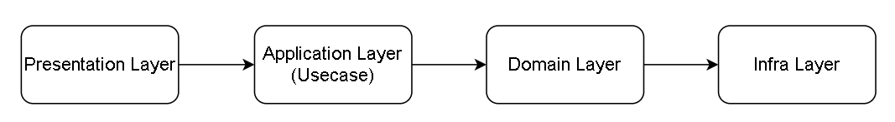

# 목차

 

- [목차](#목차)
- [웹 애플리케이션 레이어](#웹-애플리케이션-레이어)
  - [개요](#개요)
  - [계층은 왜 분리하는 것일까?](#계층은-왜-분리하는-것일까)
  - [웹에선 어떤 계층 구조를 사용할까?](#웹에선-어떤-계층-구조를-사용할까)
    - [프레젠테이션 계층](#프레젠테이션-계층)
    - [애플리케이션 계층 (서비스 계층)](#애플리케이션-계층-서비스-계층)
    - [비즈니스 계층 (Domain)](#비즈니스-계층-domain)
    - [영속 계층](#영속-계층)
  - [Spring 웹 계층 구조](#spring-웹-계층-구조)
- [계층에 대한 토론](#계층에-대한-토론)
  - [계층 구조를 그냥 건너뛰면 안되나?](#계층-구조를-그냥-건너뛰면-안되나)
  - [DTO와 도메인(Entity)간의 변환 작업은 어디에서 수행되어야 하는가?](#dto와-도메인entity간의-변환-작업은-어디에서-수행되어야-하는가)
    - [도메인 모델 보호 관점](#도메인-모델-보호-관점)
    - [정답은 없다](#정답은-없다)
  - [Service Layer는 DTO와 도메인(혹은 엔티티)중 뭐를 반환해야하는가?](#service-layer는-dto와-도메인혹은-엔티티중-뭐를-반환해야하는가)
    - [Service Layer에서 Presentation Layer로 반환할 때](#service-layer에서-presentation-layer로-반환할-때)
    - [Service Layer에서 Service Layer의 다른 Component로 반환할 때](#service-layer에서-service-layer의-다른-component로-반환할-때)
  - [Repository와 DAO](#repository와-dao)
    - [Repository](#repository)
    - [DAO](#dao)
    - [차이점](#차이점)
  - [DB에 대한 예외처리는 어디서 하는 것이 좋은가?](#db에-대한-예외처리는-어디서-하는-것이-좋은가)
  - [Dao는 Optional을 반환하는 것과 도메인을 반환하는 것중 무엇이 더 좋을까??](#dao는-optional을-반환하는-것과-도메인을-반환하는-것중-무엇이-더-좋을까)
- [참고](#참고)

 

# 웹 애플리케이션 레이어

 

## 개요
웹 애플리케이션을 구현하면서 항상 다음과 같은 물음표가 따른다.

`이 코드는 여기에 있는게 맞는가? 이 책임은 이 레이어가 담당하는게 맞는가?`

많은 사람들과 이와 관련된 토론을 해보았지만, 정말 사람마다 생각하는 것이 다르다는 것을 알게 되었다.

그래서 이참에 `웹 애플리케이션 레이어에 대한 여러 주장을 정리`해보고자 한다.

 

## 계층은 왜 분리하는 것일까?

🤔 계층 구조를 나누는 의미는 무엇일까?

* **첫번째는 계층간의 `추상화`다.**
  * 각각의 계층을 **추상화한다면, 각기 다른 계층끼리 부품을 갈아끼우듯이 변경이 가능하다.**
  * 각 계층은 어떤 역할을 한다는 명세를 따라 구현하면 된다. 그럼 자연스레 레이어의 구현 세부사항은 은폐된다.
* **두번째는 계층간의 `의존 관계 깨끗함`이다.**
  * 어떤 비즈니스 요청을 처리하는 웹 애플리케이션이 계층 구조가 없다면 스파게티 코드(의존성이 뒤죽박죽)가 나오기 쉽다.
  * 각 계층의 분리하고, 역할을 분명히한다면 깔끔한 구조로 코드를 작성할 수 있다.
* **세번째는 계층간의 `독립적인 개발 => 개발 속도 + 유지보수`이다.**
  * 각 계층별로 역할이 분명이 나눠졌다면, 여러 개발자들이 동시에 자신이 맡은 계층만을 구현하고 합치면 빠르게 전체 애플리케이션을 구현할 수 있다.
  * 그리고 이러한 독립이라는 특징은 **유지보수**도 비교적 수월하다.
  * ex. 프론트엔드 / 백엔드 (프리젠테이션, 비즈니스, DB)
* **네번째는 계층간의 독립성이다.**
  * 각 계층은 독립적이여야 하며, 자신의 의존성을 드러내면 안된다.
  * 즉, 서로 연결되지 않은 계층끼리는 서로 알지 못한다.
  * 왜 이렇게까지 분리하는 것일까?? Presentation Layer에서 바로 Persistence Layer에 의존하면 안될까?
    * 안된다고 본다. 그 이유는 해당 Persistence Layer의 변경이 Presentation과 Business Layer 모두에 영향이 가기 때문이다. 또한, 밀접한 계층이 아닌 계층끼리 의존하다보면 구성 요소간의 의존성이 복잡해진다. (스파게티 코드)

 

이외에도 여러가지 나누는 이유가 존재할 듯하다. (발견하는대로 추가할 예정)

개인적으로는 계층을 나누는 이유가 객체지향에서 객체를 분리하는 이유와도 비슷하다고 생각든다.

그래서 계층을 분리하는 것은 객체지향의 특징을 그대로 물려 받는다고도 생각든다. 

`캡슐화`, `다형성`, `추상화` (상속은 빼고!)

 

## 웹에선 어떤 계층 구조를 사용할까?

웹 애플리케이션에서는 보통 수평적인 계층 구조를 가진다. 그리고 각 계층은 애플리케이션 내에서 각자의 특정 역할을 수행한다.

 출처: https://ko.wikipedia.org/wiki/%EB%8B%A4%EC%B8%B5_%EA%B5%AC%EC%A1%B0

일반적으로 다음과 같이 계층 구조를 나눈다.
* 프레젠테이션 계층 (Presentation Layer)
* 애플리케이션 계층 (Application Layer) => Service Layer
* 비즈니스 계층 (Business Layer) => Domain
* 데이터 접근 계층 (Persistence Layer)

> 비즈니스 계층을 Domain으로 봐도 되는가??

 

### 프레젠테이션 계층

 

**개념**
* **Presentation Layer == UI Layer** (Web UI, 앱, Native GUI)
  * UI가 변경되면 같이 변경되는 계층. ([Martin Flower](https://martinfowler.com/eaaDev/SeparatedPresentation.html))
  * the presentation layer doesn’t need to know or worry about how to get customer data; **it only needs to display that information on a screen in particular format** - [Software Architecture Patterns by Mark Richards](https://www.oreilly.com/library/view/software-architecture-patterns/9781491971437/ch01.html)
* 더 큰 범위의 계층에서의 의미 => **자원에 대한 표현**
  * presents the application’s features and data to the user.

 

**역할과 책임**
* 요청과 응답
  * 사용자의 입력(브라우저)을 처리하고 올바른 응답을 사용자에게 반환해야 한다.
* 예외 처리
  * 다른 계층이 던진 예외도 처리해야 한다.
* 인증
  * 애플리케이션의 진입점이기 때문에 인증을 관리하고 무단 사용자를 방어하는 첫번째 방어선 역할을 한다.

 

### 애플리케이션 계층 (서비스 계층)

 

**Service계층에서 비즈니스 로직을 처리하는 것이 아니다!**
* **이 계층은 트랜잭션, 도메인 간 순서 보장의 역할만 한다.**
* 그럼 **비즈니스 로직은 누가 처리하느냐!**
  * **바로 도메인(Domain)이다!**

 

**개념**

 출처: https://martinfowler.com/books/eaa.html p.133

* **Application Layer == Service Layer**
  * 보통 애플리케이션과 인프라 관련된 서비스를 가지고 있는다.
* **Domain Model을 묶어서 애플리케이션의 핵심 작업을 제어하는 계층**
  * 서비스 계층은 클라이언트 계층을 인터페이스하는 관점에서 응용 프로그램의 경계와 사용 가능한 작업 현황을 정의한다.
  * 애플리케이션 비즈니스 로직을 캡슐화하고, 운영을 구현하면서 트랜잭션을 제어하고, 응답을 조정한다.
  * **Martin Flower의 그림을 봐도 Service Layer안에 Domain Model을 가지고 있는다.**
* the business layer doesn’t need to be concerned about how to format customer data for display on a screen or even where the customer data is coming from; **it only needs to get the data from the persistence layer, perform business logic against the data (e.g., calculate values or aggregate data), and pass that information up to the presentation layer.** - [Software Architecture Patterns by Mark Richards](https://www.oreilly.com/library/view/software-architecture-patterns/9781491971437/ch01.html)
* Service에서 Service를 참조 가능하나 계층 구조가 명확해야한다.
  * 순환 참조가 발생할 수 있기 때문에

 

**역할과 책임**
* **도메인 간 순서 보장 역할**
  * 도메인 모델의 비즈니스 로직 하나를 호출하는 것만으로는 복잡한 작업을 처리할 수 없다.
  * 여러 도메인 모델에게 비즈니스 처리 요청을 위임하고, 도메인 간의 순서를 보장한다.
* 핵심 API
  * **가장 핵심에 가까운 API**를 제공하는 계층으로 볼 수 있다.
  * **Controller는 그저 UI Layer이기 때문에 진짜 핵심은 Service라고 보는 것이 맞는듯 하다.**
  * 요청이 UI를 통해 들어온거라면 Controller를 거치겠지만, 다른 경로로 들어온다면 (ex. 내부 API) 핵심 API를 처리하는 것은 Service기 때문이다.
* 트랜잭션 관리

 

### 비즈니스 계층 (Domain)

 

**개념**
* **Business Layer == Domain Model**
* **An object model of the domain that incorporates both behavior and data.** - [Martin Fowler](https://martinfowler.com/eaaCatalog/domainModel.html)
  * 서로 관련된 행위(비즈니스 로직)와 데이터를 모두 가지고있는 객체
* **중요한 점은 Model 클래스에 구조체 혹은 DTO처럼 데이터의 집합으로만 사용하는 것은 지양해야한다.** - [Martin Fowler](https://martinfowler.com/bliki/AnemicDomainModel.html)
  * 가장 좋은 것은 도메인을 먼저 만들어 DDD 방식의 애플리케이션을 개발하는 것이라고 생각든다.

 

**역할과 책임**
* 애플리케이션의 핵심 로직을 처리한다. (객체지향 개발)

 

### 영속 계층

 

**개념**
* Persistence (영속성)
  * 프로세스의 휘발성과 별개로 비휘발성으로 유지되는 상태의 특징 중 한가지.
  * 별도의 기억 장치에 데이터를 보존하는 것을 목적으로 한다.
* Persistence Layer (영속 계층)
  * **데이터 소스(DB 연결을 위한 정보)를 가지고 영속적인 CRUD를 제공하는 추상 계층**
  * DB의 세부내용을 노출하지 않고 특정 데이터 조작 기능을 제공한다.

 

## Spring 웹 계층 구조

🤔 그렇다면 스프링에선 어떻게 계층을 나눌까?

 출처: https://www.petrikainulainen.net/software-development/design/understanding-spring-web-application-architecture-the-classic-way/

* Web Layer
  * Web Layer는 프레젠테이션 계층을 의미한다.
    * 프레젠테이션 계층은 브라우저를 통해 사용자가 액세스할 수 있으며, 시스템과의 상호 작용을 지원하는 사용자 인터페이스 구성 요소와 UI 프로세스 구성요소로 구성된다.
    * **이외에도 필터(`@Filter`), 인터셉터, 컨트롤러 어드바이스(`@ControllerAdvice`)등 외부 요청과 응답에 대한 전반적인 영역을 의미한다.**
  * 이 계층은 가능한 한 가볍게 유지하고 MVC 작업의 메커니즘으로 제한한다.
    * 예를 들어 입력 수신 및 검증, 모델 개체 조작, 적절한 ModelAndView 개체 반환 등을 의미한다.
* Service Layer
  * Service Layer는 비즈니스 논리 계층을 의미한다.
    * 일반적으로 계산, 데이터 변환, 데이터 프로세스 및 레코드 간 검증이 이 계층에서 수행된다.
  * **Service Layer가 비즈니스 로직을 처리하는 것은 아니다!**
    * **그저 트랜잭션, 도메인 간 순서 보장의 역할만 한다.**
    * **비즈니스 로직을 처리하는 것은 도메인이다.**
* Repository Layer
  * Repository Layer는 데이터 액세스 계층을 의미한다.
    * DB와 같이 데이터 저장소에 접근하는 영역이다.
    * **일반적으로 CRUD작업으로 제한된다.**
* DTO
  * **DTO는 계층 간에 데이터 교환을 위한 객체를 이야기한다.**
    * ex. 뷰 템플릿 엔진에서 사용될 객체나 Repository Layer에서 결과로 넘겨준 객체 등이 이들을 의미할 수 있다.
  * DTO는 그저 간단한 데이터 컨테이너다.
    * DTO는 서로 다른 프로세스나 레이어간의 데이터를 전송하는 목적으로 사용된다.

 

# 계층에 대한 토론

 

## 계층 구조를 그냥 건너뛰면 안되나?

 

## DTO와 도메인(Entity)간의 변환 작업은 어디에서 수행되어야 하는가?
🤔  요청과 응답에 대한 DTO를 도메인으로 변환하는 것은 어떤 레이어에서 하는 것이 맞을까??

 

### 도메인 모델 보호 관점
도메인 모델을 외부에 공개하지 않고 보호해야한다는 주장에 따르면, Service에서 변환 작업을 해주는 것이 타당하다.

> Martin Fowler: the Service Layer defines the application's boundery, it encapsulates the domain. In other words it protects the domain.

마틴 파울러도 Service 계층은 애플리케이션의 경계를 정의하고, 비즈니스 로직 등 도메인을 캡슐화하는 역할이라고 정의했다. 즉, 도메인을 보호한다는 의미다.

도메인 모델을 Presentation 계층에게 반환할 경우 결합도가 증가하여, 도메인의 변경이 Controller의 변경을 촉발하는 유지보수의 문제로 이어질 수 있다.

이러한 관점에서 보면 DTO와 도메인(Entity)간의 변환 작업은 Service 계층에서 정의되어야 한다고 본다. 요청에 대한 응답 역시 Service 계층의 일부분이기 때문이다.

 

### 정답은 없다
그렇다고 꼭 DTO를 만들어서 반환하라는 것은 아니다.

DTO를 통해 도메인과 다른 계층을 분리할 수 있지만, 이럴경우 도메인 모델과 유사한 코드 복제가 빈번하게 발생하는 문제가 발생한다.

또한, Service 계층에서 DTO 변환 로직이 추가되는 경우 코드의 복잡성이 증가할 수도 있다.

결론적으론 작은 규모의 프로젝트에서는 DTO 사용은 불필요하다고 본다.

 

## Service Layer는 DTO와 도메인(혹은 엔티티)중 뭐를 반환해야하는가?
> 위 토론 내용과 유사한 주제이다.

 

### Service Layer에서 Presentation Layer로 반환할 때
* Presentation Layer는 오직 DTO만을 핸들링한다.
* Service Layer는 파라미터로 DTO를 받는다. 그리고 도메인 객체를 핸들링하고, DTO만을 Presentation Layer에 반환한다.
* Repository Layer는 엔티티를 메서드 매개 변수로 사용하고 엔티티(및 기본 타입)를 반환한다.

 

🤔 **서비스 계층이 굳이 DTO를 반환해야하는가? 그냥 도메인이나 VO를 반환하면 안되는가??**
* 좋은 생각이 아니라고 생각든다. 그 이유는
  * 도메인 모델은 애플리케이션의 내부 모델(비즈니스 로직)을 명시한다. **만약 이 도메인 모델을 외부에 공개된다면, 해당 클라이언트측은 그것을 사용하는 방법을 알아야 한다.** 다시 말해서, **애플리케이션의 클라이언트가 소유해야하는 것이 아닌 것들을 처리해야한다**. 만약 DTO를 사용한다면, 우리의 모델을 클라이언트에게 숨길 수 있기 때문에, 더 쉽고 깨끗한 API를 제공할 수 있다.
  * 만약 외부에 도메인 모델을 공개된다면, **이것에 의존하는 다른 것들을 깨지 않고는 변경할 수 없다.** DTO를 사용하면, **DTO를 변경하지 않는 한 도메인 모델을 변경할 수 있다.** (**DTO를 하나의 문처럼 사용하는 것!**)

> 위 내용은 [여기](https://www.petrikainulainen.net/software-development/design/understanding-spring-web-application-architecture-the-classic-way/)에서의 주장이다. 정답은 아니지만, 나도 위 내용에 동의한다!

 

### Service Layer에서 Service Layer의 다른 Component로 반환할 때
> 이 문제도 역시 정답은 없다고 생각든다.

**내가 처음 내린 결론은 `Service에서 Controller로 리턴할 때는 DTO, Service에서 Service로 반환할 때는 도메인`이다.**

하지만 역시 다른 사람의 의견이 궁금해 리뷰어인 `닉`에게 질문은 남겼고, 아래와 같은 답변을 받아볼 수 있었다.

> 닉이 나의 궁금증을 풀어주었다 :) 감사합니다!

 

> 이외에도 [stackoverflow - should-services-always-return-dtos-or-can-they-also-return-domain-models](https://stackoverflow.com/questions/21554977/should-services-always-return-dtos-or-can-they-also-return-domain-models) 에서 이 문제에 대해서 잘 정리하였다.

 

## Repository와 DAO
사람마다 영속 계층을 구현하는 방법이 모두 다르다.

누구는 Repository라고 부르며, 누구는 DAO라고 부른다.

🤔 이 둘의 차이점은 무엇일까??

 

### Repository

 

### DAO

 

### 차이점

 

## DB에 대한 예외처리는 어디서 하는 것이 좋은가?

 

## Dao는 Optional을 반환하는 것과 도메인을 반환하는 것중 무엇이 더 좋을까??

 

# 참고
* https://ko.wikipedia.org/wiki/%EB%8B%A4%EC%B8%B5_%EA%B5%AC%EC%A1%B0
* https://umbum.dev/1066
* https://martinfowler.com/eaaDev/SeparatedPresentation.html
* https://martinfowler.com/eaaCatalog/domainModel.html
* https://martinfowler.com/bliki/AnemicDomainModel.html
* https://ko.wikipedia.org/wiki/%EC%A7%80%EC%86%8D%EC%84%B1
* https://www.oreilly.com/library/view/software-architecture-patterns/9781491971437/ch01.html
* https://www.petrikainulainen.net/software-development/design/understanding-spring-web-application-architecture-the-classic-way/
* https://www.javaguides.net/2020/07/three-tier-three-layer-architecture-in-spring-mvc-web-application.html
* https://github.com/xlffm3/javable/blob/doc%2Fdto-layer-scope/src/content/post/2021-04-25-dto-layer-scope.md
* https://stackoverflow.com/questions/21554977/should-services-always-return-dtos-or-can-they-also-return-domain-models
