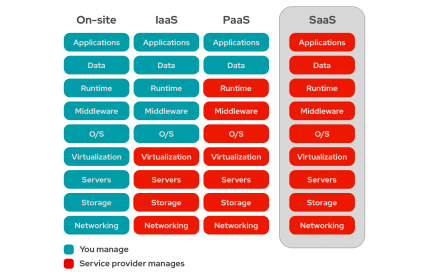
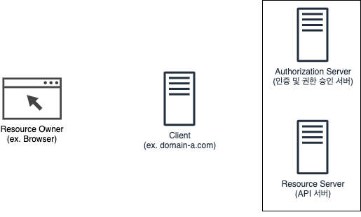
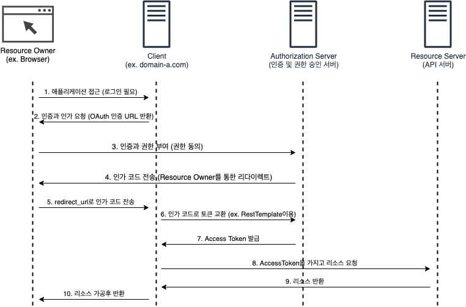
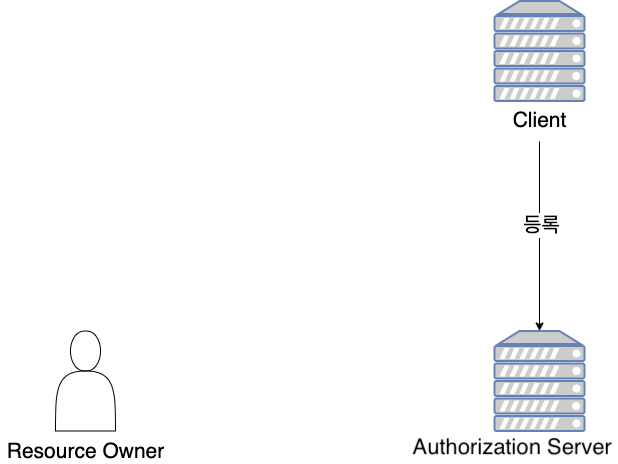
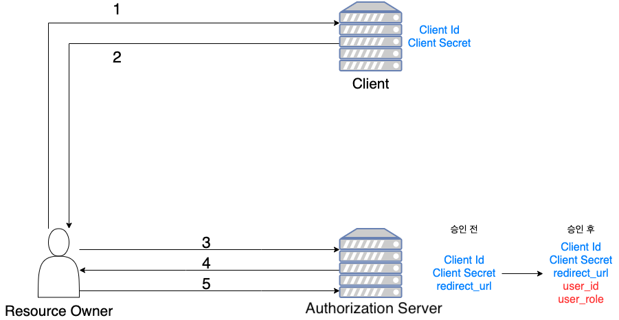
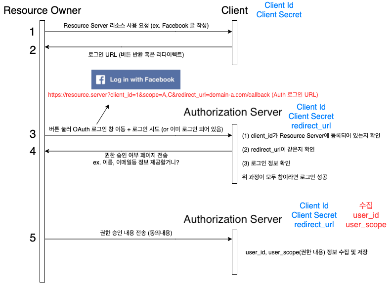
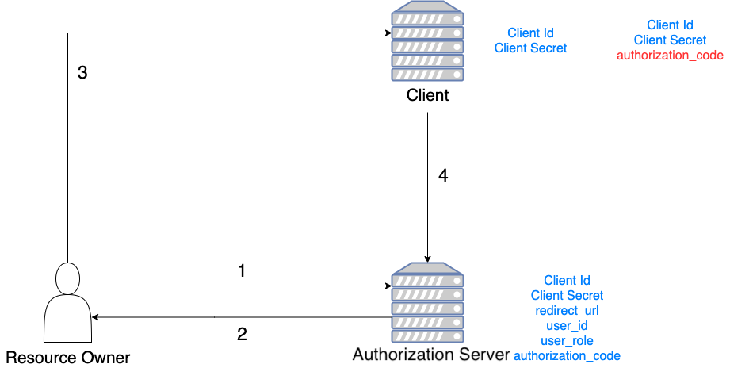
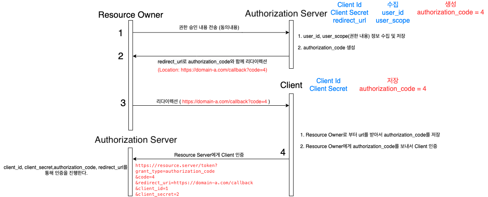
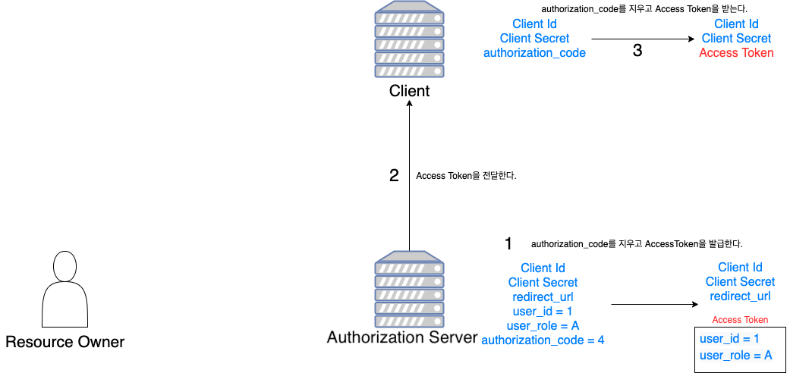
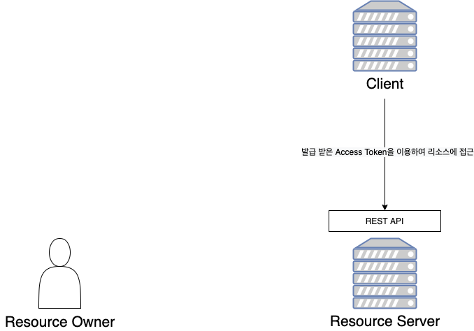

# 목차

 

- [목차](#목차)
- [개요](#개요)
  - [OAuth의 탄생과 사용](#oauth의-탄생과-사용)
  - [OAuth의 목적은 Authorization이다](#oauth의-목적은-authorization이다)
- [OAuth 2.0을 구성하는 요소](#oauth-20을-구성하는-요소)
- [OAuth 2.0 WorkFlow](#oauth-20-workflow)
  - [한눈에 보는 WorkFlow](#한눈에-보는-workflow)
  - [자세히 보는 WorkFlow](#자세히-보는-workflow)
    - [1 - OAuth 서버에 클라이언트 등록](#1---oauth-서버에-클라이언트-등록)
    - [2 - Resource Owner로부터의 승인](#2---resource-owner로부터의-승인)
    - [3 - Resource Server로부터의 승인](#3---resource-server로부터의-승인)
    - [4 - 액세스 토큰 발급](#4---액세스-토큰-발급)
    - [5 - REST API 호출 (리소스 접근)](#5---rest-api-호출-리소스-접근)
- [참고](#참고)

 

# 개요
애플리케이션 개발을하면 빼놓을 수 없는 개념이 하나 있다. 바로 로그인이다.

로그인을 해야 유저를 식별하고, 유저별 맞춤 서비스를 제공해줄 수 있기 때문이다.

그렇다면 매 애플리케이션마다 사용자가 회원가입하고, 관리하는 수고를 해야할까?

물론 아니다. 바로 OAuth를 사용하면 되기 때문이다.

최근의 인터넷 서비스는 그 자체가 SaaS(Software as a Service)라고 볼 수 있다.

 출처: https://www.redhat.com/ko/topics/cloud-computing/what-is-saas

즉, 서비스 중에서 사용자가 일부 필요한 것만 사용할 수 있게 한다는 것이다. (대표적으로 Google Docs가 있다.)

예를 들어, Github같은 경우 OAuth를 통하면 외부 서비스에서도 Github의 일부 기능을 사용할 수 있다.

이러한 방식은 Github같은 서비스 제공자뿐만 아니라 사용자와 여러 인터넷 서비스 업체 모두에 이익이 되는 생태계를 구축하는데 기여하게 된다.

그리고 이러한 방식에 중심에 있는 것이 바로 OAuth다!

 

## OAuth의 탄생과 사용
OAuth는 쉽게 말해서 인증을 위한 오픈 스탠더드 프로토콜이다.

사용자가 Github이나 Instagram 같은 인터넷 서비스의 기능을 다른 애플리케이션에서도 사용할 수 있게 한 것.

물론 OAuth전에도 인터넷 서비스 회사마다 아이디와 암호가 노출되지 않도록 하면서 API 접근 위임이 가능한 여러 인증 방법이 존재했다고 한다.

그러다 2006년 트위터의 개발자와 소셜 북마크 서비스인 Gnolia의 개발자가 만나 인증 방식에 대한 논의를 했다고 한다.

그들은 그때까지 API 접근 위임에 대한 공개 표준안이 없다는 결론에 이르렀다고 한다.

2007년 4월 OAuth의 인터넷 커뮤니티가 탄생하게 되었고, 소수 인원으로 새로운 공개 프로토콜의 초안을 작성했다.

그 결과 2007년 10월 3일, OAuth 코어 1.0의 최종 초안이 발표되었다.

그리고 2010년에 OAuth 1.0의 프로토콜 표준안인 RFC5849가 발표되었다.

현재 나와 있는 OAuth 2.0도 드래프트 단계에 있다고 한다. 하지만 여러 인터넷 서비스에서 OAuth 2.0을 표준안처럼 사용중이다.

> 이 말은 언젠가 또 OAuth 3.0이 나온다는 것을 의미한다.. 후.. ㅎ

 

## OAuth의 목적은 Authorization이다
OAuth와 로그인은 반드시 분리해서 이해해야 한다.

* 회사 사원이 해당 회사 건물에 출입하는 것 -> 로그인
* 외부 회사 사원이 방문증을 수령한 후 출입하는 것 -> OAuth

외부 회사 사원이 방문하기 위해선 꼭 해당 회사 직원의 인증이 필요하다.

또한, 방문증이란 사전에 정해진 곳만 다닐 수 있도록 한 것이므로, 사원증을 가진 사람과 출입할 수 있는 곳이 다르다.

OAuth의 Auth는 Authentication(인증)와 Authorization(인가) 둘 다 포함하고 있다.

다만, OAuth 인증을 진행할 때 해당 서비스 제공자는 '제 3자 어떤 정보나 서비스에 사용자의 권한을 접근하는 것을 허용하겠느냐?'라는 안내 메시지를 보여준다.

 OAuth의 Authentication Server에서 인증을 하면 인가 권할을 묻는다.

즉, **OAuth에도 인증 과정이 있지만, 근본 목적은 해당 서비스 API를 어디까지 호출할 수 있는지 권한을 부여해주고 권한에 맞는 자원을 제공해주는 것이다.**

 

# OAuth 2.0을 구성하는 요소

* Client: 개발자가 개발한 비즈니스 로직을 처리하는 Web 서버. (OAuth 서버 입장에서의 Client)
  * OAuth 사용자의 계정에 액세스하려는 애플리케이션.
* Resource Owner: OAuth 서버 (Authentication + API)에 저장되어있는 Resource(정보)의 주인. (사용자)
  * 애플리케이션이 자신의 계정에 액세스 할 수 있도록 승인하는 사용자.
  * 사용자 계정에 대한 애플리케이션의 액세스 권한을 제한한다.
* Resource Server: 데이터(자원)을 가지고 API를 통해 반환해주는 서버. (REST API)
  * 보호된 사용자 계정의 자원을 호스팅.
* Authorization Server: 인증 및 인가 관련된 처리를 담당하는 서버. (인증 및 인가 서버)
  * 사용자 인증을 통해 액세스 토큰을 발행한다.

 

# OAuth 2.0 WorkFlow

 

## 한눈에 보는 WorkFlow

최대한 한눈에 볼 수 있도록 정리하려고 노력했다..

 

## 자세히 보는 WorkFlow
조금 자세하게 보면 OAuth로부터 Access Token을 발급하는 과정은 다음과 같다.
1. Authorization 서버에 클라이언트 등록
2. Resource Owner(사용자)로부터의 승인 (로그인 + 접근 권한)
3. Authorization로부터의 승인
4. 엑세스 토큰 발급
5. REST API 호출 (리소스 접근)

 

### 1 - OAuth 서버에 클라이언트 등록
> 이 과정은 OAuth 서버 (Authorization Server)에 클라이언트 (개발자가 개발한 웹서버)를 등록하는 과정이다.

 OAuth 서버에 클라이언트 등록

 

* OAuth 서버에 등록을 하면 아래 내용들을 발급받는다.
  * Client ID
    * Resource Server에서 클라이언트를 식별하는데 사용하는 키.
  * Client Secret
    * 절대 공유되면 안되는 키.
  * Authorized Redirect URIs
    * Authentication Server가 권한을 부여하는 과정에서 Authentication Code를 이 주소로 보낸다.
    * 즉, 인증 성공 후 Authentication Server에서 사용자를 반환하는 콜백 URL이다.
    * 또한, Resource Server는 이 주소에서 보낸 요청이 아니면 무시한다.

 

### 2 - Resource Owner로부터의 승인
> 이 과정은 Resource Owner (브라우저)로부터 Client 서버가 OAuth 서버에 접속하는 것에 동의를 구하는 과정이다. (로그인 기능, 리소스 접근 권한등)

 

 전체적인 Flow

 

 자세한 Flow

 

### 3 - Resource Server로부터의 승인
> 바로 AccessToken을 발급하지 않고, 하나의 절차를 더 진행한다.
> 
> 이전 단계에서 Resource Owner(사용자)로부터 승인을 받았으니, 이제 Authorization Server가 승인을 해줄 차례다.
> 
> Client와 Resource Owner가 통신하는 것인지 Authorization Server에게 확인 받는 과정 (3자간의 인증)

 

 전체적인 Flow

 

 자세한 Flow

 

### 4 - 액세스 토큰 발급
> 이제 3자간의 인증은 모두 완료했다. 토큰을 발급하는 차례다.

 

 전체적인 Flow

1. Client로부터 authorization_code를 포함한 URL을 받고, 인증이 완료되었다면, Resource Server는 액세스 토큰을 발급한다.
2. 발급한 액세스 토큰은 Client에게 전달한다.

 

### 5 - REST API 호출 (리소스 접근)
> 이제 액세스 토큰도 얻었으니, OAuth 서버에 저장된 리소스에 접근할 수 있다.

 

* 액세스 토큰을 이용하여, Resource Server로부터 인증과 관련 데이터를 접근할 수 있게 된다.
* 물론 Resource Owner(사용자)에서도 바로 접근이 가능하다.
  * 하지만, Client 서버만의 토큰과 Resource Server에서 발근한 토큰을 분리시키는 것이 좋다고 생각든다.

 

# 참고
* https://d2.naver.com/helloworld/24942
* https://ko.wikipedia.org/wiki/OAuth#%EC%97%AD%EC%82%AC
* https://www.redhat.com/ko/topics/cloud-computing/what-is-saas
* https://datatracker.ietf.org/doc/html/rfc6749
* https://developers.google.com/identity/protocols/oauth2