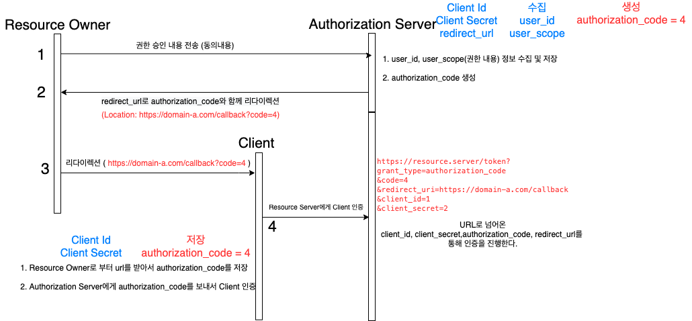

# 목차

 

- [목차](#목차)
- [OAuth 2.0](#oauth-20)
  - [OAuth 2.0를 구성하는 요소](#oauth-20를-구성하는-요소)
  - [OAuth 2.0 동작 원리 첫 번째 - Access Token 발급 과정](#oauth-20-동작-원리-첫-번째---access-token-발급-과정)
    - [OAuth 서버에 클라이언트 등록](#oauth-서버에-클라이언트-등록)
    - [Resource Owner로부터의 승인](#resource-owner로부터의-승인)
    - [Resource Server로부터의 승인](#resource-server로부터의-승인)
    - [액세스 토큰 발급](#액세스-토큰-발급)
  - [OAuth 2.0 동작 원리 - REST API 호출 (리소스 접근)](#oauth-20-동작-원리---rest-api-호출-리소스-접근)
  - [Refresh Token](#refresh-token)
- [출처](#출처)

 

# OAuth 2.0
> OAuth는 Authentication(인증)이 아닌 Authorization(승인) between services이다.

 

## OAuth 2.0를 구성하는 요소

 OAuth 2.0을 구성하는 요소

* Client: 개발자가 개발한 비즈니스 로직을 처리하는 Web 서버.
* Resource Owner: Resource Server에 저장 돼 있는 Resource(정보)의 주인(사용자).
* Resource Server: 데이터(자원)를 가지고 API를 통해 반환해주는 서버. (REST API)
* Authentication Server: 인증과 관련된 처리를 담당하는 서버. (인증 서버)

 

## OAuth 2.0 동작 원리 첫 번째 - Access Token 발급 과정

 간략하게 보면 위와 같다. 출처: https://developers.google.com/identity/protocols/oauth2

조금 자세하게 보면 OAuth로부터 Access Token을 발급하는 과정은 다음과 같다.
1. Authorization 서버에 클라이언트 등록
2. Resource Owner(사용자)로부터의 승인 (로그인 + 접근 권한)
3. Authorization로부터의 승인
4. 엑세스 토큰 발급

 

### OAuth 서버에 클라이언트 등록
> 이 과정은 OAuth 서버 (Authorization Server)에 클라이언트(개발자가 개발한 웹서버)를 등록하는 과정을 의미한다.

 OAuth 서버에 클라이언트 등록

 

* OAuth 서버에 등록을 하면 아래 내용들을 발급받는다.
  * Client ID
    * Resource Server에서 클라이언트를 식별하는데 사용하는 키.
  * Client Secret
    * 절대 공유되면 안되는 키.
  * Authorized Redirect URIs
    * Authentication Server가 권한을 부여하는 과정에서 Authentication Code를 이 주소로 보낸다.
    * 즉, 인증 성공 후 Authentication Server에서 사용자를 반환하는 콜백 URL이다.
    * 또한, Resource Server는 이 주소에서 보낸 요청이 아니면 무시한다.

 

### Resource Owner로부터의 승인
> 이 과정은 Resource Owner(사용자)로부터 Client 서버가 OAuth 서버에 접속하는 것에 동의를 구하는 과정 (로그인기능, 리소스 접근 권한)

 

 전체적인 Flow

 

 자세한 Flow

 

### Resource Server로부터의 승인
> 바로 AccessToken을 발급하지 않고, 하나의 절차를 더 따른다.
> 
> 이전 단계에서 Resource Owner(사용자)로부터 승인을 받았으니, 이제 Authorization Server가 승인을 해줄 차례다.
> 
> Client와 Resource Owner가 통신하는 것인지 Authorization Server에게 확인 받는 과정 (3자간의 인증)

 

 전체적인 Flow

 

 자세한 Flow

 

### 액세스 토큰 발급
> 이제 3자간의 인증은 모두 완료했다. 토큰을 발급하는 차례다.

 

 전체적인 Flow

1. Client로부터 authorization_code를 포함한 URL을 받고, 인증이 완료되었다면, Resource Server는 액세스 토큰을 발급한다.
2. 발급한 액세스 토큰은 Client에게 전달한다.

 

## OAuth 2.0 동작 원리 - REST API 호출 (리소스 접근)
> 이제 액세스 토큰도 얻었으니, OAuth 서버에 저장된 리소스에 접근할 수 있다.

 

* 액세스 토큰을 이용하여, Resource Server로부터 인증과 관련 데이터를 접근할 수 있게 된다.
* 물론 Resource Owner(사용자)에서도 바로 접근이 가능하다.
  * 하지만, Client 서버만의 토큰과 Resource Server에서 발근한 토큰을 분리시키는 것이 좋다고 생각든다.

 

## Refresh Token

 출처: https://datatracker.ietf.org/doc/html/rfc6749#section-1.3

 

# 출처
* 생활 코딩 - OAuth 2.0
* https://datatracker.ietf.org/doc/html/rfc6749
* https://developers.google.com/identity/protocols/oauth2
