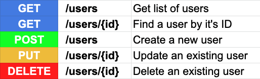

# 목차

- [REST API 정리](#rest-api-정리)
  * [1 REST](#1-rest)
    + [1-1 REST란?](#1-1-rest란)
    + [1-2 REST 구성](#1-2-rest-구성)
    + [1-3 REST의 제약조건 ( 특징 )](#1-3-rest의-제약조건--특징-)
  * [2 REST API](#2-rest-api)
    + [2-1 REST API란](#2-1-rest-api란)
    + [2-2 REST API 설계 필수 규칙](#2-2-rest-api-설계-필수-규칙)
    + [2-3 REST API 설계 시 주의할 점](#2-3-rest-api-설계-시-주의할-점)
  * [3 RESTful](#3-restful)
    + [3-1 RESTful이란](#3-1-restful이란)
    + [3-2 RESTful 하지 못한 경우](#3-2-restful-하지-못한-경우)
  * [4 사용하기 쉽고 유연한 REST API 설계 방법](#4-사용하기-쉽고-유연한-rest-api-설계-방법)
- [참고](#참고)

# REST API 정리

> `로이 필딩`의 2000년 박사학위 논문에서 소개되어 지금까지 많이 사용되고 있는 REST API에 대해 정리한 자료.

## 1 REST

### 1-1 REST란?

🤔 REST (Representational State Transfer)

* **분산 하이퍼미디어 시스템 (예 : 웹)을 위한 아키텍쳐 스타일**
  * 아키텍쳐 스타일: 제약조건들의 집합
  * 즉, REST의 제약조건들을 모두 지켜야 REST인 것이다.
* 자원을 이름(자원의 표현)으로 구분하여 해당 자원의 상태(정보)를 주고 받는 모든 것을 의미한다.
  * 자원(Resource)의 표현(Representation)에 의한 상태 전달
* CRUD
  * Create - 생성 (POST)
  * Read - 조회 (GET)
  * Update - 수정 (PUT)
  * Delete - 삭제 (DELETE)
  * Header - header 정보 조회 (HEAD)

### 1-2 REST 구성

* 자원 (Resource) : URI
  * 모든 자원은 URI라는 고유한 ID가 존재하며, 자원은 서버에 존재한다.
  * 클라이언트는 URI만으로 자원을 지정하고 해당 자원의 상태(정보)에 대한 조작을 서버에 요청한다.
* 행위 (Verb) : HTTP method
  * GET, POST, PUT, DELETE
* 표현 (Representation)
  * 클라이언트가 자원의 상태(정보)에 대한 조작을 요청하면 서버는 이에 적절한 응답을 보낸다.
  * REST에서 하나의 자원은 JSON, XML등 여러 형태의 Representation (표현)으로 나타내어 질 수 있다.

### 1-3 REST의 제약조건 ( 특징 )

💁‍♂️ REST는 제약조건을 모두 지켜야 REST이다.

1. client - server
   * 서버와 클라이언트가 각각 역할을 확실히 구분하여 서로간의 의존성을 줄인다.
     * 서버 : REST API 제공, 비즈니스 로직 처리 담당.
     * 클라이언트 : 사용자 인증, 컨텍스트 (세션, 로그인 정보)등을 관리라고 책임진다.
2. stateless (무상태성)
   * REST는 작업을 위한 상태정보를 따로 저장하고 관리하지 않는다.
   * 즉, 세션 정보나 쿠키정보를 별도로 저장하고 관리하지 않기 때문에 API 서버는 들어오는 요청만을 단순히 처리하면 된다.
   * 서비스의 자유도가 높아지고 서버에서 불필요한 정보를 관리하지 않음으로써 구현이 단순해진다.
3. cache (캐시)
   * REST는 HTTP 웹 표준을 그대로 사용하기 때문에, 웹에서 사용하는 기존 인프라를 그대로 활용이 가능하다. 따라서 HTTP가 가진 캐싱 기능이 적용 가능하다.
4. uniform interface
   * 제약 조건
     * identification of resources - 리소스가 URL로 식별되면 된다.
     * manipulation of resources through representations - REST를 이용해서 리소스를 조작할 수 있어야한다.
     * self-descriptive messages -  메시지는 스스로를 설명되야해야한다.
       * **메시지만 보고도 쉽게 이해할 수 있는 자체 표현 구조로 되어 있어야한다.**
     * hypermedia as the engine of application state (HATEOAS) - 애플리케이션의 상태는 Hyperlink를 이용해 전이되어야한다. (사이트의 버튼(하이퍼링크)를 통해 전이를 해야한다.)
   * 왜 uniform interface를 지켜야 하는가? - 독립적 진화때문
     * 서버와 클라이언트가 각각 독립적으로 진화하기 위해
     * 서버의 기능이 변경되어도 클라이언트를 업데이트할 필요가 없다.
     * REST를 만들게 된 계기 : `How do i improve HTTP without breaking the Web.`
     * 상호운용성 - HTTP에서 글자 하나 바꾸면 이전에 나왔던 웹에선 이를 인식못할 수도 있기 때문.
5. layered system (계층형)
   * REST 서버는 다중 계층으로 구성될 수 있으며 보안, 로드 밸런싱, 암호화 계층을 추가해 구조상의 유연성을 둘 수 있고 프록시, 게이트웨이 같은 네트워크 기반의 중간매체를 사용할 수 있게 한다.
6. code-on-demand (optional)
   * 서버에서 코드를 클라이언트로 보내서 실행할 수 있어야 한다. (JS)

> 현재 REST API로 불리는 대부분의 API는 로이 필딩이 정의한 REST를 따르지 않고 있으며, 그중에서도 특히 Self-descriptive Message와 HATEOAS가 지켜지지 않음을 지적하였다. - [그런 rest api로 괜찮은가]() -

## 2 REST API

### 2-1 REST API란

🤔 REST API

* REST 기반의 규칙들을 지켜서 설계된 API
* REST는 HTTP 표준을 기반으로 구현하므로, HTTP를 지원하는 프로그램 언어로 클라이언트, 서버를 구현할 수 있다.

### 2-2 REST API 설계 필수 규칙

> 🤔 리소스의 표현 방식
>
> * document : 객체 인스턴스, 데이터베이스의 레코드와 유사한 개념. 리소스 집합(collection)의 인스턴스
> * collection : 단일 리소스(document)들의 묶음. 디렉토리
> * store : 클라이언트 입장에서의 리소스 저장소. 

💁‍♂️ REST API 설계에 있어 무엇보다 중요한 두 가지

1. URI는 정보의 자원을 표현해야 한다.
   * 리소스는 **동사가 아닌 명사**로 표현한다. 대문자보다는 소문자를 사용.
   * 리소스의 **도큐먼트 이름으로는 단수 명사를 사용해야 한다.**
   * 리소스의 **컬렉션 이름으로는 복수 명사를 사용해야 한다.**
   * 리소스의 **스토어 이름으로는 복수 명사를 사용해야 한다.**

2. 자원에 대한 행위는 HTTP Method (GET, PUT, POST, DELETE)로 표현한다.
   * URI에 HTTP Method가 들어가면 안된다.
     * `GET /users/delete/1` -> `DELETE /users/1`
   * URI에 행위에 대한 동사 표현이 들어가면 안된다.
     * `GET /users/show/1` -> `GET /users/1`
     * `GET /users/insert/1` -> `POST /users/1`
   * 경로 부분 중 변하는 부분은 유일한 값으로 대체한다.

### 2-3 REST API 설계 시 주의할 점

1. 슬래시 구분자(`/`)는 계층 관계를 나타내는 데 사용된다.
   * `http://restapi.example.com/houses/apartments`
2. URL 마지막 문자로 슬래시(`/`)를 포함하지 않는다.
   * URI에 포함되는 모든 글자는 리소스의 유일한 식별자로 사용되어야 하며 URI가 다르다는 것은 리소스가 다르다는 것이고, 역스로 리소스가 다르면 URI도 달라져야 한다.
   * REST API는 분명한 URI를 만들어 통신을 해야 하기 때문에 혼동을 주지 않도록 URI 경로의 마지막에는 슬래시(`/`)를 사용하지 않는다.
     * `http://restapi.example.com/houses/apartments/` (x)
3. 하이픈 (-)은 URI 가독성을 높이는데 사용
   * 불가피하기 긴 URI 경로를 사용하게 된다면 하이픈을 사용해 가독성을 높일 수 있다.
4. 밑줄 (_)은 URI에 사용하지 않는다.
   * 밑줄 대신 하이픈을 사용하는 것이 좋다.
5. URL 경로에는 소문자가 적합하다.
   * 대소문자에 따라 다른 리소스로 인식하게 되기 때문에 대문자의 사용은 피하는 것이 좋다.
   * RFC 3986(URI 문법 형식)은 URI 스키마와 호스트를 제외하고는 대소문자를 구별하도록 규정하기 때문이다.
6. 파일 확장자는 URI에 포함시키지 않는다.
   * REST API에서는 메시지 바디 내용의 포맷을 나타내기 위한 파일 확장자를 URI 안에 포함시키지 않는다.
   * `Accept-header` 를 사용하자.

7. 리소스 간에는 연관 관계가 있는 경우
   * /리소스명/리소스 ID/관계가 있는 다른 리소스명
   * `GET : /users/{userid}/devices (일반적으로 소유 ‘has’의 관계를 표현할 때)`
   * `GET : /users/{userid}/likes/devices (관계명이 애매하거나 구체적 표현이 필요할 때)`

## 3 RESTful

### 3-1 RESTful이란

* **REST 원리를 따르는 시스템**을 RESTful이란 용어로 지칭한다고 한다. (공식적인것 아니라고 한다.)
* 즉, REST API를 제공하는 웹 서비스를 RESTful하다고 할 수 있다.

### 3-2 RESTful 하지 못한 경우

* CRUD 기능을 모두 POST로만 처리하는 API
* route에 리소스, id 외의 정보가 들어가는 경우

## 4 사용하기 쉽고 유연한 REST API 설계 방법

* https://dev.to/khalyomede/design-an-easy-to-use-and-flexible-rest-endpoints-3fia#1-the-database-schema

# 참고

* [그런 rest api로 괜찮은가](https://www.youtube.com/watch?v=RP_f5dMoHFc)

* https://meetup.toast.com/posts/92
* https://gmlwjd9405.github.io/2018/09/21/rest-and-restful.html
* https://www.kennethlange.com/rest-api-checklist/

* https://sabarada.tistory.com/28
* https://restfulapi.net/resource-naming/

* https://dev.to/khalyomede/design-an-easy-to-use-and-flexible-rest-endpoints-3fia

* https://spoqa.github.io/2012/02/27/rest-introduction.html