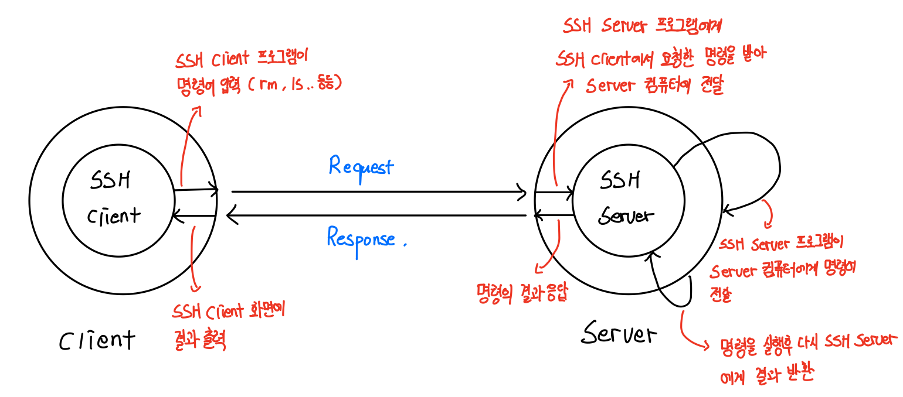
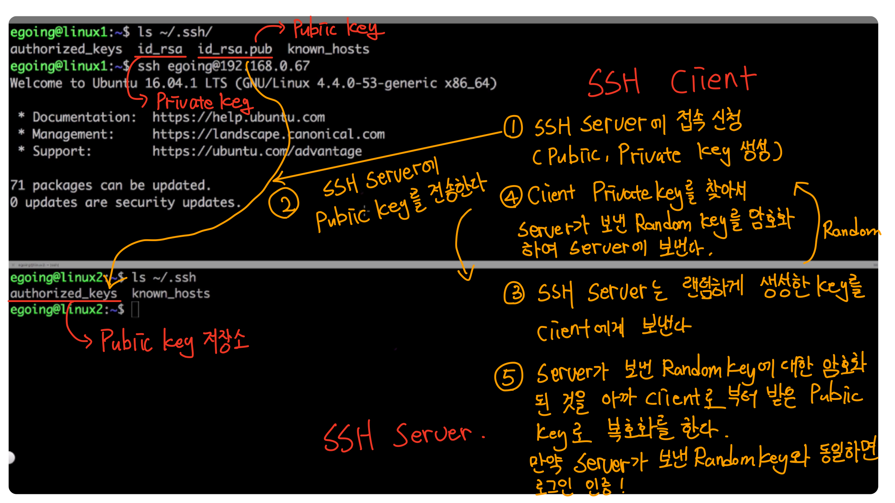

# SSH

 

- [SSH](#ssh)
  - [SSH 개념](#ssh-개념)
  - [SSH 동작 원리](#ssh-동작-원리)
    - [Client - Server](#client---server)
    - [SSH 인증 과정](#ssh-인증-과정)
  - [특징](#특징)
- [참고](#참고)

 

## SSH 개념
* **SSH (Secure Shell)은 네트워크 상의 다른 컴퓨터에 로그인하거나 원격 시스템에서 명령을 실행하고 다른 시스템으로 파일을 복사할 수 있도록 해주는 응용 프로그램 또는 프로토콜이다.**
  * SSH는 응용 계층에 속해있다. (TCP, UDP는 그 아래층인 전송 계층)
  * TCP만을 사용하여 통신한다.
* **SSH는 기존의 ftp, telnet 등을 대체하기 위해 설계되었으며, 강력한 인증 방법 및 안전하지 못한 네트워크에서 안전하게 통신을 할 수 있는 기능을 제공한다.**

 

## SSH 동작 원리

  

### Client - Server

* 웹의 `Client - Server`관계가 그대로 적용이된다.
  * `openssh-client`와 `openssh-server`라는 프로그램이 따로 존재한다.

 

### SSH 인증 과정
SSH의 인증 과정을 이해하기 위해선 우선 `비대칭키(Asymmetric Key)`에 대해서 알아야 한다.

* SSH 설치 후 처음 구동될 때 내부적으로 비대칭키(공개키와 비밀키)가 생성된다.
* SSH인증 과정
  * 클라이언트가 서버에 처음 접속을 시도하면 공개키를 받을지 묻는 메시지가 나오고 사용자가 `YES`를 선택하면 공개키를 받아서 클라이언트에 있는 `.ssh/known_hosts`파일에 저장하게 된다.
  * 클라이언트는 난수값을 발생시키고 난수값에 대한 해시값을 생성해 저장하게 된다. 그리고 난수값을 공개키로 암호화하여 서버에 전송한다.
  * 서버에서는 암호화된 데이터를 비밀키로 복호화한 후 난수값을 알아낸다. 복호화된 난수값을 통해 해시값을 다시 만든 후 클라이언트에 다시 전송하게 된다.
  * 클라이언트에서는 저장하고 있는 해시값과 서버로부터 받은 해시값을 비교해 서버가 정상적인 서버인지 확인하게 된다.

> 더 자세한 내용은 [여기](https://medium.com/@labcloud/ssh-%EC%95%94%ED%98%B8%ED%99%94-%EC%9B%90%EB%A6%AC-%EB%B0%8F-aws-ssh-%EC%A0%91%EC%86%8D-%EC%8B%A4%EC%8A%B5-33a08fa76596)를 참고하자.

 

## 특징

* 보안 통신, 포트포워딩 등의 기능 제공
  * 암호화되지 않은 `telnet`, `SMTP`등에 대한 패킷 스니핑 등의 보안 공격 방지
* 클라이언트/서버 관계 존재
  * 사용자 클라이언트 및 응용 서버 사이에서 SSH 클라이언트 및 SSH 서버가 존재함
    * 설치된 두 S/W 사이에서 TCP 보안 채널이 형성됨
  * 서버는 원격 접근하려는 호스트, 클라이언트는 원격 접근하는 사용자.
* 프로토콜 및 포트 번호
  * 전송계층 프로토콜 : ***TCP만 가능 (TCP 상에 보안 채널 형성됨)***
  * 포트 번호 : 22 (SSH 서버에 개방되는 포트)

 

> 더 많은 정보는 [여기](http://www.ktword.co.kr/abbr_view.php?nav=2&m_temp1=2524&id=1288)를 참조하자!

 

# 참고
* https://medium.com/@labcloud/ssh-%EC%95%94%ED%98%B8%ED%99%94-%EC%9B%90%EB%A6%AC-%EB%B0%8F-aws-ssh-%EC%A0%91%EC%86%8D-%EC%8B%A4%EC%8A%B5-33a08fa76596
* http://www.ktword.co.kr/abbr_view.php?nav=2&m_temp1=2524&id=1288
