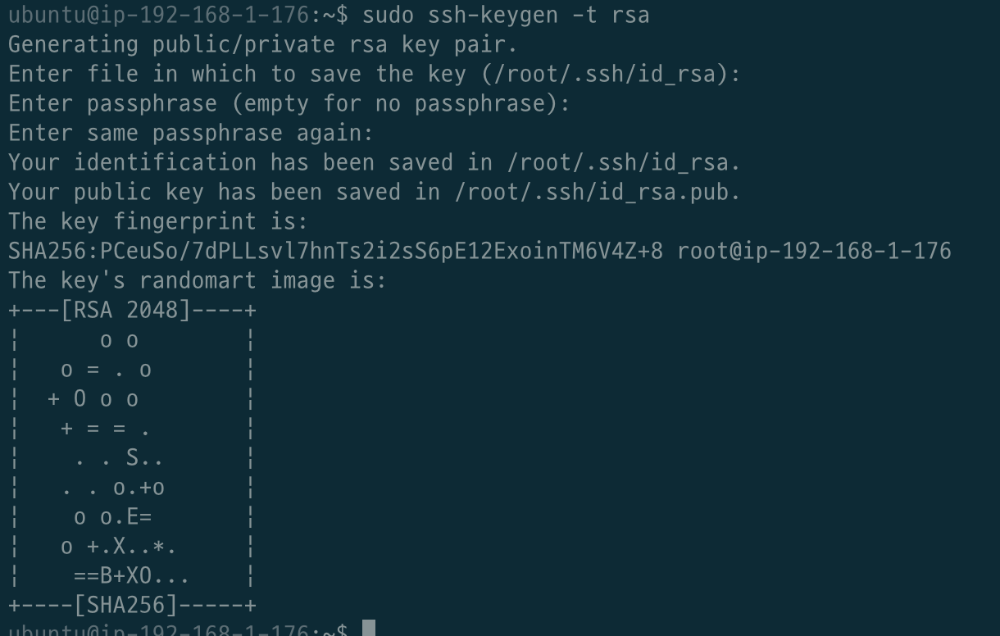
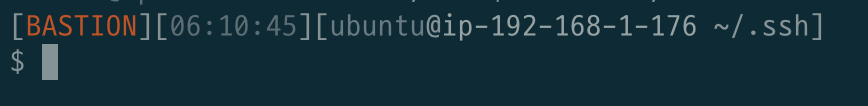
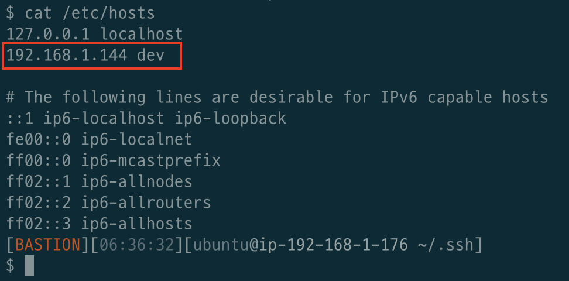
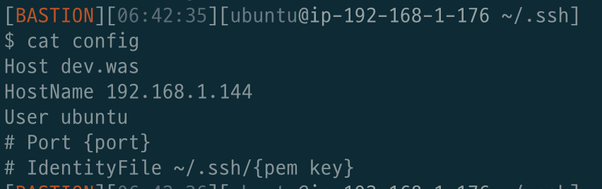

# 목차

<br>

- [목차](#목차)
- [SSH 개념](#ssh-개념)
- [SSH 동작 원리](#ssh-동작-원리)
  - [Client - Server](#client---server)
  - [SSH 인증 과정](#ssh-인증-과정)
- [특징](#특징)
- [SSH 설정](#ssh-설정)
  - [SSH 클라이언트-서버 구성하기](#ssh-클라이언트-서버-구성하기)
  - [SSH 접속 포트 변경](#ssh-접속-포트-변경)
  - [Shell Prompt 수정하기](#shell-prompt-수정하기)
  - [SSH 호스트 별칭주기](#ssh-호스트-별칭주기)
- [참고](#참고)

<br>

# SSH 개념
* **SSH (Secure Shell)은 네트워크 상의 다른 컴퓨터에 로그인하거나 원격 시스템에서 명령을 실행하고 다른 시스템으로 파일을 복사할 수 있도록 해주는 응용 프로그램 또는 프로토콜이다.**
  * SSH는 응용 계층에 속해있다. (TCP, UDP는 그 아래층인 전송 계층)
  * TCP만을 사용하여 통신한다.
* **SSH는 기존의 ftp, telnet 등을 대체하기 위해 설계되었으며, 강력한 인증 방법 및 안전하지 못한 네트워크에서 안전하게 통신을 할 수 있는 기능을 제공한다.**


<br>

# SSH 동작 원리

<br> 

## Client - Server

<p align="center"></p>

* 웹의 `Client - Server`관계가 그대로 적용이된다.
  * `openssh-client`와 `openssh-server`라는 프로그램이 따로 존재한다.

<br>

## SSH 인증 과정
SSH의 인증 과정을 이해하기 위해선 우선 `비대칭키(Asymmetric Key)`에 대해서 알아야 한다.

<p align="center"></p>

* SSH 설치 후 처음 구동될 때 내부적으로 비대칭키(공개키와 비밀키)가 생성된다.
* SSH인증 과정
  * 클라이언트가 서버에 처음 접속을 시도하면 공개키를 받을지 묻는 메시지가 나오고 사용자가 `YES`를 선택하면 공개키를 받아서 클라이언트에 있는 `.ssh/known_hosts`파일에 저장하게 된다.
  * 클라이언트는 난수값을 발생시키고 난수값에 대한 해시값을 생성해 저장하게 된다. 그리고 난수값을 공개키로 암호화하여 서버에 전송한다.
  * 서버에서는 암호화된 데이터를 비밀키로 복호화한 후 난수값을 알아낸다. 복호화된 난수값을 통해 해시값을 다시 만든 후 클라이언트에 다시 전송하게 된다.
  * 클라이언트에서는 저장하고 있는 해시값과 서버로부터 받은 해시값을 비교해 서버가 정상적인 서버인지 확인하게 된다.

> 더 자세한 내용은 [여기](https://medium.com/@labcloud/ssh-%EC%95%94%ED%98%B8%ED%99%94-%EC%9B%90%EB%A6%AC-%EB%B0%8F-aws-ssh-%EC%A0%91%EC%86%8D-%EC%8B%A4%EC%8A%B5-33a08fa76596)를 참고하자.

<br>

# 특징

* 보안 통신, 포트포워딩 등의 기능 제공
  * 암호화되지 않은 `telnet`, `SMTP`등에 대한 패킷 스니핑 등의 보안 공격 방지
* 클라이언트/서버 관계 존재
  * 사용자 클라이언트 및 응용 서버 사이에서 SSH 클라이언트 및 SSH 서버가 존재함
    * 설치된 두 S/W 사이에서 TCP 보안 채널이 형성됨
  * 서버는 원격 접근하려는 호스트, 클라이언트는 원격 접근하는 사용자.
* 프로토콜 및 포트 번호
  * 전송계층 프로토콜 : ***TCP만 가능 (TCP 상에 보안 채널 형성됨)***
  * 포트 번호 : 22 (SSH 서버에 개방되는 포트)

<br>

> 더 많은 정보는 [여기](http://www.ktword.co.kr/abbr_view.php?nav=2&m_temp1=2524&id=1288)를 참조하자!

<br>

# SSH 설정
다양한 SSH 설정에 대해서 알아본다.

<br>

## SSH 클라이언트-서버 구성하기
SSH Server 역할을 하는 인스턴스로 가서 아래와 같이 명령어를 입력한다.

```bash
$ ssh-keygen -t rsa
```

그럼 아래와 같이 public키와 private키가 생성되는 과정을 볼 수 있다.

<p align="center"> </p>

생성하는 과정에서 따로 저장 위치를 설정해주지 않았다면 `/root/.ssh`에 public키와 private키가 저장된다.

* public 키 조회: `sudo cat /root/.ssh/id_rsa.pub`
* private 키 조회: `sudo cat /root/.ssh/id_rsa`

> `sudo`를 붙으면 위와 같이 `/root/.ssh`에 디폴트로 키가 생성되며, `sudo`를 붙이지 않으면 해당 유저의 home에 디폴트로 키가 생성된다. (`/home/ubuntu`)

<br>

이제 접속하려는 서비스용 인스턴스에가서 위에서 만든 public key를 복사해주면 된다.

```bash
$ vi ~/.ssh/authorized_keys
```

이제 아래와 같이 접속해주면 접속되는 것을 볼 수 있다.

```bash
$ ssh {서비스용 서버 호스트}@{서비스용 서버 IP}
```

> `ssh hostname@ip` 명령어를 치면, `~/.ssh/id_rsa`의 키 파일을 사용하여 접속을 시도한다.
> 
> 그리고 접속하고자하는 서버의 `authorized_keys`에 대응하는 public key가 있으면 접속이 된다.

<br>

## SSH 접속 포트 변경
```bash
$ vi /etc/ssh/sshd_config

# Port 22 부분을 주석을 지우고 원하는 port로 설정
Port 8888

# ssh service 재시작
$ sudo service ssh restart
$ ssh -i {keyfile} -p 8888 {hostname}@{ip}
```

<br>

## Shell Prompt 수정하기
> 더 자세한 내용은 [여기](https://uroa.tistory.com/116)를 확인해주세요.

일반적으로 SSH를 통해 서버에 접속하면 터미널에선 IP 주소만을 보여준다.

하지만 IP만으로 Bastion인지, DEV서버인지, PROD서버인지를 확인할 수 없다.

이때 Shell의 Prompt를 변경해주면 이름을 부여하여 어떤 서버인지 쉽게 구분할 수 있다.

<p align="center"> </p>

적용하는 방법은 간단하다.

```bash
$ sudo vi ~/.bashrc

# 가장 밑에
USER=BASTION
PS1='[\e[1;31m$USER\e[0m][\e[1;32m\t\e[0m][\e[1;33m\u\e[0m@\e[1;36m\h\e[0m \w] \n\$ \[\033[00m\]'
# 를 추가해주면 된다.

# 그리고 resource 명령을 통해 적용시켜준다.
source ~/.bashrc
```
> 만약 해당 서버에 대한 모든 사용자에게 적용하고 싶다면 `/etc/bashrc`를 수정해주면 된다.
> 
> 또한, bashrc에 대한 개념은 [여기]()를 참고하자.

<br>

## SSH 호스트 별칭주기
보통 SSH를 통해 다른 서버에 접속하기 위해선 아래와 같이 `{Hostname}@{ip address}`를 통해 목적지를 정한다.

하지만 매번 이렇게 하기 번거럽다면 `/etc/hosts`에 미리 별칭을 설정해줄 수 있다.

```bash
$ vi /etc/hosts

# {IP} {별칭} 추가
192.168.1.144 dev
```

<p align="center"> </p>

이제 `ssh {hostname}@dev`으로 접속할 수 있다. (ex. `ssh ubuntu@dev`)

<br>

조금 더 간단하게 만들 수도 있다.

```bash
$ vi ~/.ssh/config

Host {hostname}
HostName {server ip}
User ubuntu
# Port {port}
# IdentityFile ~/.ssh/{pem key}
```
`~/.ssh/config`에 위와 같이 설정해주면 훨씬 더 간편하게 접속가능하다.

<br>

예시를 통해 살펴보자.

<p align="center"> </p>

이제 `ssh dev.was`를 통해 쉽게 접속할 수 있다.

> 더 자세한 내용은 [여기](http://taewan.kim/post/ssh_config/)를 확인해주세요.

<br>

# 참고
* https://medium.com/@labcloud/ssh-%EC%95%94%ED%98%B8%ED%99%94-%EC%9B%90%EB%A6%AC-%EB%B0%8F-aws-ssh-%EC%A0%91%EC%86%8D-%EC%8B%A4%EC%8A%B5-33a08fa76596
* http://www.ktword.co.kr/abbr_view.php?nav=2&m_temp1=2524&id=1288
* https://uroa.tistory.com/116
* http://taewan.kim/post/ssh_config/
