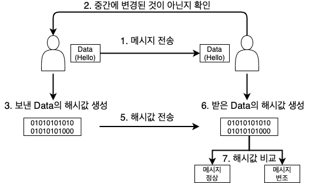
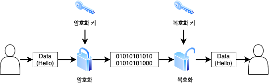
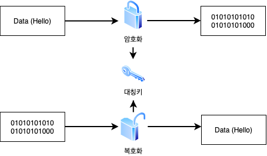
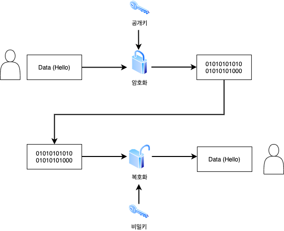
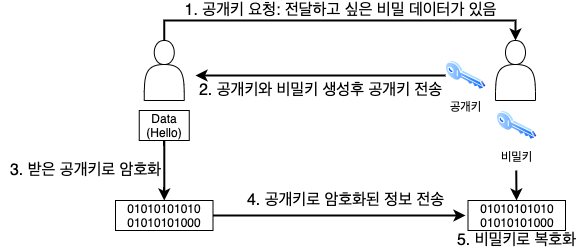

# 목차

 

- [목차](#목차)
- [암호화 기초](#암호화-기초)
  - [암호화와 복호화](#암호화와-복호화)
  - [단방향과 양방향](#단방향과-양방향)
    - [단방향](#단방향)
    - [양방향](#양방향)
  - [대칭키와 비대칭키](#대칭키와-비대칭키)
    - [대칭키 암호 알고리즘](#대칭키-암호-알고리즘)
    - [비대칭키 암호 알고리즘](#비대칭키-암호-알고리즘)
- [참고](#참고)

 

# 암호화 기초

 

## 암호화와 복호화
* 암호화(Encrypt)
  * 암호화는 사용자가 입력한 데이터를 알아볼 수 없는 데이터로 변경하는 과정을 의미한다.
* 복호화(Decrypt)
  * 복호화는 암호화된 데이터를 정상적인 데이터로 변경하는 과정을 의미한다.

> 암호화가 되어 있지 않은 자료를 그대로 보내게 된다면 중간에 패킷을 갈취해서 데이터를 확인할 수 있다.
> 
> 그러므로, 암호화는 필수라고 볼 수 있다.

 

## 단방향과 양방향

 

### 단방향

* **단방향 암호는 암호화는 가능하지만, 복호화는 불가능하다.**
  * 그러므로 **보통 `데이터의 무결성`을 검증하기 위해 사용된다.**
* 데이터 무결성
  * **데이터의 무결성이란 데이터가 허락된 사용자로 인해 수정이 제대로 이뤄졌는지, 허가되지 않은 사용자가 무단으로 데이터를 조작했는지 여부를 보는 것이다.**
  * ex. JWT
* 가장 대표적인 단방향 암호 알고리즘은 해시 알고리즘이다.
  * 해시 알고리즘은 임의의 길이의 데이터를 고정된 길이의 데이터로 매핑하는 함수다.
  * 대표적으로 SHA와 MD5라는 알고리즘이 존재한다.

 

### 양방향

* 양방향 암호는 암호화도 가능하고, 복호화도 가능한 알고리즘을 의미한다.
  * 그러므로 데이터를 인가된 사용자만 볼 수 있도록 할 수 있다.
* 대칭키와 비대칭키
  * 양방향 암호는 크게 `대칭키 암호 알고리즘`과 `비대칭키 암호 알고리즘`으로 구분된다.
* 대표적인 양방향 암호 알고리즘
  * 대칭키: DES, AES
  * 비대칭키: RSA

 

## 대칭키와 비대칭키

 

### 대칭키 암호 알고리즘

* 대칭키 암호 알고리즘이란?
  * `하나의 키로 암호화와 복호화`를 모두 수행하는 것을 의미한다.
* 특징
  * 장점: 암호 알고리즘 내부 구조가 단순하여, 시스템 개발 환경에 용이하고, 비대칭키에 비해 암호화와 복호화 속도가 빠르다.
  * 단점: 하지만 교환 당사자간에 동일한 키를 공유해야 하므로 키관리의 어려움이 있다. 잦은 키 변경이 있는 경우엔 불편함을 초래한다.

 

### 비대칭키 암호 알고리즘

* 비대칭키 암호 알고리즘이란?
  * 비대칭키 암호화는 다른 말로 `공개키 암호 알고리즘`라고 한다.
  * **하나의 키가 아닌 `암호화에 쓰이는 키 값`과 `복호화에 쓰이는 키 값`이 다른 것을 의미한다.**
* 공개키 암호화 방식
  * 공개키 암호화 방식은 암호학적으로 연관된 두 개의 키를 만들어서 하나는 자기가 안전하게 보관하고 다른 하나는 상대방에게 공개한다고 한다.
* 공개키(public)와 개인키(private)
  * 공개키: 누구나 가질 수 있는 키.
  * 개인키: 특정 사람만이 가질 수 있는 키. 
  * `개인키로 암호화 한 정보`는 그 쌍이 되는 공개키로만 복호화가 가능하고, `공개키로 암호화한 정보`는 그 쌍이 되는 개인키로만 복호화가 가능하다.
* 특징
  * 장점: 다른 유저와 키를 공유하지 않아도 암호를 통한 안전한 통신이 가능하다. 
  * 단점: 대칭키에 비해 암호화와 복호화 속도가 느리다.

 

 비대칭키 예시(데이터 암호화) - 암호화해서 전달하고 싶은 비밀 데이터가 있을 경우

 

**예시**

서버는 개인키를 보관하고, 공개키는 클라이언트에게 모두 뿌린다. 

이제 사용자는 공개키로 비밀번호를 암호화해서 서버에 보내면 전송 중간 스니핑을 당해서 민감 정보를 숨길 수 있다. 

그리고 서버는 개인키로 공개키로 암호화된 데이터를 복호화해서 민감 정보를 읽을 수 있게된다.

만약 개인키를 가지고 있지 않은 페이크 서버에 민감 정보를 전송해도, 페이크 서버에선 해당 내용을 들여다 볼 수 없다.

즉, 보안적으로 안전하다.

 

# 참고
* https://raonctf.com/essential/study/web/cryptography
* https://raonctf.com/essential/study/web/symmetric_key
* https://raonctf.com/essential/study/web/asymmetric_key
* https://sungjk.github.io/2016/09/30/Security.html