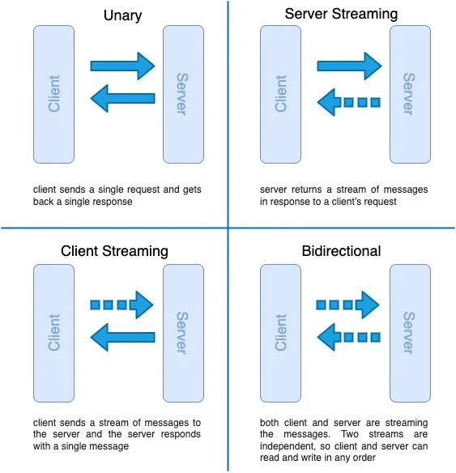

# 목차

<br>

- [목차](#목차)
- [JAVA로 gRPC 실습해보기 (feat. 4가지 통신 기법)](#java로-grpc-실습해보기-feat-4가지-통신-기법)
- [1 gRPC가 무엇인가?](#1-grpc가-무엇인가)
- [2 REST대신 gRPC를 사용하는 이유](#2-rest대신-grpc를-사용하는-이유)
- [3 gRPC 4가지 통신 방식](#3-grpc-4가지-통신-방식)
- [4 Java로 구현하는 gRPC](#4-java로-구현하는-grpc)
  - [4-1 프로젝트 생성 및 의존성 추가](#4-1-프로젝트-생성-및-의존성-추가)
  - [4-2 IDL 정의](#4-2-idl-정의)
  - [4-3 gRPC 서버 애플리케이션 구현](#4-3-grpc-서버-애플리케이션-구현)
  - [4-4 gRPC 클라이언트 애플리케이션 구현](#4-4-grpc-클라이언트-애플리케이션-구현)
- [참고](#참고)

<br>

# JAVA로 gRPC 실습해보기 (feat. 4가지 통신 기법)

JAVA로 gRPC의 Server와 Client를 간단한 테스트 형식으로 구현해본다.

> gRPC의 Hello World.

<br>

# 1 gRPC가 무엇인가?

**gRPC는 구글에서 개발한 오픈 소스의 고성능 RPC (Remote Procedure Call) 프레임워크이다.**

구현체로서의 특징으론 IDL로 구글에서 개발한 protocol buffers (protobuf)를 사용하며, 전송 프로토콜로 HTTP/2.0을 사용한다.

<br>

# 2 REST대신 gRPC를 사용하는 이유

<br>

💁‍♂️ **RPC**

gRPC는 RPC를 구현한 고성능 프레임워크이므로, 당연히 RPC의 아키텍처를 기본적으로 준수한다.

**RPC는 Remote Procedure Call의 줄임말로 번역하면 "원격 프로시저 호출"을 의미하며, 이는 원격에 위치한 프로그램을 로컬에 있는 프로그램처럼 사용할 수 있다는 의미를 가진다.**

클라이언트와 서버 모두 일반적인 함수를 호출하는 것처럼만 호출하면 서로 통신하기때문에, REST와 다르게 network 통신관 관련된 작업을 신경쓰지 않아도 된다.

<br>

💁‍♂️ **JSON/XML 대신 protobuf**

REST는 모두 알다싶이 JSON을 사용하여 메시지를 주고받는다. 

JSON은 유연하고 텍스트 기반이며 사람이 쉽게 읽고 이해할 수 있지만, 시스템 간에 데이터를 전송하긴 충분히 빠르거나 가볍지 않다.

gRPC는 데이터 전송을 더 빠르고 효율적인 Protobuf를 사용하여 메시지를 주고받는다.

**더 빠르고 효율적인 이유는 protobuf는 구조화된 데이터를 이진 형식으로 효율적이고 컴팩트하게 저장하여 네트워크 연결을 통해 더 빠르게 전송할 수 있기때문이다.**

**protobuf에 대한 더 자세한 내용은 [protobuf doc](https://protobuf.dev/)를 참고하는걸로하고, 이 글에선 protobuf가 JSON보다 언어와 플랫폼 중립적이며 높은 압축률로 더 빠르다고 이해하고 넘어간다.**

<br>

💁‍♂️ **HTTP/2.0 기반**

REST는 요청-응답 기반의 통신을 HTTP/1.1을 기반으로한다.

gRPC는 HTTP/2.0을 사용함으로써 다중통신, 양방향 스트림, 효율적인 헤더 사용등 HTTP/2.0의 장점을 그대로 활용한다.

<br>

# 3 gRPC 4가지 통신 방식

gRPC는 4개의 통신 방식을 지원한다.

<p align="center"><br>출처: https://pamodaaw.medium.com/handson-introduction-to-grpc-with-java-1195870027fb </p>

* Unary - 1개 request, 1개 response
  * 기존 API와 동일하게 요청 하나당 응답 하나를 받는 방식.
* Server Stream - 1개 request, n개 response.
  * HTTP/2.0의 특징을 활용한 새로운 형태의 RPC API.
  * 클라이언트의 요청 한 번으로, 서버가 데이터를 여러 번 전송할 수 있는 방식.
* Client Stream - n개 request, 1개 response.
  * HTTP/2.0의 특징을 활용한 새로운 형태의 RPC API.
  * 클라이언트는 여러 번 서버에 데이터를 전송하고, 서버는 한번 응답을 전송하는 방식.
  * 클라이언트가 응답을 언제 받을 수 있는지는 전적으로 서버에 달려있다.
* Bidirectional Stream - n개 request, n개 response.
  * 클라이언트과 서버 모두 Stream을 사용하며, 두 개의 Stream은 독립적으로 운용된다.
  * 그러므로 클라이언트과 서버는 어떤 순서를 가지고 있든지, 전송 데이터를 읽거나 쓸 수 있다.

<br>

# 4 Java로 구현하는 gRPC

💁‍♂️ **JAVA 베이스로 gRPC를 이용한 통신을 하기위해선 아래 단계로 구현해주면된다.**

1. **프로젝트 생성 및 의존성 추가**
2. **IDL (Interface Defintion Language) 정의.**
   * 클라이언트와 서버간의 통신 규약을 정의하는 단계로 gRPC의 경우 `.proto`파일을 정의한다.
   * **protobuf 컴파일러를 사용하여 클라이언트와 서버 코드 작성.**
3. **서버 애플리케이션 구현**
   * 서버 애플리케이션 빌드후 gRPC 서버를 위해 생성된 서비스 인터페이스 구현.
4. **클라이언트 애플리케이션 구현**
   * 클라이언트 애플리케이션 빌드후 생성된 gRPC 스텁을 사용하여 서버 대상 RPC 호출.

<br>

## 4-1 프로젝트 생성 및 의존성 추가

Gradle로 프로젝트를 생성하고, 아래와 같이 의존성을 설정한다.

> build.gradle

```gradle
plugins {
    id 'java'
    id 'com.google.protobuf' version '0.9.4' // protobuf 설정을 위한 plugins 추가
}

group 'com.binghe'
version '1.0-SNAPSHOT'

sourceCompatibility = JavaVersion.VERSION_11
targetCompatibility = JavaVersion.VERSION_11

repositories {
    mavenCentral()
}

dependencies {
    runtimeOnly 'io.grpc:grpc-netty-shaded:1.57.1'
    implementation 'io.grpc:grpc-protobuf:1.57.1'
    implementation 'io.grpc:grpc-stub:1.57.1'
    compileOnly 'org.apache.tomcat:annotations-api:6.0.53' // necessary for Java 9+

    testImplementation 'org.junit.jupiter:junit-jupiter-api:5.8.1'
    testRuntimeOnly 'org.junit.jupiter:junit-jupiter-engine:5.8.1'
}

test {
    useJUnitPlatform()
}

// IDL (protobuf) 생성 관련 Gradle 설정
protobuf {
    protoc {
        artifact = "com.google.protobuf:protoc:3.22.3"
    }
    plugins {
        grpc {
            artifact = 'io.grpc:protoc-gen-grpc-java:1.57.1'
        }
    }
    generateProtoTasks {
        all()*.plugins {
            grpc {}
        }
    }
}

// fat-jar setting for server
task gRpcServerJar(type: Jar) {
    manifest {
        attributes 'Main-Class': 'com.binghe.server.HelloServiceGrpcServer'
    }
    duplicatesStrategy = DuplicatesStrategy.EXCLUDE
    from { configurations.runtimeClasspath.collect { it.isDirectory() ? it : zipTree(it) } }
    with jar
}

// fat-jar setting for client
task gRpcClientJar(type: Jar) {
    manifest {
        attributes 'Main-Class': 'com.binghe.client.HelloServiceClient'
    }
    duplicatesStrategy = DuplicatesStrategy.EXCLUDE
    from { configurations.runtimeClasspath.collect { it.isDirectory() ? it : zipTree(it) } }
    with jar
}
```

<br>

## 4-2 IDL 정의
프로젝트 생성 및 빌드 스크립트 작성이 완료되었다면, 이제 클라이언트와 서버간의 통신 규약을 정의하는 단계로 gRPC의 경우 `.proto`파일을 정의한다.

<br>

> hello.proto

```gradle
syntax = "proto3";
option java_multiple_files = true;
option java_package = "com.binghe.proto";

message HelloRequest {
  string firstName = 1;
  string lastName = 2;
}

message HelloResponse {
  string greeting = 1;
}

service HelloService {
  rpc hello(HelloRequest) returns (HelloResponse);
  rpc helloServerStream(HelloRequest) returns (stream HelloResponse);
  rpc helloClientStream(stream HelloRequest) returns (HelloResponse);
  rpc helloBiStream(stream HelloRequest) returns (stream HelloResponse);
}
```
* 메시지
  * HelloRequest
    * 클라이언트 -> 서버 요청시 네트워크를 타고 전송될 메시지 포맷.
  * HelloResponse
    * 서버 -> 클라이언트 응답시 네트워크를 타고 전성될 메시지 포맷.
* 서비스
  * 클라이언트 -> 서버 요청시 호출할 RPC 메서드.

<br>

💁‍♂️ **proto 정의가 완료되었다면 빌드 해준다.**

이제 proto 정의가 완료되었다면, Gradle로 `build` Task를 실행시켜준다.


<br>

## 4-3 gRPC 서버 애플리케이션 구현

클라이언트와 서버가 서로 주고받을 통신 규약과 요청할 메서드등을 정의했다면, 이제 서버 애플리케이션을 구현해준다.

<br>

> HelloServiceImpl.java

```java
import com.binghe.proto.HelloRequest;
import com.binghe.proto.HelloResponse;
import com.binghe.proto.HelloServiceGrpc;
import io.grpc.stub.StreamObserver;

import java.util.ArrayList;
import java.util.List;

public class HelloServiceImpl extends HelloServiceGrpc.HelloServiceImplBase {

    private static final String HELLO = "Hello ! ";

    // unary
    @Override
    public void hello(HelloRequest request, StreamObserver<HelloResponse> responseObserver) {

        String greeting = HELLO + request.getFirstName() + "," + request.getLastName();

        HelloResponse response = HelloResponse.newBuilder()
                .setGreeting(greeting)
                .build();

        responseObserver.onNext(response);
        responseObserver.onCompleted();
    }

    // server stream
    @Override
    public void helloServerStream(HelloRequest request,
                                  StreamObserver<HelloResponse> responseObserver) {

        List<String> greetingList = new ArrayList<>();

        for (int i = 1; i <= 3; i++) {
            greetingList.add(HELLO + request.getFirstName() + "," + request.getLastName() + ":" + i);
        }

        for (String greeting : greetingList) {
            HelloResponse response = HelloResponse.newBuilder()
                    .setGreeting(greeting)
                    .build();
            
            responseObserver.onNext(response);
        }

        responseObserver.onCompleted();
    }

    // client stream
    @Override
    public StreamObserver<HelloRequest> helloClientStream(
            StreamObserver<HelloResponse> responseObserver) {
        return new StreamObserver<HelloRequest>() {
            @Override
            public void onNext(HelloRequest helloRequest) {
                System.out.println(HELLO + helloRequest.getFirstName() + "," + helloRequest.getLastName());
            }

            @Override
            public void onError(Throwable throwable) {
                System.out.println("error");
            }

            @Override
            public void onCompleted() {
                responseObserver.onNext(HelloResponse.newBuilder().setGreeting("success").build());
                responseObserver.onCompleted();
            }
        };
    }

    // bi stream
    @Override
    public StreamObserver<HelloRequest> helloBiStream(
            StreamObserver<HelloResponse> responseObserver) {
        return new StreamObserver<HelloRequest>() {
            @Override
            public void onNext(HelloRequest helloRequest) {
                String greeting = HELLO + helloRequest.getFirstName() + "," + helloRequest.getLastName();
                System.out.println(greeting);

                responseObserver.onNext(HelloResponse.newBuilder().setGreeting(greeting+"1").build());
                responseObserver.onNext(HelloResponse.newBuilder().setGreeting(greeting+"2").build());
            }

            @Override
            public void onError(Throwable throwable) {
                System.out.println("error");
            }

            @Override
            public void onCompleted() {
                responseObserver.onCompleted();
            }
        };
    }
}
```

클라이언트의 요청을 받았을 때, 어떻게 처리후 응답할지를 정의해준다.

**중요한 점은 추상 클래스인 `HelloServiceGrpc.HelloServiceImplBase`를 상속받고있으며, 구현한 모든 메서드가 오버라이딩한다는 것이다.**

정의한 적 없는 `HelloServiceGrpc`가 어디서 튀어나왔지..? 라고 할 수 있는데, 이는 proto를 build할 때 protobuf에 의해서 자동으로 생겨난 추상 클래스이다.

이 추상 클래스는 gRPC를 이용하여 통신하는데 필요한 모든 절차를 대신 수행해준다. (템플릿 메서드 패턴)

<br>

그리고 서버를 작동해야하니 gRPC에서 제공해주는 Server 객체를 활용하여 서버 구동 코드를 작성해주면 된다.

> HelloServiceGrpcServer.java

```java
import io.grpc.Server;
import io.grpc.ServerBuilder;

import java.io.IOException;

public class HelloServiceGrpcServer {

    public static void main(String[] args) throws IOException, InterruptedException {
        Server server = ServerBuilder.forPort(9090)
                .addService(new HelloServiceImpl())
                .build();

        server.start();
        server.awaitTermination();
    }
}
```

그리고 위 main 메서드를 실행하면 이제 gRPC 서버가 구동된다.

<br>

## 4-4 gRPC 클라이언트 애플리케이션 구현

이제 마지막으로 클라이언트 부분을 구현해준다.

> HelloServiceCaller.java

```java
import com.binghe.proto.HelloRequest;
import com.binghe.proto.HelloResponse;
import com.binghe.proto.HelloServiceGrpc;
import com.google.common.util.concurrent.ListenableFuture;
import io.grpc.ManagedChannel;
import io.grpc.ManagedChannelBuilder;
import io.grpc.stub.StreamObserver;

import java.util.Iterator;
import java.util.List;
import java.util.concurrent.TimeUnit;

public class HelloServiceCaller {

    private ManagedChannel channel;
    private HelloServiceGrpc.HelloServiceBlockingStub blockingStub;
    private HelloServiceGrpc.HelloServiceStub asynStub;
    private HelloServiceGrpc.HelloServiceFutureStub futureStub;

    public HelloServiceCaller(String domain, int port) {
        channel = ManagedChannelBuilder.forAddress(domain, port)
                .usePlaintext()
                .build();
        blockingStub = HelloServiceGrpc.newBlockingStub(channel);
        asynStub = HelloServiceGrpc.newStub(channel);
        futureStub = HelloServiceGrpc.newFutureStub(channel);
    }

    public void sendBlockingUnary(HelloRequest request) {
        System.out.println("[step1] client 1 server 1 blocking");
        HelloResponse helloResponse = blockingStub.hello(request);
        System.out.println("[step1 결과] " + helloResponse.getGreeting());
        System.out.println("[step1 끝]");
    }

    public void sendAsynUnary(HelloRequest request) {
        System.out.println("[step2] client1 server 1 asyn");
        asynStub.hello(request, new StreamObserver<HelloResponse>() {
            @Override
            public void onNext(HelloResponse helloResponse) {
                System.out.println("[step2 결과] " + helloResponse.getGreeting());
            }

            @Override
            public void onError(Throwable throwable) {
                System.out.println("error");
            }

            @Override
            public void onCompleted() {
                System.out.println("[step2 통신 끝]");
            }
        });
        System.out.println("[step2 끝]");
    }

    public void sendFutureUnary(HelloRequest request) {
        System.out.println("[step3] client 1 server 1 future");
        ListenableFuture<HelloResponse> future = futureStub.hello(request);
        HelloResponse response = null;
        try {
            response = future.get(2, TimeUnit.SECONDS);
        } catch (Exception e) {
            e.printStackTrace();
        }
        System.out.println("[step3 결과] " + response.getGreeting());
        System.out.println("[step3 끝]");
    }

    public void sendBlockingServerStream(HelloRequest request) {
        System.out.println("[step4] client 1 server n blocking");
        Iterator<HelloResponse> responseIter = blockingStub.helloServerStream(request);
        responseIter.forEachRemaining(response -> {
            System.out.println("[step4 결과] " + response.getGreeting());
        });
        System.out.println("[step4 끝]");
    }

    public void sendAsynServerStream(HelloRequest request) {
        System.out.println("[step5] client 1 server n asyn");
        asynStub.helloServerStream(request, new StreamObserver<HelloResponse>() {
            @Override
            public void onNext(HelloResponse helloResponse) {
                System.out.println("[step5 결과] " + helloResponse.getGreeting());
            }

            @Override
            public void onError(Throwable throwable) {
                System.out.println("error");
            }

            @Override
            public void onCompleted() {
                System.out.println("[step5 통신 끝]");
            }
        });
        System.out.println("[step5 끝]");
    }

    public void sendAsynClientStream(List<HelloRequest> requestList) {
        System.out.println("[step6] client n server 1 asyn");
        StreamObserver<HelloResponse> responseObserver = new StreamObserver<HelloResponse>() {
            @Override
            public void onNext(HelloResponse helloResponse) {
                System.out.println("[step6 결과] " + helloResponse.getGreeting());
            }

            @Override
            public void onError(Throwable throwable) {
                System.out.println("error");
            }

            @Override
            public void onCompleted() {
                System.out.println("[step6 통신 끝]");
            }
        };
        StreamObserver<HelloRequest> requestObserver = asynStub.helloClientStream(responseObserver);
        for (HelloRequest request : requestList) {
            requestObserver.onNext(request);
        }
        requestObserver.onCompleted();
        System.out.println("[step6 끝]");
    }

    public void sendAsynBiStream(List<HelloRequest> requestList) {
        System.out.println("[step7] client n server n asny");
        StreamObserver<HelloResponse> responseObsever = new StreamObserver<HelloResponse>() {
            @Override
            public void onNext(HelloResponse helloResponse) {
                System.out.println("[step7 결과] " + helloResponse.getGreeting());
            }

            @Override
            public void onError(Throwable throwable) {
                System.out.println("error");
            }

            @Override
            public void onCompleted() {
                System.out.println("[step7 통신 끝]");
            }
        };

        StreamObserver<HelloRequest> requestObsever = asynStub.helloBiStream(responseObsever);

        for (HelloRequest request : requestList) {
            requestObsever.onNext(request);
        }

        requestObsever.onCompleted();
        System.out.println("[step7 끝]");
    }
}
```

gRPC 서버를 호출할 때 사용되는 클라이언트 코드이며, 이제 간단히 main 메서드로 테스트를 만들어 서버에 요청을 보낸다.

<br>

> HelloServiceClientTest.java

```java
import com.binghe.proto.HelloRequest;

import java.util.List;

public class HelloServiceClientTest {

    public static void main(String[] args) throws InterruptedException {
        // channel, stub
        HelloServiceCaller caller = new HelloServiceCaller("localhost", 9090);

        // requests
        HelloRequest A = HelloRequest.newBuilder().setFirstName("A").setLastName("AA").build();;
        HelloRequest B = HelloRequest.newBuilder().setFirstName("b").setLastName("bb").build();;
        HelloRequest C = HelloRequest.newBuilder().setFirstName("c").setLastName("cc").build();

        caller.sendBlockingUnary(A);
        caller.sendAsynUnary(A);
        caller.sendFutureUnary(A);
        caller.sendBlockingServerStream(A);
        caller.sendAsynServerStream(A);
        caller.sendAsynClientStream(List.of(A, B, C));
        caller.sendAsynBiStream(List.of(A, B, C));

        Thread.sleep(10000);
    }
}
```

```shell
[step1] client 1 server 1 blocking
[step1 결과] Hello ! A,AA
[step1 끝]

[step2] client1 server 1 asyn
[step2 끝]

[step3] client 1 server 1 future
[step2 결과] Hello ! A,AA
[step2 통신 끝]
[step3 결과] Hello ! A,AA
[step3 끝]

[step4] client 1 server n blocking
[step4 결과] Hello ! A,AA:1
[step4 결과] Hello ! A,AA:2
[step4 결과] Hello ! A,AA:3
[step4 끝]

[step5] client 1 server n asyn
[step5 끝]

[step6] client n server 1 asyn
[step6 끝]

[step7] client n server n asny
[step7 끝]

[step6 결과] success
[step6 통신 끝]
[step5 결과] Hello ! A,AA:2
[step5 결과] Hello ! A,AA:3
[step5 통신 끝]
[step7 결과] Hello ! A,AA1
[step7 결과] Hello ! A,AA2
[step7 결과] Hello ! b,bb1
[step7 결과] Hello ! b,bb2
[step7 결과] Hello ! c,cc1
[step7 결과] Hello ! c,cc2
[step7 통신 끝]
```

<br>

# 참고
* https://medium.com/@yangli907/grpc-learning-part-1-cdcf59e52707
* https://pamodaaw.medium.com/handson-introduction-to-grpc-with-java-1195870027fb
* https://qwer9412.tistory.com/40

