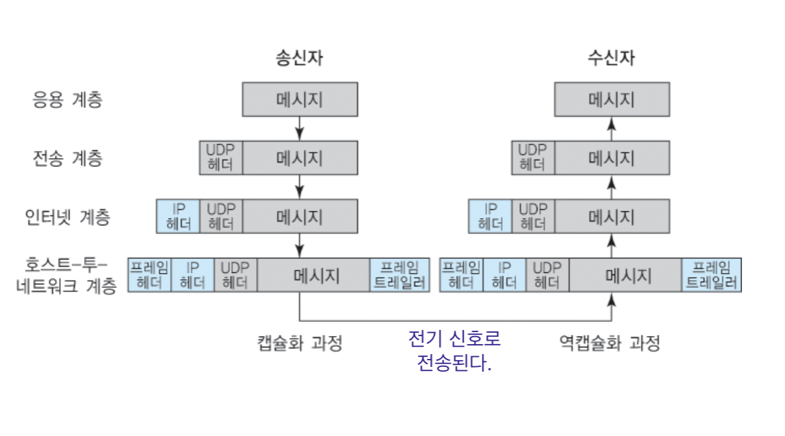

[모두의 네트워크](http://www.yes24.com/Product/Goods/61794014?OzSrank=1)을 바탕으로 작성한 자료입니다.

 

# 목차

 

- [목차](#목차)
- [네트워크의 구조](#네트워크의-구조)
  - [컴퓨터 네트워크란?](#컴퓨터-네트워크란)
  - [패킷이란?](#패킷이란)
- [LAN과 WAN](#lan과-wan)
  - [LAN과 WAN의 개념과 차이](#lan과-wan의-개념과-차이)
  - [가정에서 하는 랜 구성](#가정에서-하는-랜-구성)
  - [회사에서 하는 랜 구성](#회사에서-하는-랜-구성)
- [네트워크의 규칙 - 프로토콜](#네트워크의-규칙---프로토콜)
  - [프로토콜](#프로토콜)
- [OSI 모델과 TCP/IP 모델](#osi-모델과-tcpip-모델)
  - [OSI 모델](#osi-모델)
  - [TCP/IP 모델](#tcpip-모델)
  - [캡슐화와 역캡슐화](#캡슐화와-역캡슐화)

 

# 네트워크의 구조

 

## 컴퓨터 네트워크란?
* 네트워크란?
  * **Network. 어원은 그물을 뜻하는 net과 work의 합성어. 그물을 짜는 행위를 가리키는 명사에서 임의의 연결망을 지칭하는 용어로 그 범위가 확장된 단어이다.**
  * 두 엔드포인트끼리의 연결 (사람과 사람, 도로와 철도, 물류 네트워크등등)
* 컴퓨터 네트워크
  * 네트워크하면 보통 컴퓨터 네트워크를 의미하는 경우가 많다.
  * **두 대 이상의 컴퓨터들을 연결하고 서로 통신(이야기)할 수 있는 것.**
* 인터넷이란?
  * **Inter + Network: 네트워크 간의 연결을 의미합니다 (여러 개의 네트워크가 연결된 것)**
  * 인터넷은 전 세계의 큰 네트워크부터 작은 네트워크까지를 연결하는 거대한 네트워크를 의미한다.
  * **전세계의 네트워크(LAN 혹은 WAN)이 TCP/IP를 이용해 정보를 주고받는 거대한 공개 통신망.**
* 네트워크와 인터넷의 차이
  * 인터넷은 네트워크들의 연결이다. 즉, 인터넷이 더 큰 의미.

 

## 패킷이란?
> 왜 작은 단위의 패킷으로 나눠서 전송하는가?

* 패킷이란?
  * 컴퓨터 간에 데이터를 주고받을 때 **네트워크를 통해 전송되는 데이터의 작은 조각**
* 왜 굳이 작게 나눌까?
   

  * 큰 데이터를 그대로 보내면 그 데이터가 네트워크의 대역폭(bandwidth)을 너무 많이 차지하기 때문이다.
  * 대역폭을 모두 차지하게 되면 다른 패킷의 흐름을 막을 위험이 있다.
  * 비유
    * 대역폭: 도로, 패킷: 자동차
* 패킷을 작게 나누면 목적지에서 패킷의 순서를 모르지 않나?
   
 

  * 발신측에서 패킷에 순서를 부여하고, 목적지에서 순서대로 되돌리는 작업을 해줘야한다.
  * 이는 패킷이 디지털 데이터라서 가능하다고 한다.

 

# LAN과 WAN

 

## LAN과 WAN의 개념과 차이

  

* **LAN (Local Area Network)**
  * 건물 안이나 특정 지역을 범위로 하는 네트워크.
  * 이더넷과 와이파이를 이용한다.
  * **속도가 빠르며, 오류가 적다.**
* **WAN (Wide Area Network)**
  * 지리적으로 넓은 범위에 구축된 네트워크.
  * LAN과 LAN사이를 연결시켜주는 광범위한 네트워크.
  * **속도가 느리며, 오류가 많다.**

> 인터넷의 시작
> * 1969년 12월 미국 국방부의 ARPA에서 군사 목적으로 컴퓨터 네 대를 연결한 것이 시작. (ARPA 네트워크)
> * 이후 대학이나 연구소에서 유사한 네트워크가 생김.
> * 이후 상용 서비스가 생겨나면서 민간에서도 인터넷을 사용하기 시작함.

 

## 가정에서 하는 랜 구성

* **가정집에선 보통 인터넷 공유기 (broadband router)를 사용한다.**
  * 최근 인터넷 공유기는 라우터의 기능뿐만 아니라, 허브, 스위칭 허브, 방화벽과 같은 다양한 기능도 제공한다.
* 유선 랜과 무선랜 모두 사용된다.

 

## 회사에서 하는 랜 구성

* **가정에서의 랜 구성과 다른 점은 `DMZ(공개 서버)`가 존재한다는 것이다.**
  * DMZ는 Demilitarized Zone의 약자로, 인터넷인 외부 네트워크와 내부 네트워크 사이에 위치한 중간 지대(서브넷)을 말한다.
    * 네트워크의 보안 영역으로 외부 공격자가 내부 네트워크에 침투하는 것을 막는 역할을 한다.
  * 내부망은 말그대로 회사 내부에서만 사용되는 네트워크 망을 의미한다.
* 온프레미스 vs 클라우드
  * 온프레미스 (on-premise): 사내에 직접 서버를 설치하는 방식
  * 클라우드 (cloud): AWS와 같이 인터넷을 통해 컴퓨팅 서비스를 받는 방식

 

# 네트워크의 규칙 - 프로토콜

 

## 프로토콜
* 프로토콜이란 서로간의 규칙(약속)을 의미한다.
  * ex. 한국인과 프랑스인은 서로 대화가 안된다. 하지만 영어를 사용하자는 약속을 하면 대화가 가능하다.
  * ex. 편지를 배송하기 위해서는 편지를 쓸 때부터 상대방에게 도착할 때까지 지켜야 하는 독립적인 여러 규칙을 거쳐야 한다.
    * 편지를 쓰는 규칙, 편지를 보내는 규칙, 우체국의 규칙등등

 

# OSI 모델과 TCP/IP 모델

 

## OSI 모델

 출처: http://wiki.hash.kr/index.php/OSI_7_%EA%B3%84%EC%B8%B5

* OSI 모델이란?
  * OSI모델은 ISO(국제 표준화 기구)가 제정한 표준 규격이다.
  * OSI 7 계층은 네트워크 프로토콜이 통신하는 구조를 7개의 계층으로 분리하여 각 계층간 상호 작동하는 방식을 정해 놓은 것이다.
* OSI 7계층을 나눈 이유는?
  * 보통 계층을 나누는 이유는 **계층간의 독립성과 추상화**다.
  * **OSI 7계층도 위와 동일하며, 더해서 흐름을 한눈에 알아보고, 특정한 곳에 이상이 생기면 바로 발견할 수 있도록 하기 위함이다.**

 

|계층|이름|설명|
|----|----|----|
|7계층|응용 계층|이메일 & 파일 전송, 웹사이트등 서비스를 제공한다.|
|6계층|표현 계층|문자 코드, 압축, 암호화 등의 데이터를 변환한다.|
|5계층|세션 계층|세션 체결, 통신 방식을 결정한다.|
|4계층|전송 계층|신뢰할 수 있는 통신을 구현한다.|
|3계층|네트워크 계층|다른 네트워크와 통신하기 위한 경로 설정 및 논리 주소를 결정한다.|
|2계층|데이터 링크 계층|네트워크 기기 간의 데이터 전송 및 물리 주소를 결정한다.|
|1계층|물리 계층|시스템 간의 물리적인 연결과 전기 신호를 변환 및 제어한다.|

 

## TCP/IP 모델

 출처: https://shlee0882.tistory.com/110

* OSI 7계층을 기반으로 상업적이고 실무적으로 이용될 수 있도록 단순화한 모형이다.
* 실제 인터넷 표준이라고 봐도 무방하다고 한다.

 

## 캡슐화와 역캡슐화

 출처: https://docsplayer.org/179905866-Chapter-5-인터넷과-tcp-ip.html

* 캡슐화와 역캡슐화
  * 송신 컴퓨터에서 계층별로 헤더를 붙여나가는 것을 캡슐화라고 한다.
  * 수신 컴퓨터에서 계층별로 헤더를 제거해나가는 것을 역캡슐화라고 한다.
* 헤더
  * 각 계층별로 필요한 정보 데이터.
  * 데이터의 내용이나 성격을 식별 또는 제어하는 데 사용한다.
* 트레일러
  * 데이터를 전달할 때 데이터의 마지막에 추가하는 정보.

