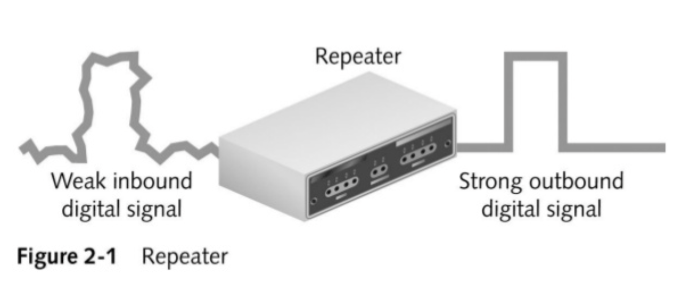

[모두의 네트워크](http://www.yes24.com/Product/Goods/61794014?OzSrank=1)을 바탕으로 작성한 자료입니다.

# 목차

 

- [목차](#목차)
- [물리 계층의 역할과 랜 카드의 구조](#물리-계층의-역할과-랜-카드의-구조)
  - [전기 신호란?](#전기-신호란)
  - [랜 카드란?](#랜-카드란)
- [케이블의 종류와 구조](#케이블의-종류와-구조)
  - [전송 매체](#전송-매체)
  - [트위스트 페어 케이블이란?](#트위스트-페어-케이블이란)
  - [다이렉트 케이블과 크로스 케이블](#다이렉트-케이블과-크로스-케이블)
    - [다이렉트 케이블](#다이렉트-케이블)
    - [크로스 케이블](#크로스-케이블)
    - [나머지 구리 선은 사용되지 않는다.](#나머지-구리-선은-사용되지-않는다)
- [물리 계층의 네트워크 장비 - 리피터와 허브](#물리-계층의-네트워크-장비---리피터와-허브)
  - [리피터](#리피터)
  - [허브](#허브)

 

🤔 **물리 계층**

* OSI 모델의 최하위 계층으로, 데이터를 전송하기 위해 **시스템 간의 물리적인 연결을 하고 전기 신호의 변환 및 제어하는 역할**을 담당한다.
* **전송 매체를 통해 데이터를 통신할 수 있는 전기적인 신호로 바꾸어 전송하는 역할도 한다.**

 

# 물리 계층의 역할과 랜 카드의 구조
> **물리 계층의 역할: 네트워크 장비 간의 전송되는 데이터를 전기 신호로 변환하는 계층이다.**

 

## 전기 신호란?

**전기 신호를 통해 네트워크 통신을 한다.**
* 즉, 통신을 위해선 데이터 (0과 1)를 전기 신호로 변환할 수 있어야한다.
* **전기 신호로 변환하는 역할을 하는 계층이 바로 물리 계층이다.**

 

 출처: https://www.youtube.com/watch?v=mhmTrBQNWGk&t=3s 

**전기 신호의 종류**
* 아날로그 신호
  * 전화 회선이나 라디오 방송에 사용된다.
* 디지털 신호
  * 컴퓨터 네트워크에 사용된다.

 

**데이터 -> 전기 신호**

 출처: http://jidum.com/jidums/view.do?jidumId=1023

* 데이터 송신측에서 전송하는 0과 1의 비트열 데이터를 전기 신호로 변환하여 전송한다.
  * 0과 1 -> 전기 신호(디지털 신호)
* 데이터 수신측에선 도착한 전기 신호를 0과 1의 비트열 데이터로 복원한다.
  * 전기 신호(디지털 신호) -> 0과 1

 

## 랜 카드란?
> 랜 카드는 네트워크 카드, 물리 네트워크 인터페이스라고도 불린다.

* 0과 1을 전기 신호로 바꿔주는 역할을 하는 것이 **랜 카드**다.
  * 0과 1의 정보를 랜 카드로 전송되고, 랜 카드가 0과 1을 전기 신호로 변환한다.
* OSI 계층에선 1(물리 계층)과 2(데이터 링크 계층)에서 사용된다.

 

# 케이블의 종류와 구조
> 유선 전송 매체로 사용되는 네트워크 케이블 커넥터에 대해 알아본다.

 

## 전송 매체
* 전송 매체란?
  * 전송 매체는 **데이터가 흐르는 물리적인 선로**를 의미한다.
* 전송 매체 종류: 유선과 무선
  * 유선: 트위스트 페어 케이블, 광케이블
  * 무선: 라이오파, 마이크로파, 적외선

 

## 트위스트 페어 케이블이란?
> 트위스트 페어 케이블은 가장 많이 사용되는 전송 매체이다.

 출처: https://ko.wikiqube.net/wiki/Twisted_pair 

* **트위스트 페어 케이블(UTP, STP)은 일반적으로 랜 케이블이라고 한다.**
  * 보통은 랜 케이블이라는 용어로 더 많이 불린다.
  * 랜 케이블의 양쏙 끝에는 `RJ-45`라고 부르는 커넥터가 붙어있다.
* **트위스트 페어 케이블은 두 종류로 나눌 수 있다.**
  * UTP 케이블: 구리 선 여덟 개를 두 개씩 꼬아 만든 네 쌍의 전선으로 실드로 보호되어 있지 않은 케이블.
    * 노이즈의 영향을 받기 쉽지만 저렴하기 때문에 일반적으로 많이 사용된다.
  * STP 케이블: 두 개씩 꼬아 만든 선을 실드로 보호한 케이블.
    * 노이즈의 영향을 매우 적게 받지만 비싸기 때문에 보편적으로 사용하지는 않는다.
* **구리 선 두 개를 비틀어 꼬아서 케이블을 만든 이유는 노이즈의 영향을 최대한 적게 받기 위함이라고 한다.**

 

> 노이즈
> * **노이즈는 케이블에 전기 신호가 흐를 때 발생한다.**
>   * **노이즈를 받으면 전기 신호의 형태가 왜곡된다. (찌그러진다.)**
>   * **당연히 노이즈를 많이 받으면, 수신측에서 0과 1의 데이터로 변환할 때 안좋은 영향을 끼친다.**
> * 실드는 금속 호일이나 금속의 매듭과 같은 것으로 외부에서 발생하는 노이즈를 막는 역할을 한다.

 

## 다이렉트 케이블과 크로스 케이블
> 랜 케이블 종류에는 다이렉트 케이블과 크로스 케이블이 있다.
> 
> 더 자세한 내용은 [여기](http://www.ktword.co.kr/abbr_view.php?m_temp1=2875)에서 확인가능하다.

 

 출처: http://www.ktword.co.kr/abbr_view.php?m_temp1=2875

### 다이렉트 케이블

* 다이렉트 케이블이란
  * **다이렉트 케이블은 구리 선 여덟 개를 같은 순서로 커텍터에 연결한 케이블이다.**
* 용도
  * 컴퓨터와 스위치를 연결할 때 사용한다.
  * 컴퓨터 끼리의 통신에서는 사용할 수 없다.
    * 이유는 양쪽 컴퓨터에서 1번과 2번으로 데이터를 전송하면 데이터 충돌이 발생하기 때문이다.

 

### 크로스 케이블

* 크로스 케이블이란
  * 크로스 케이블은 구리 선 여덟 개 중 한쪽 커넥터의 1과 2번에 연결되는 구리 선을 다른 쪽 커넥터의 3번과 6번에 연결한 케이블이다.
* 용도
  * 컴퓨터 간에 직접 랜 케이블로 연결할 때 사용된다.
    * 전송은 3, 6번으로 수신은 1, 2번으로 한다. 그럼으로 컴퓨터 간의 통신에 사용될 수 있다.

 

### 나머지 구리 선은 사용되지 않는다.
* 다이렉트 케이블과 크로스 케이블 모두 1, 2, 3, 6번 구리선만 사용한다.
* 나머지 네 개의 선은 사용하지 않는다고 한다.
  * 노이즈를 최대한 방지하기 위해서 존재하는 듯하다.

 

# 물리 계층의 네트워크 장비 - 리피터와 허브
> 물리 계층의 네트워크 장비로는 **리피터**와**허브**가 있다.

 

## 리피터

 출처: https://www.slideshare.net/zuhaibroyzuhaib/1-networking-devices-2014

* 리피터란?
  * **전기 신호를 정형(일그러진 전기 신호를 복원)하고 증폭하는 기능을 가진 네트워크 중계 장비이다.**
  * **일대일 통신에서만 사용할 수 있다.**
  * 망의 물리적인 길이를 확장하는데 사용됐다고 한다.
* 리피터는 물리계층에서만 동작하는 장치이다.
  * 요즘은 다른 네트워크 장비가 리피터 기능을 지원하기 때문에 사용되지 않는다고한다.
* 단점
  * 단순히 신호 증폭의 역할을 하며 브로드 캐스트로 전파하기 때문에 트래픽 증가의 문제가 있다.
  * 변질된 신호도 증폭하기 때문에 신호의 변형 가능성이 크다고한다.

 

## 허브

 출처: https://www.slideshare.net/zuhaibroyzuhaib/1-networking-devices-2014

* 허브란?
  * **포트(실제로 통신하는 통로)를 여러 개 가지고 있으며, 리피터와 달리 컴퓨터 여러 대와 통신할 수 있는 장치이다.**
  * 랜 케이블을 사용하여 컴퓨터 여러 대가 데이터를 주고받을 때 유용한 장비이다.
  * 랜을 구성할 때 한 사무실이나 가까운 거리에 있는 장비들을 케이블을 사용하여 연결하는 장치.
  * 허브는 리피터와 동일하게 **전기 신호를 정형하고 증폭하는 기능**도 한다.
* 허브는 물리 계층에서만 동작하는 장치이다.
* **허브의 특징 - 전체 전송**
  * **특정 컴퓨터에서 데이터를 전송시 허브는 연결된 모든 컴퓨터에 데이터를 전송한다.**
    * 이 특징으로 인해, 허브가 스스로 판단하지않고, 전기 신호를 모든 포트로 보낸다고하여 더미 허브라고도 불린다.
  * 물론 이 문제의 대책으로 나온 것이 바로 **스위치**다.

> 일단 컴퓨터와 허브의 연결구멍을 포트라고 생각하자.

