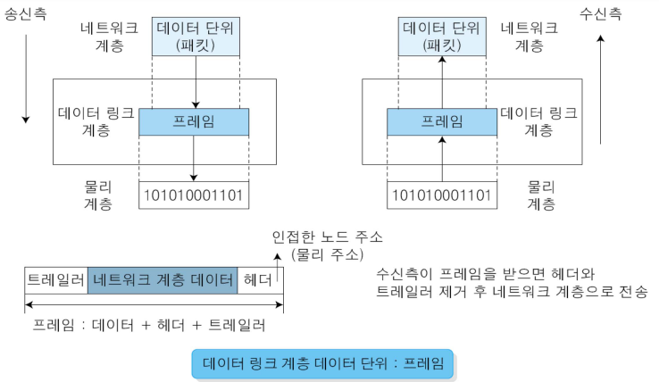
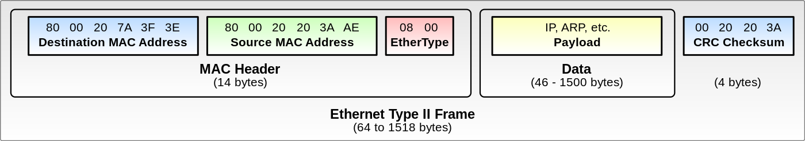
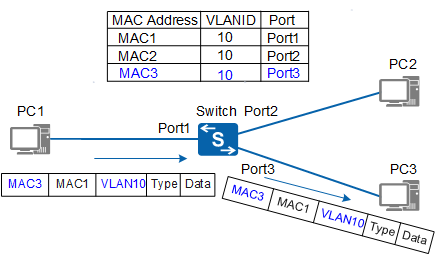
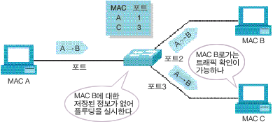
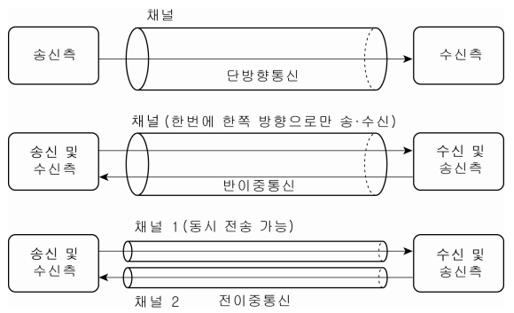
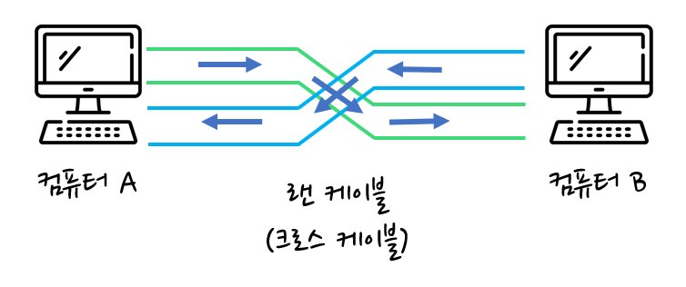
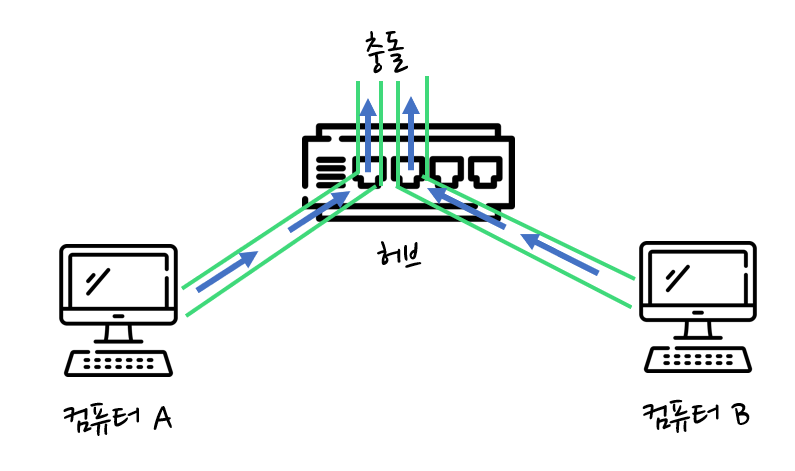
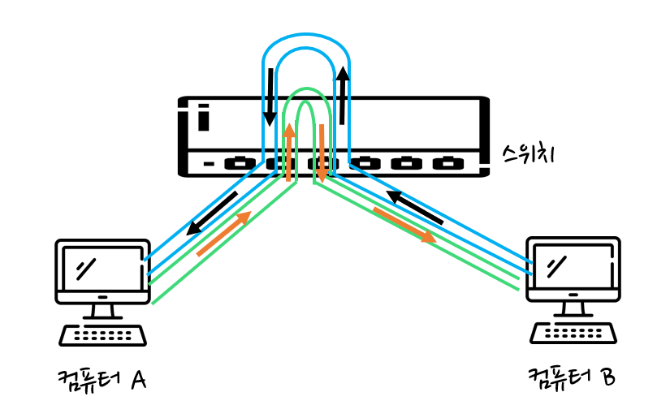
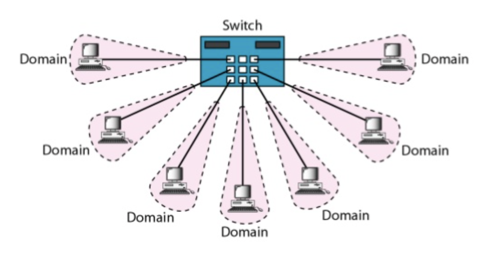

[모두의 네트워크](http://www.yes24.com/Product/Goods/61794014?OzSrank=1)을 바탕으로 작성한 자료입니다.

# 목차

 

- [목차](#목차)
- [데이터 링크 계층의 역할](#데이터-링크-계층의-역할)
- [이더넷](#이더넷)
  - [이더넷이란](#이더넷이란)
  - [CSMA/CD](#csmacd)
- [MAC주소](#mac주소)
  - [MAC주소란?](#mac주소란)
  - [데이터 링크 계층의 이더넷 헤더](#데이터-링크-계층의-이더넷-헤더)
- [스위치](#스위치)
  - [스위치란?](#스위치란)
  - [MAC 주소 테이블](#mac-주소-테이블)
- [데이터가 케이블에서 충돌하지 않는 구조](#데이터가-케이블에서-충돌하지-않는-구조)
  - [전이중 통신과 반이중 통신](#전이중-통신과-반이중-통신)
  - [무엇이 더 좋은가?](#무엇이-더-좋은가)
  - [충돌 도메인](#충돌-도메인)
  - [ARP](#arp)

 

# 데이터 링크 계층의 역할

 출처: http://jidum.com/jidums/view.do?jidumId=1024

* **데이터 링크 계층은 네트워크 장비 간에 신호를 주고받는 규칙을 정하는 계층이다.**
* **랜에서 데이터를 정상적으로 주고받기 위해 필요한 계층이다.**
  * 랜에서 데이터를 주고받으려면 데이터 링크 계층의 기술이 필요하다.
* **데이터 링크 계층은 이더넷 규칙을 기반으로 랜에서의 데이터 전송을 담당한다. - 중요**
  * **이 규칙에 따라 같은 네트워크(랜)에 있는 컴퓨터로는 데이터를 전송할 수 있지만, 인터넷이나 다른 네트워크로는 데이터를 전송할 수 없다.**
  * **같은 네트워크(랜)끼리의 통신에서 MAC 주소를 이용한다.**
  * 이땐 네트워크 계층의 힘이 필요하다.
* **데이터 링크 계층에선 이더넷 헤더와 트레일러를 추가한다. -> 프레임**
* **데이터 링크 계층의 주요 기능**
  * 정보 전달: 인접 노드간 데이터 전송
  * 회선 제어: 신호간 충돌이 발생하지 않도록 제어 (ENQ/ACK, 풀링)
  * 흐름 제어: 송신자와 수신자간의 속도차 보상 (Stop and Wait, Sliding, Window)
  * 오류 제어: 물리 전송 특성상 발생하는 오류와 잡음에 대한 보정 (FEC, BEC, ARQ)
  * 주소 지정: 송신자와 수신자의 물리주소 삽입 (MAC)
  * 접근 제어: 여러 시스템 연결 시, 링크 점유 시 사용 (CSMA/CD, CSMA/CA)

> 데이터 링크 계층은 같은 네트워크(랜)안에 장치들끼리의 통신을 담당한다. (MAC주소를 이용)
> 
> 네트워크 계층이 서로 다른 네트워크끼리의 통신을 담당한다. (IP주소를 이용)

 

# 이더넷

 

## 이더넷이란
* 전 세계에서 폭넓게 이용되고 있는 **네트워크 규격**.
  * **유선 네트워크 인터페이스는 거의 이더넷**이라고봐도 무방하다.
* **랜에서 데이터를 정상적으로 주고받기 위해 가장 많이 사용되는 규칙**.
  * 이더넷은 허브와 같은 장비에 연결된 컴퓨터와 데이터를 주고받을 때 사용된다.
* **이더넷은 네트워크를 구성하는 방식 중 하나의 방법이며, 각 기기들의 고유의 주소 MAC주소를 가지고 호스트간의 데이터를 주고 받을 수 있는 방식을 사용한다.**
  * 즉, 각 기기들이 48비트의 고유한 MAC주소를 가지고 상호간에 데이터를 주고 받을 수 있도록 만들어졌다.
* 전송매체로는 UTP, STP, 광 케이블을 사용한다.

 

## CSMA/CD
* **허브의 특징**
  * 허브는 연결된 네트워크에서 한 컴퓨터에서 주고받는 데이터가 같은 허브에 연결된 다른 모든 컴퓨터에 전달된다.
    * 물론 수신 컴퓨터에서 목적지가 자기와 다르면 무시한다고 한다. 이때 이더넷 헤더(MAC주소)를 이용한다. (그래도 로그는 남기 않나?..)
* **충돌**
  * **허브의 특징으로 인해 컴퓨터 여러 대가 동시에 데이터를 보내면 데이터들이 서로 부딪혀서 충돌이 발생한다.**
* CSMA/CD
  * **이더넷은 여러 컴퓨터가 동시에 데이터를 전송해도 충돌이 일어나지 않는 구조로 되어있다.**
  * CS: 데이터를 보내려고 하는 컴퓨터가 케이블에 신호가 흐르고 있는지 아닌지 확인하는 규칙.
  * MA: 케이블에 데이터가 흐르고 있지 않다면 데이터를 보내도 좋다는 규칙.
  * CD: 충돌이 발생하고 있는지를 확인하는 규칙.

> 현재는 CSMA/CD의 효율이 좋지 않다는 이유로 거의 사용되지 않는다고 한다. 
> 
> (반이중 통신방식이기 때문에. 대신 스위치를 사용한다.)

 

# MAC주소

 

## MAC주소란?
* **MAC주소란?**
  * 랜 카드를 제조할 때 정해지는 물리적인 주소를 의미한다.
* **전 세계에서 유일한 번호로 할당된다.**
  * 48비트로 구성되며, 앞 24비트는 랜 카드 제조사 번호, 뒤 24비트는 일련번호.

 

## 데이터 링크 계층의 이더넷 헤더

 출처: https://en.wikipedia.org/wiki/Ethernet_frame

* **OSI 7계층의 데이터 링크 계층에서는 이더넷 헤더와 트레일러를 붙인다.**
  * **이더넷 헤더에는 목적지의 MAC 주소(6바이트)와 출발지 MAC 주소(6비트) 그리고 유형(2바이트)로 구성되어있다.**
* **허브를 이용한 컴퓨터에서 수신한 데이터를 보고 자신의 목적지와 다르면 파기한다.**

> 유형은 상위 계층 프로토콜의 종류를 의미한다. (IPv4, ARP, IPv6등등)

 

# 스위치

 

## 스위치란?
* 스위치란
  * 랜을 구성할 때 사용하는 단말기 간 스위칭 기능이 있는 통신망 중계 장치.
  * 스위치는 데이터 링크 계층에서 동작하고 레이어 2 (L2) 스위치 또는 스위칭 허브라고도 불린다.
* 스위치의 기능
  * MAC 주소 테이블

 

## MAC 주소 테이블

 출처: https://support.huawei.com/enterprise/en/doc/EDOC1000178168/35c83785/elements-and-functions-of-a-mac-address-table

* MAC 주소 테이블이란
  * MAC 주소 테이블은 스위치의 포트 번호와 해당 포트에 연결되어 있는 컴퓨터의 MAC 주소가 등록되는 DB이다.
  * 브리지 테이블이라고도 불린다.

 

**MAC 주소 학습 기능**
* 스위치를 맨 처음 키면 테이블은 비어있다.
* 다만 컴퓨터들끼리 목적지 MAC주소가 추가된 프레임을 전송하면 해당 주소를 테이블에 추가해나간다.

 

**Flooding**

 출처: https://www.ahnlab.com/kr/site/securityinfo/secunews/secuNewsView.do?cmd=print&seq=5122&menu_dist=3

* Flooding 동작방식
  * MAC A가 MAC B로 데이터를 전송하지만, MAC테이블엔 MAC B에 대한 정보가 없다. 
  * 스위치는 연결된 모든 호스트에 데이터를 전송하고, 수신측들에선 자신의 MAC주소가 아니면 폐기하고, 자기 것인 MAC B는 MAC A에 데이터를 전송한다.
  * 이때 스위치는 MAC A로 전송되는 것을 보고, MAC B가 포트2번에 연결되어있음을 저장한다.
* Flooding이란
  * 스위치가 목적지 MAC에 대한 정보가 없어 허보의 동작과 동일하게 포트에 연결된 모든 호스트로 데이터를 전송하는 것을 의미한다.

> 물론 MAC 테이블에 정보가 있다면 모든 기기에 데이터를 전송하지 않는다. 
> 
> (MAC 주소 필터링)

 

# 데이터가 케이블에서 충돌하지 않는 구조
> 케이블에 데이터가 아무리 많이 전송되어도 데이터가 충돌하지 않는 구조를 알아보자.

 

* 정보 흐름의 방향성
  * 단방향
  * 양방향
    * 전이중
    * 반이중

 

## 전이중 통신과 반이중 통신

 출처: 전송 방향에  따른  전송 방식 분류(참고문헌: '데이터통신', 오창환 저, 한국학술정보(주))

* 전이중 통신이란
  * 데이터의 송수신을 동시에 통신하는 방식.
  * 데이터를 동시에 전송해도 충돌이 발생하지 않는다.
* 반이중 통신이란
  * 회선 하나로 송신과 수신을 번갈아가면서 통신하는 방식
  * 데이터를 동시에 전송하면 충돌이 발생한다.

 

## 무엇이 더 좋은가?
> 정답은 없다.

**컴퓨터 두 대를 직접 연결할 경우**

 출처: https://almotjalal.tistory.com/87

* 컴퓨터 두 대를 직접 연결할 경우 전이중이 더 효율적이다.
  * 전이중으로도 충돌이 발생하지 않는다.

 

**컴퓨터 두 대를 허브를 통해 연결할 경우**

 출처: https://almotjalal.tistory.com/87

* 컴퓨터 두 대를 허브를 통해 연결할 경우 반이중이 더 효율적이다.
  * 허브가 전이중을 지원해주지 않는다. 그러므로 충돌이 발생하게 된다.

 

**컴퓨터 두 대를 스위치를 통해 연결할 경우**

 출처: https://almotjalal.tistory.com/87

* 컴퓨터 두 대를 스위치를 통해 연결할 경우 전이중이 더 효율적이다.
  * 스위치는 전이중을 지원해준다!

 

## 충돌 도메인

 출처: https://www.slideshare.net/zuhaibroyzuhaib/1-networking-devices-2014

* 충돌 도메인이란?
  * 충돌이 발생할 때 그 영향이 미치는 범위.
* 허브와 스위치의 충돌 도메인
  * 허브는 연결되어 있는 컴퓨터 전체가 하나의 충돌 도메인이된다.
    * 즉, 허브는 충돌의 영향이 모든 컴퓨터에 미치게된다.
  * 스위치는 각 선마다 충돌 도메인이 분리되어있다.
    * 스위치는 전이중 통신 방식이기 때문에 전체 컴퓨터에 충돌의 영향이 가지 않는다.

 

## ARP
* **ARP(Address Resolution Protocol)이란**
  * **네트워크 계층과 데이터 링크 계층 주소 사이의 변환을 담당하는 프로토콜이다.**
  * **목적지 컴퓨터의 IP 주소를 이용하여 MAC주소를 찾기 위한 프로토콜.**
  * 이더넷 프레임을 전송하려면 목적지 컴퓨터의 MAC주소가 필요한데, 이때 사용된다.
* **ARP 테이블**
  * 출발지 컴퓨터에서는 MAC 주소를 얻은 후에 MAC 주소와 IP 주소의 매핑 정보를 메모리에 보관한다. 이를 ARP 테이블이라고한다.

