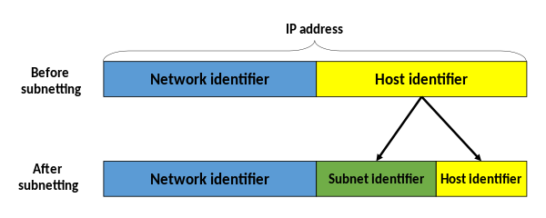

[모두의 네트워크](http://www.yes24.com/Product/Goods/61794014?OzSrank=1)을 바탕으로 작성한 자료입니다.

# 목차

 

- [목차](#목차)
- [네트워크 계층의 역할](#네트워크-계층의-역할)
  - [IP헤더](#ip헤더)
- [IP주소](#ip주소)
  - [IP주소의 구조](#ip주소의-구조)
  - [공인 IP와 사설 IP](#공인-ip와-사설-ip)
  - [IP주소의 클래스 구조](#ip주소의-클래스-구조)
  - [네트워크 주소와 브로드캐스트 주소](#네트워크-주소와-브로드캐스트-주소)
- [서브넷](#서브넷)
  - [서브넷이란](#서브넷이란)
  - [서브넷 마스크](#서브넷-마스크)
  - [서브넷 구하기 예시](#서브넷-구하기-예시)
- [라우터](#라우터)
  - [라우터란](#라우터란)
  - [기본 게이트웨이](#기본-게이트웨이)
  - [라우팅](#라우팅)

 

# 네트워크 계층의 역할

 출처: https://m.blog.naver.com/PostView.naver?isHttpsRedirect=true&blogId=kyg3766&logNo=220691563209

* **데이터 링크 계층의 한계**
  * 데이터 링크 계층은 이더넷 규칙을 기반으로 같은 네트워크에 있는 컴퓨터의 통신을 지원한다. (MAC 주소 이용)
  * 인터넷이나 다른 네트워크로는 데이터를 전송할 수 없다.
* **네트워크 계층의 역할**
  * **서로 다른 네트워크에 있는 장치로 통신을 가능하게 한다. (IP 주소 이용)**
  * 다른 네트워크로 통신하기 위해 **라우터**란 장비를 이용한다.
    * 목적지까지 어떤 경로로 보낼지 결정하는 것을 **라우팅**이라고한다.
  * 다른 네트워크를 식별하기 위해 **IP주소**를 이용한다.
  
 

## IP헤더

 출처: http://ktword.co.kr/abbr_view.php?m_temp1=1859

* **IP란**
  * 네트워크 계층에서 사용하는 프로토콜.
* **IP헤더**
  * **네트워크 계층에서 캡슐화하는 헤더정보.** (**IP패킷**)
  * 가장 중요한 것은 출발지 IP와 도착지 IP이다.

 

# IP주소
* IP주소란
  * 어떤 네트워크의 어떤 컴퓨터인지 구분할 수 있게 해주는 주소.
    * ex. 우편물의 주소

 

## IP주소의 구조

 출처: https://en.wikipedia.org/wiki/IP_address

* IP주소는 4개의 8비트, 즉 32비트로 구성되어 있다. (IPv4)
  * `0.0.0.0`부터 `255.255.255.255`까지이다. (42.9억개)
* 현재는 IPv4의 개수가 부족하여, IPv6까지 나왔다.

 

## 공인 IP와 사설 IP

 출처: https://www.pragimtech.com/blog/azure/public-ip-address-vs-private-ip-address/

* 공인 IP와 사설 IP가 따로 존재하는 이유
  * **IPv4주소을 컴퓨터 한 대당 부여하기엔 부족하다.**
  * 이로 인해 **인터넷에 직접 연결되는 컴퓨터나 라우터에는 공인 IP를 할당하고, 회사나 가정의 랜에 있는 컴퓨터는 사설 IP를 할당하는 정책을 사용한다.**
* 공인 IP와 사설 IP의 이점
  * 공인 IP 한 개로 랜 안에 있는 컴퓨터 여러 대가 모두 인터넷에 연결할 수 있다.
* **공인 IP는 라우터에 할당. 사설 IP는 랜 안에 있는 장치에 할당**
  * 랜의 관리자가 사설 IP주소를 할당할수도 있고, DHCP을 통해 자동으로 할당할 수도 있다.

> 공인 IP는 ISP에서 제공한다.

 

## IP주소의 클래스 구조

 출처: https://sites.google.com/site/pnutpck11/ip-addressing?tmpl=%2Fsystem%2Fapp%2Ftemplates%2Fprint%2F&showPrintDialog=1

* **IP주소는 네트워크 ID와 호스트 ID로 이루어져있다.**
  * **네트워크 ID는 어떤 네트워크인지, 호스트 DI는 해당 네트워크의 어느 컴퓨터인지를 나타낸다.**
* IP주소 클래스는 네트워크 ID와 호스트 ID의 크기를 구분할 때 사용된다.
  * 라우팅으로 목적지를 알아내고 찾아갈 때 네트워크와 호스트 주소가 합쳐진 IP를 보낸다.

 

## 네트워크 주소와 브로드캐스트 주소

 네트워크 주소  브로드캐스트 주소

* **네트워크 주소**
  * 해당 네트워크의 첫번째 IP주소
  * **하나의 네트워크를 통칭하기 위한 주소이다.**
* **브로드캐스트 주소**
  * 해당 네트워크의 맨 마지막 IP주소
  * 특정 네트워크에 속한 모든 호스트들이 갖게되는 주소.
  * **네트워크에 있는 모든 클라이언트들에게 데이터를 보내기 위함이다.**
* **네트워크 주소와 브로드캐스트 주소는 특별한 주소로 컴퓨터나 라우터의 IP로 사용하면 안된다.**

 

# 서브넷

 

## 서브넷이란

* 서브넷이란
  * 대규모 네트워크를 작은 단위로 분할된 네트워크를 서브넷이라 부른다.
  * 하나의 랜 네트워크안에서 여러 개의 작은 네트워크를 만들 수 있다.
* 서브넷팅
  * 네트워크를 분할하는 것.

 

 출처: https://en.wikipedia.org/wiki/Subnetwork 

* 서브넷을 이용하면 전체 IP는 네트워크 ID과 호스트 DI 그리고 서브넷 ID로 나눠지게 된다.

 

## 서브넷 마스크

 출처: https://ko.wikipedia.org/wiki/부분망

* **서브넷 마스크란**
  * IP주소를 서브넷팅하면 어디까지가 네트워크ID고, 어디부터가 호스트ID인지 판단하기 어려워진다. 이럴때 사용되는 것이 서브넷 마스크다.
  * 즉, **서브넷 마스크는 네트워크 ID와 호스트 ID를 식별하기 위한 값이다.**
  * AND (&)연산을 통해 구분한다.
* **프리픽스 표기법을 사용한다.**
  * `255.255.255.0` -> `/24`
  * 2진수에서 1의 개수를 통해 표기한다.
  * 즉, 숫자 하나당 2배로 커지면서 서브넷을 만든다.

 

:point_right: **예시**

* IPv4 : `172.16.1.17`과 서브넷 마스크가 `255.255.0.0`이라면
  * `172.16.1.17` & `255.255.0.0` = `172.16.0.0`
  * `172.16`로 시작하는 IP주소는 나와 동일한 랜(서브넷)에 있는 주소를 의미한다.(ARP를 통해 MAC주소 기반의 스위치 통신이 가능하다.)
  * 만약 다른 IP주소라면 다른 랜에 존재하며, 라우터를 통해서 통신해야한다.

 

## 서브넷 구하기 예시

 

**네트워크 접두사 결정**

 출처: https://ko.wikipedia.org/wiki/부분망

* `192.168.5.130/24`로부터 네트워크 접두사와 호스트 식별자를 구분하는 예시

 

**부분망 구하기**

 출처: https://ko.wikipedia.org/wiki/부분망

* `192.168.5.130/26`로부터 네트워크 접두사와 호스트 식별자를 구분하는 예시

 

# 라우터

 

## 라우터란

* **라우터란?**
  * **라우터는 데이터의 목적지가 정해지면 해당 목적지까이 어떤 경로로 가는 것이 좋은지를 알려주는 기능을 하는 장치다. (IP주소 이용)**

> 스위치만 있는 네트워크에서는 모든 컴퓨터와 스위치가 동일한 네트워크에 속하게 된다.

 

## 기본 게이트웨이

**게이트웨이란?**

 출처: http://wiki.hash.kr/index.php/게이트웨이 

* 게이트웨이는 '관문'이나 '출입구'라는 의미로 다양한 분야에서 일반적으로 사용되는 용어이다.
* **네트워크에서는 서로 다른 통신망, 프로토콜을 사용하는 네트워크로 들어가는 입구 역할을 하는 네트워크 포인트를 의미한다.**
  * 넓은 의미로는 종류가 다른 네트워크 간의 통로의 역할을 하는 장치이다.
  * **외부와 내부 네트워크를 연결하는 인터페이스.**
  * ex. 해외 여행을 위하 들리는 공항(게이트웨이)
* 라우터와 게이트웨이는 비슷하지만 다르다.

 

:point_right: **게이트웨이 예시**

 출처: http://wiki.hash.kr/index.php/게이트웨이 

 

**기본 게이트웨이 예시**

* 컴퓨터 1에서 컴퓨터 6에 접속한다고 가정해보자.
  * 컴퓨터 1이 다른 네트워크에 데이터를 전송하려면 라우터의 IP주소를 설정해야한다. (이것을 기본 게이트웨이라고 한다.)
* 컴퓨터 1은 다른 네트워크로 데이터를 보낼 때 어디로 전송해야 하는지 모른다.
  * 그러므로 네트워크의 출입구(기본 게이트웨이)를 지정하고, 일단은 라우터로 데이터를 전송한다.
* 라우터가 IP를 확인하여 목적지까지 보내게된다.

 

## 라우팅

* **라우팅이란**
  * 라우팅은 경로 정보를 기반으로 현재의 네트워크에서 다른 네트워크로 최적의 경로를 통해 데이터를 전송하는 역할을 한다.
* **라우팅 테이블**
  * **이 경로 정보가 등록되어 있는 테이블이 라우팅 테이블이다.** (목적지까지 어떤 경로로 가야하는지 저장)
  * 라우팅 테이블은 수동과 자동으로 등록할 수 있다.
* 라우팅 프로토콜
  * RIP, OSPF, BGP

