[모두의 네트워크](http://www.yes24.com/Product/Goods/61794014?OzSrank=1)을 바탕으로 작성한 자료입니다.

 

# 목차

 

 

# 전송 계층의 역할

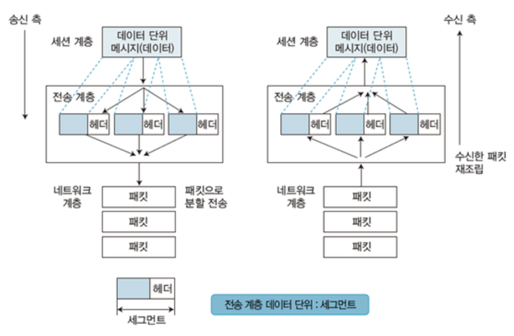 출처: https://m.blog.naver.com/kyg3766/220694266577

 

## 전송 계층이 필요한 이유
1. **신뢰할 수 있는 데이터**
   * 네트워크 계층에서 라우터는 라우팅 기능을 사용하여 다른 네트워크로 데이터를 전송한다. 
     * 이때, 여러 라우터를 경유하는 도중에 라우팅 정보가 잘못될 수도, 혹은 문제가 생겨 패킷이 손상될 수도 있다.
   * 물리 계층, 데이터 링크 계층, 네트워크 계층은 목적지에 데이터를 보낼 순 있다. 
     * 다만, **데이터가 손상되거나 유실되더라도 이들 계층에서는 아무것도 해주지 않는다.**
   * **전송 계층은 목적지에 신뢰할 수 있는 데이터를 전달할 수 있도록 해준다.**
2. **오류를 점검하고 재전송을 요청한다.**
   * **네트워크 계층은 목적지까지 데이터를 전달하고, 전송 계층에서 데이터가 제대로 도착했는지 확인하는 것.**
3. **전송된 데이터의 목적지가 어떤 애플리케이션인지 식별하는 기능** 
   * 컴퓨터가 데이터를 받아도 어떤 애플리케이션에서 사용되는지 모르면 의미가 없다.

 

## 전송 계층의 기능
* 흐름 제어
  * 수신측에서 설정한 윈도우 크기만큼 응답(ACK)없이 전송하여 흐름제어.
* 혼잡 제어
  * 느린 출발, 혼잡 회피, 손실 복구, Fast Retransmission, Fast Recovery
* 오류 제어
  * 시퀀스넘버 기반, ACK로 수신 확인, 오류 발생시 CRC이용, 송신 측에 프레임 재전송 요청
* 종단간 연결
  * 3-way handshake, 4-way handshake
* 서비스지점 주소 지정
  * 포트를 이용하여 프로세스 통신 제공 기능
* 분할 재조립
  * 메시지를 세그먼트 단위 분할, 순서대로 재조립

 

# 포트번호

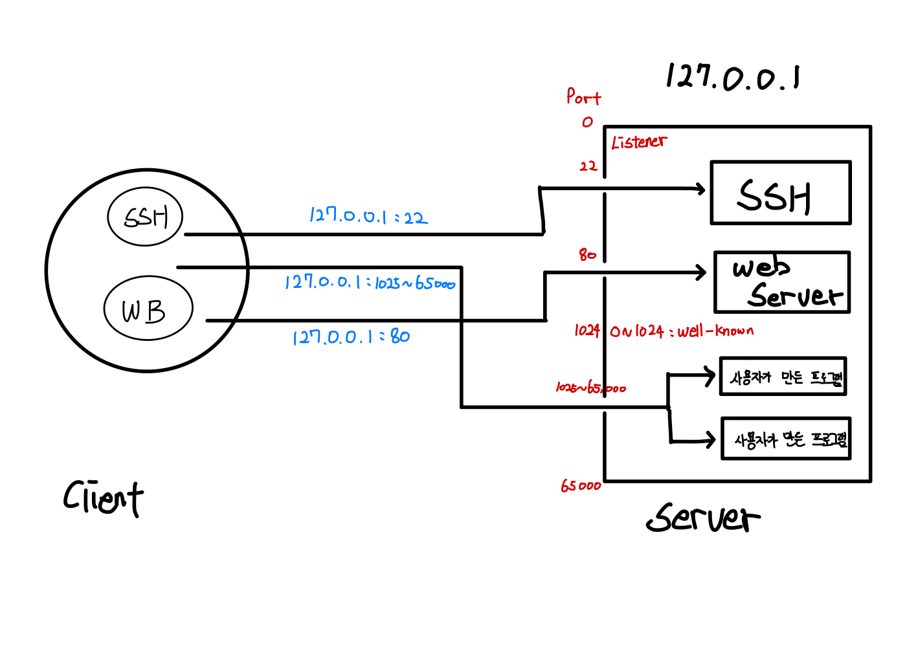 

* 포트 번호가 필요한 이유
  * 전송 계층에서 전송된 데이터의 목적지가 어떤 애플리케이션인지 구분하는 역할도 담당한다.
  * 이때 애플리케이션을 구분하는 것이 바로 포트번호이다.
* 전송 계층 헤더 안에는 두 개의 포트 번호가 있다.
  * 출발지 포트 번호, 목적지 포트 번호.

 

# 연결형과 비연결형 통신

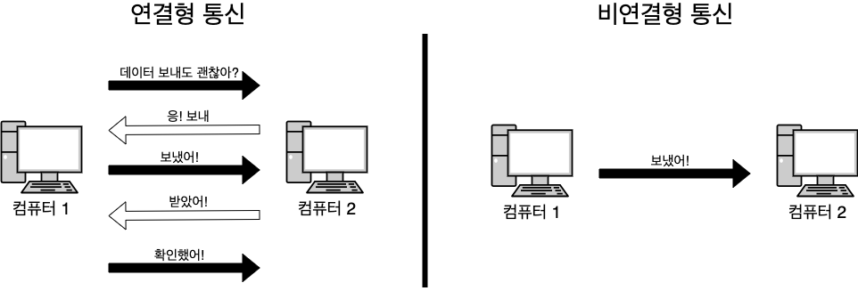

👨‍💻 **전송 계층의 특징은 신뢰성/정확성과 효율성으로 구분된다.**

* 신뢰성/정확성: 데이터를 목적지에 문제없이 전달하는 것. (**연결형 통신**)
  * 연결형 통신은 상대편과 확인해 가면서 통신하는 방식 (TCP)
* 효율성: 데이터를 빠르고 효율적으로 전달하는 것. (**비연결형 통신**)
  * 비연결형 통신은 상대편을 확인하지 않고 일방적으로 데이터를 전송하는 방식. (UDP)

 

# TCP

 

## TCP헤더

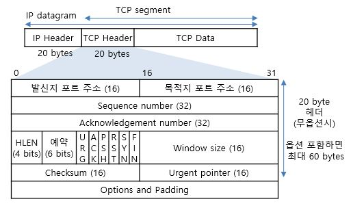 출처: http://www.ktword.co.kr/abbr_view.php?nav=&m_temp1=1889&id=1103

* 세그먼트: TCP헤더 + 데이터
* 코드 비트 (URG, ACK, PSH, RST, SYN, FIN)
  * TCP는 데이터를 전송하려면 **먼저 연결이라는 가상 독점 통신로**를 확보해야한다. (3-way handshake)
  * 이때 코드비트를 이용한다. (SYN: 연결 요청, ACK: 확인 요청)
* 일련번호 (Sequence Number)
* 확인 응답 번호 (Acknowledgement Number)
* 윈도우 크기

 

## 3-way 핸드셰이크, 4-way 핸드셰이크

 

**3-way handshake**

TCP는 기본적으로 데이터를 전송하려면 **먼저 연결이라는 가상 독점 통신로를 확보**해야한다.

이때 3-way 핸드셰이크 방식으로 통신로를 확보한다.

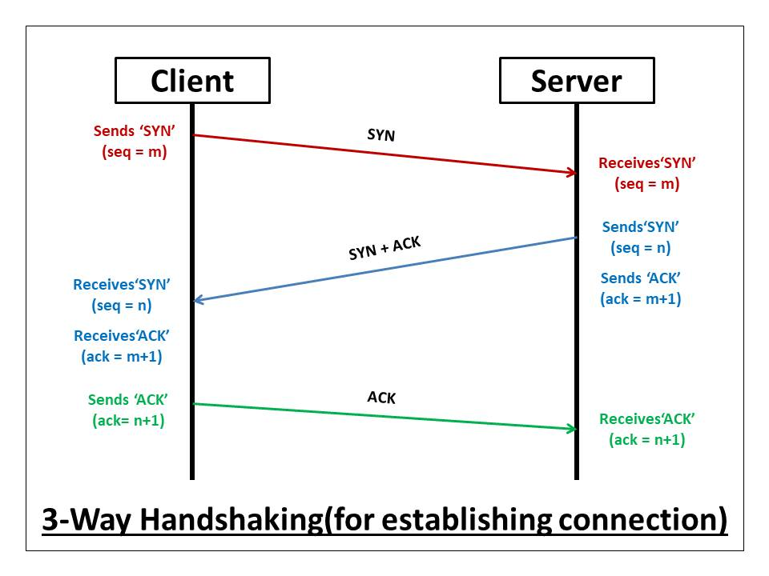 출처: https://afteracademy.com/blog/what-is-a-tcp-3-way-handshake-process

1. 컴퓨터 1에서 컴퓨터 2로 연결 확립 허가를 받이 위한 요청(SYN)을 보낸다.
2. 컴퓨터 2는 컴퓨터 1이 보낸 요청을 받은 후에 허가한다는 응답으로 연결 확인 응답(ACK)를 보낸다.
   * 동시에 컴퓨터 2도 컴퓨터 1에게 데이터 전송을 허가 받기 위한 연결 확립 요청 (SYN)을 보낸다.
3. 컴퓨터 2의 요청을 받은 컴퓨터 1은 컴퓨터 2로 허가한다는 응답으로 연결 확립 응답(ACK)를 보낸다.

 

**4-way handshake**

TCP는 또한 데이터를 전송하고나서 **가상 독점 통신로를 닫아**줘야한다.

이때 4-way 핸드셰이크 방식으로 통신로를 닫는다.

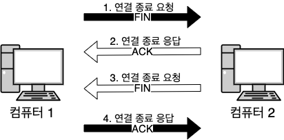

1. 컴퓨터 1에서 컴퓨터 2로 연결 종료 요청(FIN)을 보낸다.
2. 컴퓨터 2에서 컴퓨터 1로 연결 종료 응답(ACK)을 반환한다.
3. 또한 컴퓨터 2에서도 컴퓨터 1로 연결 종료 요청(FIN)을 보낸다.
4. 컴퓨터 1에서 컴퓨터 2로 연결 종료 응답(ACK)을 반환한다.

 

## 일련번호와 확인 응답 번호의 구조

**일련번호와 확인 응답 번호란?**

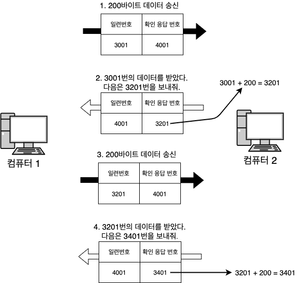 

* 3-way handshake가 끝나고 **실제 데이터를 보내거나 상대방이 받을 때** 일련번호(Sequence Number)와 확인 응답 번호(Acknowledgement Number)를 사용한다.
* **일련번호 (순서, 연속된 번호)**
  * TCP는 데이터를 분할해서 보내기 때문에, 송신 측에서 수신 측에 '**이 데이터는 몇 번째 데이터**'인지를 알려주는 역할을 한다.
* **확인 응답 번호**
  * 수신 측이 **몇 번째 데이터를 수신했는지** 송신 측에 알려주는 역할을 한다.

 

**일련번호와 확인 응답 번호가 필요한 이유**

* **재전송 제어**
  * 데이터가 항상 올바르게 전달되는 것이 아니다.
    * **일련번호와 확인 응답 번호를 사용해서 데이터가 손상되거나 유실됐는지 확인한다.**
  * 그리고 **손상되거나 유실된 경우엔 데이터를 재전송한다.**
  * 데이터를 전송하는 도중에 오류가 발생하면 일정 시간 동안 대기한 후에 재전송한다.

 

## 윈도우 크기

 

**윈도우 크기가 필요한 이유와 개념**

* [일련번호와 확인 응답 번호 예시](#일련번호와-확인-응답-번호의-구조)를 보면, **세그먼트(데이터) 하나를 보낼 때마다 확인 응답을 한 번 반환한다.**
  * 이와 같은 통신은 **한 번 보낼 때마다 한 번 응답을 반환하는 방식이어서 효율적이지않다.**
* **매번 확인 응답을 기다리는 대신 세그먼트를 연속해서 보내고 난 다음에 확인 응답을 반환하는 것이 효율적이다.**
  * 하지만 **너무 계속보내면 상대방의 버퍼에 점점 쌓여 오버플로우가 발생한다.**
  * 그래서 오버플로우가 발생하지 않도록 **버퍼의 한계 크기**를 정해야하는데 이것이 바로 **윈도우 크기**다.
* **윈도우 크기: 얼마나 많은 용량의 데이터를 저장해 둘 수 있는지**를 나타냄.

 

**핸드셰이크할 때 측정한다**

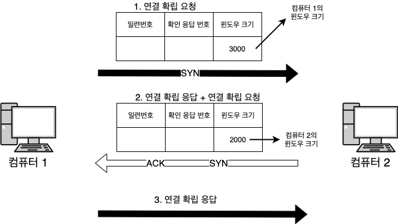

* 각 컴퓨터의 윈도우 크기는 3-way 핸드셰이크를 할 때 상대측에 알려준다.

 

**매번 확인 응답 번호를 확인 하는 통신**

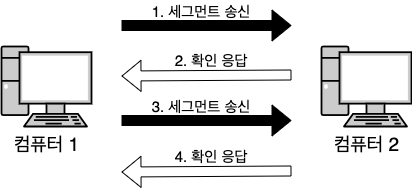 

* 윈도우 크기를 정하지 않고, 매번 데이터를 보낼때마다 확인하는 방식이다.
  * 비효율적.

 

**확인 응답 번호를 확인 하지 않는 통신**

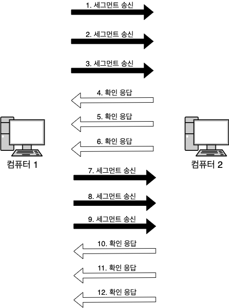 

* 윈도우 크기를 정하고, 확인 응답을 수신하기 전에 데이터를 보내는 방식이다.
  * 효율적.

 

# UDP

 

## UDP 헤더 

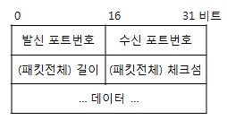 출처: http://www.ktword.co.kr/abbr_view.php?m_temp1=323&m_search=udp

* 데이터 그램: UDP헤더 + 데이터
* UDP는 효율성과 빠른 속도가 중요해서 상대방을 확인하지 않고 연속해서 데이터를 보낸다.
  * 동영상, 브로드캐스트등에 사용된다.

