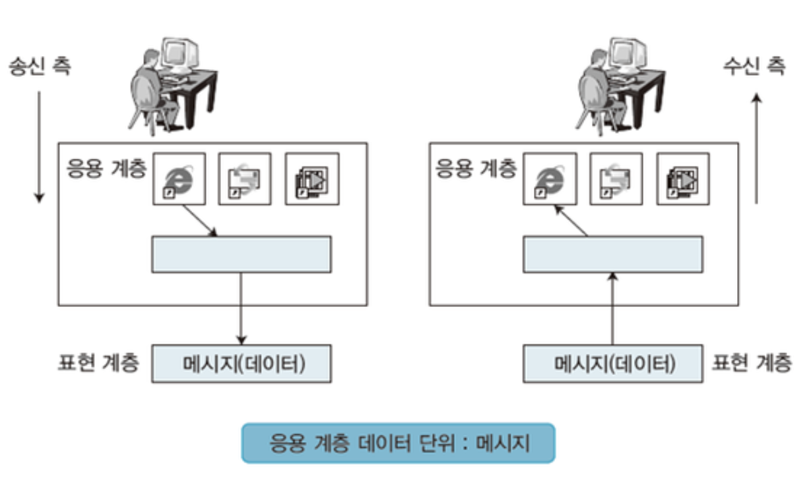

[모두의 네트워크](http://www.yes24.com/Product/Goods/61794014?OzSrank=1)을 바탕으로 작성한 자료입니다.

# 목차

 

 

# 응용 계층의 역할

 출처:  https://m.blog.naver.com/PostView.naver?isHttpsRedirect=true&blogId=kyg3766&logNo=22069431311

* 물리 계층, 데이터 링크 계층, 네크워크 계층, 전송 계층의 역할
  * 상대방에게 데이터를 정확하게 전달한다.
* **응용 계층의 역할**
  * 클라이언트의 요청을 전달하기 위해 서버가 **이해할 수 있는 메시지(데이터)로 변환하여 전송계층으로 전달**하는 역할.
  * 각각 **애플리케이션(이 사용하는 프로토콜)에 대응되는 데이터를 전송**하는 역할.
* 클라이언트와 서버가 통신을 하기 위해 응용 계층은 프로토콜을 사용한다.
  * ex. telnet, FTP, DHCP, HTTP, SMTP, DNS, POP3 등

> 여기서 말하는 응용 계층은 TCP/IP의 응용 계층이다. (세션 + 표현 + 애플리케이션)

 
