# 목차

 

- [목차](#목차)
- [컴퓨터 네트워크 기본](#컴퓨터-네트워크-기본)
- [1 네트워크 구성요소](#1-네트워크-구성요소)
- [2 데이터 전송 방법](#2-데이터-전송-방법)
  - [2-1 TCP vs UDP](#2-1-tcp-vs-udp)
  - [2-2 Protocol](#2-2-protocol)
  - [2-2 Packet Switching vs Circuit Switching](#2-2-packet-switching-vs-circuit-switching)
  - [2-3 네트워크 데이터 전송이 늦어지는 이유](#2-3-네트워크-데이터-전송이-늦어지는-이유)
  - [2-4 패킷 유실](#2-4-패킷-유실)
- [3 프로세스간의 통신 (애플리케이션 계층)](#3-프로세스간의-통신-애플리케이션-계층)
  - [3-1 소켓 통신](#3-1-소켓-통신)
  - [3-2 프로세스간의 통신에서 필요한 4가지](#3-2-프로세스간의-통신에서-필요한-4가지)
  - [3-3 예시 - HTTP](#3-3-예시---http)
- [생각해볼 점](#생각해볼-점)
- [참고](#참고)

 

# 컴퓨터 네트워크 기본
이번 장의 목표 -> 네트워크에 대한 전체적인 큰 그림 그리기.

 

# 1 네트워크 구성요소
이번 장의 목표는 네트워크의 큰 그림을 그리는 것이다.

그러기에.. 첫 부분은 네트워크의 구성요소에 대해서 다룬다.

 

💁‍♂️ **네트워크 구성요소**

 

위 그림에서 볼 수 있듯이, 네트워크는 굉장히 많은 Node들의 연결로 되어있다.

크게 세 가지의 요소로 구성된다.

* network edge
  * applications and hosts
  * 애플리케이션과 호스트 (위 그림에서 가장자리)
* network core
  * routers, network of networks
  * 네트워크들간의 통신을 위한 라우터 (위 그림에서 중앙부분)
* access networks, physical media
  * communication links
  * 각 네트워크 장비를 이어주는 연결 요소 (ex. 케이블, 이더넷, 와이파이, LTE, 구리선등등)

 

💁‍♂️ **보통 End System (Hosts)끼리 통신한다.**

보통 네트워크를 이용하여 End System (위 그림에선 가장자리)끼리 통신한다.

> End System (Hosts): run application programs (ex. Web, email)

통신 형식은 `Client - Server 모델`과 `Peer - Peer 모델`이 존재한다.

 

# 2 데이터 전송 방법
네트워크에 대한 구성요소를 통해 큰그림을 그렸다면, 이제 End Point들끼리 어떻게 데이터를 전송하는지에 대해서 다룬다.

> 전송 계층의 내용이기도 하다.

 

## 2-1 TCP vs UDP
💁‍♂️ 시스템간의 데이터를 전송하는 방법은 두 가지로 나뉜다.

* TCP
  * 데이터를 주고받기 전에, 미리 통로를 연결한 다음에 데이터를 주고 받는 방식.
  * 장점
    * 신뢰성 - 순서를 지키면서 통신되며, 신뢰성이 있다.
    * Flow Control - Sender가 Receiver의 처리 속도에 맞춰서 데이터를 전송한다.
    * Congestion Control - Sender가 Receiver 중간의 네트워크 처리 가능량에 따라 데이터를 주고 받는다.
  * 단점
    * 데이터를 주고 받기 전후로 핸드셰이크를해야하기에 비용이 비교적 크다.
* UDP
  * Sender가 그저 데이터를 바로바로 보내는 방식
  * 장점
    * 빠르다.
  * 단점
    * 신뢰성이 떨어진다, Flow Control, Congestion Control 모두 사용 불가.

> 이번 장은 간단하게 큰 그림을 그려보는 부분이기에 간단히만 정리한다.
> 
> 자세한 내용은 전송 계층에서 다룰 예정이다.

 

## 2-2 Protocol
TCP, UDP에서의 P는 Protocol을 의미하며, 이는 네트워크에서 흔히 사용되는 굉장히 빈번하게 사용되는 용어이다.

 

🤔 **Protocol**
* All communication in Internet coordinated by protocols
  * 서로 간의 통신을 위한 약속한 규격을 의미한다.
  * ex. 언어, 대화의 약속
* 재밌는 예시: `난 쟤랑 프로토콜이 안 맞아`

 

## 2-2 Packet Switching vs Circuit Switching
이제 네트워크의 Core 부분에 속하는 내용을 이야기해본다.

네트워크의 목적은 End Point들끼리의 통신이라고 말했다.

그리고 **네트워크의 중간부분인 라우터 (Network Core)가 데이터를 전달하는 역할을 맡는다.**

 

🤔 **그렇다면 각 라우터들은 어떤 방식으로 데이터를 전송하고 받는 것일까?**

1. circuit-switching
2. packet-switching

 

💁‍♂️ **circuit-switching**

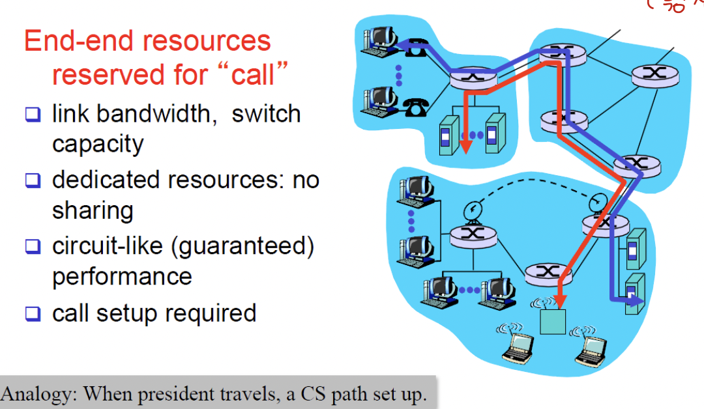 출처: http://www.kocw.or.kr/home/cview.do?mty=p&kemId=1169634  

* 개념
  * **출발지부터 목적지까지의 길을 미리 만들어두고 데이터를 주고 받는 방식이다.**
    * 즉, **하나의 회선을 할당받아 데이터를 주고받는 방식.**
  * **먼저 통신을 위한 연결을 해야하며, 연결이되고나면 출발지로부터 목적지까지 도착하는데 사용되는 회선 전체를 독점 (dedicated)하기 때문에 다른 사람이 끼어들 수 없다.**
* 보통은 전화와 같은 실시간 통신에 사용된다.

 

💁‍♂️ **packet-switching**

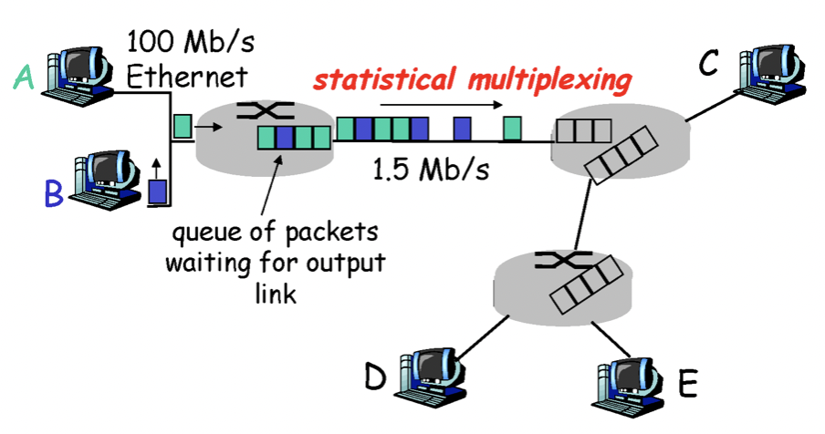 출처: http://www.kocw.or.kr/home/cview.do?mty=p&kemId=1169634 

* 개념
  * 데이터를 packet 단위로 쪼개서 전송하는 방식을 의미한다. (packet 단위로 청크 처리)
  * 미리 전송 경로를 정하지않고, 통계적 다중화 방식으로 패킷을 전송한다.
* 현재 대부분의 HTTP에서 사용중인 데이터 전송 방식이다.

 

💁‍♂️ **두 전송방식의 비교**

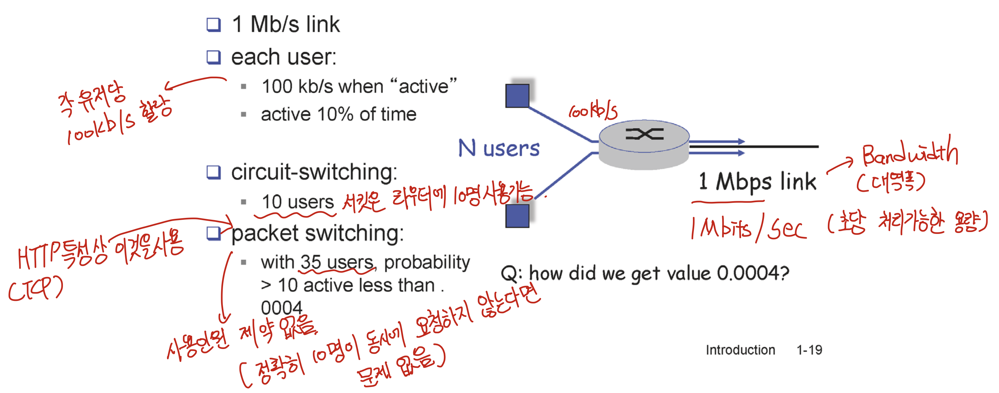 출처: http://www.kocw.or.kr/home/cview.do?mty=p&kemId=1169634 

**라우터가 1 Mb/s의 대역폭과 처리속도를 지니며, 각 유저당 100kb/s씩 할당해준다고 가정해본다.**

* circuit-switching
  * **서킷은 10명만 사용이 가능하다.** (회선을 독점하기 때문이다.)
  * 정확히 말하면 10명이 통신하는 도중엔 10명이 모두 회선을 독점하기에 다른 사용자가 사용하지 못한다.
* packet-switching
  * **회선을 독점하지않고 사용할 때만 잠시 회선을 이용하고 끊기때문에 많은 유저가 사용할 수 있다.**
  * 단, **정확히 10명이 동시에 요청한다면 라우터는 Queue에 요청을 쌓아서 처리한다.**

> 현재 인터넷은 HTTP와 TCP의 특성상 Packet Switching을 이용한다.
> 
> **HTTP는 TCP를 이용하여 원하는 데이터만을 주고받고 연결을 끊기 때문에, 굳이 회선을 계속해서 차지할 필요가없어 회선을 공유하는 packet-switching 방식을 채택한 것.**

 

## 2-3 네트워크 데이터 전송이 늦어지는 이유
앞서 말했듯이 인터넷은 TCP 기반의 packet-switching 방식을 이용한다.

이번엔 packet-switching 기준으로 라우터가 데이터를 어떻게 처리하고 전송하는지 살펴본다.

그리고 이 과정에서 왜 데이터 전송이 늦어지는지 알아본다.

**라우터가 다른 라우터로부터 데이터를 받고 다른 라우터로 전송하기까지 지연(Delay)되는 부분은 크게 4가지이다.**

1. Node processing
2. Queueing
3. Transmission delay
4. Propagation Delay

> 그리고 패킷 유실도 하나의 데이터 전송이 늦어지는 이유중 하나이다.

 

💁‍♂️ **Node processing와 Queueing**

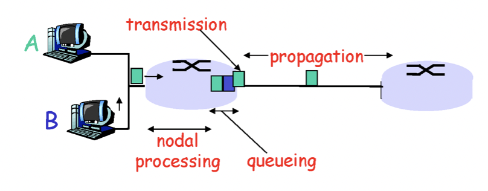 출처: http://www.kocw.or.kr/home/cview.do?mty=p&kemId=1169634 

* **node processing**
  * check bit errors (유효성 검사)
  * determine output link (목적지 체크)
* **Queueing**
  * time waiting at ouput link for transmission
    * **라우터가 처리가능 대역폭을 넘는 요청이 온다면 Queue를 이용하여 줄을 세워 차례대로 처리한다.** (버퍼 처리)
  * dependes on congestion level of router
    * **라우터의 혼잡 제어 수준에 따라 지연(Delay) 여부가 결정된다.**

 

💁‍♂️ **Transmission Delay와 Progagation Delay**

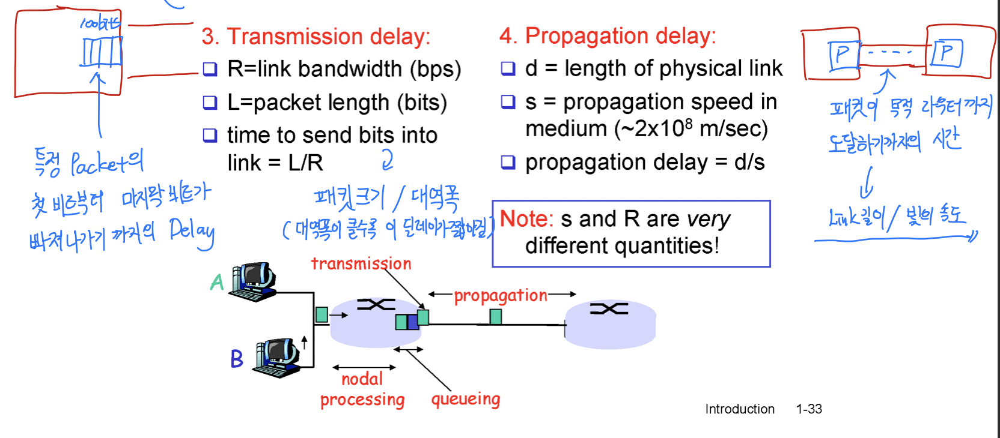 출처: http://www.kocw.or.kr/home/cview.do?mty=p&kemId=1169634 

* **Trasmission Delay**
  * **특정 Packet의 첫 비트부터 마지막 비트가 라우터를 빠져나가기까지의 Delay**
    * **즉, 특정 Packey의 첫 비트부터 마지막 비트까지 라우터를 벗어날 때까지의 지연.**
  * time to send bits into link = 패킷 크기 / 대역폭
    * 대역폭이 클수록 이 지연은 짧아진다.
  * 비유: 통로가 좁은 깔때기에 양동이의 물(Packet)을 부으면 모두 통과하기까지 오래걸린다. 반면에, 통로가 넓은 깔때기에 동일한 양동이의 물을 부으면 한번에 통과할 수 있다.
* **Propagation Delay**
  * **특정 라우터로부터 출발한 패킷이 목적 라우터까지 도달하기까지의 시간.**
  * propagation delay = link 길이 / 빛의 속도
     * 이 지연은 우리가 해결할 수 없다. (물리적으로 해결해야하는 문제)

 

💁‍♂️ **비유를 해보자면 - Caravan analogy**

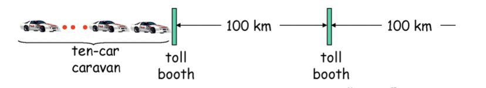 

* Q: 위와 같이 자동차 10대가 있는데 100km/h로 운행된다. 그리고 toll booth(요금소)에서 자동차가 정산하기 위해 12sec가 걸린다. **그렇다면 10개의 자동차가 2번째 toll booth까지 세워질려면 얼마나 걸릴까?**
  * 여기서 자동하 1대가 bit이며, 10대의 비트를 합쳐 하나의 패킷으로 인식한다.
  * 요금소는 라우터라고보면 된다.
* A: 10의 차가 출발 요금소(라우터)를 빠져나가기까지 12 * 10 = 120 sec 걸린다. 그리고 자동차가 propagate하는 100km/100km/h=60min. -> 62분이 걸리게 된다.

> **여기서 중요한 점은 목적 라우터에 도착한 bit는 출발 라우터로부터 패킷의 모든 bit가 도달할 때까지 기다린다.**
> 
> **목적 라우터에 출발 라우터로부터 온전한 패킷이 도달해야지만, 다음 작업을 이어간다.**

 

**💁‍♂️ 보통은 트래픽이 몰렸을 경우, Queing Delay가 많이 발생한다.**

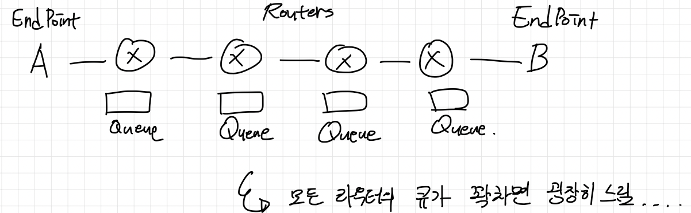 

트래픽이 몰렸을 경우, 도저히 대역폭과 라우터가 바로바로 처리할 수 없기에 Queueing을 하는데...

**여기서 줄을 기다리는 패킷이 모두 지연(Delay)된다고 볼 수 있다.**

 

🤔 **지연(Delay)를 줄일 방법은 없을까?**

* Queueing Delay
  * Queueing은 사람이 한번에 몰리면 자주 발생하는 Delay다.. (제일 골치 아픔)
  * **지연을 줄이는 방법은 대역폭을 늘리고 라우터의 처리 속도를 높이면 된다.**
    * **그럼에도 많은 양의 트래픽이 몰리면 지연이 발생한다.**
  * **비유: 톨게이트 - 차로를 넓히고, 하이패스를 도입하면 빠르게 차들을 보낼 수 있다.**
    * **그럼에도 추석땐 항상 막힌다.. 너무 많은 차량이 몰리기 때문..**
* Transmission Delay
  * 라우터와 케이블을 업그레이드함으로써 지연을 막을 수 있다.
  * 실제로 ISP들이 주기적으로 라우터와 케이블의 대규모 공사를하는 이유라고한다.
  
 

## 2-4 패킷 유실
packing-switching에서 당연히 패킷이 유실된다.

 

💁‍♂️ **90%의 패킷 유실는 Queueing 때문이라고 한다.**

라우터의 처리량과 대역폭보다 많은 사용자가 한번에 몰리면 라우터는 Queue를 통해 패킷을 줄 세워 처리하게된다.

이때 **라우터 Queue의 사이즈보다 큰 요청이오면, 당연히 패킷은 유실된다.**

실제로 이로인한 패킷 유실이 90%에 달한다고한다.

 

🤔 **TCP는 신뢰성있는 전송 방식인데.. 패킷이 유실될 경우 어떻게 처리하는가?**

**TCP는 신뢰성있는 통신을 위해 `재전송` 방식을 이용하여 패킷이 유실될 경우 해당 패킷을 재전송한다.**

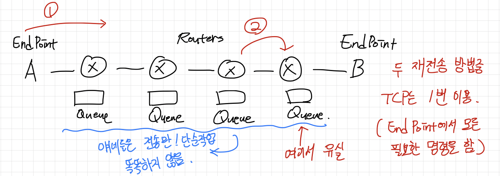 

그리고 **Network Core인 라우터는 보통 데이터를 받고 그대로 전송만하는 bypass 역할을하기에, 재전송 로직은 End Point에 존재한다고한다.**

**TCP는 보통 timeout을 통해 패킷을 재전송한다고한다.** 이와 관련해서도 전송 계층에서 더 자세히 다룰 예정이다.

> 스터디중 한 분이 라우터의 발전에 따라 라우터가 재전송 로직을 가지는 경우도 있다고한다. (추후에 한번 더 자세히 알아볼 예정이다.)

 

# 3 프로세스간의 통신 (애플리케이션 계층)
이번 장은 애플리케이션 계층의 빌드업하는 내용을 담고있다.

 

## 3-1 소켓 통신
**다른 Host의 프로세스간의 통신은 소켓을 이용한다.**

이 말이 어떤 의미인지 알아보자.

 

💁‍♂️ **통신하는 주체는 프로세스이다.**

위에서도 언급했듯이, 통신을 하는 주체는 network edge에 속하는 애플리케이션들이다.

그리고 **이러한 애플리케이션들은 운영체제 관점에서보면 프로세스 (Process)이다.**

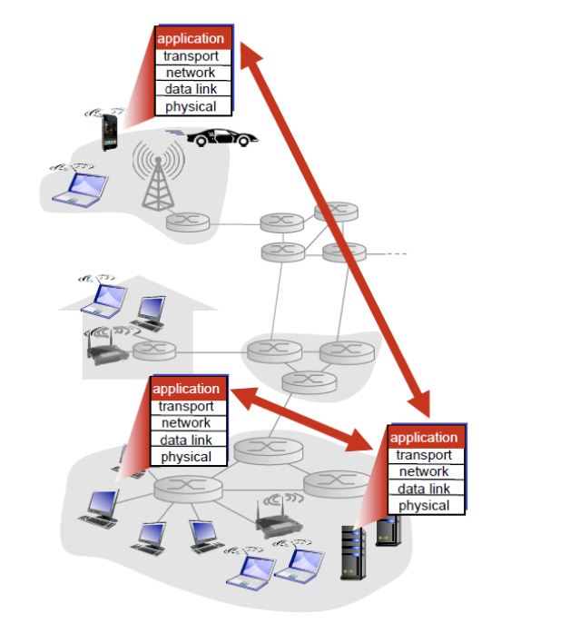 출처: http://www.kocw.or.kr/home/cview.do?mty=p&kemId=1169634 

즉, 네트워크 통신이란 프로세스간의 통신을 의미하며, network core에 속하는 다른 계층들은 그저 데이터를 전송하는 역할만 담당하게 된다.

* 네트워크를 통해 다양한 요구사항을 구현하는 계층 : Application 계층 (프로세스)
  * 보통은 Client - Server 아키텍처로 이루어져있다.
* 그저 프로세스간의 데이터 통신을 담당하는 계층 : Transfer, Data link, Physical 등등
  * 나쁜 말로는 그저 데이터만 받아서 전달하는 바보들...?

> 위 내용은 OSI 7계층을 설명하기 위한 빌드업으로 보인다. OSI 7계층을 이미 알고있는 사람이면 쉽게 이해할 수 있다.

 

💁‍♂️ **프로세스의 통신 인터페이스이 바로 소켓이라 부른다.**

네트워크에서 통신을 주체하는 대상은 프로세스이다. 그렇다면 프로세스는 어떤 방식으로 네트워크를 통해 데이터 전송할까?

**바로 인터페이스와 같은 역할을 하는 소켓을 이용한다.**

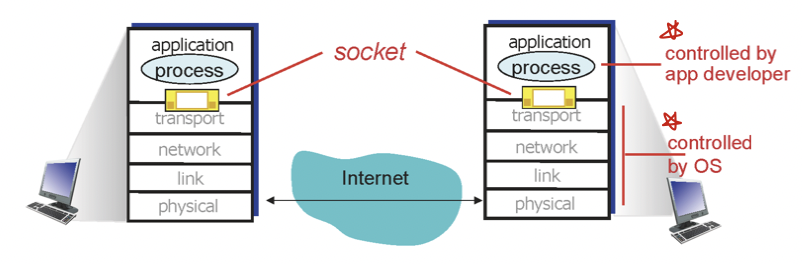 출처: http://www.kocw.or.kr/home/cview.do?mty=p&kemId=1169634 

* **같은 디바이스 (Host) 내 프로세스간의 통신 : IPC (Inter - Process Communication)**
* **다른 디바이스 (Host) 의 프로세스간의 통신 : Socket 통신.**

**각 프로세스들은 다른 Host의 프로세스에 데이터를 전송 및 수신하기위해 Socket을 이용한다.**

 

## 3-2 프로세스간의 통신에서 필요한 4가지

💁‍♂️ **애플리케이션 계층에 속하는 프로세스가 안정적으로 소켓을 이용하여 통신하기 위해 필요한 4가지 기능. - 중요**

* data integrity (데이터 무결성 - 입력된 데이터가 변경·파괴되지 않은 상태)
  * TCP를 이용하면 된다.
* timing
  * 지연이 적게 발생하여 제때 원하는 데이터를 받아야한다.
* throughput
  * 효과적으로 처리하여 적은 양의 throughput으로도 처리할 수 있어야한다.
* security (보안))
  * 보안 계층 (TSL, SSL 계층)을 이용하면 된다.

> **위 4가지 기능을 제공하기 위해 각 계층이 존재하며, 각 계층이 위 4가지 기능을 위해 각각의 역할을 부여받아 처리한다.**

이러한 내용을 언급하는 이유는 애플리케이션의 요구사항이 OSI의 각 계층이 필요한 이유를 잘 설명해주기때문이다.

 

## 3-3 예시 - HTTP
실제로 위와 같이 프로세스간의 통신을 위해 애플리케이션에서도 각 프로토콜별 통신하는 방법이 모두 상이하다.

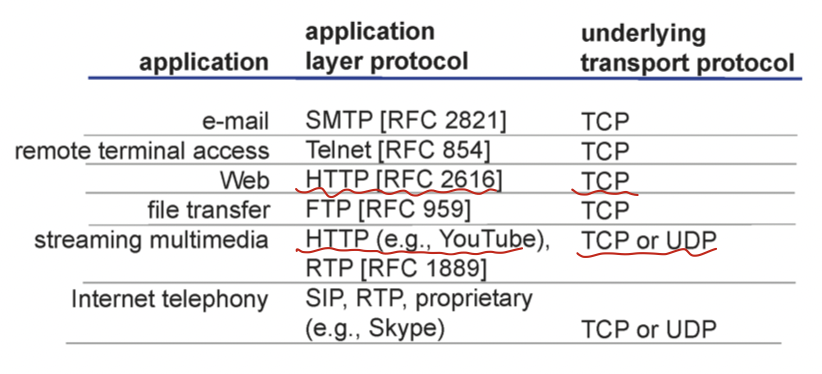 출처: http://www.kocw.or.kr/home/cview.do?mty=p&kemId=1169634 

그리고 **소켓을 이용한 프로세스중 가장 많이 사용되는 프로세스가 아마 HTTP를 이용하는 Client(브라우저 or App)나 Server일 것이다.**

이번 장에선 간단히 실제로 가장 많이 사용되는 HTTP 프로토콜이 무엇인이 살펴본다.

 

💁‍♂️ HTTP 통신 과정

1. TCP 연결을 생성한다. (이때 소켓을 이용한다.) - 3 way handshakes
2. HTTP 메시지를 Client와 Server간 서로 교환한다.
3. TCP 연결을 해제한다. - 4 way handshakes

> HTTP는 무상태성을 지향한다. -> Server는 누구한테서 요청이 온 것인지 알지못하고, 단순히 요청이오면 처리하고 반환만한다.

 

# 생각해볼 점
> 스터디를 진행하며 나온 여러가지 여담에 대해서 정리한다.

* HTTP/3부터는 UDP를 이용한 통신을 지향한다.
  * 참고: https://blog.cloudflare.com/http3-the-past-present-and-future/
* Throughtput?
  * 스루풋(throughput) 또는 처리율(處理率)은 통신에서 **네트워크 상의 어떤 노드나 터미널로부터 또 다른 터미널로 전달되는 단위 시간당 디지털 데이터 전송으로 처리하는 양**을 말한다. 예를 들어 데이터 링크에서는 스루풋 단위로 초당 비트 수(bit/s 또는 bps)가 주로 사용된다.
  * 
* Bandwidth vs Throughtput
  * Throughtput: Throughput is defined as rate of successful information delivery over a communication link.
  * Bandwidth: actually gives the maximum amount of data that can be transmitted through a link or channel. Bandwidth does not consider latency and protocols type while considering the traffic traversing the link.

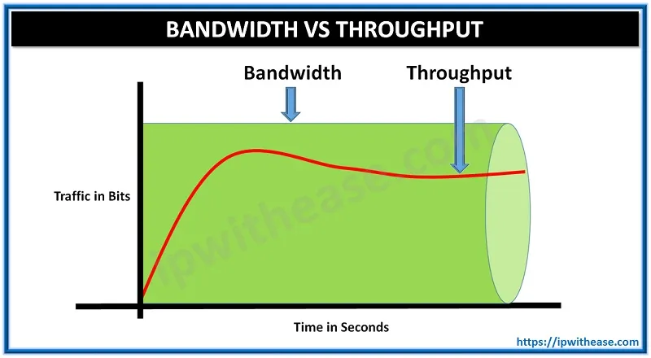 Throughtput vs Bandwidth 

 

# 참고
* http://www.kocw.or.kr/home/cview.do?mty=p&kemId=1169634

