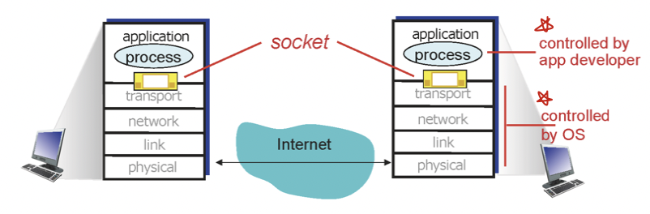

# 목차

 

- [목차](#목차)
- [애플리케이션 계층](#애플리케이션-계층)
- [1 소켓](#1-소켓)
  - [1-1 소켓이란?](#1-1-소켓이란)
  - [1-2 소켓 종류](#1-2-소켓-종류)
  - [1-3 소켓 통신 과정](#1-3-소켓-통신-과정)
- [2 소켓과 전송 계층](#2-소켓과-전송-계층)
  - [2-1 전송 계층의 역할 (Multiplexing과 Demultiplexing)](#2-1-전송-계층의-역할-multiplexing과-demultiplexing)
  - [2-2 TCP와 UDP의 Demultiplexing 차이](#2-2-tcp와-udp의-demultiplexing-차이)

 

# 애플리케이션 계층
네트워크란 edge (end point)들끼리의 통신이 목표이다.

그러므로 애플리케이션 계층은 컴퓨터 네트워크의 존재이유이기도하다.

인터넷 도입이후에 수많은 애플리케이션들(ex. 브라우저, 서버)이 개발되었으며, 이러한 애플리케이션이 인터넷 성공의 뒷받침이되었다.

이번 장은 이러한 애플리케이션들이 어떻게 다른 애플리케이션과 통신을 주고받는지 알아본다.

그중에서 가장 애플리케이션과 밀접한 애플리케이션 계층에 대해서 알아본다.

 

# 1 소켓
애플리케이션이 다른 애플리케이션과 네트워크로 통신하려면 소켓이라는 인터페이스를 이용해야한다.

 

## 1-1 소켓이란?

 출처: http://www.kocw.or.kr/home/cview.do?mty=p&kemId=1169634 

* **소켓은 인터페이스다.**
  * **소켓은 `애플리케이션 계층 - 전송 계층 사이`에 존재하는 소프트웨어 인터페이스이다.**
  * **애플리케이션 통신은 프로세스간의 통신을 의미하는데, 같은 호스트안에선 IPC를 다른 호스트끼리의 통신은 소켓을 이용한다고보면 된다.**
  * 즉, 서로 다른 호스트의 프로세스끼리 통신할 때, **프로세스를 개발하는 개발자가 네트워크와 관련된 내용을 자세히 알지못해도 소켓을 통해 쉽게 네트워크 통신을 할 수 있도록한다.**
* 프로세스가 데이터를 보내거나 받기 위해서는 반드시 소켓을 열어서 소켓에 데이터를 써보내거나 소켓으로부터 데이터를 읽어들여야한다.
  * 우리가 흔히아는 HTTP도 소켓을 통해 통신한다.

 

## 1-2 소켓 종류
소켓은 종류는 두 가지로 볼 수 있다.

 출처: http://www.kocw.or.kr/home/cview.do?mty=p&kemId=1169634 

* TCP 소켓 (스트림)
  * 양방향으로 바이트 스트림을 전송한다. (연결지향성)
  * 오류 수정, 흐름제어, 재전송처리등을 통해 통신의 안정성을 보장한다.
  * 송신된 순서에 따라 중복되지 않게 데이터를 수신한다. -> 이로인해 오버헤드가 발생하기도한다.
* UDP 소켓 (데이터그램)
  * 비연결형소켓
  * 데이터의 크기에 제한이 있다.
  * 확실하게 데이터가 전달되었는지 보장할 수 없다. 데이터가 손실돼도 오류가 발생하지 않는다.
  * 비교적 속도가 빠르다. 주로 실시간 멀티미디어 정보를 처리하기 위해 주로 사용된다.

 

## 1-3 소켓 통신 과정
두 프로세스가 소켓을 통해 전송하는 과정은 아래와 같다.

> 흔히 많이 사용되는 TCP 소켓의 통신 과정이다.

 출처: http://www.libqa.com/wiki/116 

💁‍♂️ **클라이언트 소켓 통신**
1. 소켓 생성 - `socket()`
   * 서버와 통신을 위해 운영체제에 `socket()` 시스템콜을 통해 소켓을 생성한다.
2. 소켓 연결 - `connect()`
   * `connect()` 시스템 콜을 호출하며, 서버와 3-way handshake를 통해 연결한다.
   * 소켓이 연결되었다면 클라이언트와 서버가 연결된다.
3. 데이터 송수신 - `write()`, `read()`
   * 클라이언트가 서버에 보낼 요청은 `write()`을 통해, 서버로부터의 데이터를 받기위해선 `read()`를 이용한다.
   * 보통 메모리에 버퍼를 저장하여, 데이터 양이 적으면 모아서 전송하고, 데이터 양이 크면 분할하여 전송하게된다.
4. 소켓 연결 종료 - `close()`
   * `close()` 시스템 콜을 호출하여 서버와의 통신을 끊는다.
   * 이때 4-way handshake를 통해 연결을 끊는다.

 

💁‍♂️ **서버 소켓 통신**

1. 소켓 생성 - `socket()`
   * 클라이언트와 통신을 위해 운영체제에 `socket()` 시스템 콜을 통해 소켓을 생성한다.
2. 소켓 바인딩 - `bind()`
   * `bind()` 시스템 콜을 통해 소켓과 프로세스의 포트 번호를 결합한다.
   * 포트당 프로세스는 하나이다.
   * 프로세스는 여러 개의 소켓을 지닐 수 있다. 다시말해, **스레드별로 소켓이 존재할 수 있다.**
3. 연결 요청 대기 - `listen()`
   * `listen()` 시스템 콜을 통해 클라이언트의 연결 요청(`connect()`)이 수신될때까지 대기한다.
4. 연결 허용 - `accept()`
   * `accept()` 시스템 콜을 통해 새로운 소켓을 만들어 해당 소켓으로 클라이언트와 연결한다.
   * **서버 소켓은 클라이언트의 연결요청을 수신하는 소켓이고, 실질적으로 클라이언트와의 통신은 `accept()` 통해 스레드 기반의 새로 생성된 소켓으로 데이터를 주고받는다.**
5. 데이터 송수신 - `write()`, `read()`
   * `read()`, `write()`을 통해 클라이언트와 데이터를 주고받는다.
6. 소켓 연결 종료 - `close()
   * `close()` 시스템 콜을 호출하여 클라이언트와 통신을 끊는다.

> 소켓의 통신 과정은 인터넷에 굉장히 자료가 많다. 구글링해보면 더 자세한 내용을 찾을 수 있다. 

 

자바에서는 소켓 클래스를 지원하며, 해당 클래스를 이용한 전송 과정은 아래와 같다.

 출처: http://www.libqa.com/wiki/116 

> 자세한 내용은 [자바를 이용한 채팅 프로그램](https://github.com/binghe819/project-socket-chatting)을 참고.

 

# 2 소켓과 전송 계층
소켓은 애플리케이션과 전송 계층 사이의 인터페이스이다.

이번엔 소켓과 전송 계층 사이의 관계에 대해서 조금 더 알아본다.

 

## 2-1 전송 계층의 역할 (Multiplexing과 Demultiplexing)
전송 계층의 역할을 크게 두 가지로 볼 수 있다.

 출처: http://www.kocw.or.kr/home/cview.do?mty=p&kemId=1169634 

* Multiplexing - 여러 소켓으로부터 받은 데이터를 모아 전송계층의 헤더를 붙여서 네트워크 계층으로 내려보내 네트워크로 전송하는 역할.
  * 애플리케이션 계층에서 패킷이 소켓에 의해 전송 계층으로 전달 될 때, 여러 소켓의 패킷을 수집하여 하나의 세그먼트에 캡슐화하여 네트워크 계층으로 전달한다.
  * 전송 계층에서 여러 소켓의 데이터를 전송 계층의 헤더를 붙임으로써 처리하는 과정이라고보면 된다.
* Demultiplexing - 전송계층에 도착한 세그먼트를 알맞는 소켓에 전달하는 역할.
  * 전송 계층에서 세그먼트가 애플리케이션 계층으로 전달 될 때, 올바른 소켓을 찾아 전달한다.
  * 이때 Multiplexing 과정에서 추가된 세그먼트의 헤더 정보(출발지와 도착지의 정보)를 바탕으로 전달된다.

 

## 2-2 TCP와 UDP의 Demultiplexing 차이

 

💁‍♂️ **Demultiplexing 은 전송 계층의 헤더 정보를 바탕으로 동작한다.**

Demultiplexing은 네트워크 계층으로부터 받은 데이터그램을 분석하여 알맞는 소켓에 전달하는 역할이다.

 출처: http://www.kocw.or.kr/home/cview.do?mty=p&kemId=1169634 

* 각 데이터그램은 출발지 IP와 도착지 IP를 가지고있다. (TCP는 출발지 Port와 도착지 Port도 포함하여 가지고있다.)
  * **출발지와 도착지의 IP, Port를 기반으로 알맞는 소켓을 찾는다.**
* 각 데이터그램은 한 개의 전송 계층의 세그먼트를 전송한다.

 

💁‍♂️ **TCP Demultiplexing**

 출처: http://www.kocw.or.kr/home/cview.do?mty=p&kemId=1169634 

* **프로세스별로 소켓을 가지며, 출발지 IP와 Port, 도착지 IP와 Port 기준으로 어떤 소켓으로 데이터를 올릴지 결정한다.**
* **각 연결되는 클라이언트마다 서로 다른 소켓을 사용하기에 어쩌면 당연하다.**
  

 

💁‍♂️ **UDP Demultiplexing**

 출처: http://www.kocw.or.kr/home/cview.do?mty=p&kemId=1169634 

* UDP는 연결지향이 아니기에 누구에게서 온것인지는 상관이없기때문에, **출발지와 상관없이 도착지 IP와 Port만을 고려하여 소켓을 결정한다.**

