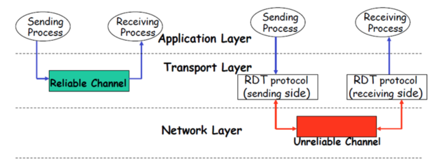
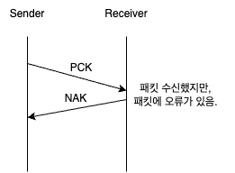
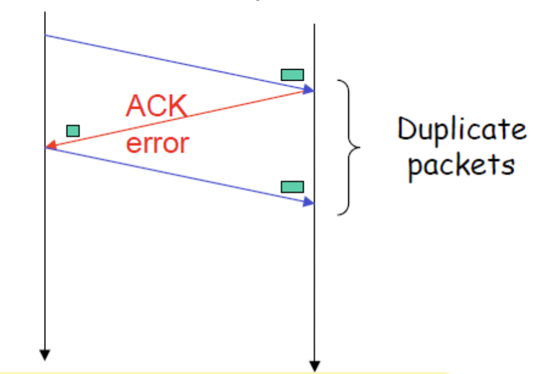
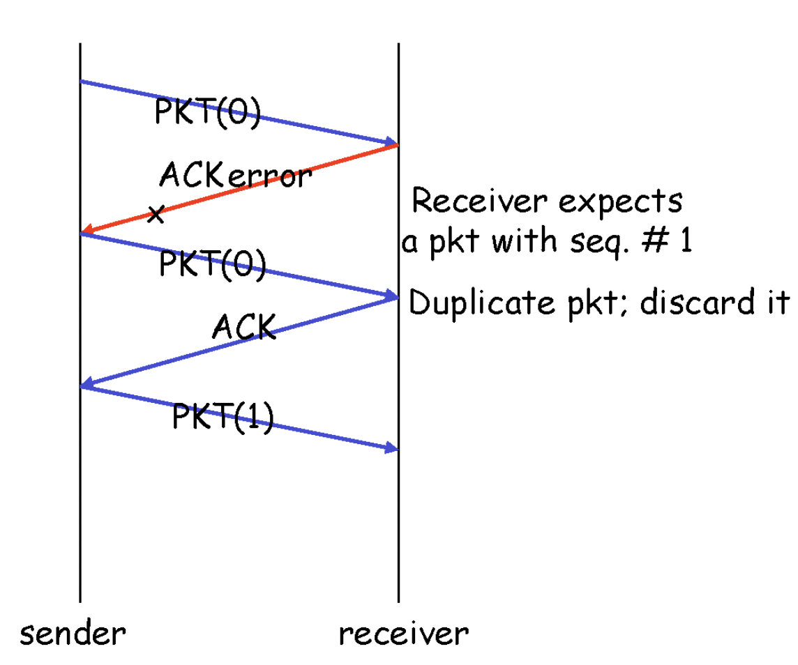
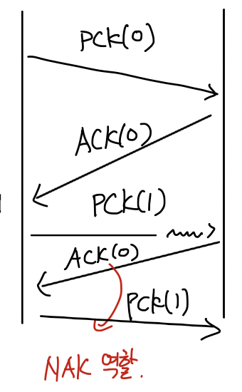
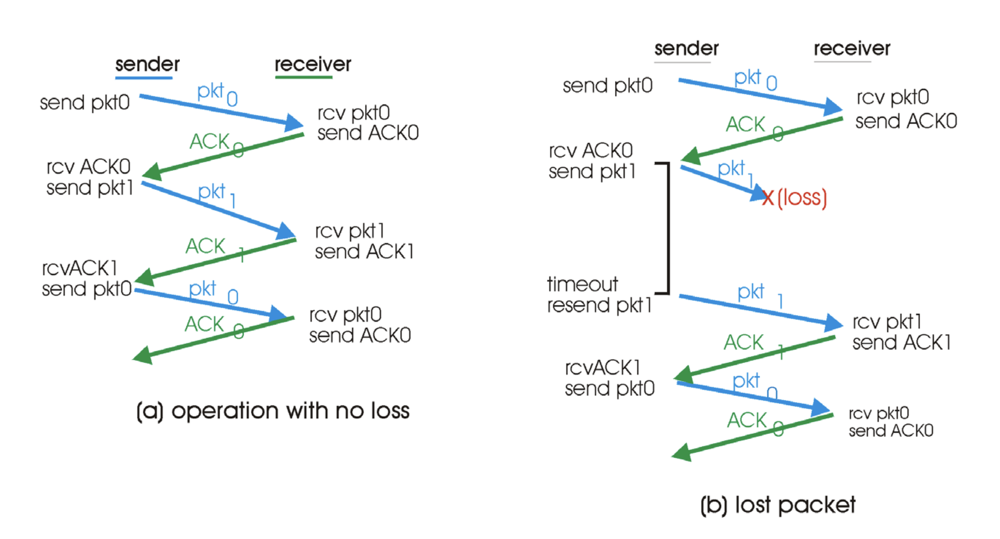
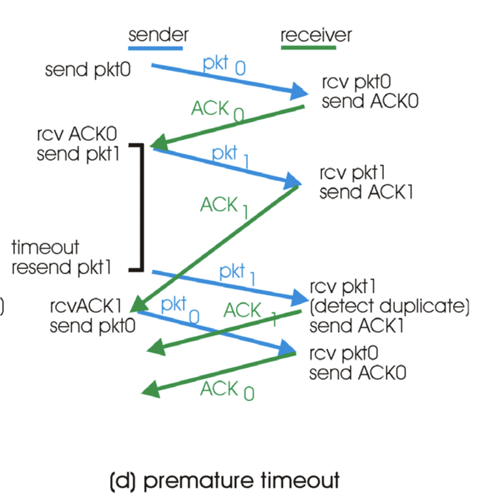
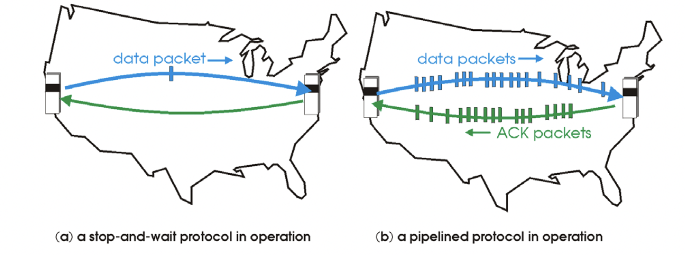

# 목차

 

- [목차](#목차)
- [애플리케이션 계층과 전송 계층](#애플리케이션-계층과-전송-계층)
- [1 소켓](#1-소켓)
  - [1-1 소켓이란?](#1-1-소켓이란)
  - [1-2 소켓 종류](#1-2-소켓-종류)
  - [1-3 소켓 통신 과정](#1-3-소켓-통신-과정)
- [2 소켓과 전송 계층](#2-소켓과-전송-계층)
  - [2-1 전송 계층의 역할 (Multiplexing과 Demultiplexing)](#2-1-전송-계층의-역할-multiplexing과-demultiplexing)
  - [2-2 TCP와 UDP의 Demultiplexing 차이](#2-2-tcp와-udp의-demultiplexing-차이)
- [3 신뢰성있는 데이터 전송을 위한 전송계층의 역할](#3-신뢰성있는-데이터-전송을-위한-전송계층의-역할)
  - [3-1 무엇이 네트워크 통신의 신뢰성을 깨트리는 것인가?](#3-1-무엇이-네트워크-통신의-신뢰성을-깨트리는-것인가)
  - [3-2 패킷 에러의 다양한 상황과 해결 방안](#3-2-패킷-에러의-다양한-상황과-해결-방안)
    - [패킷 오류를 판단하는 방법 - checksum](#패킷-오류를-판단하는-방법---checksum)
    - [패킷 오류로 인해 중복된 패킷을 수신하는 경우 - Sequence사용](#패킷-오류로-인해-중복된-패킷을-수신하는-경우---sequence사용)
    - [NAK를 사용하지 않는 프로토콜](#nak를-사용하지-않는-프로토콜)
    - [패킷 에러 정리](#패킷-에러-정리)
  - [3-3 패킷 유실](#3-3-패킷-유실)
    - [timeout이 긴 경우와 짧은 경우](#timeout이-긴-경우와-짧은-경우)
  - [3-4 Pipelined 프로토콜](#3-4-pipelined-프로토콜)

 

# 애플리케이션 계층과 전송 계층
네트워크란 edge (end point)들끼리의 통신이 목표이다.

그러므로 애플리케이션 계층은 컴퓨터 네트워크의 존재이유이기도하다.

인터넷 도입이후에 수많은 애플리케이션들(ex. 브라우저, 서버)이 개발되었으며, 이러한 애플리케이션이 인터넷 성공의 뒷받침이되었다.

이번 장은 이러한 애플리케이션들이 어떻게 다른 애플리케이션과 통신을 주고받는지 알아본다.

그중에서 가장 애플리케이션과 밀접한 애플리케이션 계층에 대해서 알아본다.

그리고 애플리케이션 계층의 데이터를 신뢰성있게 전송해주는 전송계층에 대해서도 간단히 알아본다.

 

# 1 소켓
애플리케이션이 다른 애플리케이션과 네트워크로 통신하려면 소켓이라는 인터페이스를 이용해야한다.

 

## 1-1 소켓이란?

 출처: http://www.kocw.or.kr/home/cview.do?mty=p&kemId=1169634 

* **소켓은 인터페이스다.**
  * **소켓은 `애플리케이션 계층 - 전송 계층 사이`에 존재하는 소프트웨어 인터페이스이다.**
  * **애플리케이션 통신은 프로세스간의 통신을 의미하는데, 같은 호스트안에선 IPC를 다른 호스트끼리의 통신은 소켓을 이용한다고보면 된다.**
  * 즉, 서로 다른 호스트의 프로세스끼리 통신할 때, **프로세스를 개발하는 개발자가 네트워크와 관련된 내용을 자세히 알지못해도 소켓을 통해 쉽게 네트워크 통신을 할 수 있도록한다.**
* 프로세스가 데이터를 보내거나 받기 위해서는 반드시 소켓을 열어서 소켓에 데이터를 써보내거나 소켓으로부터 데이터를 읽어들여야한다.
  * 우리가 흔히아는 HTTP도 소켓을 통해 통신한다.

 

## 1-2 소켓 종류
소켓은 종류는 두 가지로 볼 수 있다.

 출처: http://www.kocw.or.kr/home/cview.do?mty=p&kemId=1169634 

* TCP 소켓 (스트림)
  * 양방향으로 바이트 스트림을 전송한다. (연결지향성)
  * 오류 수정, 흐름제어, 재전송처리등을 통해 통신의 안정성을 보장한다.
  * 송신된 순서에 따라 중복되지 않게 데이터를 수신한다. -> 이로인해 오버헤드가 발생하기도한다.
* UDP 소켓 (데이터그램)
  * 비연결형소켓
  * 데이터의 크기에 제한이 있다.
  * 확실하게 데이터가 전달되었는지 보장할 수 없다. 데이터가 손실돼도 오류가 발생하지 않는다.
  * 비교적 속도가 빠르다. 주로 실시간 멀티미디어 정보를 처리하기 위해 주로 사용된다.

 

## 1-3 소켓 통신 과정
두 프로세스가 소켓을 통해 전송하는 과정은 아래와 같다.

> 흔히 많이 사용되는 TCP 소켓의 통신 과정이다.

 출처: http://www.libqa.com/wiki/116 

💁‍♂️ **클라이언트 소켓 통신**
1. 소켓 생성 - `socket()`
   * 서버와 통신을 위해 운영체제에 `socket()` 시스템콜을 통해 소켓을 생성한다.
2. 소켓 연결 - `connect()`
   * `connect()` 시스템 콜을 호출하며, 서버와 3-way handshake를 통해 연결한다.
   * 소켓이 연결되었다면 클라이언트와 서버가 연결된다.
3. 데이터 송수신 - `write()`, `read()`
   * 클라이언트가 서버에 보낼 요청은 `write()`을 통해, 서버로부터의 데이터를 받기위해선 `read()`를 이용한다.
   * 보통 메모리에 버퍼를 저장하여, 데이터 양이 적으면 모아서 전송하고, 데이터 양이 크면 분할하여 전송하게된다.
4. 소켓 연결 종료 - `close()`
   * `close()` 시스템 콜을 호출하여 서버와의 통신을 끊는다.
   * 이때 4-way handshake를 통해 연결을 끊는다.

 

💁‍♂️ **서버 소켓 통신**

1. 소켓 생성 - `socket()`
   * 클라이언트와 통신을 위해 운영체제에 `socket()` 시스템 콜을 통해 소켓을 생성한다.
2. 소켓 바인딩 - `bind()`
   * `bind()` 시스템 콜을 통해 소켓과 프로세스의 포트 번호를 결합한다.
   * 포트당 프로세스는 하나이다.
   * 프로세스는 여러 개의 소켓을 지닐 수 있다. 다시말해, **스레드별로 소켓이 존재할 수 있다.**
3. 연결 요청 대기 - `listen()`
   * `listen()` 시스템 콜을 통해 클라이언트의 연결 요청(`connect()`)이 수신될때까지 대기한다.
4. 연결 허용 - `accept()`
   * `accept()` 시스템 콜을 통해 새로운 소켓을 만들어 해당 소켓으로 클라이언트와 연결한다.
   * **서버 소켓은 클라이언트의 연결요청을 수신하는 소켓이고, 실질적으로 클라이언트와의 통신은 `accept()` 통해 스레드 기반의 새로 생성된 소켓으로 데이터를 주고받는다.**
5. 데이터 송수신 - `write()`, `read()`
   * `read()`, `write()`을 통해 클라이언트와 데이터를 주고받는다.
6. 소켓 연결 종료 - `close()
   * `close()` 시스템 콜을 호출하여 클라이언트와 통신을 끊는다.

> 소켓의 통신 과정은 인터넷에 굉장히 자료가 많다. 구글링해보면 더 자세한 내용을 찾을 수 있다. 

 

자바에서는 소켓 클래스를 지원하며, 해당 클래스를 이용한 전송 과정은 아래와 같다.

 출처: http://www.libqa.com/wiki/116 

> 자세한 내용은 [자바를 이용한 채팅 프로그램](https://github.com/binghe819/project-socket-chatting)을 참고.

 

# 2 소켓과 전송 계층
소켓은 애플리케이션과 전송 계층 사이의 인터페이스이다.

이번엔 소켓과 전송 계층 사이의 관계에 대해서 조금 더 알아본다.

 

## 2-1 전송 계층의 역할 (Multiplexing과 Demultiplexing)
전송 계층의 역할을 크게 두 가지로 볼 수 있다.

 출처: http://www.kocw.or.kr/home/cview.do?mty=p&kemId=1169634 

* Multiplexing - 여러 소켓으로부터 받은 데이터를 모아 전송계층의 헤더를 붙여서 네트워크 계층으로 내려보내 네트워크로 전송하는 역할.
  * 애플리케이션 계층에서 패킷이 소켓에 의해 전송 계층으로 전달 될 때, 여러 소켓의 패킷을 수집하여 하나의 세그먼트에 캡슐화하여 네트워크 계층으로 전달한다.
  * 전송 계층에서 여러 소켓의 데이터를 전송 계층의 헤더를 붙임으로써 처리하는 과정이라고보면 된다.
* Demultiplexing - 전송계층에 도착한 세그먼트를 알맞는 소켓에 전달하는 역할.
  * 전송 계층에서 세그먼트가 애플리케이션 계층으로 전달 될 때, 올바른 소켓을 찾아 전달한다.
  * 이때 Multiplexing 과정에서 추가된 세그먼트의 헤더 정보(출발지와 도착지의 정보)를 바탕으로 전달된다.

 

## 2-2 TCP와 UDP의 Demultiplexing 차이

 

💁‍♂️ **Demultiplexing 은 전송 계층의 헤더 정보를 바탕으로 동작한다.**

Demultiplexing은 네트워크 계층으로부터 받은 데이터그램을 분석하여 알맞는 소켓에 전달하는 역할이다.

 출처: http://www.kocw.or.kr/home/cview.do?mty=p&kemId=1169634 

* 각 데이터그램은 출발지 IP와 도착지 IP를 가지고있다. (TCP는 출발지 Port와 도착지 Port도 포함하여 가지고있다.)
  * **출발지와 도착지의 IP, Port를 기반으로 알맞는 소켓을 찾는다.**
* 각 데이터그램은 한 개의 전송 계층의 세그먼트를 전송한다.

 

💁‍♂️ **TCP Demultiplexing**

 출처: http://www.kocw.or.kr/home/cview.do?mty=p&kemId=1169634 

* **프로세스별로 소켓을 가지며, 출발지 IP와 Port, 도착지 IP와 Port 기준으로 어떤 소켓으로 데이터를 올릴지 결정한다.**
* **각 연결되는 클라이언트마다 서로 다른 소켓을 사용하기에 어쩌면 당연하다.**
  

 

💁‍♂️ **UDP Demultiplexing**

 출처: http://www.kocw.or.kr/home/cview.do?mty=p&kemId=1169634 

* UDP는 연결지향이 아니기에 누구에게서 온것인지는 상관이없기때문에, **출발지와 상관없이 도착지 IP와 Port만을 고려하여 소켓을 결정한다.**

 

# 3 신뢰성있는 데이터 전송을 위한 전송계층의 역할
전송 계층의 역할은 애플리케이션이 필요한 기능을 제공하는 것이다.

그리고 지금까지 Multiplexing과 Demultiplexing에 대해서 알아보았다.

하지만 **이 두가지외에도 가장 기초적으로 필요한 기능이있는데 바로 신뢰성이다.**

애플리케이션 계층은 전송하거나 수신하는 데이터가 신뢰할 수 있다고 판단하고 사용한다. 

그러므로 전송 계층은 애플리케이션 계층에 데이터를 제공할 때 신뢰성을 보장해주어야한다.

> **참고로 이 글에서의 TCP 내용은 모두 `a step-and-wait` 방식이다.**
> 
> 즉, **실제 네트워크에선 이 방법은 사용하진 않지만, 이후의 내용을 이해하는데 도움이 되는 내용이므로 정리하게되었다.**

 

## 3-1 무엇이 네트워크 통신의 신뢰성을 깨트리는 것인가?
신뢰성있는 통신이란 서로 다른 호스트에 존재하는 A 프로세스와 B 프로세스가 유실없이 통신을 주고받는 것이다.

 

💁‍♂️ **전송계층만으로는 신뢰성을 보장하기 어렵다**

**문제는 아래와 같이 서로 다른 두 호스트의 전송 계층끼리 신뢰성있는 통신을 보장하더라도, 네트워크 계층 아래로는 신뢰성을 보장한다는 확신이없다.**

 출처: http://www.kocw.or.kr/home/cview.do?mty=p&kemId=1169634 

예를 들어, **네트워크 전송과정에서 패킷이 유실되거나 오류가있다면 아무리 전송계층에서 신뢰성을 보장한다고해도 제대로된 패킷을 받아볼 수 없어 신뢰성을 보장하긴 어렵다.**

즉, **패킷 에러와 패킷 유실이 신뢰성을 깨트리는 원인이라고 볼 수 있다.**

 

🤔 **그렇다면 전송계층은 어떻게 신뢰성을 보장할까?**

네트워크상에서 신뢰성을 보장하지 못하는 경우는 두 가지뿐이다.

1. 패킷 에러
2. 패킷 유실

**이 두가지만을 보장한다면 신뢰성있는 통신이 가능하다.**

 

## 3-2 패킷 에러의 다양한 상황과 해결 방안
우선 패킷 에러를 어떻게 해결하는지 살펴본다.

 

🤔 **패킷 에러란?**

 

**패킷 에러란 말 그대로 통신과정에서 패킷이 손상되어 수신측에서 제대로 못 읽는 경우를 말한다.**

이럴 경우, 수신측에선 패킷을 제대로 해석할 수 없기에 해당 패킷을 버린다.

**패킷 에러엔 두 가지 종류가 존재한다.**

* 전송 오류 - 목적지로 가는 도중에 패킷이 손상된 경우.
* 포맷 오류 - 목적지에 도착한 패킷이 목적지에서 기대한 포맷과 다른 경우.

 

🤔 **어떻게 패킷 에러를 처리할 까?**

1. **Error Detection** (에러 판단)
   * 가장 먼저 Receiver측에선 패킷이 손상되었는지 판단한다. 
   * **이때 TCP 헤더에 존재하는 `checksum`을 이용하여 에러를 판단한다.**
2. **Feedback** (피드백)
   * **Receiver측에서 패킷을 받고 Sender측에 피드백을 준다.**
     * 제대로된 패킷을 받았다면 -> ACK (Acknowledgements)
     * 패킷에 오류가 있다면 -> NAK (Negative Ackknowledgements)
3. **Retransmission** (재전송)
   * 만약 Receiver측이 NAK를 반환하면, **Sender측은 해당 패킷을 재전송한다**.

 

### 패킷 오류를 판단하는 방법 - checksum
패킷의 오류를 판단하는 방법은 TCP 헤더의 **checksum** 속성을 이용하는 것이다.

 

### 패킷 오류로 인해 중복된 패킷을 수신하는 경우 - Sequence사용
> Sequence 번호를 이용하여 중복을 판단하고 중복된 경우 Receiver에서 해당 패킷을 버린다.

 

🤔 **중복된 패킷을 수신하는 경우는 어떤경우인가?**

 출처: http://www.kocw.or.kr/home/cview.do?mty=p&kemId=1169634  

위와 같이 **Receiver의 ACK, NAK등 피드백 과정에서 Sender가 손상된 패킷을 받을 가능성도 존재한다.**

이런경우, **Sender는 제대로된 피드백을 받지 못했기에 이전에 보냈던 패킷을 재전송한다.**

**문제는 Receiver가 다시 수신한 패킷이 처음 받은 것인지, 이전에 받은 같은 내용인지 알 수 없다는 것이다.**

즉, **중복된 패킷을 받아도 중복된 패킷인지 인지하기 어렵다는 것이다.**

 

💁‍♂️ **Sequence를 이용하면 중복된 패킷을 판단할 수 있다.**

Receiver측에서 중복된 패킷을 판단하는 방법은 Sequence속성을 이용하는 것이다.

**매 패킷마다 Sequence 번호를 붙여서 전송하는 것이다.**

그리고 **중복으로 판단하는 경우 Sequence는 해당 패킷을 버린다.**

 

💁‍♂️ **가장 간단하게 Sequence를 붙이는 방법은 0과 1만 사용하는 것이다.**

 

Sequence 번호를 통해 중복된 패킷을 판단할 수 있다고하였지만, 무작정 1부터 숫자를 순차적으로 붙이기엔 너무 많은 데이터가 필요하게된다.

> TCP의 헤더는 데이터의 부가정보이기때문에, 가능한 최소한의 데이터를 가지는게 좋다.
> 
> ex. 편지 봉투 안의 내용이 중요하지, 편지 봉투에 너무 많은 정보가 써져있는건 의미가 없다.

**이러한 문제를 해결하는 가장 간단한 방법은 Seq 번호로 0과 1을 사용하는 것이다.**

 

💁‍♂️ **Seq로 0과 1만 사용하는 것은 비효율적이긴하다.**

**Seq로 0과 1만 사용한다면.. Sender는 동기/블로킹 방식으로 패킷을 전송하게된다.**

즉, Sender는 0을 보내고 피드백을 받고 나서야 1을 보내게된다.

> 실제 네트워크 환경에선 0과 1만 사용하진 않는다고한다. 추후에 더 자세히 다룰 예정!
> 
> 여기선 Seq의 필요성만 알면 될 것 같다.

 

### NAK를 사용하지 않는 프로토콜
피드백으로 ACK와 NAK가 존재하는데, NAK를 사용하지 않는 프로토콜도 존재한다.

 

ACK + Seq로 NAK의 역할까지 대행하는 것이다.

**`ACK(n)`은 n이 가장 최근에 성공한 seq를 의미한다.**

 

### 패킷 에러 정리
* 패킷 에러를 처리하기 위해선 4가지 매커니즘이 필요하다.
  * Error Detection
  * Feedback
  * Retransmission
  * Sequence
* Sender과 Receiver의 역할
  * Sender
    * 패킷마다 seq 번호를 붙여서 전송한다.
    * 항상 ACK,NAK 피드백을 체크해야한다.
    * 만약 NAK나 이전에 받았던 Seq의 피드백을 받는다면 재전송해야한다.
  * Receiver
    * 수신한 패킷이 중복된 것인지 체크해야한다.
    * 만약 패킷이 잘못되었다면 NAK를 반환해줘야한다.

 

## 3-3 패킷 유실
패킷 오류말고 네트워크의 신뢰성을 방해하는 요소로 패킷 유실이있다.

 

🤔 **패킷 유실이란?**

 출처: http://www.kocw.or.kr/home/cview.do?mty=p&kemId=116963 

**패킷 유실이란 패킷이 전송과정에서 유실되어 Receiver가 해당 패킷을 받지 못하는 경우를 의미한다.**

 

🤔 **어떻게 패킷 유실을 해결할까?**

**타이머(Timer)를 사용하면 된다.**

**Sender는 패킷을 전송하는 시점에 타이머를 작동시키고, timeout되면 해당 패킷을 재전송하는 방식이다.**

 

### timeout이 긴 경우와 짧은 경우
**패킷 유실을 해결하는 방안으로 타이머가 존재하는데, 이 타이머는 몇초로 맞춰놓는 것이 좋을까?**

물론 정답은 없다.

 

💁‍♂️ **타이머를 길게 설정할 경우**

* 장점
  * Network Overhead가 비교적 적다.
    * 중복된 패킷을 전송할 확률이 비교적 적다.
* 단점
  * Recevoring이 느리다.
    * 패킷 유실이 발생했을 때 반응이 느리다.

 

💁‍♂️ **타이머를 짧게 설정할 경우**

 

* 장점
  * Recevoring이 빠르다.
    * 패킷 유실이 발생했을 때 반응이 빠르다.
* 단점
  * Network Overhead가 비교적 많다.
    * 패킷이 유실된게 아니라 네트워크 사정상 늦게 도착하는 패킷이 존재할 수도 있는데, 이때도 패킷을 재전송해버린다. **이로인해 중복된 패킷을 재전송하여 네트워크의 부하를 줄 수 있다.**

 

## 3-4 Pipelined 프로토콜
지금까지 살펴본 신뢰성을 보장하는 방법은 모두 **동기/블로킹** 방식처럼 동작할 때이다.

**Sender는 패킷을 하나 보내고 ACK가 올때까지 기다린 후 다음 패킷을 보낸다.**

이는 **많은 데이터 전송이 발생하는 현대 사회에서 인터넷 속도를 만족시키지못한다.**.

 왼쪽이 지금까지 살펴본 a step-and-wait 방식이며, 오른쪽이 실제 네트워크에서 사용하는 pipelined 방식이다.  

**대신 Pipeline 프로토콜 방식은 seq를 0과 1만 사용하지 않고, 계속해서 증가시킨다.**

그리고 이 방식은 두 가지의 방식을 이용한다.

* go-back-n
  * 손상되었거나 분실된 패킷 이후의 데이터를 모두 재전송
* selective
  * 손상되거나 분실된 데이터만을 재전송

