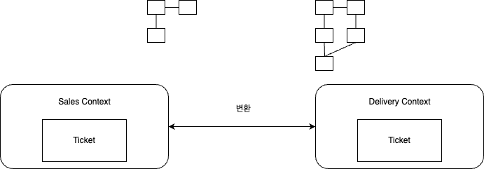
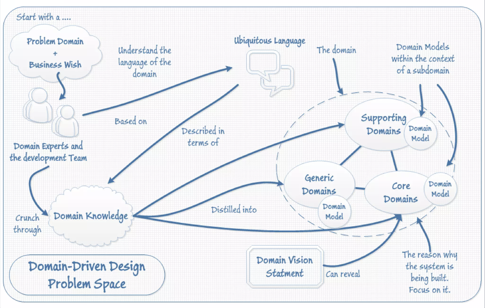
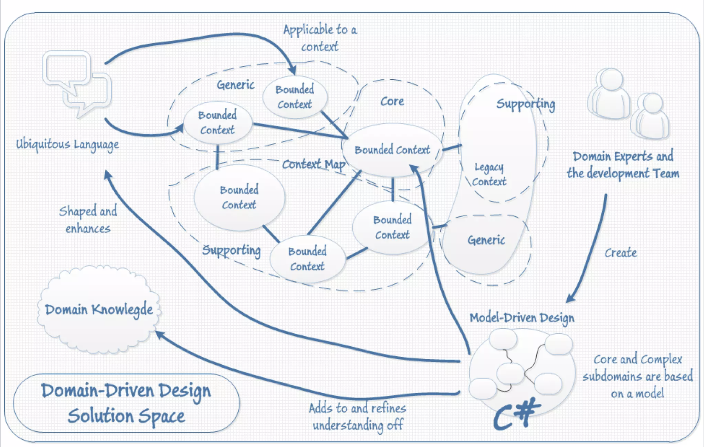

# 목차

<br>

- [목차](#목차)
- [DDD 사실과 오해](#ddd-사실과-오해)
- [강의 소개](#강의-소개)
- [DDD를 이해하는 순서](#ddd를-이해하는-순서)
- [동작하는 도메인 모델 만들기](#동작하는-도메인-모델-만들기)
- [DDD의 개념적 바탕](#ddd의-개념적-바탕)
- [모델 주도 설계의 빌딩블록](#모델-주도-설계의-빌딩블록)
- [애자일과 도메인 주도 설계](#애자일과-도메인-주도-설계)
- [전략적 설계](#전략적-설계)
- [에릭 에반스의 도메인 주도 설계 책 그 후](#에릭-에반스의-도메인-주도-설계-책-그-후)

<br>

# DDD 사실과 오해

조영호님의 DDD 사실과 오해 특강을 들으면서 간단히 정리한 내용입니다.

<br>

# 강의 소개

* 소프트웨어의 본질
  * 소프트웨어 사용자를 위해 도메인에 관련된 문제를 해결하는 것.
* DDD는 2003년 에릭 에반스 책으로부터 등장.
  * DDD는 복잡한 도메인을 다뤄야 하는 소프트웨어 프로젝트에 박차를 가하는 것을 목표로 삼는 사고 방식이자 우선순위의 모음을 의미한다.
  * DDD는 특정한 기술과는 무관한 사고 방식이라는 것에 집중한다.
* 책의 배경 -> 소프트웨어 복잡성을 줄이고싶다.
  * "어떤" 부분 때문에 복잡한 것인데, 이를 해소하기위해 DDD를 도입하자.
  * 모두가 이야기하지만 누구도 제대로 이해하지 못한 책.
* 이번 강의의 목적은 책을 이해할 수 있는 방법을 알려주는 것.

<br>

# DDD를 이해하는 순서

DDD는 철학이다. 그리고 이를 구현하는 방법은 굉장히 다양하다.

DDD를 하나의 구현으로 공부하면 그 구현이 DDD라고 매몰된 생각을 하게된다.

그러므로 DDD의 철학을 먼저 배우고, 이것이 지향하는 방향대로 구현하는 연습을 하는게 좋다.

<br>

# 동작하는 도메인 모델 만들기

💁‍♂️ **도메인**

* 사용자가 프로그램을 사용하는 주제 영역
* ex. 배달 (메뉴 -> 주문 -> 조리 -> 배달 -> 결제 -> 식사)

<br>

💁‍♂️ **모델**

* 도메인 대상의 단순화 -> 당면한 문제를 해결하는 것과 관련된 측면을 추상화하고 중요하지 않은 세부사항을 생략.
* ex. 배달 도메인의경우 메뉴, 주문, 결제 모델로 분리

<br>

💁‍♂️ **도메인 모델**

* 사용자가 프로그램을 사용하는 주제 영역의 문제를 해결하는데 필요한 측면을 추상화한 것.

<br>

💁‍♂️ **도메인 모델 = 코드** (모델 주도 설계)

* DDD에서의 도메인 모델은 코드와 동일시된다.
* 즉, 도메인 모델이 변경되면 코드도 이와 같이 변경된다.
  * 문제를 해결하기위해 추상화된 도메인 모델을 그대로 코드로 옮겨놓은 것.
  * **분석, 설계, 개발을 다 같은 것으로 보는 것. 개발자는 그저 비즈니스 요구사항을 해결한 도메인 모델을 코드로 구현해주는 역할.**
* 모델과 핵심 설계는 서로 영향을 주며 반복을 통해 구체화된다.
  * 이를 모델 주도 설계라 한다.

<br>

💁‍♂️ **지식 탐구**

* 설계의 전 단계에서 개발자와 도메인 전문가의 활발한 논의를 거쳐 유용한 도메인 모델을 도출하는 것.
  * 개발자와 도메인 전문가간의 도메인에 대한 컨텍스트를 맞추면서 도메인 모델을 도출하는 것.
* 문제 도메인을 깊이 이해하면서 모델을 단순하게 개선한다.

<br>

💁‍♂️ **유비쿼터스 언어**

* 도메인 전문가와 개발자 사이의 커뮤니케이션 수단.
  * 개발자는 기술적인 용어, 도메인 전문가는 도메인 전문분야의 용어가 존재할텐데, 서로의 이야기만하면 소통이 불가.
  * 그래서 두 분야간의 공통적인 언어를 만들어 소통하는 것을 유비쿼터스 언어라 부름.

<br>

💁‍♂️ **도메인 주도 설계 요약**

* 도메인 전문가와 개발자가 한 팀을 이루고,
* 유비쿼터스 언어를 함께 만들고 커뮤니케이션에 이용하면서
* 함께 지식을 탐구하여 도메인 모델을 창조하고
* 도메인 모델을 코드로 구현하는 것.

<br>

> DDD는 도메인에만 집중하며, 복잡한 도메인은 단순한 모델 기반으로 설계한다. 그리고 도메인 모델과 코드는 반복적인 과정을 거쳐 정제한다.

<br>

# DDD의 개념적 바탕

DDD는 객체지향과 애자일 관점이 섞임.

* 1990년대 객체의 시대
  * GUI의 부흥.
  * 객체지향 부흥. 객체지향이 원래 UI를 만들 때 쓰던 개념. 서버는 이후에 도입하게됨.
* 웹의 부상
  * 브라우저에서 도메인 로직을 처리하기 힘들어지다보니 로직이 서버쪽으로 이동하게됨.
  * 객체지향도 서버쪽에서 흥행했고, UI 로직은 점점 심플해짐
* 90년대 분산 객체의 시대
  * 로컬 객체를 벗어나 분산 객체 기술이 유행함.
  * 각 객체마다 다른 서버에 위치시키고 싶어함. -> RPC 통신을 같은것을 통해 시스템간의 통신함.
  * 문제는 네트워크 부하가 심해지고 결국 없어짐. 그래서 객체를 묶고 서비스를 기준으로 나누자는 이야기가 나왔고 이게 MSA의 방향성.
* EJB
  * 분산 객체의 네트워크 통신을 위해 미들웨어를 도입함.
  * 바로 EJB 컨테이너. 문제는 미들웨어 서비스를 제공받기위해선 기술에 종속적인 인터페이스를 구현해야함.
  * 기술 관심사와 도메인 관심사의 혼재로인해 유지보수, 확장에 취약.
* POJO
  * 어떤 기술에도 종속되지않고 도메인에 집중할 수 있는 순수한 객체.
  * 로드 존슨: 어떤 특정한 구현 기술보다 객체지향 설계가 더 중요하다. -> 책을 발표
  * 해당 책을 통해 사람들이 객체지향이 더 중요하고 기술이 이를 서포트해야한다는 점에 공감.
  * 스프링의 기원이 됨.
* 2000년대초 복잡하던 시기
  * EJB를 계속 사용하기도하면서 객체지향의 개념이 계속 발전하던 시기.
  * 이때 DDD 책이 나옴.
* EJB의 침투성과 종속성 문제
  * 침투성의 문제로인해 도메인에 대한 멘탈 모델과 소프트웨어 구현간의 차이가 심함. -> 도메인 전문가와 커뮤니케이션 어려움.
  * 비즈니스 로직에 기술적인 부분이 계속 침투.
* 모델 주도 설계
  * 도메인에 대한 멘탈 모델과 소프트웨어 구현간의 차이를 줄임.
    * 도메인을 기반으로 모델 만들어 설계 및 구현함으로써 차이를 줄임.
    * 도메인 모델 = 설계 = 코드
  * 비즈니스 로직과 기술적인 부분을 분리함으로써 도메인 전문가와 커뮤니케이션 용이해짐.

<br>

# 모델 주도 설계의 빌딩블록

<br>

💁‍♂️ **도메인 로직의 격리**

* **DDD의 핵심은 도메인 로직이 격리되어있어야한다는 것.**
  * 도메인 로직이 외부 프레임워크나 라이브러리에 의존하면 안된다.
* 다시말해, **도메인이 다른 계층으로 나가면(노출) 안된다.** (도메인 객체에서 다른 외부 계층의 객체를 import하지 않도록 해야함.)
  * 즉, **비침투적이고 표현적 차이가 적은 도메인 로직은 외부로 나가는 의존성이 존재하지 않아야한다.**
  * DDD 책이 나올 당시엔 이런 개념이 강하지않아 책의 예제에선 도메인 로직이 외부로 나가는 경우가 있다고한다.

<br>

💁‍♂️ **모델 주도 설계의 빌딩 블록**

* 빌딩 블록이란 구현 가능한 도메인 모델을 구성하는 요소들의 목록을 의미한다.
* 목적은 모델 주도 설계 구현에 대한 가이드를 제공함으로써 복잡도를 낮추는 것이다.
  * 도메인을 표현하기 위한 빌딩 블록: Value Object, Entity, Service, Module, Association
  * 생명주기를 관리하기 위한 빌딩 블록: Aggregate, Repository, Factory

<br>

💁‍♂️ **Aggregate**

* 요구사항에 따라 한 객체의 변경이 다른 객체에 영향을 미치는 경우에 여러 객체를 하나의 그룹으로 묶어서 처리하는 것이 좋다. -> Aggregate의 목적.
  * Aggregate는 여러 객체를 하나로 묶어 같이 움직이도록 하며, 한 트랜잭션의 단위가 된다.
    * 트랜잭션 하나 당 하나의 Aggregate.
  * 그리고 보통 Aggregate 단위로 Repository를 정의한다.
* 복잡성을 줄이기위해 Aggretate 간에는 ID를 이용하여 참조한다.
  * JPA에선 Aggregate 단위로 읽어오다보니 지연로딩을 안쓰는 경우도 존재한다.
* 만약 여러 Aggregate를 수정해야 하는 경우, 별도의 트랜잭션으로 분리한다.
  * 별도의 트랜잭션으로 분리함으로써 일관성을 위반하는 경우가 존재하는데, Eventual Consistency를 기본으로한다.

<br>

# 애자일과 도메인 주도 설계

<br>

💁‍♂️ **설계에 대한 여러가지 의문들...**

* 왜 코드 작성 전에 완벽하게 설계하지 못할까?
  * 코드를 작성하다보면 내가 처음에 생각한 것과 다른 경우가 많다.
* 왜 일정을 제대로 추정하지 못할까?
  * 코드를 작성하다보면 내가 생각한 것보다 일정이 촉박하다. -> 단순 반복의 일이 아니라면 애초에 추정이 불가능하므로, 상황에 따라 일정을 재조정하는 능력이 더 중요하다고 함.

<br>

💁‍♂️ **문제의 원인**

1. 흐릿한 요구사항
   * 초반엔 명확한 요구사항이 없어 당연히 완벽한 설계가 나오기 어렵다.
   * 요구사항은 개발을 진행하면서 점차 명확해진다.
2. 변경되는 요구사항
   * 제대로된 서비스를 개발하다보면 요구사항은 자주 변경된다. 보통 개발자들은 이런것을 불편해한다..
3. 유연하지 못한 개발 방법
   * 시작할 때 전체 일정을 계획한다.
     * 요구사항 전체 분석 -> 전체 설계 -> 전체 구현 -> 전체 테스트.
   * 설계할 땐 수많은 가정들이 존재하는데, 설계와 구현을 따로 생각하는 경우가 많다.
     * 특히 SI의 경우 설계 문서만 한트럭 된다고한다. 어차피 다 바뀌고 설계 문서를 보고 구현하지도 않는다고한다.

<br>

💁‍♂️ **문제의 해결 방안 - 애자일**

* 설계와 요구사항은 어차피 계속 변경된다. 변경되지 않는다는 가정보다는 변화에 민첩하게 대응하는 방법을 채택하는게 좋다.
  * eXtream Programming (XP), TDD, 지속적 통합등의 방법론과 애자일 등장.
* 짧은 주기로 계획하고 구현하는 것을 지향.
  * 한달 뒤가 아닌 짧은 주기는 예측하기 쉽다.
  * 반복적이고 점증적인 프로세스.
    * 반복을 통한 피드백. (개발된 내용을 바탕으로 짧은 주기의 다음 계획 및 구현)
* 이를 통한 문제점 해결.
  1. 흐릿한 요구사항
     * 일단 중요한 것부터 구현하며, 반복을 통해 요구사항이 명확해짐.
  2. 변경되는 요구사항
     * 짧은 주기의 반복 단위로 변경을 반영한다.
  3. 유연하지 못한 개발 방법
     * 반복 단위로 피드백을 통해 계획을 조정한다.
     * 이때 가장 중요한 것은 리팩토링.
* DDD 책은 기본적으로 애자일 개발 프로세스을 지향함.
  * 특히 반복 주기와 리팩토링을 굉장히 강조함.

<br>

💁‍♂️ **애자일 선언문**

* 공정과 도구보다 **개인과 상호작용**이 더 중요.
* 포괄적인 문서보다 **작동하는 소프트웨어**가 더 중요.
* 계약 협상보다 **고객과의 협력**이 더 중요.
* 계획을 따르기보다 **변화에 대응하기**가 더 중요

<br>

💁‍♂️ **애자일과 DDD**

* DDD 책은 기본적으로 애자일 개발 프로세스를 굉장히 지향.
  * 이를 위한 전제조건
    * 개발은 반복주기를 통해 진행되어야 한다.
    * 개발자와 도메인 전문가는 밀접한 관계를 가져야 한다.
* 도메인 전문가와 개발자 팀가 한팀.
  * 유비쿼터스 언어를 함께 만들고 커뮤니케이션에 이용.
  * 지식탐구하여 함께 도메인 모델 창조.
* 반복적인 리팩터링을 통해 심층 모델과 유연한 설계로 도약

<br>

# 전략적 설계

💁‍♂️ **중복 제거에 대한 이야기**

* 중복에 대한 강박관념
  * 중복을 줄이기 위해 하나의 도메인 모델에 모든 데이터를 넣는 경우가 많다.
  * 이 경우 더 복잡해질 수 있다. 왜냐하면 여러 개발자들이 하나의 도메인 모델을 개발하다 보면 충돌 할 수 있기 때문.
  * 도메인 모델을 여러 개 두는 것이 좋다.
* 실제 실무를 하다보면 결합도나 응집도에 비하면 중복은 크게 중요하지않다.
  * 각 팀마다 표현하기 편한대로 중복을 적당히 허용하는 것이 유용할 때가 많다.
  * 대표적인 중복 허용으로 DTO가 있다.

<br>

💁‍♂️ **단일 도메인 모델**

* **하나의 도메인에 대해서 중복을 제거하면서 작업하다보면 모든 팀이 하나의 도메인에서 작업한다.**
  * 예를 들어, Ticket이라는 도메인 객체가 있다고한다면,
    * A팀은 Ticket을 판매 상품으로 바라보고,
    * B팀은 Ticket을 출력물로 바라보고,
    * C팀은 Ticket을 배송 물품으로 바라본다.
  * 이때 각 팀마다 Ticket을 대하는 요구사항이 다름에도, 하나의 도메인 객체에 모든 요구사항을 넣는다.
  * 이런 도메인 모델을 단일 도메인 모델이라한다.
* **여러 팀이 하나의 도메인에서 작업한다면 아래와 같이 문제가 발생한다.**
  * 기능추가와 코드 수정시 충돌 발생.
  * 협업 오버헤드
  * 릴리즈 일정 협의
  * 의미적 충돌로 인한 언어의 모호함
* **하나의 커다란 단일 도메인 모델은 비현실적이다.**

<br>

💁‍♂️ **사용되는 컨텍스트에 따라 모델을 분리**

> AS-IS (단일 도메인 모델)
```java
public class Ticket {
    public Money price() {...}         // 판매 컨텍스트

    public Order buy() {...}           // 판매 컨텍스트

    public Seat position() {...}       // 판매 컨텍스트, 배송 컨텍스트

    public boolean isStanding() {...}  // 판매 컨텍스트, 배송 컨텍스트

    public void deliver() {...}        // 배송 컨텍스트

    public void print() {...}          // 출력 컨텍스트
}
```
여러 팀이 하나의 도메인에서 작업함으로써 단일 도메인 모델에 여러 컨텍스트가 섞여있다.

이를 아래와 같이 분리.

<br>

> TO-BE (컨텍스트에 따라 모델 분리)

```java
// 판매 컨텍스트
public class Ticket {
    public Money price() {...}         // 판매 컨텍스트

    public Order buy() {...}           // 판매 컨텍스트

    public Seat position() {...}       // 판매 컨텍스트

    public boolean isStanding() {...}  // 판매 컨텍스트
}

// 배송 컨텍스트
public class Ticket{
    public Seat position() {...}       // 배송 컨텍스트

    public boolean isStanding() {...}  // 배송 컨텍스트

    public void deliver() {...}        // 배송 컨텍스트
}

// 출력 컨텍스트
public class Ticket {
    public void print() {...}          // 출력 컨텍스트
}
```

이렇게 컨텍스트에따라 도메인 모델을 분리.

<br>

💁‍♂️ **바운디드 컨텍스트**

<p align="center"><br>Customer와 Product 도메인 객체를 Context에 따라 분리한 예시.<br>출처: https://martinfowler.com/bliki/BoundedContext.html </p>

* 바운디트 컨텍스트란?
  * 도메인 모델을 Context에 따라 분리하고, 특정한 도메인 모델이 적용되는 범위를 의미한다.
  * 같은 바운디드 컨텍스트 안에서는 도메인 모델의 통합성 유지.
  * 서로 다른 바운디드 컨텍스트 사이에서는 통합성에 신경 쓰지 않음.
* 바운디드 컨텍스트 구현
  * 바운디드 컨텍스트별로 프리젠테이션-도메인-영속성-DB까지 모두 구현해줘야한다.
  * **그래서 이 구조가 분리하기 쉽기 때문에 MSA를 구현에 적합하다는 이야기가 많다.**

<br>

💁‍♂️ **컨텍스트 맵**

<p align="center"> </p>

* 컨텍스트 맵이란?
  * 바운디드 컨텍스트는 팀 단위로 각각 관리한다. 이때 동일한 도메인 모델을 가지고 어떻게 커뮤니케이션할지? 팀간의 관계를 어떻게 정립할지에 대한 내용.
* 정치와 협력의 영역.

> 다양한 협업 전략이 존재한다. -> https://virtualddd.com/learning-ddd/ddd-crew-starter-modelling

<br>

💁‍♂️ **distilation -> 도메인에 따른 리소스 분배**

* distilation이란?
  * distilation이란 혼합된 요소를 분리해서 본질을 좀더 값지고 유용한 형태로 뽑아내는 과정을 의미한다.
  * 이를 DDD에 적용하면 distilation은 결국 CORE DOMAIN을 찾아내는 과정이다.
  * 즉, 리소스를 집중할 영역과 시스템 구축 방법을 결정
* 큰 도메인은 각 부분에 우선순위를 매겨 도메인의 핵심적인 측면을 구분해야한다. ex. 이커머스라는 큰 도메인을 여러 서브 도메인으로 나누는 것.
  * CORE DOMAIN
    * 가장 핵심이 되는 도메인. 사업의 성공을 결정하는 핵심적인 서브 도메인.
    * 코어 도메인을 식별해서 강조하고 최고의 실력자를 배정해야한다.
    * ex. Product Catalog (상품 전시, 상품 카탈로그)
  * GENERIC SUB DOMAIN
    * 비즈니스에 경쟁 우위를 제공하지 않고 여러 회사에서 공통으로 존재하는 서브 도메인.
    * 기성 소프트웨어를 구입하거나 주니어 개발자 배정해야한다.
    * ex. Payment, Inventory, Security
  * SUPPORTING SUB DOMAIN
    * 비즈니스에 경쟁 우위를 제공하지 않지만, 비즈니스의 일부로 코어 도메인을 지원하는 서브 도메인.
    * 외주로 해결하거나 개발자들의 성장을 위한 기회로 활용하라.
    * ex. Orders, Shipping, Custom Management

<br>

# 에릭 에반스의 도메인 주도 설계 책 그 후

<br>

💁‍♂️ **도메인 주도 설계 구현 by 반 버논**

* 현재의 DDD 체계 정립.
* 전술적 패턴과 전략적 패턴 문제 영역과 솔루션 영역이라는 용어 처음 사용.
  * 문제 영역: 서브 도메인, 이상.
  * 솔루션 영역: 바운디드 컨텍스트, 현실.
* 구현 관점의 이야기가 많다고 함.

<br>

💁‍♂️ **문제 영역과 솔루션 영역**

<p align="center"><br>문제 영역<br>출처: https://www.slideshare.net/tkocjan/domain-driven-design-47480496 </p>

<p align="center"><br>솔루션 영역<br>출처: https://www.slideshare.net/tkocjan/domain-driven-design-47480496 </p>

* 문제 영역에서 솔루션 공간으로

<br>

💁‍♂️ **도메인 이벤트**

* 트랜잭션 하나당 하나의 Aggregate만 Update해야한다.
  * 만약 두 Aggregate를 Update하고 싶다면 도메인 이벤트를 발생시켜 다른 Aggregate를 변경하는 것이 좋다.
* 도메인 이벤트
  * 도메인 내의 활동에 관한 정보를 일련의 개별 이벤트로 모델링. 
  * 각 이벤트는 도메인 객체로 표현하라.
  * 이것은 활동을 반영하는 시스템 이벤트와 구별된다.
  * 도메인 이벤트를 도메인 모델의 완전한 구성 요소를 **도메인에서 발생한 사건**을 표현한다.

<br>

💁‍♂️ **이벤트 소싱**

* 도메인 이벤트를 사용하다보니 탄생한 개념.
* 이벤트 소싱
  * 이벤트 스토어에 모든 객체의 상태를 저장하고, 최종 객체의 상태를 보려면 스토어를 롤업해서 다 더하면 된다.
  * 이 경우 DB가 따로 필요없다.
  * 외국에선 실제로 많이 사용되긴 한다고한다. (실제 주변에선 사용하는 것을 본 적은 없음.)

<br>

💁‍♂️ **CQRS**

<p align="center"><br>출처: https://martinfowler.com/bliki/CQRS.html </p>

* 조회 모델과 명령 모델을 나눔으로써 도메인 모델 분리는 통한 도메인 모델 복잡성 해결.

<br>

💁‍♂️ **마이크로서비스 아키텍처의 유행 - 2012년**

* 도메인 객체를 분리하는 것은 복잡하므로 객체의 모임인 서비스 단위로 분리한다는 목적.
  * 이때 서비스 단위란 바운디드 컨텍스트를 의미한다.
* 하나의 응용 프로그램을 여러 작은 서비스의 결합으로 구현하며, 각각의 서비스는 독립적인 비즈니스 로직을 구성한다.
  * 각 서비스는 완전 자동화된 개발/배포 환경에 의해 각각 독립적으로 배포됨.
* 헥사고날 아키텍처의 재조명 - 2005
  * 자동화된 회귀 테스트 실행 가능.
  * 데이터베이스가 사용 불가능하더라도 작업이 가능.
  * 사용자의 개입 없이도 애플리케이션을 연결할 수 있도록 UI나 데이터베이스가 없어도 작동할 수 있는 애플리케이션 구축 가능.
  * 결국 마이크로서비스를 구현하는데 적합한 아키텍처중 하나라서 재조명 받았다.
* 도메인 주도 설계의 재조명
  * 서비스 단위에 대해 생각하는 유용한 방법은 도메인 주도 설계의 바운디드 컨텍스트의 개념이다.
  * 도메인 주도 설계는 복잡한 도메인을 여러 개의 바운디드 컨텍스트로 나누고 이들 간의 관계를 매핑한다.
  * 즉, 마이크로서비스 아키텍처를 구축하는데 도메인 주도 설계의 개념이 큰 도움 된다는 의미인듯.

<br>

💁‍♂️ **도메인 구현의 격리**

* 도메인 계층
  * 비즈니스 로직에 대한 설계와 구현으로 이루어진다.
  * 모델 주도 설계에서는 도메인 계층의 소프트웨어 구성물들이 모델의 개념을 반영한다.
* 도메인 로직 격리
  * 도메인 로직이 프로그램상의 다른 관심사와 섞여 있다면 그와 같은 대응이 효과적으로 이루어지지 않는다.
  * 따라서 도메인 주도 설계의 전제 조건은 도메인 로직이 비침투적이고 표현적 차이가 적은 도메인 로직은 외부로 나가는 의존성이 존재하지 않아야한다. -> 도메인 구현을 격리해야한다는 의미.

<br>

💁‍♂️ **도메인 주도 설계 패턴, 원칙, 실천방법 by 스콧 밀럿**

* 현대의 DDD를 구현 관점에서 잘 표현한 좋은 책.

> 이 책이 좋지만, DDD는 구현 중심으로 먼저 공부하면 DDD의 철학을 오해할 수 있어서 에릭 에반스의 DDD를 먼저 읽고 이 책 읽는 것을 추천.

