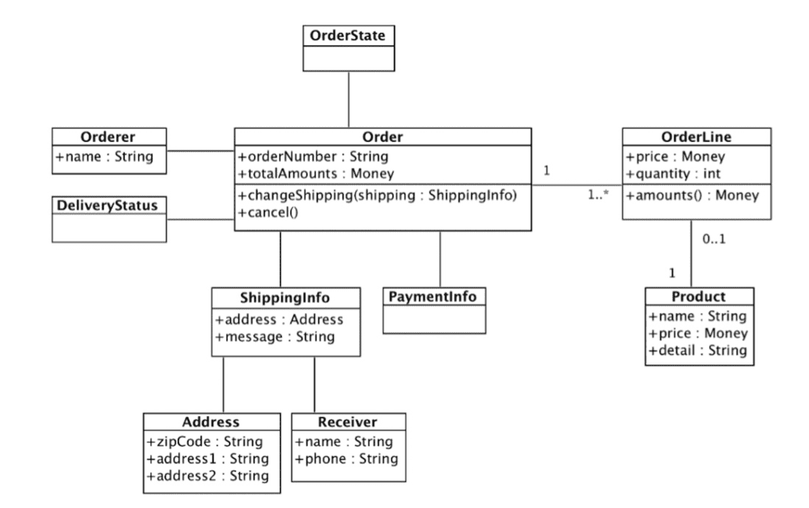
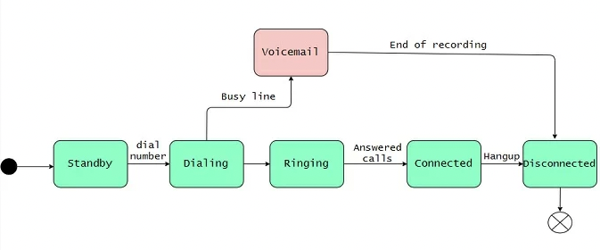
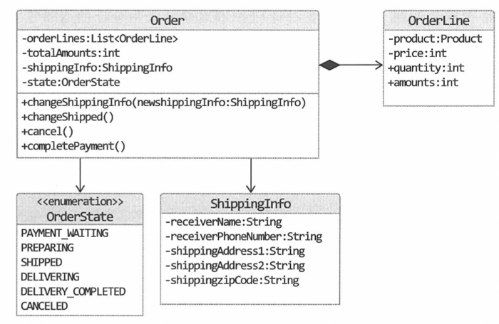

본 글은 [도메인 주도 개발 시작하기](http://www.yes24.com/product/goods/108431347) 책을 바탕으로 작성된 글입니다.

<br>

# 목차

<br>

- [목차](#목차)
- [도메인](#도메인)
  - [도메인이란 무엇인가](#도메인이란-무엇인가)
  - [개발자는 비즈니스 요구사항을 코드로 구현해주는 역할을 한다](#개발자는-비즈니스-요구사항을-코드로-구현해주는-역할을-한다)
- [도메인 모델](#도메인-모델)
  - [도메인 모델이란?](#도메인-모델이란)
  - [도메인 모델 패턴](#도메인-모델-패턴)
  - [도메인 모델 도출](#도메인-모델-도출)
- [엔티티와 밸류](#엔티티와-밸류)
  - [엔티티](#엔티티)
  - [밸류](#밸류)
  - [도메인 모델 구현시 주의할 점 - setter를 지양하자.](#도메인-모델-구현시-주의할-점---setter를-지양하자)
- [도메인 용어과 유비쿼터스 언어](#도메인-용어과-유비쿼터스-언어)
- [정리](#정리)

<br>

# 도메인
DDD에서의 도메인은 무엇을 의미하는가?

<br>

## 도메인이란 무엇인가

🤔 도메인이란?

* DDD에서 의미하는 도메인
  * 소프트웨어로 해결하고자하는 문제 영역을 의미한다.
  * ex. 온라인 서점 -> 책 검색, 조회, 장바구니, 구매, 쿠폰, 결제, 배송등이 모두 도메인에 해당된다.
* 일반적인 의미에서의 도메인
  * 분야, 영역, 범위 -> 인터넷 주소에서의 도메인은 특정 분야 (com, net, org)의 어떤 웹사이트(영역)을 지칭할 때 사용된다.

<br>

💁‍♂️ 도메인은 여러 하위 도메인으로 구성된다.

* 한 하위 도메인은 다른 하위 도메인과 연동하여 완전한 기능을 제공하게 된다.
  * ex. 고객이 물건을 조회하려면 카탈로그, 리뷰, 회원 하위 도메인의 기능이 엮이게 된다.
  * ex. 고객이 물건을 구매하려면 주문, 결제, 배송, 혜택 하위 도메인의 기능이 엮이게 된다.

<br>

💁‍♂️ 특정 도메인은 외부에서 제공하는 시스템을 사용하기도 한다.

* 모든 도메인을 직접 구현해야하는 것은 아니다. 특정 도메인은 외부에서 제공하는 시스템을 이용하기도 한다.
  * ex. 물건 구매할 때 배송 도메인은 보통 외부 배송 업체를 사용하게 된다. (외부 물류)
  * ex. 외부 PG
* 하위 도메인을 어떻게 구성할지는 서비스 별 요구사항 (상황)에 따라 달라진다.
  * ex. 대형 장비를 판매하는 B2B 서비스의 경우 카탈로그와 주문서를 작성하는 주문 도메인만 필요할 수 있다.
  * ex. 일반 고객을 대상으로하는 B2C 서비스의 경우 카탈로그, 리뷰, 주문, 결제, 배송, 회원등의 도메인이 필요하다.

<br>

## 개발자는 비즈니스 요구사항을 코드로 구현해주는 역할을 한다
개발자는 홍보, 정산, 배송 등 각 영역의 전문가가 요구하는 비즈니스를 코드로 구현해주는 사람이다.

**당연히 도메인에 대한 이해가 낮거나 요구사항을 제대로 이해하지못하면 쓸모없는 코드가 완성된다.**

<br>

🤔 개발자의 역할

* 도메인 전문가는 비즈니스에 필요한 요구사항을 정리한다.
  * 각 도메인 전문가 (ex. 정산, 홍보)는 도메인에 대한 지식과 경험을 바탕으로 비즈니스에 필요한 기능을 요구한다.
* 개발자는 요구사항을 분석하고 설계하여 유지보수하기 좋은 코드를 만들어 테스트하고 배포한다.
  * 즉, **개발자는 비즈니스 요구사항을 분석하여 구현하는 역할이다.**
  * 만약 요구사항을 제대로 분석하지 못하면 의미없는 코드가 완성된다. (첫 단추부터 잘 끼워야한다.)

> `Garbage in, Garbage out`: 잘못된 값이 들어가면 잘못된 결과가 나온다. 요구사항을 제대로 분석하지 못하면 잘못된 기능이 완성된다.

<br>

💁‍♂️ 개발자도 도메인 전문가 만큼은 아니지만, 도메인 지식을 갖춰야한다.

* 서비스 개발과 관련된 도메인 전문가와 관계자들과 같은 지식을 공유하고 직접 소통할수록 요구하는 비즈니스를 완벽히 구현할 수 있다.
* 즉, **개발자와 도메인 전문가 사이의 지식에 대한 컨텍스트가 맞아야한다.**
* **지식 컨텍스트를 맞추는 가장 좋은 방법은 도메인 전문가와 대화를 많이 하는 것이다.**

> 무작정 도메인 전문가의 말을 믿지말고.. 왜 그런 기능이 필요한지? 실제로 원하는 것이 무엇인지 핵심을 파고드는 것이 중요하다.

<br>

# 도메인 모델

<br>

## 도메인 모델이란?

🤔 도메인 모델이란 무엇인가

* **도메인 모델은 특정 도메인을 개념적으로 표현한 것을 의미한다.**
  * 즉, **도메인 자체를 이해하기 위한 개념 모델을 의미한다.**
* 도메인 모델을 아래와 같이 여러가지 종류로 표현 될 수 잇다.
  * 객체 기반 도메인 모델
  * UML
  * 상태 다이어그램

<p align="center"><br>객체 기반 도메인 모델 </p>

<p align="center"><br>상태 다이어그램 </p>

<br>

🤔 도메인 모델 사용이유

* **도메인 모델을 사용하면 여러 관계자들이 동일한 모습으로 쉽게 도메인을 이해하고 도메인 지식을 공유할 수 있다.**

<br>

🤔 개념 모델과 구현 모델

* 도메인 모델은 도메인 자체를 이해하기 위한 개념 모델이다. 문제는 개념 모델을 바로 코드로 옮기기 힘들다.
  * **옮기기 위해선 구현 기술에 맞는 구현 모델이 필요한다.**
  * **처음엔 모든 관계자들이 이해할 수 있는 개념 모델을 만들고, 점차 구현 기술에 맞는 구현 모델을 설계하는 것이 좋다.**
    * ex. 도메인 분석 -> 객체 기반 개념 모델 설계 -> 객체 지향 언어로 개념 모델 구현 -> 구현
* **두 모델의 차이**
  * 개념 모델
    * 개념 모델은 순수하게 문제를 분석한 결과물이다.
    * DB, 트랜잭션 처리, 성능, 구현 기술과 같은 것은 고려하지 않는다.
  * 구현 모델
    * 개념 모델을 구현하기 위해 기술적인 부분을 고려한 모델을 의미한다.

> 처음부터 완벽한 개념 모델을 만들기보다는 점진적으로 발전시키는 것이 좋다.

<br>

💁‍♂️ **하위 도메인과 모델 - 중요**

* 도메인은 다수의 하위 도메인으로 구성된다. 그리고 **각 하위 도메인이 다루는 영역은 서로 다르기에 같은 용어라도 하위 도메인마다 의미가 조금씩 다르다.**
  * **ex. 카탈로그 도메인의 상품은 가격, 상세 내용등의 정보를 의미한다면, 배송 도메인의 상품은 고객에게 실제 배송되는 물리적인 상품을 의미한다.**
* **도메인에 따라 용어 의미가 결정되므로 여러 하위 도메인을 하나의 다이어그램에 모델링하는 것은 좋지 않다.**
  * 카탈로그와 배송 도메인 모델을 구분하지 않는다면 카탈로그의 상품과 배송의 상품의 의미를 하나로 담아야하기 때문에, 각 도메인별 상품을 이해하는데 방해된다.
* **결론은 모델은 특정 도메인에 한정할 때 비로소 의미가 완전해지기에, 각 하위 도메인마다 별도로 모델을 만들어야한다.**

<br>

## 도메인 모델 패턴
일반적인 애플리케이션의 계층형 아키텍처는 4계층으로 구성된다.

* 사용자 <-> 표현 <-> 응용 <-> 도메인 <-> 인프라스트럭처 <-> DB
  * 표현계층: 요청을 처리하고 정보를 보여준다. 요청은 사용자일 수도, 외부 시스템일 수도 있다.
  * 응용계층: 사용자가 요청한 기능을 실행한다. 비즈니스 로직을 직접 구현하여 처리하는 계층이 아닌, 도메인 계층을 조합해서 비즈니스 로직을 만족시킨다. (트랜잭션, 도메인 간 순서 보장의 역할)
  * 도메인계층: 핵심 비즈니스 로직을 구현한다.
  * 인프라스트럭처: DB나 메시징 시스템과 같은 외부 시스템과의 연동을 처리한다.

<br>

🤔 도메인 모델의 2가지 의미

1. 도메인 자체를 표현하는 개념적인 모델.
   * 도메인 자체를 이해하기 위한 개념 모델.
2. 도메인 계층을 구현할 때 사용되는 객체 모델.
   * 도메인 계층은 비즈니스 핵심 로직을 구현한다. 그리고 도메인 계층을 객체 지향 기법으로 구현하는 패턴을 도메인 모델 패턴이라 부른다.
   * 이를 통해 **핵심 비즈니스 로직에 변경이 필요한 경우, 다른 계층엔 영향을 주지않고 도메인 계층만의 수정만으로 핵심 비즈니스 규칙을 수정할 수 있다.**

<br>

## 도메인 모델 도출
도메인에 대한 이해 없이는 코딩을 시작할 수 없다. 

기획서, 유스케이스, 사용자 스토리와 같은 요구사항과 도메인 전문가와 도메인 모델 초안을 만들어야 비로소 코딩을 할 수 있다.

**도메인 모델을 도출하기 위해선 모델을 구성하는 핵심 구성요소, 규칙, 기능을 찾아야한다.**

그리고 **이러한 과정의 출발점은 요구사항 분석이다.**

주문과 관련된 요구사항을 정리하고 구현하면 아래와 같이 도메인 모델을 도출할 수 있다.

> 요구사항은 책을 참고하면 좋을 듯 하다.

<p align="center"><br>출처: 도메인 주도 개발 시작하기 </p>

**참고로 도메인을 구현할 때는 자율적인 객체를 바탕으로 객체간의 역할, 책임, 협력으로 구현해야한다.**

> 이 부분을 이해하지 못한다면 조영호님의 토끼책과 오브젝트 책을 보면 좋을 듯하다.

<br>

# 엔티티와 밸류

<p align="center"><br>출처: 도메인 주도 개발 시작하기 </p>

위에서 구현한 도메인 모델은 크게 엔티티와 밸류로 구분될 수 있다.

<br>

## 엔티티
* 엔티티의 의미
  * 엔티티는 사물의 구조나 상태, 동작 등을 모델로 표현하는 경우, 그 모델의 구성요소를 말한다 (개체)
  * **필자의 경우는 도메인과 같은 역할을 수행하지만, DB와 연관되어 식별자를 가진 도메인을 엔티티라고 이해했다.**
  * **DB에서 한 건의 자료를 레코드라고도 부르고, 엔티티라고도 부른다.**
* 특징 - 엔티티는 무조건 식별자를 가진다.
  * 식별자는 바뀌지 않고 고유해야한다. 그러기 때문에 식별자가 같으면 같은 엔티티라고 간주한다.
  * ex. 주문번호, 주민번호, 운송장번호등등 (보통 DB로 보면 PK가 식별자가 된다.)

<br>

## 밸류
* 밸류의 의미
  * 밸류 타입은 개념적으로 완전한 하나를 표현할 때 사용된다.
  * ex. 주소, 돈등등
* 밸류 타입을 사용하는 이유
  * 자율적인 객체로 사용해서 값에 기능(메서드)을 추가할 수 있다.
  * 값에 의미를 명확하게 줄 수 있다. 
* 주의할 점 - 불변
  * **밸류 타입은 불변으로 만들어야한다. 그래야 참조 투명성과 스레드로부터 안전한 코드를 작성할 수 있다.**

<br>

**밸류 예시 - Money**

```java
public class Money {
    private int value;

    ... 생성자, getter

    // 기능
    public Money add(Money money) {
        return new Money(this.value + money.value);
    }

    public Money multiply(int multiplier) {
        return new Money(value * multiplier);
    }

    ... equals, hashCode (value 기준)
}
```

위와 같이 돈을 표현할 때 `int`를 가지는 것보단 `Money`라는 밸류 객체를 만들어서 사용하는 것이 좋다.

<br>

## 도메인 모델 구현시 주의할 점 - setter를 지양하자.
도메인 모델을 코드로 구현할 때 가장 주의해야할 부분은 setter를 무지성으로 사용하는 것이다.

* 도메인 모델에 setter 메서드는 넣지 말자.
  * setter는 도메인의 핵심 개념이나 의도를 코드에서 사라지게 한다.
  * 즉, 자율적인 객체를 기반으로 역할과 책임을 가진 객체가 서로 협력하지 못하게 된다.
  * setter보다는 생성자를 통해 상태를 주입해주자. 그래야 입력하는 상태에 대한 validation도 할 수 있다.

<br>

# 도메인 용어과 유비쿼터스 언어
코드를 작성할 때 도메인에서 사용하는 용어는 굉장히 중요하다.

예를 들어서 주문에 대한 상태를 아래와 같이 표현한다면..

```java
public enum OrderState {
    STEP1, STEP2, STEP3, STEP4, STEP5, STEP6
}
```
딱봐도 이해하기 힘들다. 몇번째가 `출고 대기중` 상태인지 바로 알 수 있겠는가?!

<br>

아래와 같이 이해관계자들과 용어를 맞춰서 코드에도 구현해야한다.

```java
public enum OrderState {
    PAYMENT_WAITING, PREPARING, SHIPPED, DELIVERING, DELIVERY_COMPLETED
}
```

이렇게 전문가, 관계자, 개발자가 도메인과 관련된 공통의 언어를 만들어 대화, 문서, 도메인 모델, 코드, 테스트 등 모든 곳에서 같은 용어를 사용한다.

이를 **DDD에서 에릭 에반스는 유비쿼터스라는 용어를 사용했다.**

<br>

# 정리
계속해서 말하지만 개발자는 코더가 아닌, 사업의 핵심 비즈니스 로직을 코드로 옮겨서 구현하는 사람이다.

개발자가 도메인에 대한 이해가 없다면.. 쓰레기 같은 코드만 생산된다.

이를 피하기 위해선 개발자도 도메인 전문가와 이해관계자들과 많은 대화를 해야하며, 같이 도메인 모델을 만들어야한다.

그리고 개발자는 이를 코드로 유지보수성이 좋고 가독성이 좋게 구현해야한다.
