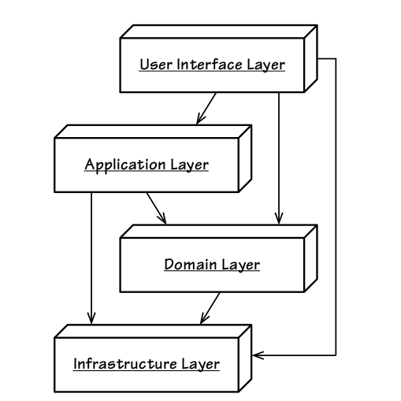
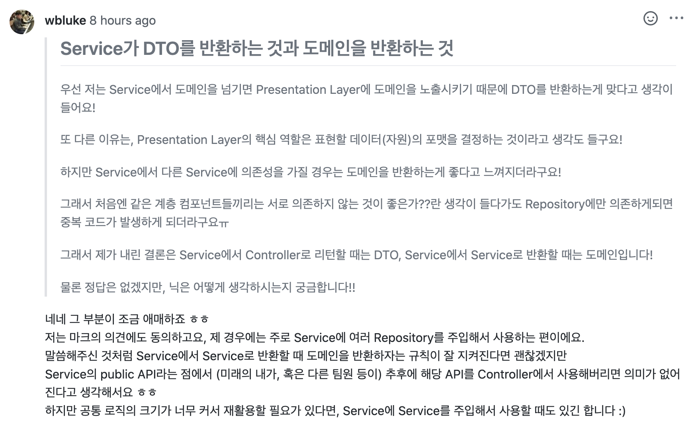
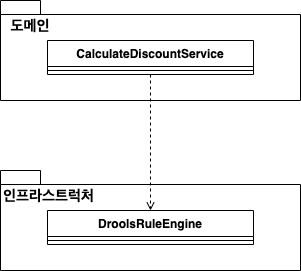
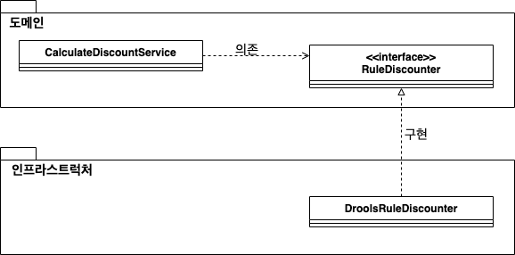
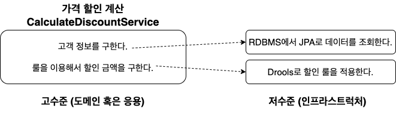
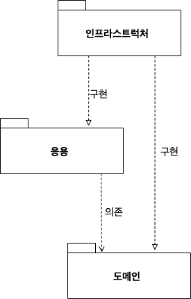

# 목차

<br>

<br>

# 계층 구조 아키텍처
웹 애플리케이션에서 보통 가장 많이 활용되는 아키텍처는 계층 구조 아키텍처이다.

이번 챕터에선 DDD에서 흔히 언급되는 계층 구조에 대해서 알아본다.

🤔 계층 구조가 좋은 이유는 무엇일까?

1. 계층간의 추상화.
   * 각각의 계층을 추상화한다면, 각기 다른 계층끼리 부품을 갈아끼우듯이 변경이 가능하다.
   * 각 계층은 어떤 역할을 한다는 명세를 따라 구현하면 된다. 그럼 자연스레 레이어의 구현 세부사항은 은폐된다.
2. 계층간의 의존 관계 클린.
   * 어떤 비즈니스 요청을 처리하는 웹 애플리케이션이 계층 구조가 없다면 스파게티 코드(의존성이 뒤죽박죽)가 나오기 쉽다.
   * 각 계층의 분리하고, 역할을 분명히한다면 깔끔한 구조로 코드를 작성할 수 있다.
3. 계층간의 독립적인 개발 => 개발 속도 + 유지보수
   * 각 계층별로 역할이 분명이 나눠졌다면, 여러 개발자들이 동시에 자신이 맡은 계층만을 구현하고 합치면 빠르게 전체 애플리케이션을 구현할 수 있다.
   * 그리고 이러한 독립이라는 특징은 유지보수도 비교적 수월하다.
4. 계층간의 독립성
   * 각 계층은 독립적이여야 하며, 자신의 의존성을 드러내면 안된다.
   * 즉, 서로 연결되지 않은 계층끼리는 서로 알지 못한다.

<br>

## DDD 계층 구조와 특징

<br>

💁‍♂️ 에릭 에반스는 아래와 같은 계층 구조를 제시한다.

<p align="center"><br>출처: https://ahmedhemaz.medium.com/my-journey-in-learning-domain-driven-design-part2-layers-and-hexagonal-architecture-67697ff1426c </p>

위 계층 구조의 특징은 다음과 같다.

* 상위 계층에서 하위 계층으로의 의존만 존재한다. (단방향)
  * 하위 계층은 상위 계층을 의존하지 않는다.

<br>

## 계층별 역할과 책임

<br>

🤔 각 계층별 역할은 무엇일까?

* 표현 계층
  * 사용자의 요청을 받아 응용 계층에 전달하고, 응용 계층의 처리 결과를 다시 사용자에게 보여주는 역할. (UI가 변경되면 같이 변경되는 계층)
    * 즉, 비즈니스 처리 결과 혹은 자원에 대한 표현을 결정하는 계층이다.
  * the presentation layer doesn’t need to know or worry about how to get customer data; it only needs to display that information on a screen in particular format - [Software Architecture Patterns by Mark Richards](https://www.oreilly.com/library/view/software-architecture-patterns/9781491971437/ch01.html)
  * ex. Spring MVC
* 응용 계층
  * 도메인을 묶어서 애플리케이션의 핵심 작업을 제어하는 역할.
    * 비즈니스 로직을 직접 수행하기보다는 도메인 모델에 위임하며 작업에 대한 순서등을 제어한다.
  * 응용 계층은 도메인 모델을 이용해서 사용자에게 제공할 기능을 구현한다.
  * 즉, 트랜잭션과 도메인의 처리 순서를 보장.
  * the business layer doesn’t need to be concerned about how to format customer data for display on a screen or even where the customer data is coming from; it only needs to get the data from the persistence layer, perform business logic against the data (e.g., calculate values or aggregate data), and pass that information up to the presentation layer. - [Software Architecture Patterns by Mark Richards](https://www.oreilly.com/library/view/software-architecture-patterns/9781491971437/ch01.html)
* 도메인 계층
  * 도메인 모델을 구현한다.
  * 즉, 핵심 비즈니스 로직을 구현한다.
  * 엔티티, 밸류, 애그리거트, 리포지토리, 도메인 서비스로 구성된다.
* 인프라스트럭처 계층
  * 구현 기술을 다룬다. (구체적인 것을 다룬다)
    * RDBMS 연동을 처리하고, 메시징 큐에 메시지를 전송하거나 수신하는 기능을 구현하고, Redis와의 데이터 연동을 처리한다.
  * 인프라스트럭처는 논리적 개념보다는 실제 구현을 다룬다.

<br>

💁‍♂️ 표현, 응용, 도메인 계층은 구현 기술을 직접 만들지 않고, 인프라스트럭처 영역에서 제공하는 기능을 사용해서 필요한 기능을 개발한다.

뒤에서 말하겠지만, DIP을 활용해서 표현, 응용, 도메인에서는 추상적인 것에 의존하도록 만들고, 인프라스트럭처에서 구체적인 것을 생성하여 의존성 주입하여 유지보수성 좋게 코드를 구성한다.

예를 들어, 응용 계층에서 DB에 보관된 데이터가 필요하면 인프라스트럭처 계층의 DB 모듈을 사용하여 데이터를 읽어온다. (물론 인프라스트럭처의 DB 구현체에 따라 다른 DB에 저장할 수 있다.)

<br>

❗️ **응용 계층에서 비즈니스 로직을 처리하는 것이 아니다!**

* 응용 계층은 트랜잭션과 도메인 간의 순서 보장의 역할만을 수행한다.
* 그럼 비즈니스 로직은 누가 처리하느냐?!?!
  * 바로 도메인 계층이다 :) 

<br>

💁‍♂️ **계층 구조를 엄격하게 적용한다면 상위 계층은 바로 아래 계층에만 의존해야한다.**

하지만 구현의 편리함으로 인해 계층 구조를 유연하게 적용하기도 한다.

필자 생각엔 가능한 바로 아래 계층만 의존하는 것이 좋다고 생각든다.

그 이유는 만약 표현 계층에서 응용 계층을 넘어 도메인 계층에 의존한다면, 도메인 계층의 변경이 표현 계층과 응용 계층에 모두 영향을 끼치기 때문이다.

또한, 밀접한 계층이 아닌 계층끼리 의존하다보면 구성 요소간의 의존성이 복잡해진다.

물론 개발의 편리성을 위해 굉장히 엄격하게 지키긴 힘들지만, 가능한 지키는 것이 좋다고 생각든다.

<br>

## 계층에 대한 여러가지 의견
이번 장은 필자가 생각하는 계층에 대한 여러가지 의견이다.

그냥 넘겨도 좋다 :)

<details>
  <summary>DTO와 도메인간의 변환 작업은 어디에서 수행되어야 하는가?</summary>
  
  ---

  🤔 요청과 응답에 대한 DTO를 도메인으로 변환하는 것은 어떤 레이어에서 하는 것이 맞을까??

  <br>

  <b>도메인 모델 보호 관점</b>

  도메인 모델을 외부에 공개하지 않고 보호해야한다는 주장에 따르면, Service에서 변환 작업을 해주는 것이 타당하다.

  > Martin Fowler: the Service Layer defines the application's boundery, it encapsulates the domain. In other words it protects the domain.
  
  마틴 파울러도 Service 계층은 애플리케이션의 경계를 정의하고, 비즈니스 로직 등 도메인을 캡슐화하는 역할이라고 정의했다. 즉, 도메인을 보호한다는 의미다.
  
  도메인 모델을 Presentation 계층에게 반환할 경우 결합도가 증가하여, 도메인의 변경이 Controller의 변경을 촉발하는 유지보수의 문제로 이어질 수 있다.
  
  이러한 관점에서 보면 DTO와 도메인(Entity)간의 변환 작업은 Service 계층에서 정의되어야 한다고 본다. 요청에 대한 응답 역시 Service 계층의 일부분이기 때문이다.

  <br>

  <b>정답은 없다.</b>

  그렇다고 꼭 Service에서 DTO를 만들어서 반환하라는 것은 아니다.

  DTO를 통해 도메인과 다른 계층을 분리할 수 있지만, 이럴경우 도메인 모델과 유사한 코드 복제가 빈번하게 발생하는 문제가 발생한다.
  
  또한, Service 계층에서 DTO 변환 로직이 추가되는 경우 코드의 복잡성이 증가할 수도 있다.
  
  결론적으론 작은 규모의 프로젝트에서는 DTO 사용은 불필요하다고 본다.
  
  ---
</details>

<br>

<details>
  <summary>응용 계층은 DTO와 도메인중 뭐를 반환해야 하는가?</summary>
  
  ---
  
  <b>응용 계층에서 표현 계층으로 반환할 때</b>

  * Presentation Layer는 오직 DTO만을 핸들링한다.
  * Service Layer는 파라미터로 DTO를 받는다. 그리고 도메인 객체를 핸들링하고, DTO만을 Presentation Layer에 반환한다.
  * Repository Layer는 엔티티를 메서드 매개 변수로 사용하고 엔티티(및 기본 타입)를 반환한다.

  <b>🤔 서비스 계층이 굳이 DTO를 반환해야하는가? 그냥 도메인이나 VO를 반환하면 안되는가??</b>

  * 좋은 생각이 아니라고 생각든다. 그 이유는
    * 도메인 모델은 애플리케이션의 내부 모델(비즈니스 로직)을 명시한다. 만약 이 도메인 모델을 외부에 공개된다면, 해당 클라이언트측은 그것을 사용하는 방법을 알아야 한다. 다시 말해서, 애플리케이션의 클라이언트가 소유해야하는 것이 아닌 것들을 처리해야한다. 만약 DTO를 사용한다면, 우리의 모델을 클라이언트에게 숨길 수 있기 때문에, 더 쉽고 깨끗한 API를 제공할 수 있다.
    * 만약 외부에 도메인 모델을 공개된다면, 이것에 의존하는 다른 것들을 깨지 않고는 변경할 수 없다. DTO를 사용하면, DTO를 변경하지 않는 한 도메인 모델을 변경할 수 있다. (DTO를 하나의 문처럼 사용하는 것!)
  * 그리고 JPA에서 엔티티를 표현 계층으로 반환하면 지연 로딩으로 인해 자칫 잘못하면 무한 루프에 빠질 수 있다.

  <br>

  <b>응용 계층에서 응용 계층의 다른 컴포넌트로 반환할 때</b>

  > 이 문제도 역시 정답은 없다고 생각든다.

  내가 처음 내린 결론은 Service에서 Controller로 리턴할 때는 DTO, Service에서 Service로 반환할 때는 도메인이다.

  하지만 역시 다른 사람의 의견이 궁금해 토론을 진행하였고, 아래와 같은 답변을 받아볼 수 있었다.

  <p align="center"> </p>

  이외에도 [stackoverflow - should-services-always-return-dtos-or-can-they-also-return-domain-models](https://stackoverflow.com/questions/21554977/should-services-always-return-dtos-or-can-they-also-return-domain-models) 에서 이 문제에 대해서 잘 정리하였다.

  ---
</details>

<br>

<details>
  <summary>영속 계층과 응용 계층중 어디에서 예외처리를 해주어야하는가?</summary>
  
  ---
  
  어느날 개발 친구가 갑자기 아래와 같은 대화 주제를 꺼냈다.

  <p align="center"> </p>

  <b>아주 좋은 토론 주제라고 생각든다!! 까먹기 전에 여기에 나의 생각을 기록해놓을려고 한다.</b>

  응용에서 예외처리하는 것이 맞다고 생각든다.
  
  우선 나는 응용 계층에서 `isExists`를 통해 예외처리하는 것을 지향한다. 그 이유는 다음과 같다.

  1. 역할과 책임
     * 중복 체크도 어떻게 보면 비즈니스 로직이기 때문에 Service에서 처리하고, DAO는 CRUD만 수행하는 역할을 담당하는 것이 맞다고 생각든다.
  2. DB 기술 그리고 데이터 액세스 기술과의 격리를 위해선 DB나 데이터 액세스 기술에 의존적인 코드를 작성하면 안된다.
     *  DB 기술마다 예외 코드와 SQL문이 조금씩 다르기 때문에 DAO를 통해 특정 DB에 종속된 코드를 작성하면 DB 기술을 바꿔 낄 수 없다.
     *  물론 스프링은 `DataAccessException`을 통해 모든 DB회사의 예외를 매핑했지만, 데이터 액세스 기술과의 매핑은 완벽하지 않다.
        *  하이버네이트의 경우 `DataIntegrityViolationException`를 던지지만, JdbcTemplate의 경우 `DuplicateException`을 던진다.

<br>

<b>간단히 말해, DB 기술 그리고 데이터 액세스 기술와 DAO를 격리시키려면 영속 계층은 CRUD만 지원하는 것이 타당하다고 생각든다.</b>
  
  ---
</details>

<br>

# DIP
갑자기 DIP ?? 라고 생각할 수 있지만, DDD의 계층 구조는 DIP를 기반으로 구성된 아키텍처이다.

계층구조에 DIP를 적용하지 않은 것과 적용한 예시를 통해 DIP가 중요한지에 대해서 정리하였다.

<br>

## DIP를 적용하지 않는다면
DIP를 적용하지 않는 예시를 위해 할인 금액을 계산하는 요구사항을 구현해본다.

💁‍♂️ 인프라스트럭처 계층의 Drools라는 룰 엔진을 사용해서 계산 로직을 수행하는 코드를 먼저 작성해본다.

> DroolsRuleEngine.java

```java
public class DroolsRuleEngine {
  private KieContainer kContainer;

  public DroolsRuleEngine(){
      KieServices ks = KieServices.Factory.get();
      kContainer = ks.getKieClasspathContainer();
  }

  public void evalute(String sessionName, List<?> facts) {
      KieSession kSession = KContainer.newKieSession(sessionName);
      try {
          facts.forEach(x -> kSession.insert(x));
          kSession.fireAllRules();
      } finally {
          kSession.dispose();
      }
  }
}
```

그리고 위 객체를 이용하는 응용 계층을 작성해준다.

> CalculateDiscountService.java

```java
public class CalculateDiscountService {
    private DroolsRuleEngine ruleEngine; // 구체적인 것에 의존하기 때문에 변경에 취약하다.

    // 생성자

    public Money calculateDiscount(List<OrderLine> orderLines, String customerId) {
        Customer customer = findCustomer(customerId);

        MutableMoney money = new MutableMoney(0);
        List<?> facts = Arrays.asList(customer, money);
        facts.addAll(orderLines);
        ruleEngine.evalute("discountCalculation", facts); // 인프라스트럭처 객체 사용
        return money.toImmutableMoney(); 
    }
    ...
}
```
위 구조의 코드는 구체적인 것 (`DroolsRuleEngine`)에 의존하기 때문에 **변경에 취약하고 테스트하기 힘들다.**

1. 변경에 취약하다.
2. 테스트하기 어렵다.

**위 문제를 해결하는 방법은 구체적인 것에 의존하지 않고, 추상적인 것에 의존하게하는 것이다.**

<br>

## DIP를 적용한다면

💁‍♂️  이제 위 코드에 DIP를 적용시켜 변경에 유연하고 테스트하기 좋은 구조를 만들어본다.

**AS-IS**

<p align="center"><br>DIP 적용전 계층 구조 </p>

<br>

**TO-BE**

<p align="center"><br>DIP 적용후 계층 구조 </p>

<br>

코드로 보면 아래와 같이 인터페이스(추상적인 것)를 만들어 도메인 계층에선 추상적인 것에 의존하게 하고, 인프라스트럭처는 해당 인터페이스를 구현함으로써 의존하게 만든다.

> RuleDiscounter.java
```java
public interface RuleDiscounter {
    Money applyRules(Customer customer, List<OrderLine> orderLines);
}
```

> DroolsRuleDiscounter.java

```java
public class DroolsRuleDiscounter implements RuleDiscounter {
    ...
}
```

> CalculateDiscountService.java

```java
public class CalculateDiscountService {
    private RuleDiscounter ruleDiscounter; // 구체적인 것인 아닌 추상적인 것에 의존한다.

    public CalculateDiscountService(RuleDiscounter ruleDiscounter) {
        this.ruleDiscounter = ruleDiscounter;
    }

    public Money calculateDiscount(List<OrderLine> orderLines, String customerId) {
        Customer customer = findCustomers(customerId);
        return ruleDiscounter.applyRules(customer, orderLines); // 의존되는 객체에 따라 런타임에 다르게 동작한다.
    }
}
```
위와 같이 구체적인 것이 아닌 추상적인 것에 의존하게 되면 변경에 유연하고 테스트에도 용이한 구조가 완성된다.

* 변경에 유연한 이유
  * 컴파일 타임엔 추상적인 것에 의존하고, 런타임에 의존되는 구체적인 객체에 따라 다르게 동작한다.
  * 즉, 변경이 발생하면 해당 인터페이스를 구현한 구체적인 객체를 만들어 의존성 주입만하면 기존의 코드 수정은 발생하지 않는다.
* 테스트에 용이한 이유
  * 마찬가지로 생성자에서 추상적인 것을 구현한 구체적인 것을 주입하기 때문에, 테스트에 사용될 테스트용 구현체를 생성하여 주입해주면 된다.

<br>

💁‍♂️ 고수준과 저수준의 관점에서 보면 아래와 같다.

<p align="center"> </p>

* 고수준과 저수준
  * 고수준은 여러 저수준 모듈을 이용하여 완전한 기능을 수행한다. (ex. 가격 할인 계산)
  * 저수준은 하위 기능을 실제로 구현한다. (ex. DB로부터 데이터 조회, 할인 계산 룰)
* 고수준 모듈이 저수준 모듈을 사용한다.

<br>

## DIP의 진짜 의미

💁‍♂️ **DIP의 핵심은 고수준 모듈이 저수준 모듈에 의존하기 않도록하기 위함이다.**

* **고수준 모듈이 저수준 모듈을 바로 의존하지 않고, 고수준과 저수준 사이의 인터페이스를 둔다.**
  * **하위 기능을 추상화한 인터페이스는 고수준 모듈에 위치한다.**
* **DIP는 저수준 모듈이 고수준 모듈의 인터페이스를 구현함으로써 의존성을 역전시켰다해서 DIP라 부른다.**

> **중요한 점은 고수준이 저수준의 구체적인 객체에 바로 의존하지 않는 것이다. 대신 인터페이스를 두고, 고수준의 객체와 저수준의 객체 모두 인터페이스에 의존하도록 해야한다.**

<br>

💁‍♂️ DIP와 아키텍처

인프라스트럭처 영역은 구현 기술을 다루는 저수준 모듈이고, 응용과 도메인 영역은 고수준 모듈이다.

**인프라스트럭처 계층이 가장 하단에 위치한 일반적인 계층 구조와 달리 DIP를 적용하면 아래와 같이 인프라스트럭처 계층이 응용과 도메인 영역에 의존(상속 혹은 구현)하는 구조가 된다.**

<p align="center"> </p>

<br>

## 무조건적으로 인프라스트럭처의 의존성을 없앨 필요는 없다

인프라스트럭처는 표현, 응용, 도메인 영역에서 사용되는 구현체를 제공한다.

ex. 영속성 처리, 트랜잭션, 프레임워크, 보조 기술등등

위에서 DIP의 장점을 설명하면서 고수준 모듈에서 저수준 모듈에 직접 의존하지 말라고 말하였다.

하지만 **이는 이상적인 규칙일 뿐.. 무조건 응용과 도메인 계층에서 인프라스트럭처의 의존성을 없앨 필요는 없다.**

ex. `@Transactional`, `@Entity`, `@Table`과 같은 애노테이션은 그대로 의존해서 사용하는 것이 좋다.

오히려 너무 DIP에 따른 규칙을 지키다 구현이 복잡해질 수도 있다. 상황에 맞게 사용하자.

<br>

# 도메인 영역의 주요 구성요소
도메인 영역은 도메인의 핵심 모델을 구현한다. 즉, 핵심 비즈니스 로직을 구현한다.

<br>

## 엔티티

🤔 엔티티의 의미

* 고유의 식별자를 갖는 객체로 자신의 생명주기를 갖는다.
  * ex. 주문, 회원, 상품등등
* 도메인 모델의 데이터를 포함하며 해당 데이터와 관련된 기능을 함께 제공한다.

<br>

🤔 도메인 모델의 엔티티와 RDBMS에서의 엔티티의 차이는?

* 도메인 모델의 엔티티는 데이터와 함께 도메인 기능을 함께 제공한다. (핵심 비즈니스 로직을 수행한다.)
  * 사실 기능이 먼저이고, 그 다음이 데이터라고 봐도 무방하다. (객체지향)
* 반면에, RDBMS의 엔티티는 그저 데이터만을 담는 홀더 기능을 한다.

<br>

## 밸류

🤔 밸류의 의미

* 고유의 식별자를 갖지 않는 객체로 개념적으로 하나인 값을 표현할 때 사용된다.
  * ex. Money, Address
* 엔티티의 속성으로 사용할 뿐만 아니라 다른 밸류 타입의 속성으로도 사용된다.

<br>

## 애그리거트

🤔 애그리거트의 의미

* 애그리거트는 연관된 엔티티와 밸류 객체를 개념적으로 하나로 묶은 것을 의미한다.
  * ex. 주문과 관련된 Order, OrderLine, Orderer 객체를 '주문'이라는 애그리거트로 묶어서 생각할 수 있다.
* 애그리거트는 관련 객체를 하나로 묶은 군집을 의미한다.
  * ex. 주문 -> 주문, 배송지 정보, 주문자, 주문 목록, 총 결제 금액의 하위 모델로 구성된다.

<br>

🤔 애그리거트가 없다면

* 프로젝트의 규모가 커짐에 따라 전체 구조가 아닌 한 개 엔티티와 밸류에만 집중하는 상황이 발생할 수 있다.
  * 이때 상위 수준에서 모델을 관리하지 않고 개별 요소에만 초점을 맞추다 보면, 프로젝트에 대한 큰그림을 그리지못한 상황에서 모델을 관리해야한다.
* **비유**
  * **지도를 통해 위치를 찾으려면 매우 상세하게 나오는 지도와 큰 수준에서 보여주는 지도 모두 있어야 비로소 자신의 위치와 앞으로의 길을 찾을 수 있다.**
  * 여기서 매우 상세하게 나오는 지도는 엔티티와 밸류등을 의미하며, 큰 수준에서 보여주는 지도는 애그리거트라고 보면 된다.

<br>

💁‍♂️ 애그리거트는 군집에 속한 객체를 관리하는 **루트 엔티티**를 갖는다.

* 루트 엔티티는 애그리거트에 속해 있는 엔티티와 밸류 객체를 이용해서 애그리거트가 구현해야 할 기능을 제공한다.
* **루트 엔티티가 내부 구현을 숨겨서 애그리거트 단위로 구현을 캡슐화 할 수 있도록 돕니다.**
  * **루트 엔티티가 public, 그 안에 속해있는 엔티티와 밸류는 private이라고 봐도 좋을듯 하다.**
  * 즉, **루트 엔티티를 통해서만 해당 애그리거트의 엔티티와 밸류에 접근 및 기능을 수행할 수 있다.**

> 애그리거트를 어떻게 구성했느냐에 따라 구조가 많이 달라진다. 상황에 맞는 애그리거트를 설계해야한다.

<br>

## 리포지터리

🤔 리포지터리의 의미

* 도메인 모델의 영속성을 처리한다.
  * ex. DBMS에서 엔티티 객체를 로딩하고 저장하는 기능.
* 리포지터리는 영속화하는 데 필요한 기능을 추상화한 것으로 구수준 모듈에 속한다.
  * 도메인 계층 입장에서 DBMS와 상관없이 그저 저장소로 봐도 된다.
  * 그저 컬렉션으로 엔티티를 저장하는 저장소. 물론 보통 인프라스트럭처에 DBMS에 연결된 구현체를 구현하여 사용한다.

<br>

💁‍♂️ **리포지터리는 애그리거트 단위로 도메인 객체를 저장하고 조회하는 기능을 제공한다.**

<br>

## 도메인 서비스

🤔 도메인 서비스의 의미

* 특정 엔티티에 속하지 않는 도메인 로직을 제공한다.
  * ex. '할인 금액 계산'은 상품, 쿠폰, 회원 등급, 구매 금액등 다양한 조건을 이용해서 구현해야하기 때문에, 도메인 서비스에 구현한다.

> 책을 보면서 느끼는 것이지만, `xxxService`라고 무조건 응용 계층인 것은 아니다. 도메인 계층에서 충분히 `xxxService` 역할을 하는 객체가 존재할 수 있다.
> 
> 단, 도메인 계층에 존재하는 `xxxService`는 트랜잭션을 제어하지는 않는다.

<br>

# 모듈
모듈 구성에 정답은 없다.

1. 영역별로 별도 패키지로 구성하는 경우
   * presentation, application, domain, infrastructure
2. 도메인이 크면 하위 도메인 별로 모듈을 나눌 수도 있다.
   * catalog -> presentation, application, domain, infrastructure
   * order -> presentation, application, domain, infrastructure
   * member -> presentation, application, domain, infrastructure

프로젝트 규모에 맞게 모듈 패키지 구성을 하면 된다.

