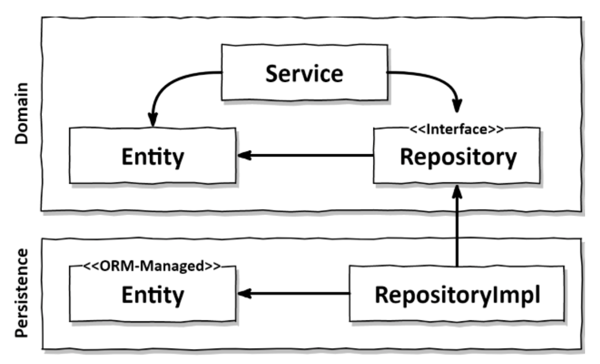
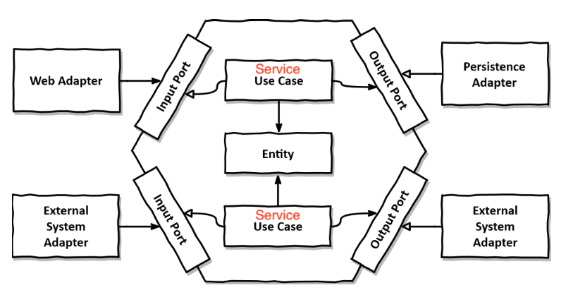

이 문서는 [Get your hands dirty on clean architecture](https://www.amazon.com/Hands-Dirty-Clean-Architecture-hands/dp/1839211962)의 번역본인 [만들면서 배우는 클린 아키텍처](http://www.yes24.com/product/goods/105138479)를 필자의 관점에서 정리한 문서입니다.

# 목차

 

- [목차](#목차)
- [의존성 역전하기](#의존성-역전하기)
  - [1 SRP와 DIP](#1-srp와-dip)
  - [2 클린 아키텍처](#2-클린-아키텍처)
  - [3 육각형 아키텍처](#3-육각형-아키텍처)

 

# 의존성 역전하기
이전 챕터에서 계층형 아키텍처의 문제점에 대해서 다뤘다면 이번엔 해결책에 대해서 다룬다.

 

## 1 SRP와 DIP
계층형 아키텍처를 유지보수와 확장면에서 좋게하려면 SRP와 DIP를 잘 활용해야한다.

> [SRP 정리](https://github.com/binghe819/TIL/blob/master/OOP&%EC%84%A4%EA%B3%84/SOLID/SRP.md), [DIP 정리](https://github.com/binghe819/TIL/blob/master/OOP&%EC%84%A4%EA%B3%84/SOLID/DIP.md)

전통적인 계층형 아키텍처에선 계층 간 의존성이 항상 다음 단계인 아래 방향으로 향한다.

그리고 **도메인 계층이 영속성 계층을 의존하기 때문에, 영속성 계층의 변경은 도메인 계층의 변경을 야기한다.**

**도메인 계층은 애플리케이션의 핵심이므로, 영속성 계층의 변경이 도메인 계층의 변경을 야기하는 것은 좋지 않다.**

이러한 문제를 해결하는 방법이 바로 DIP다.

 출처: Get your hands dirty on clean architecture 

**도메인 계층에 인터페이스를 도입함으로써 의존성을 역전. 덕분에 영속성 계층이 도메인 계층에 의존하게 된다.**

 

## 2 클린 아키텍처
로버트 C. 마틴은 "클린 아키텍처"라는 용어를 정립했다.

그리고 **그는 "클린 아키텍처"가 비즈니스 규칙의 테스트를 용이하게 하고, 비즈니스 규칙은 비침투적 (프레임워크, DB, UI, 기술로부터 독립적)일 수 있다고 한다.**

이는 **도메인 코드가 바깥으로 향하는 어떤 의존성도 없어야 함을 의미한다. - 가장 중요!!**

이때 모든 의존성은 DIP의 도움으로 모두 도메인 코드를 향하도록 해야한다고한다. (아래 그림 참고)

 모든 의존성은 도메인 로직을 향해 안쪽으로 향한다. 출처: Get your hands dirty on clean architecture 

* 비침투적
  * 도메인 코드에서는 어떤 영속성 프레임워크나 UI 프레임워크가 사용되는지 알 수 없다.
  * 즉, 어떤 프레임워크에 종속적인 도메인 코드가 나오지 않는다. 이는 자유롭게 도메인 코드를 모델링할 수 있다는 의미.
* **클린 아키텍처의 대가 - 중요** (무조건 좋은 것만은 아니다!)
  * **도메인 계층과 영속성, UI 계층과 분리시키기위해 엔티티에 대한 모델을 각 계층에서 유지보수해야한다.**
  * ex. ORM
    * ORM에선 엔티티에 메타데이터를 필요로한다. 이는 영속성 프레임워크의 엔티티를 그대로 도메인 코드로 사용된다면 영속성 프레임워크의 침투적인 코드가 된다.
    * 즉, **도메인 계층과 영속성 계층이 데이터를 주고 받을 때, 두 엔티티를 서로 변환해줘야한다.**

 

> 필자는 지금까지 도메인 로직을 작성할 때 JPA의 종속적인 코드를 작성했다. (아마 대부분이 이렇게 구현할 것이다.)
> 
> 이렇게 하는 것의 문제는 도메인 로직에 JPA의 엔티티 로직이 침투된다는 것인데.. 문제를 알면서도 변환 과정에서의 로직이 꼬일 것 같아 그저 사용했다.
> 
> 하지만 이 책의 저자는 이렇게 변환하는 것이 바람직한 일이라고 한다. 이는 앞으로 실제 프로젝트에 적용시켜보면서 살펴봐야할 듯 하다.

 

## 3 육각형 아키텍처
클린 아키텍처의 원칙들을 조금 더 구체적으로 표현한 것이 "육각형 아키텍처"이다.

 색칠 화살표는 사용(호출 - 주도), 빈 화살표는 구현(반환 - 수동) 출처: Get your hands dirty on clean architecture 

* 육각형 아키텍처의 의미
  * 아무 의미없다. 그저 애플리케이션이 다른 시스템이나 어댑터와 연결되는 4개 이상의 면을 가질 수 있음을 보여주기 위해 사각형 대신 육각형일 뿐.
* 모든 의존성은 코어를 향한다.
  * 엔티티에서 외부로 향하는 의존성이 없다. (클린 아키텍처)
* 육각형 아키텍처는 "포트와 어댑터"라고도 불린다.
  * 왼쪽 어댑터는 애플리케이션을 주도하는 어댑터, 오른쪽 어댑터는 애플리케이션에 의해 주도되는 어댑터.
  * 포트: 애플리케이션 코어와 어댑터 간의 통신을 위해 코어가 제공하는 
    * 왼쪽 어댑터 (주도하는 어댑터)의 포트: 포트가 코어에 있는 유스케이스 클래스들에 의해 구현되고 호출되는 인터페이스. (ex. UI)
    * 오른쪽 어댑터 (주도되는 어댑터)의 포트: 포트가 어댑터에 의해 구현되고 코어에 의해 호출되는 인터페이스. (ex. 영속성)

> 포트는 각각의 어댑터에 접근하는 인터페이스, 어댑터는 포트 (인터페이스)에 대한 구현체라고 생각해도 좋을듯하다.

 

> 무엇보다 중요한 것은 의존성을 역전시켜 도메인 코드가 다른 바깥쪽 코드 (UI, 영속성 프레임워크)에 종속적이지 않게해서 코드를 변경할 이유의 수를 줄이는 것이다. 이를 통해 유지보수성을 더 높이기 위함.
