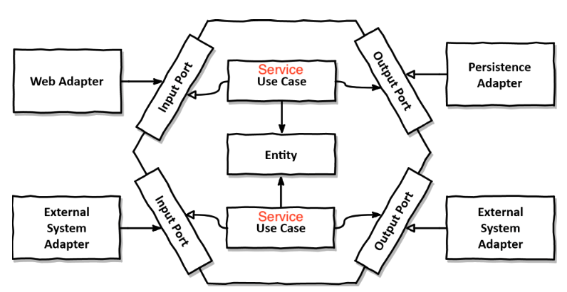
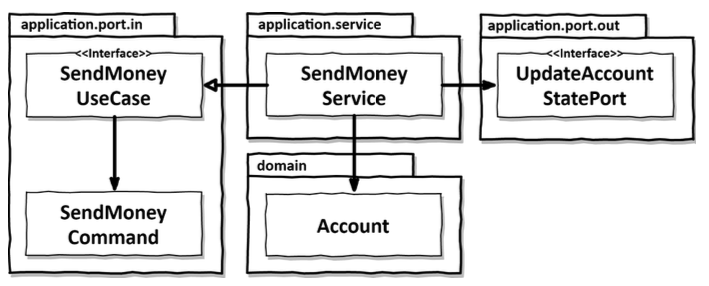

이 문서는 [Get your hands dirty on clean architecture](https://www.amazon.com/Hands-Dirty-Clean-Architecture-hands/dp/1839211962)의 번역본인 [만들면서 배우는 클린 아키텍처](http://www.yes24.com/product/goods/105138479)를 필자의 관점에서 정리한 문서입니다.

<br>

# 목차

<br>

- [목차](#목차)
- [들어가며](#들어가며)
- [도메인 구현 (유스케이스)](#도메인-구현-유스케이스)
- [응용 계층 구현](#응용-계층-구현)
  - [육각형 아키텍처로보는 애플리케이션 처리 단계](#육각형-아키텍처로보는-애플리케이션-처리-단계)
  - [송금하기 UseCase 구현](#송금하기-usecase-구현)
  - [입력 유효성 검증과 비즈니스 규칙 검증](#입력-유효성-검증과-비즈니스-규칙-검증)
  - [유스케이스마다 다른 입력 모델과 출력 모델이 필요한가?](#유스케이스마다-다른-입력-모델과-출력-모델이-필요한가)
  - [비즈니스 규칙 검증하기](#비즈니스-규칙-검증하기)
  - [풍부한 도메인 모델과 빈약한 도메인 모델](#풍부한-도메인-모델과-빈약한-도메인-모델)

<br>

# 들어가며
이번 장부터 앞에서 말한 아키텍처에 대해서 실제로 코드로 구현해본다.

앞에서 설명했듯이, 육각형 아키텍처는 도메인 중심의 아키텍처에 적합하기 때문에 도메인 엔티티를 만드는 것으로 시작한 후 

해당 도메인 엔티티를 중심으로 유스케이스를 구현한다.

<br>

# 도메인 구현 (유스케이스)
책에선 요구사항으로 `한 계좌에서 다른 계좌로 송금하는 유스케이스`를 구현한다.

당연히 도메인부터 구현한다. 처음엔 계정에 대해서 구현한다.

> Account.java
```java
public class Account {
    private AccountId id;
    private Money baselineBalance;
    private ActivityWindow activityWindow;

    // ... 생성자와 getter

    public Money calculateBalance() {
        return Money.add(
                this.baselineBalance,
                this.activityWindow.calculateBalance(this.id));
    }

    public boolean withdraw(Money money, AccountId targetAccountId) {

        if (!mayWithdraw(money)) {
            return false;
        }

        Activity withdrawal = new Activity(
                this.id,
                this.id,
                targetAccountId,
                LocalDateTime.now(),
                money);
        this.activityWindow.addActivity(withdrawal);
        return true;
    }

    // 인출
    private boolean mayWithdraw(Money money) {
        return Money.add(
                        this.calculateBalance(),
                        money.negate())
                .isPositiveOrZero();
    }

    // 예금
    public boolean deposit(Money money, AccountId sourceAccountId) {
        Activity deposit = new Activity(
                this.id,
                sourceAccountId,
                this.id,
                LocalDateTime.now(),
                money);
        this.activityWindow.addActivity(deposit);
        return true;
    }
}
```
* `Account`는 실제 계좌의 현재 스냅샷을 제공.
  * `Activity`가 계좌에 대한 모든 입금과 출금을 가진 객체이며, 모든 활동은 메모리 문제로 인해 최근 날짜의 활동을 저장한다.
  * `ActivityWindow`는 `Activity`의 일급컬렉션으로 보면 된다.
* 계좌의 현재 잔고 계산 방법
  * 기준 잔고 (baselineBalance) + 모든 활동들의 잔고
  * 기준 잔고는 첫번째 활동 전의 잔고를 표현한다. (?)
  * 장점: 예금과 출금이 그저 새로운 활동을 추가해주는 것 뿐이다. (간단)

<br>

# 응용 계층 구현
도메인에 대해서 구현하였으니, 이제 응용 계층에 대해서 구현해본다.

<br>

## 육각형 아키텍처로보는 애플리케이션 처리 단계
보통 애플리케이션은 아래와 같은 단계를 따른다.

1. 입력을 받는다. (Input)
2. 비즈니스 규칙을 검증한다.
3. 모델 상태를 검증한다.
4. 출력을 반환한다.

<br>

💁‍♂️ **계층형 아키텍처로 위 단계를 나누면 아래와 같다.**

<p align="center"><br>출처: Domain-Driven Design  </p>

1. User Interface
   * User Interface를 통해 입력을 받는다. (Controller)
   * 자원에 대한 표현을 담당한다. (요청 응답, 예외 처리, 인증등등)
2. Application
   * User Interface로부터 받은 입력 (요청)을 도메인에게 위임하는 역할.
     * **이 계층은 비즈니스 로직을 처리하는 것이 아닌, 트랜잭션과 도메인 간 순서 보장의 역할을 한다.**
   * 비즈니스 규칙을 검증하는 역할을 한다고 볼 수 있다.
3. Domain
   * 핵심 비즈니스 로직을 수행하며, 모델의 상태를 검증한다.
4. Infrastructure or Persistence
   * 외부와의 통신 (DB, 메시징 시스템 등)을 담당하는 계층.

<br>

💁‍♂️ **그리고 이를 클린 아키텍처에서 말하는 육각형 아키텍처로 변경하여 아래와 같다.**

<p align="center">색칠 화살표는 사용, 빈 화살표는 구현<br>출처: Get your hands dirty on clean architecture </p>

1. Web Adapter / External System Adapter
   * 인커밍 어댑터로부터 유스케이스 입력을 받는다.
   * 비즈니스 요청을 Input Port에 보낸다.
2. Input Port
   * 외부 어댑터 (ex. Controller)에서 Use Case에 접근할 때 사용되는 Port.
   * 보통 Use Case의 추상 객체와 DTO를 의미한다. (ex. `SendMoneyUseCase`, `SendMoneyCommand`)
3. Use Case (Service 계층의 추상화)
   * Input Port의 구현체. 보통 Service 계층을 의미한다. (ex. `SendMoneyUseCase`의 구현체는 `SendMoneyService`.)
   * **비즈니스 로직을 처리하는 것이 아닌, 트랜잭션과 도메인 간 순서 보장의 역할을 한다.**
   * 비즈니스 규칙을 검증한다. (도메인 엔티티와 이 책임을 공유한다.)
     * 비즈니스 규칙을 충족하면 입력을 기반으로 어떤 방법으로든 모델의 상태를 변경한다.
   * 도메인 객체의 상태를 바꾸고 영속성 상태를 통해 구현된 포트로 이 상태를 전달해서 저장한다.
4. Output Port
   * Use Case 처리 과정에서 외부 시스템 (ex. DB)이 필요할 때 요청하는 추상 객체 (인터페이스)
5. Persistence Adapter / External System Adapter
   * Output Port의 구현체.

<br>

> **위에서 알 수 있듯이, 육각형 아키텍처는 "포트와 어댑터"라고 볼 수 있다.**
> * **포트는 추상화 객체 (인터페이스), 어댑터는 구현체로 보면 이해가 쉽다.**

<br>

## 송금하기 UseCase 구현
위에서 육각형 아키텍처는 어떻게 요청을 처리하는지 알아보았다.

이번엔 송금하기 UseCase를 구현해본다.

> SendMoneyService.java

```java
@RequiredArgsConstructor
@Transactional
public class SendMoneyService implements SendMoneyUseCase {

	private final LoadAccountPort loadAccountPort;
	private final AccountLock accountLock;
	private final UpdateAccountStatePort updateAccountStatePort;

	@Override
	public boolean sendMoney(SendMoneyCommand command) {
        // TODO: 비즈니스 규칙 검증
        // TODO: 모델 상태 조작
        // TODO: 출력 값 반환
	}
}
```
<p align="center"><br>출처: Get your hands dirty on clean architecture </p>

* 송금하기 비즈니스를 구현하기 위한 구조는 아래와 같다.
  * `SendMoneyService`는 인커밍 포트인 `SendMoneyUseCase`를 구현한다.
  * 송금하기 비즈니스를 구현하는데 필요한 계좌 불러오기와 계좌 상태 업데이트는 아웃고잉 포트 인터페이스인 `LoadAccountPort`와 `UpdateAccountStatePort`를 구현한다.

<br>

## 입력 유효성 검증과 비즈니스 규칙 검증
본격적인 UseCase의 세부 사항을 구현하기에 앞서 논의해야할 부분이 하나 있다.

<br>

🤔 **비즈니스 요청에 대한 '입력 유효성 검증'은 어디서 하는 것이 좋을까?**

입력을 받는 인커밍 어댑터? DTO? 비즈니스를 처리하는 도메인?

**필자의 경우는 가능한 다 하는 것이 좋지만, 하나만 해야한다면 비즈니스를 처리하는 도메인에는 무조건 있어야 한다고 생각든다.**

**그 이유는 아무리 외부 포트에서 검증을 한다고해도.. 자칫 잘못하면 도메인 상태를 유효하지 않는 값으로 변경할 수 있기 때문에 도메인에선 무조건 해줘야 한다고 생각한다.**

<br>

책에선 입력 모델 (불변으로 구현된 DTO로 봐도 무방할 듯 하다.)에 검증 로직을 넣는다.

> SendMoneyCommand.java

```java
@Value
@EqualsAndHashCode(callSuper = false)
public
class SendMoneyCommand extends SelfValidating<SendMoneyCommand> {

    @NotNull
    private final AccountId sourceAccountId;

    @NotNull
    private final AccountId targetAccountId;

    @NotNull
    private final Money money;

    public SendMoneyCommand(
            AccountId sourceAccountId,
            AccountId targetAccountId,
            Money money) {
        this.sourceAccountId = sourceAccountId;
        this.targetAccountId = targetAccountId;
        this.money = money;
        this.validateSelf();
    }
}
```

* Bean Validation API에서 제공하는 `SelfValidating`을 이용하여 검증 로직을 구현하였다.
  * `SelfValidating 추상 클래스는 `validateSelf()` 메서드를 제공하며, 생성자 코드의 마지막 문장에서 이 메서드를 호출해준다.
  * 이 메서드는 애노테이션 (ex. `@NonNull`)을 검증하고, 위반할 경우 예외를 던진다.
* 불변으로 구현하여 한번 생성되면 변경되지 못하도록 막는다. (불변과 생성자의 힘)

<br>

## 유스케이스마다 다른 입력 모델과 출력 모델이 필요한가?

**입력 모델**

> 여기서 말하는 입력 모델은 불변 DTO를 의미한다.

유스케이스별 필요한 상태가 조금씩 다르며, 같은 상태라도 유스케이스에 따라 검증에 대한 규칙이 다를 수 있다.

또한, 유스케이스별 입력 모델을 만들어줌으로써 유스케이스와 입력 모델 간의 결합도도 줄일 수 있다.

그러므로, 유스케이스별 입력 모델을 따로 만들어 주는 것이 좋다.

> 물론 매번 만들어줘야하기에 비용이 들지만 필자의 생각에도 유스케이스별 만들어주는 것이 좋다고 생각한다.

<br>

**출력 모델**

이것도 정답은 없지만, 가능한 적게 반환하는 것이 좋다.

만약 많은 것을 반환해야한다면 결합도를 제거하기 위해 유스케이스별 따로 만들어주는 것이 좋다고 생각든다. (부수효과 방지)

<br>

## 비즈니스 규칙 검증하기
`송금하기` 유스케이스를 충족시키기에 지켜야하는 비즈니스 규칙들이 있다.

1. 송금되는 금액은 0보다 커야한다. - 구문상의 검증으로 충분.
2. 출금 계좌는 초과 출금되어서는 안된다. - 의미적 유효성 검증이 필요.
3. 등등..

<br>

1번은 굳이 비즈니스에서 처리하지 않고 입력모델에서 처리할 수 있다.

반면에, 2번은 현재의 상태가 필요하기에 응용계층의 맥락 속에서 의미적인 유효성 검증이 필요하다.

<br>

🤔 **그렇다면 비즈니스적인 검증은 어디에서 구현하는 것이 좋을까?**

가장 좋은 방법은 당연히 핵심 비즈니스 로직을 수행하는 도메인 엔티티 안에서 검증하는 것이다.

> Account.java
```java
@AllArgsConstructor(access = AccessLevel.PRIVATE)
public class Account {

	...

	public boolean withdraw(Money money, AccountId targetAccountId) {
        // 비즈니스 검증
		if (!mayWithdraw(money)) {
			return false;
		}

		...
	}

	private boolean mayWithdraw(Money money) {
		return Money.add(
				this.calculateBalance(),
				money.negate())
				.isPositiveOrZero();
	}
}
```

만약 도메인 엔티티에서 검증하기 애매하다면 유스케이스 코드 (Service 객체)에서 도메인 엔티티를 사용하기전에 검증하면 된다.

> 필자는 가능한 도메인 엔티티에서 하는 것을 추구한다.

<br>

## 풍부한 도메인 모델과 빈약한 도메인 모델
* 풍부한 도메인 모델
  * 애플리케이션 코어에 있는 엔티티에서 가능한 한 많은 도메인 로직을 구현하는 모델
  * **비즈니스 로직은 도메인 엔티티에서 거의 처리하는 방식.**
  * **유스케이스 (Service 객체)는 비즈니스 로직을 처리하는 것이 아닌, 트랜잭션과 도메인 간 순서 보장의 역할만한다.**
* 빈약한 도메인 모델
  * 엔티티가 상태를 표현하는 필드와 getter/setter만 가지는 모델.
  * 모든 비즈니스 로직은 유스케이스 (Service 객체)에서 처리하는 방식.

<br>

정답은 없지만.. 필자는 풍부한 도메인 모델이 훨씬 유지보수나 확장면에서 좋다고 생각든다.

<br>


