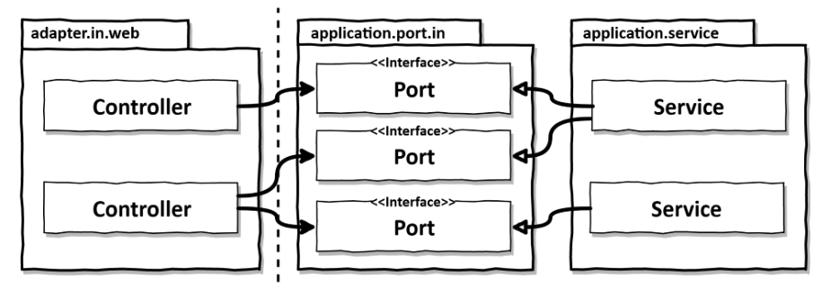
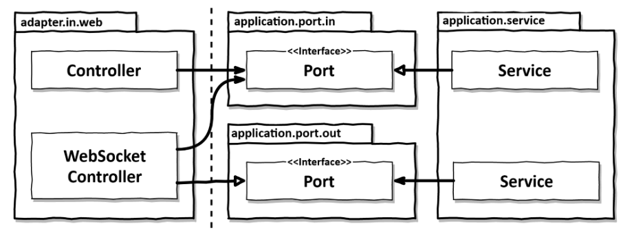

이 문서는 [Get your hands dirty on clean architecture](https://www.amazon.com/Hands-Dirty-Clean-Architecture-hands/dp/1839211962)의 번역본인 [만들면서 배우는 클린 아키텍처](http://www.yes24.com/product/goods/105138479)를 필자의 관점에서 정리한 문서입니다.

<br>

# 목차

<br>

- [목차](#목차)
- [들어가며](#들어가며)
- [의존성 역전](#의존성-역전)
- [웹 어댑터의 책임](#웹-어댑터의-책임)
- [컨트롤러 나누기](#컨트롤러-나누기)

<br>

# 들어가며
오늘날의 많은 사용자는 모두 웹 브라우저 혹은 앱을 이용하여 도메인의 서비스를 받는다.

즉, 서버 개발자는 사용자의 요구사항을 도메인으로 구현하며, 사용자와의 커뮤니케이션은 웹 어댑터를 통해 이뤄진다.

이번장은 웹 어댑터에 구현 방법에 대해서 다룬다.

<br>

# 의존성 역전
육각형 아키텍처에서 웹 인터페이스를 구현할 때도 포트와 어댑터 기반의 의존성 역전을 사용한다.

<br>

💁‍♂️ **의존성 역전이 적용된 아키텍처 구조**

<p align="center"><br>출처: 출처: Get your hands dirty on clean architecture </p>

웹 어댑터는 '주도하는'하는 어댑터이다. (인커밍 어댑터)

외부로부터 요청을 받아 애플리케이션 코어를 호출하고 무슨 일을 해야할 지 알려주는 역할을 담당한다.

**위 그림을 보면 의존성 역전 원칙이 적용된 것을 볼 수 있다.**

웹 어댑터는 인터페이스인 port에 의존하고, 실제 구현체는 service가 구현한다.

> DIP는 `추상화된 것은 구체적인 것에 의존하면 안되며, 구체적인 것이 추상화된 것에 의존해야 한다는 원칙`이다. 더 자세한 내용은 [여기](https://github.com/binghe819/TIL/blob/master/OOP&%EC%84%A4%EA%B3%84/SOLID/DIP.md)참고.

<br>

🤔 **왜 의존성 역전을 사용할까?**

어댑터와 유스케이스(서비스) 사이에 또 다른 간접 계층을 넣는 이유가 궁금할 수 있다.

**그 이유는 확장과 유지보수를 용이하게 하기 위함이다.**

예를 들어, 웹 소켓을 통해 실시간 데이터를 사용자의 브라우저로 보낸다고 가정해보자.

애플리케이션 코어(도메인)에서는 이러한 실시간 데이터를 어떻게 웹 어댑터로 보내고, 웹 어댑터는 이 데이터를 어떻게 사용자의 브라우저로 전송할까?

이때 필요한 것이 바로 중간 인터페이스 계층인 포트 (Port)이다.

<p align="center"><br>출처: 출처: Get your hands dirty on clean architecture </p>

위 그림을 보면 웹소켓 컨트롤러가 아웃고잉 포트를 구현(사용)하고 있다. 그리고 웹 애플리케이션이 아웃고잉 포트를 사용한다.

즉, 웹 어댑터와 유스케이스(서비스)간의 사용 및 구현의 의존성이 바뀐 것이다. 이로 인해, **웹 애플리케이션에서 여전히 웹 소켓이나 HTTP에 관한 내용을 몰라도 된다. - 중요**

**이렇게 포트를 통해 유지보수와 확장에 유연한 구조를 완성할 수 있다.**

> 이제 이 포트로 인해 웹 어댑터는 인커밍 어댑터인 동시에 아웃고잉 어댑터가 된다. (역할이 두 개지만 무방하다.)

<br>

# 웹 어댑터의 책임
웹 어댑터의 책임은 아래와 같다.

1. HTTP 요청을 자바 객체로 매핑
2. 권한 검사
3. 입력 유효성 검증
4. 입력을 유스케이스의 입력 모델로 매핑
5. 유스케이스 호출
6. 유스케이스 출력을 HTTP로 매핑
7. HTTP 응답을 반환.

<br>

웹 어댑터의 책임이 너무 많아보이기도 하다.

하지만 이로인해 애플리케이션 계층과 도메인이 이를 신경쓰지 않아도 되기 때문에 유연한 구조가 완성된다.

즉, **HTTP와 관련된 것은 애플리케이션 계층으로 침투되지 않기에, 유연하다.**

<br>

# 컨트롤러 나누기
책에선 컨트롤러를 가능한 잘게 쪼개는게 좋다고 한다.

**그 이유는 컨트롤러를 잘게 나눔으로써 요청과 응답 DTO에 대한 의존성을 분리할 수 있기 때문이다.**

예를 들어, `AccountDto`를 대부분의 컨트롤러에서 공유한다면, 회원 조회론 좋지만, 회원 등록, 수정, 삭제에선 사용되지 않는 상태가 존재할 수 있다.

또한, **회원 등록에서 `AccountDto`에 대한 상태 값을 추가하거나 수정하면, 모든 회원 관련된 요청에 영향이 간다.**

**그러기에 컨트롤러를 잘게 나눔으로써, 자연스럽게 DTO도 각 요청에 맞게 생성하여 의존성을 분리시키는 것을 권장한다.**

<br>

💁‍♂️ 컨트롤러를 나누지 않은 예시

```java
@RestController
@RequiredArgsConstructor
class AccountController {
    private final GetAccountBalanceQuery getAccountBalanceQuery;
    private final ListAccountQuery listAccountQuery;
    private final LoadAccountQuery loadAccountQuery;

    private final SendMoneyUseCase sendMoneyUseCase;
    private final CreateAccountUseCase createAccountUseCase;

    @GetMapping("/accounts")
    List<AccountResource> listAccounts() {
        ...
    }

    @GetMapping("/accounts/{id}")
    AccountResource getAccount(@PathVariable("accountId") Long accountId) {
        ...
    }

    @GetMapping("/accounts/{id}/balance")
    long getAccountBalance(@PathVariable("accountId") Long accountId) {
        ...
    }

    @PostMapping("/accounts")
    AccountResource createAccount(@RequestBody AccountResource account) {
        ...
    }

    ...
}
```
**`AccountResource`가 `AccountDto` 역할을 하며, 모든 회원 관련된 요청에 사용되기에 높은 결합도를 가지게된다. 이는 확장과 유지보수면에서 좋지않다.**

<br>

💁‍♂️ **컨트롤러를 요청별 잘게 나눈 예시 - 돈 송금**

```java
@RestController
@RequiredArgsConstructor
class SendMoneyController {

	private final SendMoneyUseCase sendMoneyUseCase;

	@PostMapping(path = "/accounts/send/{sourceAccountId}/{targetAccountId}/{amount}")
	void sendMoney(
			@PathVariable("sourceAccountId") Long sourceAccountId,
			@PathVariable("targetAccountId") Long targetAccountId,
			@PathVariable("amount") Long amount) {

		SendMoneyCommand command = new SendMoneyCommand(
				new AccountId(sourceAccountId),
				new AccountId(targetAccountId),
				Money.of(amount));

		sendMoneyUseCase.sendMoney(command);
	}

}
```
위와 같이 각각의 요청별 컨트롤러를 나누게되면 DTO를 자연스레 분리하게 되면서 유연한 코드가 완성될 수 있다.

<br>


