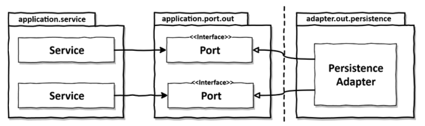
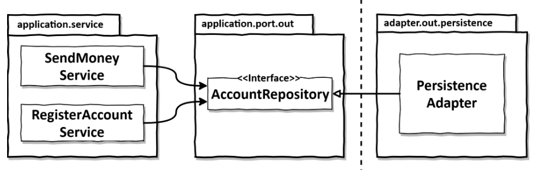
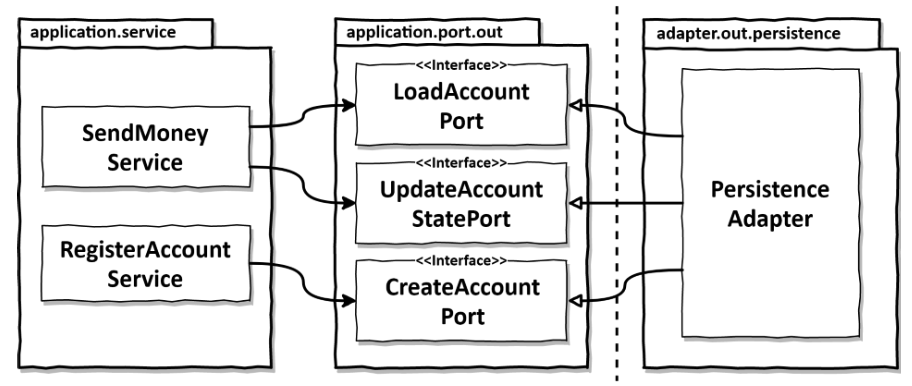
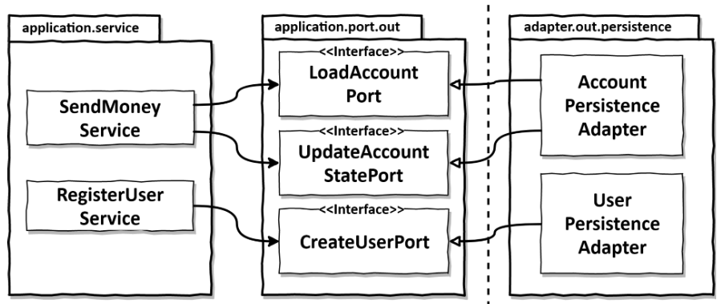

이 문서는 [Get your hands dirty on clean architecture](https://www.amazon.com/Hands-Dirty-Clean-Architecture-hands/dp/1839211962)의 번역본인 [만들면서 배우는 클린 아키텍처](http://www.yes24.com/product/goods/105138479)를 필자의 관점에서 정리한 문서입니다.

<br>

# 목차

<br>

- [목차](#목차)
- [들어가며](#들어가며)
- [의존성 역전](#의존성-역전)
- [영속성 어댑터의 책임](#영속성-어댑터의-책임)
- [포트 인터페이스 나누기](#포트-인터페이스-나누기)
- [영속성 어댑터 나누기](#영속성-어댑터-나누기)
- [스프링 데이터 JPA 예제](#스프링-데이터-jpa-예제)

<br>

# 들어가며
기존의 전통적인 계층형 아키텍처는 모든 것이 영속성 계층 (DDD 계층형에선 인프라 계층)에 의존하게 되어, 대부분 DB 주도 설계가 되는 문제가 있다.

클린 아키텍처의 육각형 아키텍처는 이러한 의존성을 역전시켜 영속성 계층을 플러그인 형태로 변경하였다.

<br>

# 의존성 역전

<br>

💁‍♂️ **육각형 아키텍처에서는 영속성 계층을 구현할 때도 포트와 어댑터 기반의 의존성 역전을 사용한다.**

<p align="center"><br>출처: Get your hands dirty on clean architecture </p>

위 그림에서 알 수 있듯이, **애플리케이션 서비스에서 영속성 기능을 사용하기 위해 포트 인터페이스(변하지 않는 것)에 의존한다.**

**이 포트는 실제로 영속성에 대한 역할을 담당하며, DB와 통신할 책임을 가진 영속성 어댑터 클래스에 의해 구현된다.**

<br>

💁‍♂️ **다시 강조하자면, 포트는 사실상 애플리케이션 서비스와 영속성 코드 사이의 간접 계층이다.**

이를 통해, 도메인 코드를 개발할 때, 영속성 계층과의 의존성을 없앨 수 있다.

즉, **영속 계층의 코드가 변경되어도 도메인의 코드는 영향이 가지 않는다.** (DB의 방향이 외부 MySQL든, 내부 H2든 도메인 코드엔 영향이 가지 않는다.)

이렇게함으로써, **포트(인터페이스)에 정의된 내용만 만족하면, 코어에 영향을 미치지 않으면서 영속성 코드를 마음껏 수정 할 수 있다. - 가장 중요**

<br>

# 영속성 어댑터의 책임

<br>

💁‍♂️ 영속성 어댑터의 책임

1. 입력을 받는다.
2. 입력을 DB 포맷으로 매핑한다.
3. 입력을 DB로 보낸다.
4. DB 출력을 애플리케이션 포맷으로 매핑한다.
5. 출력을 반환한다.

<br>

🤔 **영속성 어댑터 입력 모델 (메서드 매개변수로 넘기는 객체를 의미)**

* **영속성 어댑터는 DB를 쿼리하거나 변경하는 데 사용할 수 있는 포맷으로 입력 모델을 매핑한다.**
  * JPA의 경우, 입력 모델를 DB테이블 구조를 반영한 JPA 엔티티 객체로 매핑하게 된다.
  * **이는 입력 모델을 JPA 엔티티로 매핑하는 것이 생각보다 큰 공수가 필요하다.. 책에선 8장에서 매핑하지 않는 전략에 대해서 다룬다.**
* **물론 포트를 통해 인터페이스화 시켜두었기 때문에, JPA난 다른 SQL Mapper를 사용해도 상관없다.**
* **핵심은 영속성 어댑터의 입력 모델이 영속성 어댑터가 아닌 애플리케이션 코어에 있음으로써, 영속성 어댑터 내부를 변경하는 것이 코어에 영향을 미치지 않는다는 것이다.**
  * 이렇게 되면 영속성 어댑터의 내부 구현이 애플리케이션 코어의 입력 모델을 의존하게되는데 괜찮은가???

<br>

> **책에선 계속해서 입력과 출력 모델(메서드 반환 객체)이 영속성 어댑터가 아닌 애플리케이션 코어에 위치한다는 것을 강조한다.**

<br>

# 포트 인터페이스 나누기
영속성관련 포트와 어댑터를 구현하다보면 어떻게 포트를 나눌 것인지 고민하게 된다.

<br>

💁‍♂️ **가장 일반적인 방법 - 별로 추천하지 않는다.**

<p align="center"><br>출처: Get your hands dirty on clean architecture </p>

보통 위와같이 하나의 Repository 인터페이스 안에 특정 엔티티에 대한 모든 연산은 몰아넣는다.

**이 경우 각 서비스에서 하나의 메서드만 의존하더라도, Repository에 있는 모든 메서드에대한 의존성을 가지게 된다.**

예를 들어, **회원 생성 서비스 (`RegisterAccountService`)에서 단위 테스트를 작성한다고 가정해보자.**

**`AccountRepository` 인터페이스의 어떤 메서드를 모킹해야할까??**

**모든 메서드를 모킹하는 것은 낭비이고, 특정 일부만 모킹하면 다른 개발자가 모든 메서드가 모킹되어있을 줄 알고 개발하다 낭패를 본다.**

<br>

💁‍♂️ **ISP (Interface Segregation Principle, 인터페이스 분리 원칙)에 의해 분리해주는 것이 좋다.**

<p align="center"><br>출처: Get your hands dirty on clean architecture </p>

**이렇게 각 서비스는 실제로 필요한 메서드에만 의존하는 것이 좋다.**

이렇게 함으로써 **테스트시 어떤 메서드를 모킹할지 고민하지 않아도 된다.**

<br>

> 물론 모든 상황에 이렇게 하긴 힘들다. 상황에 따라선 응집성이 높은 경우에 따라 여러 메서드를 묶어서 사용할 수도 있다.
> 
> **그래도 좁은 포트 인터페이스를 지향하는 것이 좋다.** (ISP)

<br>

# 영속성 어댑터 나누기
포트와 마찬가지로 영속성 어댑터를 꼭 하나만 존재할 필요는 없다.

<br>

💁‍♂️ **하나의 애그리거트당 하나의 영속성 어댑터를 만들어 여러 개의 영속성 어댑터를 만드는 경우**

<p align="center"><br>출처: Get your hands dirty on clean architecture </p>

"애그리거트당 하나의 영속성 어댑터" 접근 방식 또한 나중에 여러 개의 바운디드 컨텍스트의 영속성 요구사항을 분리하기 위한 좋은 토대가 된다.

> 바운디드 컨텍스트란 "경계"를 의미한다. Account 맥락의 서비스가 User 맥락의 영속성 어댑터에 접근하지 않는다. 
> 
> 대신 필요하면 전용 인커밍 포트를 통해 접근한다.

<br>

# 스프링 데이터 JPA 예제
마지막으로 영속성 포트와 어댑터를 스프링 데이터 JPA로 구현해본다.

<br>

💁‍♂️ **도메인 구현**

> Account.java

```java
@AllArgsConstructor(access = AccessLevel.PRIVATE)
public class Account {

    private final AccountId id;
    private final ActivityWindow activityWindow;
    private final Money baselineBalance;

    ...
}
```
* 코드는 생략했지만, 불변성을 유지한 도메인 객체이다.
* **눈여겨볼 점은 어떠한 외부 기술에도 종속적이지 않다는 점이다.**
  * **POJO로 구현된 도메인**

<br>

💁‍♂️ 엔티티 구현

> AccountJpaEntity.java

```java
@Entity
@Table(name = "account")
@Data
@AllArgsConstructor
@NoArgsConstructor
class AccountJpaEntity {

	@Id
	@GeneratedValue
	private Long id;

}
```
* Account 테이블을 위한 엔티티이다.

<br>

> ActivityJpaEntity.java

```java
@Entity
@Table(name = "activity")
@Data
@AllArgsConstructor
@NoArgsConstructor
class ActivityJpaEntity {

	@Id
	@GeneratedValue
	private Long id;

	@Column
	private LocalDateTime timestamp;

	@Column
	private Long ownerAccountId;

	@Column
	private Long sourceAccountId;

	@Column
	private Long targetAccountId;

	@Column
	private Long amount;

}
```
* activity 테이블을 표현하기 위한 엔티티이다.
  
<br>

💁‍♂️ **영속성 어댑터 구현**

> AccountPersistenceAdapter.java
```java
@RequiredArgsConstructor
@PersistenceAdapter
class AccountPersistenceAdapter implements
		LoadAccountPort,
		UpdateAccountStatePort {

	private final SpringDataAccountRepository accountRepository;
	private final ActivityRepository activityRepository;
	private final AccountMapper accountMapper;

	@Override
	public Account loadAccount(
					AccountId accountId,
					LocalDateTime baselineDate) {
            
    // 중요 부분 - 엔티티를 통해 DB로부터 데이터를 가져온다.
		AccountJpaEntity account =
				accountRepository.findById(accountId.getValue())
						.orElseThrow(EntityNotFoundException::new);

		List<ActivityJpaEntity> activities =
				activityRepository.findByOwnerSince(
						accountId.getValue(),
						baselineDate);

		Long withdrawalBalance = orZero(activityRepository
				.getWithdrawalBalanceUntil(
						accountId.getValue(),
						baselineDate));

		Long depositBalance = orZero(activityRepository
				.getDepositBalanceUntil(
						accountId.getValue(),
						baselineDate));

    // 엔티티로부터 가져온 데이터를 POJO인 도메인 객체로 변환한다.
		return accountMapper.mapToDomainEntity(
				account,
				activities,
				withdrawalBalance,
				depositBalance);

	}

	private Long orZero(Long value){
		return value == null ? 0L : value;
	}


	@Override
	public void updateActivities(Account account) {
		for (Activity activity : account.getActivityWindow().getActivities()) {
			if (activity.getId() == null) {
        // POJO의 변경사항을 JPA 엔티티로 변환하고 DB에 저장한다.
				activityRepository.save(accountMapper.mapToJpaEntity(activity));
			}
		}
	}

}
```
* POJO인 도메인과 JPA 엔티티간의 변환을 통해 DB로부터 데이터를 가져오거나 저장한다.

<br>

🤔 **위와 같이 사용할거면 왜 JPA를 사용하는가?**

위 코드를 보면 비효율적으로 보이는 부분이 두 가지 있다.

1. JPA는 즉시로딩/지연로딩, 캐싱, N + 1 문제등 러닝커브가 존재하는데, 위 구조는 전혀 JPA를 잘 활용하지 못한다. 차라리 SQL Mapper가 더 효율적인 것으로 보인다.
2. POJO 도메인과 JPA 엔티티간의 변환 작업이 점점 애플리케이션이 커질수록 비용이 많이 들 것으로 보인다.

<br>

**책에선 JPA 엔티티의 경우 기본 생성자가 필요하고, 일부 데이터만 가져오고 싶은 경우가 있기 때문에 이렇게 분리한다고 한다.**

즉, JPA가 도메인에 침투하는 것이 문제라는 것.

**그러므로 영속성 측면과의 타협 없이 풍부한 도메인 모델을 생성하고 싶은 경우, 도메인 모델과 영속성 모델을 매핑하는 것이 좋다고 한다.**

<br>

물론 개개인의 생각이 있겠지만.. 필자의 경우는 아직까진 이렇게 나누는 이유를 모르겠다. 물론 JPA에 종속적인 구조가 되긴 하겠지만, ORM을 사용하는 한 다른 프레임워크로 옮겨갈 일도 없고해서 침투적임에도 큰 문제가 없다고 생각하기 때문이다.

8장에서 더 자세히 살펴본다니... 일단은 차근차근 더 읽어나가본다.


