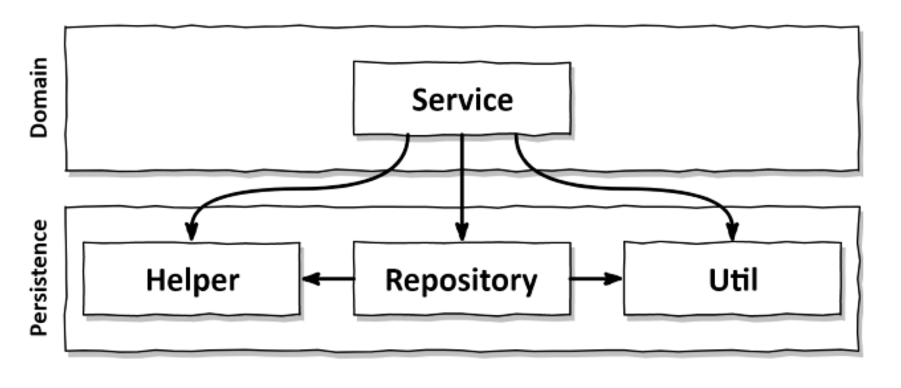
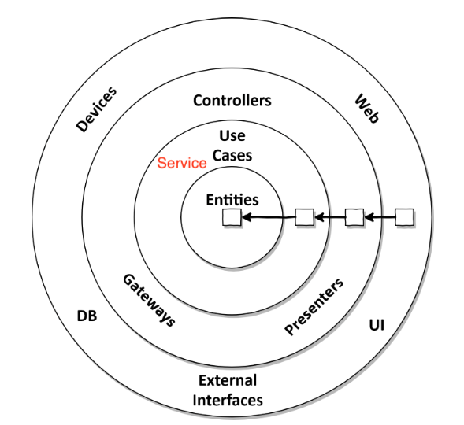

# Get your hands dirty on clean architecture
> 이 문서는 [Get your hands dirty on clean architecture](https://www.amazon.com/Hands-Dirty-Clean-Architecture-hands/dp/1839211962)의 번역본인 [만들면서 배우는 클린 아키텍처](http://www.yes24.com/product/goods/105138479)를 필자의 관점에서 정리한 문서입니다.

<br>

# 목차

<br>

<br>

# 들어가며
이 책은 기존의 전통적인 계층형 아키텍처가 아닌 로버트 C. 마틴이 말하는 클린 아키텍처를 코드와 함께 설명하는 책이다.

좋았던 점은 기존의 전통적인 계층형 아케텍처를 왜 지양해야하며, 클린 아키텍처를 왜 지향하는지에 대해서 코드를 통해 설명해준다.

물론 여기서 말하는 클린 아키텍처가 모든 설계에 해결책은 아니다. (설계엔 정답이 없듯이!)

그래도 이 책은 로버트 C. 마틴이 말하는 "클린 아키텍처"를 만들면서 설명해주므로 도움이 많이 된다.

이번 글은 조금 길어질 수도 있지만... 하나의 문서로 정리할 예정이다.

<br>

# 1 계층형 아키텍처의 문제는 무엇일까?
이번 챕터에선 저자가 전통적인 계층형 아키텍처를 사용하면서 느꼈던 단점에 대해서 이야기한다.

❗️ **이번 챕터의 내용은 모두 Bad Practice이다!**

<br>

## 1-1 전통적인 계층형 아키텍처

<br>

🤔 **전통적인 계층형 아키텍처란?**

<p align="center"><br>상위 수준 관점에서 일반적인 3계층 아키텍처를 그린 그림<br>출처: Get your hands dirty on clean architecture</p>

* 웹 계층: 웹 요청을 받아 도메인 혹은 비즈니스 계층에 있는 서비스로 요청을 보낸다.
* 도메인 / 비즈니스 계층: 서비스 계층은 필요한 도메인을 이용하여 비즈니스 로직을 수행한다. 도메인 엔티티의 현재 상태를 조회하거나 변경하기 위해 영속성 계층의 컴포넌트를 호출한다.
* 영속성 계층: 도메인 엔티티의 상태를 DB에 영속화하는 역할을 수행하는 계층.

> 위 구조를 Spring에서 흔히 사용하는 계층 구조로 보면 아래와 같다.
> * 웹 계층 => Controller, 도메인 / 비즈니스 계층 => Service, Domain, 영속성 계층 => DAO

<br>

💁‍♂️ 전통적인 계층형 아키텍처의 장점

* 잘 만들어진 계층형 아키텍처는 선택의 폭을 넓히고, 변화하는 요구사항과 외부 요인에 빠르게 적응할 수 있다.
  * 물론 이는 모든 구성원이 계층을 잘 이해하고 정해진 규칙을 잘 지킨다는 가정하이다.

<br>

## 1-2 전통적인 계층형 아키텍처의 문제점
계층형 아키텍처는 코드에 나쁜 습관들이 스며들기 쉽게 만들고 시간이 지날수록 소프트웨어를 점점 더 변경하기 어렵게 만들어 많은 허점을 노출한다.

다시말해, 정해진 규칙을 모두 정말 잘 지켜야지만 효과적인 아키텍처이다.

문제는 이러한 규칙을 잘 지키기가 쉽지 않다는 것.


<br>

1️⃣ **계층형 아키텍처는 DB 주도 설계를 유도한다.**

* **모든 것이 영속성 계층을 토대로 만들어진다**
  * 웹 계층은 도메인 계층에 의존하고, 도메인 계층은 영속성 계층에 의존하기에 자연스레 DB에 의존하게 된다.
* **모든 애플리케이션의 목적은 비즈니스 로직을 처리하는 것이다.**
  * 비즈니스 로직을 처리하기 위해선 상태(state)가 아닌 행동(behavior)에 집중해야 한다. (객체지향)
  * **문제는 계층형 아키텍처는 DB주도 설계를 유도하기에 상태에 더 집중하게된다.**
  * 이는 계층형 아키텍처의 조건상 자연스러운 구현순서이다. 하지만 비즈니스 관점에서는 전혀 맞지 않다.
  * **무엇보다 비즈니스 로직을 처리하는 도메인을 가장 먼저 고려하고 만들어야한다.** (도메인 로직 구현 -> 웹, 영속성 계층 구현)
* **DB주도 설계를 하는 이유?**
  * **가장 큰 원인은 ORM 프레임워크를 사용하기 때문이다.** (혹은 DAO로 엔티티와 테이블을 1 : 1 매칭시키기 때문)
  * **서비스는 영속성 모델을 비즈니스 모델처럼 사용하게 되고 이로 인해 도메인 로직뿐만 아니라 즉시로딩/지연로딩, 트랜잭션, 엔티티매니저등 영속성 계층과 관련된 작업들을 해야한다.**
  * 영속성 코드가 사실상 도메인 코드에 녹아들어가게된다. 이는 서비스 계층이 영속성 계층에 종속적이게 만들고, **영속성 계층과 도메인 계층 사이에 강한 결합을 만든다.**

<p align="center"><br>도메인 계층에서 DB 엔티티를 사용하는 것은 영속성 계층과의 강한 결합을 유발한다.<br>출처: Get your hands dirty on clean architecture </p>

> 개인적으로 도메인을 먼저 고려한다면 DB 주도가 아닌 도메인 주도 개발을 할 수 있다고 생각한다. 하지만 이런 경우에도 JPA로 인해 서비스 계층과 영속성 계층의 결합을 분리하긴 어렵다.

<br>

2️⃣ **지름길을 택하기 쉬워진다.**

* 계층형 아키텍처의 유일한 규칙은 `특정 계층에선 같은 계층에 있는 컴포넌트가 아래 계층 컴포넌트만 접근 가능`이다.
  * 그러므로 만약 상위 계층에 위치한 컴포넌트에 접근해야한다면 컴포넌트를 아래로 내려야한다.
* 만약 상위 계층에 위치한 컴포넌트에 접근해야한다면 상위 계층 컴포넌트를 아래로 내려 쉽게 해결가능하다.
  * **문제는 이렇게 컴포넌트를 계속해서 아래로 내린다면, 아래 계층으로 갈수록 점점 비대해진다.**
  * **이는 아래와 같이 아무 계층에도 속하지 않는 컴포넌트를 모두 아래 계층으로 내릴 가능성이 크다.**
  
<p align="center"><br>영속성 계층에서 모든 것에 접근 가능하기 때문에 시간이 지나면서 점점 비대해진다.<br>출처: Get your hands dirty on clean architecture</p>

<br>

3️⃣ **테스트하기 어려워진다.**

<p align="center"><br>도메인 계층을 건너뛰는 것은 도메인 로직을 코드 여기저기에 흩어지게 만든다.<br>출처: Get your hands dirty on clean architecture </p>

* 계층형 아키텍처를 사용할 때 흔히 계층을 건너뛰는 유혹을 받는다.
  * 예를 들어, 도메인의 상태만을 변경한다면 웹 계층에서 바로 영속성 계층에 접근하는 경우.
* **계층을 건너뛰는 경우 아래와 같은 문제가 발생한다.**
  1. 계층을 건너뛰다보면 도메인에 대한 처리가 다른 계층에 가므로 **각 계층간의 역할과 책임이 불분명해진다.**
  2. 웹 계층 테스트에서 도메인 계층뿐만 아니라 영속성 경우도 모킹해줘야한다.

<br>

4️⃣ **변경해야하는 로직을 찾기 어려워진다.**

* 앞서 말했듯이, **계층형 아키텍처에서는 도메인 로직이 여러 계층에 걸쳐 흩어지기 쉽다.**
  * **이럴 경우 새로운 기능을 추가할 적당한 위치를 찾는 일이 점점 어려워진다.** -> 유스케이스를 숨기는 결과가 발생한다.
* 또한, **아래와 같이 점점 Fat Service가 되므로, 추가된 요구사항에 맞는 유스케이스를 찾기가 점점 어려워진다.**

<p align="center"><br>넓은 서비스는 코드 상에서 특정 유스케이스를 찾기 어렵다.<br>출처: Get your hands dirty on clean architecture </p>

<br>

## 1-3 계층형도 규칙을 명확히하면 유용하다.

계층형 아키텍처의 규칙과 팀에서 정한 규칙을 잘 준수한다면 계층형 아키텍처도 유지보수와 확장면에서 유용할 수 있다.

필자의 경우 실제 진행한 프로젝트([Github Repo 기반 개발 장려 SNS](https://github.com/woowacourse-teams/2021-pick-git))에서 DDD 계층 구조를 사용했으며, 팀원들과 몇 가지 추가 규칙를 통해 유지보수와 확장면에서 만족스러운 설계였다.

<p align="center"><br>출처: Domain-Driven Design </p>

위 구조를 이용하며 Domain에는 인터페이스를 두고, Infrastructure에 구현체를 둠으로써 DIP를 잘 활용하여 확장에 유연한 설계를 만들 수 있었다.

**위와 같이 일정 규모의 서비스를 만들 때 계층형 규칙도 분명 좋은 아키텍처이다. 다만 이러한 규칙을 팀원 모두가 지킬려면 큰 노력이 필요하다.**

<br>

# 2 의존성 역전하기
이전 챕터에서 계층형 아키텍처의 문제점에 대해서 다뤘다면 이번엔 해결책에 대해서 다룬다.

<br>

## 2-1 SRP와 DIP
계층형 아키텍처를 유지보수와 확장면에서 좋게하려면 SRP와 DIP를 잘 활용해야한다.

> [SRP 정리](https://github.com/binghe819/TIL/blob/master/OOP&%EC%84%A4%EA%B3%84/SOLID/SRP.md), [DIP 정리](https://github.com/binghe819/TIL/blob/master/OOP&%EC%84%A4%EA%B3%84/SOLID/DIP.md)

전통적인 계층형 아키텍처에선 계층 간 의존성이 항상 다음 단계인 아래 방향으로 향한다.

그리고 **도메인 계층이 영속성 계층을 의존하기 때문에, 영속성 계층의 변경은 도메인 계층의 변경을 야기한다.**

**도메인 계층은 애플리케이션의 핵심이므로, 영속성 계층의 변경이 도메인 계층의 변경을 야기하는 것은 좋지 않다.**

이러한 문제를 해결하는 방법이 바로 DIP다.

<p align="center"><br>출처: Get your hands dirty on clean architecture </p>

**도메인 계층에 인터페이스를 도입함으로써 의존성을 역전. 덕분에 영속성 계층이 도메인 계층에 의존하게 된다.**

<br>

## 2-2 클린 아키텍처
로버트 C. 마틴은 "클린 아키텍처"라는 용어를 정립했다.

그리고 **그는 "클린 아키텍처"가 비즈니스 규칙의 테스트를 용이하게 하고, 비즈니스 규칙은 비침투적 (프레임워크, DB, UI, 기술로부터 독립적)일 수 있다고 한다.**

이는 **도메인 코드가 바깥으로 향하는 어떤 의존성도 없어야 함을 의미한다. - 가장 중요!!**

이때 모든 의존성은 DIP의 도움으로 모두 도메인 코드를 향하도록 해야한다고한다. (아래 그림 참고)

<p align="center"><br>모든 의존성은 도메인 로직을 향해 안쪽으로 향한다.<br>출처: Get your hands dirty on clean architecture </p>

* 비침투적
  * 도메인 코드에서는 어떤 영속성 프레임워크나 UI 프레임워크가 사용되는지 알 수 없다.
  * 즉, 어떤 프레임워크에 종속적인 도메인 코드가 나오지 않는다. 이는 자유롭게 도메인 코드를 모델링할 수 있다는 의미.
* **클린 아키텍처의 대가 - 중요** (무조건 좋은 것만은 아니다!)
  * **도메인 계층과 영속성, UI 계층과 분리시키기위해 엔티티에 대한 모델을 각 계층에서 유지보수해야한다.**
  * ex. ORM
    * ORM에선 엔티티에 메타데이터를 필요로한다. 이는 영속성 프레임워크의 엔티티를 그대로 도메인 코드로 사용된다면 영속성 프레임워크의 침투적인 코드가 된다.
    * 즉, **도메인 계층과 영속성 계층이 데이터를 주고 받을 때, 두 엔티티를 서로 변환해줘야한다.**

<br>

> 필자는 지금까지 도메인 로직을 작성할 때 JPA의 종속적인 코드를 작성했다. (아마 대부분이 이렇게 구현할 것이다.)
> 
> 이렇게 하는 것의 문제는 도메인 로직에 JPA의 엔티티 로직이 침투된다는 것인데.. 문제를 알면서도 변환 과정에서의 로직이 꼬일 것 같아 그저 사용했다.
> 
> 하지만 이 책의 저자는 이렇게 변환하는 것이 바람직한 일이라고 한다. 이는 앞으로 실제 프로젝트에 적용시켜보면서 살펴봐야할 듯 하다.

<br>

## 2-3 육각형 아키텍처
클린 아키텍처의 원칙들을 조금 더 구체적으로 표현한 것이 "육각형 아키텍처"이다.

<p align="center"><br>색칠 화살표는 사용(호출 - 주도), 빈 화살표는 구현(반환 - 수동)<br>출처: Get your hands dirty on clean architecture </p>

* 육각형 아키텍처의 의미
  * 아무 의미없다. 그저 애플리케이션이 다른 시스템이나 어댑터와 연결되는 4개 이상의 면을 가질 수 있음을 보여주기 위해 사각형 대신 육각형일 뿐.
* 모든 의존성은 코어를 향한다.
  * 엔티티에서 외부로 향하는 의존성이 없다. (클린 아키텍처)
* 육각형 아키텍처는 "포트와 어댑터"라고도 불린다.
  * 왼쪽 어댑터는 애플리케이션을 주도하는 어댑터, 오른쪽 어댑터는 애플리케이션에 의해 주도되는 어댑터.
  * 포트: 애플리케이션 코어와 어댑터 간의 통신을 위해 코어가 제공하는 
    * 왼쪽 어댑터 (주도하는 어댑터)의 포트: 포트가 코어에 있는 유스케이스 클래스들에 의해 구현되고 호출되는 인터페이스. (ex. UI)
    * 오른쪽 어댑터 (주도되는 어댑터)의 포트: 포트가 어댑터에 의해 구현되고 코어에 의해 호출되는 인터페이스. (ex. 영속성)

> 포트는 각각의 어댑터에 접근하는 인터페이스, 어댑터는 포트 (인터페이스)에 대한 구현체라고 생각해도 좋을듯하다.

<br>

> 무엇보다 중요한 것은 의존성을 역전시켜 도메인 코드가 다른 바깥쪽 코드 (UI, 영속성 프레임워크)에 종속적이지 않게해서 코드를 변경할 이유의 수를 줄이는 것이다. 이를 통해 유지보수성을 더 높이기 위함.

<br>

# 3 코드 구성하기
이번 장에선 코드를 보는 것만으로도 어떤 아키텍처인지 알 수 있는 패키지 구성에 대해서 다룬다.

책에선 사용자가 본인의 계좌에서 다른 계좌로 돈을 송금하는 '송금하기'유스케이스를 통해 패키지 구조를 설명한다.

그리고 아키텍처적으로 육각형 아키텍처를 패키지화하면 아래와 같다.

```shell
.
└── account
    ├── adapter
    │   ├── in
    │   │   └── web
    │   │       └── AccountController
    │   └── out
    │       └── persistence
    │           ├── AccountPersistenceAdapter
    │           └── SpringDataAccountRepository
    ├── application
    │   ├── SendMoneyService
    │   └── port
    │       ├── in
    │       │   └── SendMoneyUseCase
    │       └── out
    │           ├── LoadAccountPort
    │           └── UpdateAccountStatePort
    └── domain
        ├── Account
        └── Activity
```

<p align="center"><br>출처: Get your hands dirty on clean architecture  </p>

저자는 위 구조는 육각형을 잘 나타낸다고 한다.

다만, 완벽한 설계가 없듯이, 위 구조가 정답은 아니다. 패키지 구조도 표현력있게 잘 설계한다면 문제 없다고 생각든다.

**마지막으로 육각형 아키텍처를 위해 가장 중요한 점은 의존성 주입이다**

**컴파일타임에 추상적인 것에 의존하고, 런타임에 구체적인 것에 의존하는 유연한 설계를 위해선 의존성 주입은 필수다.**

실제로 육각형 아키텍처에서 port에 인터페이스를 두는 것 또한 유연한 설계를 위함이다.

> 의존성 주입 내용은 사실 너무 당연한 얘기이며, 좋은 자료가 많기에 생략

<br>

# 4 유스케이스 구현하기


