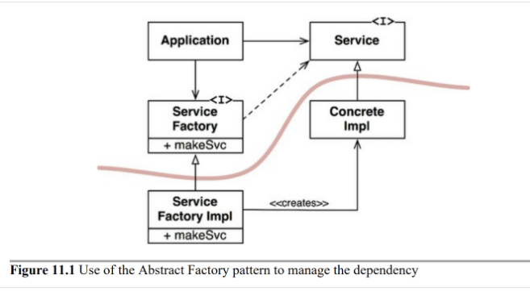
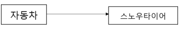
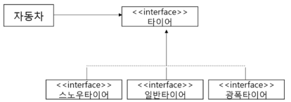

# 목차

- [목차](#목차)
- [DIP - 의존 역전 원칙](#dip---의존-역전-원칙)
  - [개념](#개념)
  - [안정된 추상화](#안정된-추상화)
  - [팩토리를 이용해 사용과 생성의 책임을 분리하라](#팩토리를-이용해-사용과-생성의-책임을-분리하라)
  - [구체 컴포넌트](#구체-컴포넌트)
  - [예제 1](#예제-1)
- [생각해볼 점](#생각해볼-점)
- [참고](#참고)

 

#  DIP - 의존 역전 원칙

> * "고차원 모듈은 저차원 모듈에 의존하면 안된다. 이 두 모듈 모두 다른 추상화된 것에 의존해야 한다." - 로버트 C. 마틴
> * **"추상화된 것은 구체적인 것에 의존하면 안된다. 구체적인 것이 추상화된 것에 의존해야 한다." - 로버트 C. 마틴**
> * **자신보다 변하기 쉬운 것에 의존하지 마라.**
>   * 자신보다 변하기 쉬운 것에 의존하던 것을 추상화된 인터페이스나 상위 클래스를 두어 변하기 쉬운것의 변화에 영향받지 않게 하는 것이 의존 역전 원칙(DIP이다)

 

## 개념
* ***의존은 추상과 이루어져야 한다는 원칙***
* **상위 모듈은 하위 모듈에 의존해서는 안된다. 상위 모듈과 하위 모듈 모두 추상화에 의존해야 한다.**
* **자주 변화하는 것보다 변화하기 어려운 것, 변화가 거의 없는 것에 의존하라는 것**
  * 상위 클래스일수록, 인터페이스일수록, 추상 클래스일수록 변하지 않을 가능성이 높기에 **하위 클래스나 구체 클래스가 아닌 상위 클래스, 인터페이스, 추상 클래스를 통해 의존하라는 것이 DIP이다.**
* 소스 코드 의존성이 추상에 의존하며 구체에는 의존하지 않는 것을 의미한다.
  * 구체적인 대상에는 절대로 의존해서는 안 된다.
* 변동성이 크지 않은 것까지 추상적인 것에 의존할 필요는 없다.
  * 자바의 `String`을 생각해보자. 매우 구체적이지만, 매우 안정적이다. 변경 될 가능성이 굉장히 적다.
  * 이럴 경우에는 굳이 추상적인 것에 의존할 필요까진 없다.
* 의존성 주입
  * 이것도 SRP와 비슷하게 **컴파일타임 의존성을 고정시키고 런타임 의존성을 변경하는 것을 지향한다.**
  * 런타임에 외부로부터 의존성을 주입받아 실행하게 된다. 그러므로 컴파일타임엔 추상화가 되어 있다.
* 예시
  * 프레임워크 자체가 DIP를 적극 이용한다고 볼 수 있다.
    * 개발자는 프레임워크의 실행 흐름에 위치한 인터페이스를 구현하거나 확장하여 구현한다.
  * 스프링은 DIP를 적극 이용한다.
  * 스프링에서 `DAO` 인터페이스를 놓고, 빈 팩토리를 이용해 구현된 `JdbcDAO`, `JpaDAO`, `myBatisDAO` 중 하나를 주입해준다. `DAO` 코드는 그저 `DAO` 라는 인터페이스를 의존하고 있을 뿐이다.

 

## 안정된 추상화
**안정된 소프트웨어 아키텍처란 변동성이 큰 구현체에 의존하는 일은 지양하고, 안정된 추상 인터페이스를 선호하는 아키텍처를 의미한다.**

* 변동성이 큰 구체 클래스를 참조하지 말라. 대신 인터페이스를 참조하라.
* 변동성이 큰 구체 클래스로부터 파생하지 말라. 상속은 변경하기 어렵다. 신중하게 사용하라.
* 구체 함수를 오버라이드 하지 마라. 
* 구체적이며 변동성이 크다면 절대로 그 이름을 언급하지 마라.

 

## 팩토리를 이용해 사용과 생성의 책임을 분리하라
위와 같은 안정된 추상화 규칙들을 지키려면 큰 구체적인 객체는 특별히 주의해서 생성해야 한다.

예시를 통해 팩토리에 대해서 알아보자.

 출처: 클린 아키텍처

`Application` 입장에선 `ConcreateImpl`을 사용하기 위해 `Service`에게 메시지를 요청한다.

하지만 문제는 `Application`이 어차피 `ConcreateImpl`을 생성해야하므로, 알게되는 것이다.

**이 문제를 해결하는 방법은 사용과 생성의 책임을 분리시키는 것이다.**

그래서 `ServiceFactory`를 만들어 의존성을 생성해주는 책임을 분리시킨 것이다.

또한, 소스 코드에서 제어 흐름이 반대로 가는 것을 볼 수 있다. 이러한 것을 의존성 역전이라 부른다.

 

## 구체 컴포넌트
위 그림에서 구체 컴포넌트에는 하나의 구체적인 의존성이 존재한다. 

바로 `ServiceFactoryImpl` -> `ConcreteImpl`이다.

따라서 DIP에 위배된다. 하지만 **모든 DIP 위배를 없앨 순 없다.**

대다수의 시스템은 이러한 구체 컴포넌트를 최소한 하나는 포함하게 된다. 그리고 이 컴포넌트를 `main`이라 부르며, 메인 함수가 포함하기 때문이다.

`main` 함수는 `ServiceFactoryImpl`의 인스턴스를 생성한 후, 전역변수에 저장할 것이다.

그런 다음 `Application`은 이 전역 변수를 사용해서 `ServiceFactoryImpl`의 인스턴스에 접근하게 된다.

 

## 예제 1

* 자동차가 스노우 타이어에 의존하고 있다.
  * 스노우타이어를 일반타이어로 교체할 때 자동차는 그 영향에 노출돼 있다.
  * 자동차 자신보다 더 자주 변하는 스노우타이어에 의존하기에 좋지 않은 설계이다.

 

* 자동차가 구체적인 타이어들이 아닌 추상화된 타이어 인터페이스에만 의존하게 함으로써 타이어가 변경돼도 자동차는 그 영향을 받지 않는다.
  * OCP와 비슷하다.
* 기존에는 스노우타이어가 의존하지 않는 클래스였는데, 타이어 인터페이스를 만듬으로써, 타이어 인터페이스에 의존하게 됐다.
  * **바로 의존의 방향이 역전된 것이다.**
  * 자신보다 변하기 쉬운 것에 의존하던 것을 추상화된 인터페이스나 상위 클래스를 두어 변하기 쉬운것의 변화에 영향받지 않게 하는 것이 의존 역전 원칙(DIP이다)

 

# 생각해볼 점
* DIP의 장점으로 의존성 주입을 컴파일 타임에 하지 않고 런타임에 한다고 하지만, 코드상에는 뭐가 주입될 지 모를텐데 위험하지 않은가?
  * DIP를 잘 설계해놓으면 주입이 어떻게 할지에 대한 정보를 IOC 컨테이너 객체에 책임을 몰아줄 수 있다. 그렇게 되면 주입에 대한 정보를 오히려 일목요연하게 볼 수 있게 되는 장점이 있다.
* 너무 먼 미래를 보고 코딩하는 게 아닌가? (오버엔지니어링)
  * TDD를 수행하는 입장으로서 프로덕트뿐 아니라 테스트 코드 생산에도 신경을 써야하는데 프로덕트, 테스트가 각각 클라이언트라고 생각할 수 있을 것 같다. 벌써 두 가지 클라이언트에 대응할 수 있는 코드를 작성하게 되므로, 그리 먼 미래라고 생각하지 않는다.

 

# 참고
* [스프링 입문을 위한 자바 객체 지향의 원리와 이해](http://www.yes24.com/Product/Goods/17350624)
* [클린 아키텍처](http://www.yes24.com/Product/Goods/77283734?OzSrank=1)
