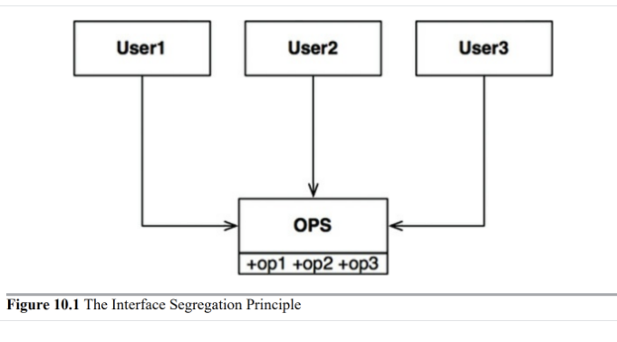
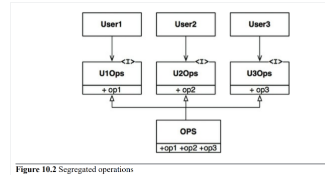
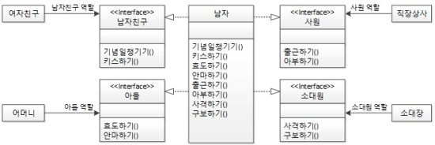

# 목차

- [목차](#목차)
- [ISP - 인터페이스 분리 원칙](#isp---인터페이스-분리-원칙)
  - [개념](#개념)
  - [ISP와 언어](#isp와-언어)
  - [ISP와 아키텍처](#isp와-아키텍처)
  - [예제 1](#예제-1)
  - [예제 2](#예제-2)
- [생각해볼 점](#생각해볼-점)
- [참고](#참고)

<br>

#  ISP - 인터페이스 분리 원칙

> * "클라이언트는 자신이 사용하지 않는 메서드에 의존 관계를 맺으면 안된다." - 로버트 C. 마틴
> * **인터페이스는 그 역할에 충실한 최소한의 기능만 공개하라는 것이 객체 지향 스승들의 가르침이다.**

<br>

## 개념

<p align="center"><br>출처: 클린 아키텍처 </p>

인터페이스 분리 원칙은 위 그림에서 보는 다이어그램에서 그 이름이 유래했다고 한다.

* User1 -> op1
* User2 -> op2
* User3 -> op3

위와 같이 사용한다고 하면

OPS클래스에서 op2의 소스 코드가 변경되면 User1도 다시 컴파일한 후 새로 배포해야 한다.

op2와 User1이 전혀 관계가 없는데도 말이다.

이 문제를 해결하는 방법은 인터페이스 단위로 분리시키는 것이다.

<p align="center"><br>출처: 클린 아키텍처 </p>

User1 -> U10ps(op1) 에는 의존하지만 OPS 클래스에는 의존하지 않게 되었다.

따라서 OPS의 op2의 변경은 User1과는 전혀 관계없으므로 재컴파일 필요가 없다.

<br>

💁‍♂️  쉽게 정리해보자면
* **인터페이스 최소주의 원칙**
  * 자신이 사용하지 않는 인터페이스는 구현하지 말아야 한다는 원칙
  * 하나의 일반적인 인터페이스보다는, 여러 개의 구체적인 인터페이스가 낫다.
* SRP와 ISP는 같은 문제에 대한 두 가지 다른 해결이라고 볼 수 있다.
  * 상황에 맞게 설계하는 것이 좋다.
* **가장 중요한 교훈은 불필요한 짐을 실은 무언가에 의존하면 예상치도 못한 문제에 빠진다는 사실이다.**

> 쉽게 말해 **하나의 인터페이스는 하나의 책임**을 수행해야 한다는 의미.

<br>

## ISP와 언어
* 정적 타입 언어
  * import, use, include와 같은 타입 선언문을 사용한다.
  * 컴파일 타임(코드 레벨)에 소스 코드 의존성이 발생한다.
* 동적 타입 언어
  * 컴파일 타임이 아닌 런타임에 추론이 발생한다.
  * 컴파일 타임에 소스 코드 의존성이 발생하지 않는다.

위와 같은 사실로 인해 ISP를 아키텍처가 아니라, 언어와 관련된 문제라고 결론내릴 여지도 있다.

> 새로운 사실이라 신기하다.

<br>

## ISP와 아키텍처
일반적으로 필요 이상으로 많은걸 포함하는 모듈에 의존하는것은 해로운 일이다.

소스 코드 의존성(정적 언어)의 경우 불필요한 재컴파일과 재배포를 강제하기 때문에 해롭다.

하지만 더 고수준인 아키텍처 수준에서도 마찬가지 상황이 발생함.

F에서는 불필요한 기능, 따라서 S에서 불필요한 기능이 D에 포함되었다고 가정한다면

* 그 기능때문에 D가 변경되면 F를 재배포
* S까지 재배포해야 할지 모른다.

<br>

## 예제 1

<p align="center"></p>

* 아무 원칙도 적용되지 않는 설계

<p align="center"></p>

* SRP (단일 책임 원칙)
  * `남자`클래스를 토막내서 하나의 역할(책임)만 하는 다수의 클래스로 분할하는 것

<p align="center"></p>

* ISP (인터페이스 분리 원칙)

  * `여자친구`를 만날 때는 `남자친구` 역할만 할 수 있게 인터페이스로 제한하고 ...

  * ```java
    남자친구 홍길동 = new 남자(); // 기념일챙기기(), 키스하기()밖에 사용이 안된다.
    아들 홍길동 = new 남자(); // 효도하기(), 안마하기()밖에 사용이 안된다.
    사원 홍길동 = new 남자();
    소대원 홍길동 = new 남자();
    ```

* 인터페이스 최소화

  * `남자친구`인터페이스가 `사격하기()`메서드를 제공할 필요도 없고 제공해서도 안된다.

<br>

## 예제 2

```java
// ISP를 적용하지 않은 예제
public interface multifunction {
  void copy();
  void fax(Address from, Address to);
  void print();
}

public class copyMachine implements multifunction {
  @Override
  public void copy() {
    System.out.println("### 복사 ###");
  }
  
  @Override
  public void fax(Address from, Address to) {
    // 사용하지 않는 인터페이스가 변경되어도 함께 수정이 일어난다.
  }
  
  @Override
  public print() {
    // 사용하지 않는 인터페이스가 변경되어도 함께 수정이 일어난다.
  }
}
```

* `multifunction`인터페이스에 모든 기능들을 한번에 넣었더니, `copyMachine`을 구현하는데 필요없는 `fax`과 `print`도 모두 구현해줘야한다.
  * **만약 `fax`나 `print`의 반환 값이 `int`로 바뀐다면, 이와 전혀 상관없는 `copyMachine`도 변경해줘야 하는 문제가 발생한다.**

```java
// ISP가 적용된 예제
public interface Print{
  void print();
}

public interface Copy {
  void copy();
}

public interface Fax {
  void fax(Address from, Address to);
}

public class copyMachine implements Copy {
  @Override
  void copy() {
    System.out.println("### 복사 ###");
  }
}
```

* ISP가 적용된 예제
  * `copyMachine`을 구현하는데 `copy`만을 구현해주면 되므로 낭비가 발생하지 않는다.

<br>

# 생각해볼 점
* ISP는 인터페이스 하나 당, 하나의 멤버를 강조하는데, 이렇게 하면 무수히 많은 인터페이스가 만들어 질 것이다.
  * 적정선까지만 쪼개는 것이 맞다고 생각한다.
* 인터페이스를 분리하는 기준이 모호하다. 어떤 기준으로 해야할까?
  * 클라이언트에 따라 달라질 듯하다. 클라이언트가 요구하는 책임 단위로 분리하는게 좋지 않을까?
  * 변경되는 시점을 기준으로 분리해야 하지 않을까?? SRP와도 관련이 있다고 생각한다.

<br>

# 참고
* [스프링 입문을 위한 자바 객체 지향의 원리와 이해](http://www.yes24.com/Product/Goods/17350624)
* [클린 아키텍처](http://www.yes24.com/Product/Goods/77283734?OzSrank=1)