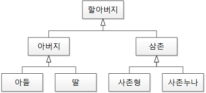
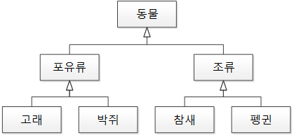

# 목차

- [목차](#목차)
- [LSP - 리스코프 치환 원칙](#lsp---리스코프-치환-원칙)
  - [개념](#개념)
  - [표준적인 요구사항](#표준적인-요구사항)
    - [하위형에서 선행 조건은 강화될 수 없다](#하위형에서-선행-조건은-강화될-수-없다)
    - [하위형에서 후행 조건은 약화될 수 없다](#하위형에서-후행-조건은-약화될-수-없다)
    - [하위형에서 상위형의 불변 조건은 반드시 유지되어야 한다](#하위형에서-상위형의-불변-조건은-반드시-유지되어야-한다)
    - [하위형에서 메서드는 상위형 메서드에서 던져진 예외의 하위형을 제외하고 새로운 예외를 던지면 안 된다](#하위형에서-메서드는-상위형-메서드에서-던져진-예외의-하위형을-제외하고-새로운-예외를-던지면-안-된다)
    - [공변성 반공변성 무공변성](#공변성-반공변성-무공변성)
    - [하위형에서 메서드 인수의 반공변성](#하위형에서-메서드-인수의-반공변성)
    - [하위형에서 반환형의 공변성](#하위형에서-반환형의-공변성)
    - [하위 클래스를 얘기하는데 함수의 공변성과 반공변성을 왜 얘기하는 것인가?](#하위-클래스를-얘기하는데-함수의-공변성과-반공변성을-왜-얘기하는-것인가)
  - [예제 1](#예제-1)
    - [잘못된 경우](#잘못된-경우)
    - [제대로된 경우](#제대로된-경우)
  - [예제 2 - 직사각형과 정사각형](#예제-2---직사각형과-정사각형)
- [생각해볼 점](#생각해볼-점)
- [참고](#참고)

<br>

# LSP - 리스코프 치환 원칙

> * "서브 타입은 언제나 자신의 기반 타입으로 교체할 수 있어야 한다." - 로버트 C. 마틴
> * 객체지향에서 상속은 조직도, 계층도가 아닌 **분류도**가 되어야 한다.
>   * **하위 클래스는 상위 클래스의 역할을 충실히 하면서 확장해나가야 한다는 것.**

<br>

## 개념

* 리스코프는 만든이의 이름
* **상위 타입의 객체를 하위 타입의 객체로 치환해도 상위 타입을 사용하는 프로그램은 정상적으로 동작해야 한다는 원칙**
  * **B가 A의 자식 타입이면 부모 타입인 A 객체는 자식 타입인 B로 치환해도, 작동에 문제가 없어야 한다는 원칙**
  * A - B의 부모 자식에 대한 정의가 논리적으로 제대로된 상속이어야 기존 프로그램이 자식인 B로 치환해도 문제 없이 작동해야 한다는 의미
* **베이스 클래스가 서브 클래스로 치환되어도 동일한 동작을 보장해야 한다는 원칙**
* **부모에서 구현한 원칙을 자식도 따라야 한다는 원칙.**
* 아래 두 개의 문장대로 구현된 프로그램이라면 LSP를 지켰다고 예상할 수 있다. (물론 무조건은 아니다)
  * `하위 클래스 is a kind of 상위 클래스` - 하위 분류는 상위 분류의 한 종류다.
  * `구현 클래스 is able to 인터페이스` - 구현 분류는 인터페이스할 수 있어야 한다.

<br>

## 표준적인 요구사항
* 리스코프 원칙은 새로운 객체 지향 프로그래밍 언어에 채용된 시그니처에 관한 **몇 가지 표준적인 요구사항을 강제한다.**
  * 하위형에서 메서드 인수의 반공변성
  * 하위형에서 반환형의 공변성
  * 하위형에서 메서드는 상위형 메서드에서 던져진 예외의 하위형을 제외하고 새로운 예외를 던지면 안된다.
* 여기에 더하여 하위형이 만족해야하는 행동 조건 몇 가지가 있다. 이것은 계약이 상속에 대해 어떻게 상호작용하는지에 대한 제약조건을 유도하는 계약에 의한 설계 방법론과 유사한 용어로 자세히 설명되어 있다.
  * 하위형에서 선행조건은 강화될 수 없다.
  * 하위형에서 후행조건은 약화될 수 없다.
  * 하위형에서 상위형의 불변조건은 반드시 유지되어야 한다.
> 여기서 하위형은 하위 클래스를 의미한다.

<br>

### 하위형에서 선행 조건은 강화될 수 없다
```java
// 상위 클래스
public void method(int data) {
  if (data < 0) {
    throw new IllegalArgumentException("데이터는 음수면 안됩니다.");
  }
}

// 하위 클래스
public void method(int data) {
  if (data <= 0) { // 선행 조건 강화
    throw new IllegalArgumentException("데이터는 0보다 커야합니다.");
  }
}
```
* 위와 같이 상위 클래스에서 입력값 예외처리하는 것을 선행 조건으로 볼 수 있다.
* 코드를 보면 하위 클래스에서 `data`값이 0이면 안된다라는 조건을 추가하였다. 이는 LSP를 위반한다.
  * **상위 클래스와 동일한 수준의 선행 조건을 기대하고 사용하는 프로그램 코드에서 예상치 못한 문제를 일으킬 수 있기 때문이다.**

<br>

### 하위형에서 후행 조건은 약화될 수 없다
```java
// 상위 클래스
public int method(int data) {
  int result;

  // ... result에 대한 실행코드

  if (result < 0) { // 후행 조건
    result = 0;
  }

  return result;
}

// 하위 클래스
public int method(int data) {
  int result;

  // ... result에 대한 실행코드

  return result;
} 
```
* 상위 클래스 코드를 보면 함수 종료 시점에 전달될 객체 값이 유효한 값인지 검사한다. (이를 후행 조건이라 한다고한다)
* 하위 클래스처럼 후행 조건을 생략하거나 완화(약화)시키면 LSP를 위반한다.
  * **상위 클래스와 동일한 수준의 후행 조건을 기대하고 사용하는 프로그램 코드에서 예상치 못한 문제를 일으킬 수 있기 때문이다.**

<br>

### 하위형에서 상위형의 불변 조건은 반드시 유지되어야 한다
* 상위 클래스에 있는 데이터의 정의한 값의 조건은 하위 클래스에서도 계속 유지되어야 한다는 의미
  * 예를 들어, `Car`의 position은 0보다 작을 수 없다고 정의했는데, `SportCar`라는 하위 클래스가 position을 -1로 재정의해버리면 안된다.
  * 즉, **하위 클래스에서 상위 클래스의 값을 마음대로 할당하지 말고 상위 클래스가 정의한 조건에 따라 할당하라는 의미인 듯 하다.**

<br>

### 하위형에서 메서드는 상위형 메서드에서 던져진 예외의 하위형을 제외하고 새로운 예외를 던지면 안 된다
* **자식 클래스의 함수에서 부모 클래스의 함수에서 던지는 예외를 제외하고 다른 예외를 던지지 말라는 의미.**
  * **부모 클래스의 함수를 호출하는 외부 코드에서 잡지 못하는 예외가 발생하기 때문이다.**

<br>

<br>

### 공변성 반공변성 무공변성
* 공변성 : `T'`가 `T`의 서브타입이면, `C<T'>`는 `C<? extends T>`의 서브타입이다.
  * **자기 자신 & 자신을 확장한 하위 클래스 타입을 허용한다는 의미 (ex. 배열)**
  ```java
  Parent[] array = new Child[];
  ```
* 반공변성 : `T'`가 `T`의 서브타입이면, `C<T>`는 `C<? super T'>`의 서브타입이다.
  * **자기 자신 & 상위 클래스 타입을 허용한다는 의미**
  ```java
  public static void Main()
  {
      Action<Parent> parentAction = (parent) => { };
      Action<Child> childAction = parentAction; // 반공변성
      
      childAction(new Child());
  }

  public class Parent { }

  public class Child : Parent { }
  ```
* 무공변성 : `C`와 `C<T'>`는 아무 관계 없다.
  * ex. 제네릭 (컴파일 타임때 타입 검사를 하고 런타임에 관련 정보가 소거된다)

<br>

### 하위형에서 메서드 인수의 반공변성
> 출처 : https://pizzasheepsdev.tistory.com/9
```java
// 맞는 코드 - 공변성 코드
public static void Main()
{
    Func<Parent> method1 = () => new Child();
    
    Parent parent = method1();
}

public class Parent { }

public class Child : Parent { }

// 틀린 코드 - 반공변성 코드
public static void Main()
{
    Func<Parent> method1 = () => new Child_B();
    Func<Child_A> method2 = method1;
    
    Child_A child = method2();
}

public class Parent { }

public class Child_A : Parent { }

public class Child_B : Parent { }
```
* 하위 클래스가 두 가지 이상이면, 어떤 값을 반환할 지 모르기 때문에 반환 값에 대한 참조값은 상위 클래스여야한다.

<br>

### 하위형에서 반환형의 공변성
> 출처 : https://pizzasheepsdev.tistory.com/9
```java
// 맞는 코드 - 반공변성 코드
public static void Main()
{
    Action<Parent> parentAction = (parent) => { };
    Action<Child> childAction = parentAction;
    
    childAction(new Child());
}

public class Parent { }

public class Child : Parent { }

// 틀린 코드 - 공변성 코드
public static void Main()
{
    Action<Child_A> childAction = (child) => { };
    Action<Parent> parentAction = childAction;
    
    parentAction(new Child_B());
}

public class Parent { }

public class Child_A : Parent { }

public class Child_B : Parent { }
```

<br>

### 하위 클래스를 얘기하는데 함수의 공변성과 반공변성을 왜 얘기하는 것인가?
* **상위 클래스에서 하위 클래스로 치환했을 때, 작동에 문제가 없으려면, 프로그램 코드에 노출되어 호출되는 함수 또한 공변성과 반공변성 또한 보장되어야 하기 때문이다.**
* 특히, 제네릭 타입을 지원하는 언어의 경우 더더욱 필요하다.

<br>

## 예제 1

<br>

### 잘못된 경우

<p align="center"></p>

* 전형적인 계층도 구조
  * 딸은 아버지의 역할을 할 수 없다
  * `아버지 춘향이 = new 딸();` - 말이 안되지 않는가...

<br>

### 제대로된 경우

<p align="center"></p>

* 전형적인 분류도 구조
  * 박쥐는 포유류의 역할을 할 수 있다.
  * `포유류 배트 = new 박쥐()` - 박쥐가 포유류의 역할을 하는 것은 전혀 문제가 없다.

<br>

## 예제 2 - 직사각형과 정사각형
```java
// 직사각형
class Rectable {
  protected double width;
  protected double height;

  public void setWidth(double width) {
    this.width = width;
  }

  public void setHeight(double height) {
    this.height = height;
  }

  // getWidth, getHeight

  public double getArea() {
    return this.getWidth() * this.getHeight();
  }
}

// 정사각형
class Square extends Rectangle {
  public void setWidth(double width) {
    this.width = width;
    this.height = width;
  }

  public void setHeight(double height) {
    this.width = height;
    this.height = height;
  }
}
```
```java
// 기존 코드에서 직사각형을 사용하고 있었다고 가정해보자.
Rectangle rectangle = new Rectangle();
rectangle.setHeight(5);
rectangle.setWidth(4);
rectangle.getArea() == 20; // True

// 만약 직사각형의 자식인 정사각형으로 치환한다면
Rectangle rectangle = new Square();
rectangle.setHeight(5);
rectangle.setWidth(4);
rectangle.getArea() == 20; // False (에러!)
```
* **정사각형 클래스가 직사각형 클래스를 상속해버리면, 직사각형을 정사각형 클래스로 치환해서 사용할 때, 네 변의 길이에 대한 두 클래스의 특징 차이 때문에 기존 프로그램이 오작동할 수 있다.**
* **논리상으로 "정사각형은 직사각형이지만, 직사각형은 정사각형이 아니다"라고 생각해서 코드에 상속 관계를 반영할 수 있지만, SOLID 법칙의 기준으로 보면 둘은 코드에서 상속 관계로 존재할 수 없다.**

```java
// 해결법
interface Shape {
  double getArea();
}

class Rectangle implements Shape {

  // ... 변수

  public Rectangle (double width, double height) {
    this.width = width;
    this.height = height;
  } 

  public double getArea() {
    return this.width * this.height;
  }
}

class Square implements Shape {
  
  // ... 변수

  public Square(double width) {
    this.width = width;
  }

  public double getArea() {
    return this.width * this.width;
  }
}
```

<br>

# 생각해볼 점
* LSP를 만족한다면 자연스럽게 다형성을 통한 확장 원리인 OCP를 구성하는 구조가 된다.
  * 예를 들어 템플릿 메서드 패턴의 경우, 핵심 로직을 구현하는 하위 클래스는 부가 로직을 구현한 상위 클래스를 재정의하지 않으므로, LSP를 지킨다면 자연스럽게 OCP를 구성하는 구조가 된다고 볼 수 있다.

<br>

# 참고

* [스프링 입문을 위한 자바 객체 지향의 원리와 이해](http://www.yes24.com/Product/Goods/17350624)
* https://ko.wikipedia.org/wiki/%EB%A6%AC%EC%8A%A4%EC%BD%94%ED%94%84_%EC%B9%98%ED%99%98_%EC%9B%90%EC%B9%99
* https://medium.com/humanscape-tech/solid-%EB%B2%95%EC%B9%99-%E4%B8%AD-lid-fb9b89e383ef
* https://pizzasheepsdev.tistory.com/9
* [공변, 반공변, 무공변](https://velog.io/@lsb156/covariance-contravariance)